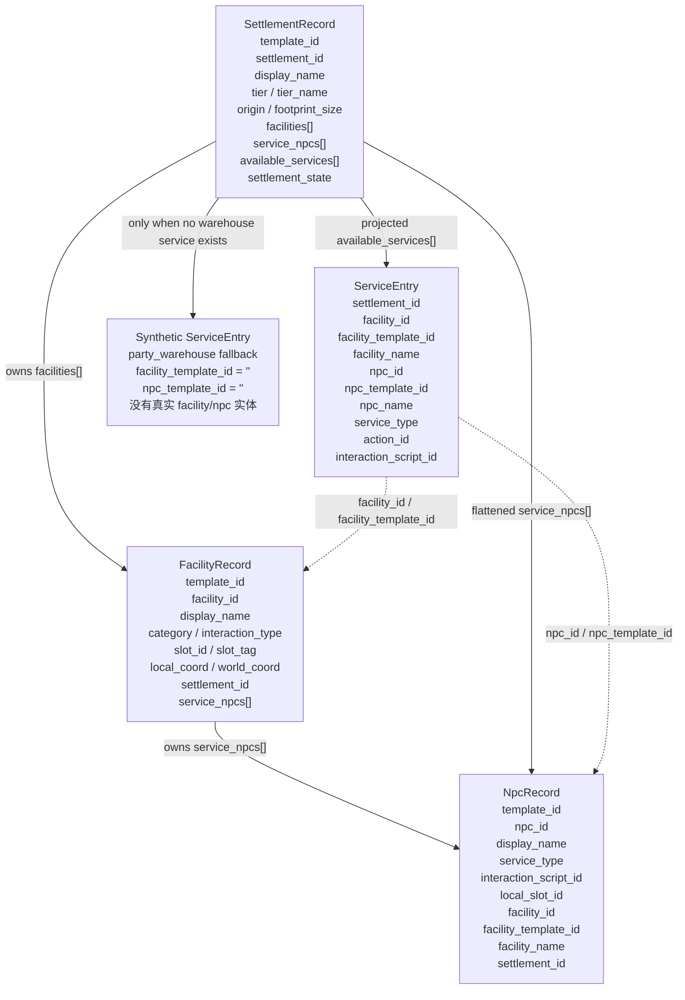

# Settlement Design — 可落地执行版

更新日期：`2026-04-18`

## 1. 文档目的

本文件是据点系统的**分步可执行实现规格书**，覆盖：

1. 据点 1~5 级行为层次设计与首版可落地范围
2. 第 6 级世界据点完整设定与延后边界
3. 每级据点的**运行时数据结构**、**配置资源结构**、**服务执行器结构**与 **UI 场景结构**
4. 分步实现计划（Phase 0 ~ Phase 4）与每步验收标准

设计红线：

- 1~5 级据点负责凡俗世界活动与城镇服务
- 6 级据点是世界级锚点 / 神话级中枢 / 法则级节点，不是"更大的城"
- 6 级复用 `WORLD_STRONGHOLD` 链路，不另开城内地图模式
- 特殊效果通过 `interaction_script_id` 和 handler 分流实现，不写死在 UI 里
- 服务执行结果统一走 `PendingCharacterReward` 队列

---

## 2. 据点分层总纲

### 2.1 分层原则

据点等级的提升不是同一功能的数值放大，而是**解决问题层级的上升**：


| 等级 | 名称     | 核心定位     | 解决的主要问题                       | 玩家体感                 |
| ---- | -------- | ------------ | ------------------------------------ | ------------------------ |
| 1    | 村       | 野外缓冲点   | 保命、兜底、最低补给                 | "弱，但能让我活下去"     |
| 2    | 镇       | 低阶整备闭环 | 修整、交易、低阶成长                 | "终于能喘口气并系统整备" |
| 3    | 城       | 中期分流中心 | 职业线、势力线、专精成长             | "我开始要做路线选择"     |
| 4    | 主城     | 区域中枢     | 政务、外交、研究、区域控制           | "我可以影响一片地区"     |
| 5    | 都会     | 高阶综合枢纽 | 高端运营、重训、顶级交易             | "凡俗层面做到极致优化"   |
| 6    | 世界据点 | 世界级锚点   | 世界移动、法则、神权、轮回、终局威胁 | "我触碰到了世界的支点"   |

### 2.2 设计红线

- 1~5 级不得直接承担世界法则切换
- 1~5 级不得提供真正意义上的全球传送网络
- 1~5 级不得直接控制世界威胁等级
- 5 级都会可以是凡俗文明的顶点，但不能替代 6 级世界据点
- 6 级据点必须具备唯一性、神话性、战略性

### 2.3 与现有代码的对齐

当前仓库已有的据点基础设施：


| 组件         | 文件                                  | 状态                                                                         |
| ------------ | ------------------------------------- | ---------------------------------------------------------------------------- |
| 据点配置资源 | `SettlementConfig`                    | 已有 tier enum（含 METROPOLIS），已有 facility_slots / guaranteed / optional |
| 设施配置资源 | `FacilityConfig`                      | 已有 min_settlement_tier / allowed_slot_tags / bound_service_npcs            |
| 设施槽位     | `FacilitySlotConfig`                  | 已有 slot_id / local_coord / slot_tag / required                             |
| NPC 配置     | `FacilityNpcConfig`                   | 已有 npc_id / service_type / interaction_script_id                           |
| 据点窗口     | `SettlementWindow` + `.tscn`          | 已有左右双栏布局：设施列表 + 服务按钮                                        |
| 据点动作执行 | `GameRuntimeSettlementCommandHandler` | 已有 action dispatch / reward enqueue / persist                              |
| 世界生成注入 | `WorldMapSpawnSystem`                 | 已有 fixed / procedural settlement + fallback warehouse                      |

---

## 3. 通用运行时数据结构

以下结构以当前仓库真实实现为准，对应：

- `scripts/systems/world_map_spawn_system.gd`
- `scripts/systems/save_serializer.gd`
- `scripts/systems/game_runtime_settlement_command_handler.gd`

当前语义红线：

- `SettlementConfig / FacilityConfig / FacilityNpcConfig` 等 `tres` 资源只负责模板。
- 运行时会为 `settlement / facility / npc` 生成实例 id，同时保留 `template_id`。
- `settlement.service_npcs` 是据点级扁平索引。
- `settlement.available_services` 是从设施内 NPC 再投影出的可交互入口，不是新的模板定义。

### 3.1 据点实例内部对象图



对象关系说明：

- `facility.service_npcs[]` 是嵌套真相源。
- `settlement.service_npcs[]` 是把所有 facility 下的 NPC 扁平化后形成的快捷索引。
- `settlement.available_services[]` 是从 NPC 再映射出的交互入口，供据点窗口与 handler 使用。
- 如果据点里没有真实的 `party_warehouse` NPC，世界生成阶段会额外注入一条合成 `ServiceEntry` 作为兜底仓库入口。

### 3.2 settlement_record（运行时 Dictionary）

由 `WorldMapSpawnSystem` 生成并写入 `world_data.settlements[]`：

```text
settlement_record: Dictionary
├── entity_id: String              # 如 "settlement_village_01"
├── template_id: String            # 据点模板 id，如 "village"
├── settlement_id: String          # 据点实例 id，如 "village_01"
├── display_name: String           # 显示名；同模板多实例时会自动编号
├── tier: int                      # SettlementConfig.SettlementTier enum 值
├── tier_name: String              # "村" / "镇" / "城市" / "主城" / "世界据点" / "都会"
├── faction_id: String             # 阵营标识，如 "neutral" / "player"
├── origin: Vector2i               # 左上角世界坐标
├── footprint_size: Vector2i       # 占地尺寸
├── facilities: Array[Dictionary]  # → 3.3 facility_record
├── service_npcs: Array[Dictionary]  # → 3.5 npc_record（扁平索引）
├── available_services: Array[Dictionary]  # → 3.4 service_entry
├── is_player_start: bool          # 是否玩家起始据点
├── settlement_state: Dictionary   # → 3.6 settlement_runtime_state
```

### 3.3 facility_record（运行时 Dictionary）

每个据点内的一处设施实例：

```text
facility_record: Dictionary
├── template_id: String            # 设施模板 id，如 "blacksmith"
├── facility_id: String            # 设施实例 id，如 "village_01__blacksmith__forge_slot"
├── display_name: String           # 显示名
├── category: String               # 如 "rest" / "trade" / "craft" / "intel" / "recruit"
├── interaction_type: String       # 如 "rest" / "trade" / "warehouse"
├── slot_id: String                # 所占槽位 id
├── slot_tag: String               # 槽位标签，如 "core" / "support" / "service"
├── local_coord: Vector2i          # 设施在据点内的本地坐标
├── world_coord: Vector2i          # 设施世界坐标 = origin + local_coord
├── settlement_id: String          # 所属据点实例 id
├── service_npcs: Array[Dictionary]  # → 3.5 npc_record
```

### 3.4 service_entry（运行时 Dictionary）

玩家可点击执行的一条服务，由 `_collect_services()` 从设施内 NPC 展开：

```text
service_entry: Dictionary
├── settlement_id: String          # 所属据点实例 id
├── facility_id: String            # 来源设施实例 id
├── facility_template_id: String   # 来源设施模板 id；合成仓库服务时可为空
├── facility_name: String          # 设施显示名
├── npc_id: String                 # 提供该服务的 NPC 实例 id
├── npc_template_id: String        # 提供该服务的 NPC 模板 id；合成仓库服务时可为空
├── npc_name: String               # NPC 显示名
├── service_type: String           # 服务类型标签，如 "歇脚" / "补给" / "交易" / "传授"
├── action_id: String              # 交互动作 id；优先按 interaction 映射，否则回退到 "service:<normalized_service_type>"
├── interaction_script_id: String  # 服务执行器路由 id，如 "service_rest_basic" / "party_warehouse"
```

### 3.5 npc_record（运行时 Dictionary）

```text
npc_record: Dictionary
├── template_id: String            # NPC 模板 id
├── npc_id: String                 # NPC 实例 id
├── display_name: String
├── service_type: String
├── interaction_script_id: String
├── local_slot_id: String
├── facility_id: String            # 所属设施实例 id
├── facility_template_id: String   # 所属设施模板 id
├── facility_name: String
├── settlement_id: String          # 所属据点实例 id
```

### 3.6 settlement_runtime_state（Phase 2+ 可变状态）

据点运行时可变状态，挂在 `settlement_record.settlement_state` 下，需序列化进存档：

```text
settlement_runtime_state: Dictionary
├── visited: bool                  # 是否访问过；玩家起始据点默认 true
├── reputation: int                # 玩家在该据点的声望值（-100 ~ 100）
├── active_conditions: Array[String]  # 当前激活的条件行为 id 列表
├── cooldowns: Dictionary          # { service_action_id: remaining_world_steps }
├── shop_inventory_seed: int       # 商店物品池随机种子（用于刷新）
├── shop_last_refresh_step: int    # 上次商店刷新时的 world_step
├── shop_states: Dictionary        # 各商店 interaction/provider 的运行时状态
```

### 3.7 窗口层派生字段

`GameRuntimeSettlementCommandHandler.get_settlement_window_data()` 不直接把 `settlement.available_services[]` 原样交给 UI，而是补一层窗口态派生字段：

```text
service_window_entry: Dictionary
├── ...service_entry 的全部字段
├── cost_label: String             # 展示成本文案
├── is_enabled: bool               # 当前是否可点击
├── disabled_reason: String        # 禁用原因
```

这些字段属于展示层派生数据，不应回写到 `world_data.settlements[]`。

---

## 4. 服务执行器结构

### 4.1 服务路由机制

当前据点动作执行链：

```text
SettlementWindow.action_requested(settlement_id, action_id, payload)
  → WorldMapSystem._on_settlement_action_requested()
    → GameRuntimeFacade → GameRuntimeSettlementCommandHandler.on_settlement_action_requested()
      → 根据 interaction_script_id 路由：
          "party_warehouse" → 打开共享仓库窗口
          其他             → execute_settlement_action() → 返回 message + pending_character_rewards
```

**扩展方案**：在 `GameRuntimeSettlementCommandHandler.on_settlement_action_requested()` 中增加 `interaction_script_id` 分支：

```text
interaction_script_id 路由表：
├── "party_warehouse"        → 现有逻辑：打开共享仓库
├── "service_rest_basic"     → 新增：执行基础休息结算
├── "service_rest_full"      → 新增：执行完整休整结算
├── "service_basic_supply"   → 新增：打开基础补给商店
├── "service_local_trade"    → 新增：打开镇级商店
├── "service_repair_gear"    → 新增：执行装备修理
├── "service_village_rumor"  → 新增：执行传闻揭示
├── "service_contract_board" → 新增：打开委托面板
├── "service_stagecoach"     → 新增：打开驿站传送选择
├── (默认)                   → 现有逻辑：通用反馈 + pending reward
```

### 4.2 服务执行结果（service_action_result）

所有服务执行器返回统一结构：

```text
service_action_result: Dictionary
├── success: bool
├── message: String                                 # 反馈文本
├── pending_character_rewards: Array[Dictionary]     # 正式奖励队列
├── service_side_effects: Dictionary                 # 服务效果明细（Phase 1+）
│   ├── hp_restored: Dictionary                      # { member_id: amount }
│   ├── mp_restored: Dictionary                      # { member_id: amount }
│   ├── status_removed: Dictionary                   # { member_id: [status_ids] }
│   ├── items_added: Array[Dictionary]               # [{ item_id, quantity }]
│   ├── items_removed: Array[Dictionary]             # [{ item_id, quantity }]
│   ├── gold_delta: int                              # 正为获得，负为消耗
│   ├── fog_revealed: Array[Vector2i]                # 揭示的世界坐标
│   ├── reputation_delta: Dictionary                 # { settlement_id: delta }
│   ├── equipment_repaired: Array[Dictionary]        # [{ member_id, slot, durability_restored }]
│   └── world_step_advanced: int                     # 推进的世界步数
```

### 4.3 服务执行器基类（Phase 1）

```text
SettlementServiceHandler (RefCounted)
├── service_id: String
├── func can_execute(context: ServiceContext) -> bool
├── func execute(context: ServiceContext) -> service_action_result
├── func get_cost(context: ServiceContext) -> Dictionary   # { gold: int, items: [{item_id, qty}] }
├── func get_description(context: ServiceContext) -> String

ServiceContext (RefCounted)
├── settlement_record: Dictionary
├── facility_record: Dictionary
├── npc_record: Dictionary
├── party_state: PartyState
├── warehouse_service: PartyWarehouseService
├── character_management: CharacterManagementModule
├── world_step: int
├── member_id: StringName         # 默认操作角色
├── payload: Dictionary           # 额外参数
```

---

## 5. 第 1~5 级据点详细行为设计

### 5.1 第 1 级据点：村

**定位**：野外生存缓冲点、最低成本的保命节点。
**核心体验**：村不强，但必须可靠。

#### 常驻行为


| 服务     | service_type | interaction_script_id | 效果                                   | 成本     | Phase |
| -------- | ------------ | --------------------- | -------------------------------------- | -------- | ----- |
| 歇脚     | 歇脚         | service_rest_basic    | 全队恢复 30% HP，移除 fatigued 状态    | 免费     | 0     |
| 乡野传闻 | 传闻         | service_village_rumor | 揭示当前据点周围 5 格内的 fog_explored | 免费     | 1     |
| 临时补给 | 补给         | service_basic_supply  | 打开补给商店（3~5 种基础消耗品）       | 物品价格 | 1     |
| 避难     | 避难         | service_seek_shelter  | 队伍安全结算一次（战后/负重/重伤缓冲） | 免费     | 2     |
| 最小仓储 | 仓储         | party_warehouse       | 打开共享仓库（已有）                   | 免费     | 0     |

#### 条件行为（Phase 2+）


| 条件行为 | 触发条件                  | 效果                                    |
| -------- | ------------------------- | --------------------------------------- |
| 村祭     | 声望 ≥ 20 且未在本轮使用 | 获得一次性 +10% 幸运 buff（下一场战斗） |
| 民兵求助 | 声望 ≥ 10                | 消耗 50 金换下一场战斗临时 +1 友军      |
| 难民安置 | 世界事件触发              | 消耗 100 金 + 5 食物，提升据点声望 +10  |
| 怪物骚扰 | 随机触发                  | 接受后触发一次低级遭遇，完成后声望 +5   |

#### 配置资源模板

```text
SettlementConfig:
  settlement_id: "template_village"
  display_name: "（程序化命名）"
  tier: VILLAGE
  facility_slots:
    - { slot_id: "village_main", local_coord: (0,0), slot_tag: "core", required: true }
  guaranteed_facility_ids: ["village_hearth"]
  optional_facility_pool: []
  max_optional_facilities: 0

FacilityConfig (village_hearth):
  facility_id: "village_hearth"
  display_name: "篝烟灶"
  category: "rest"
  min_settlement_tier: 0  # VILLAGE
  allowed_slot_tags: ["core"]
  bound_service_npcs:
    - { npc_id: "npc_village_elder", display_name: "村长", service_type: "歇脚",
        interaction_script_id: "service_rest_basic" }
    - { npc_id: "npc_village_keeper", display_name: "仓管", service_type: "仓储",
        interaction_script_id: "party_warehouse" }
```

---

### 5.2 第 2 级据点：镇

**定位**：低阶整备闭环。
**核心体验**：镇让玩家第一次感觉"队伍开始像一支队伍"。

#### 常驻行为


| 服务     | service_type | interaction_script_id  | 效果                                                           | 成本           | Phase |
| -------- | ------------ | ---------------------- | -------------------------------------------------------------- | -------------- | ----- |
| 旅店整备 | 整备         | service_rest_full      | 全队恢复 100% HP/MP，清除所有非永久负面状态，推进 1 world_step | 50 金          | 0     |
| 工坊修整 | 修整         | service_repair_gear    | 修复全队装备耐久至满（装备耐久系统落地后）                     | 按装备等级计费 | 2     |
| 镇集交易 | 交易         | service_local_trade    | 打开交易商店（10~15 种基础装备 + 消耗品）                      | 物品价格       | 1     |
| 委托板   | 委托         | service_contract_board | 展示 2~4 个低级委托任务                                        | 免费接取       | 3     |
| 驿站换乘 | 驿站         | service_stagecoach     | 消耗金币传送到已探索的其他据点                                 | 10 金/格距离   | 2     |

#### 条件行为（Phase 2+）


| 条件行为 | 触发条件             | 效果                              |
| -------- | -------------------- | --------------------------------- |
| 商队到访 | 随机每 10 world_step | 限时增加 3~5 种异域物品到交易商店 |
| 悬赏公告 | 随机                 | 指定目标遭遇 +50% 金币奖励        |
| 季节集市 | 每 30 world_step     | 特定品类物品 -20% 价格            |

#### 配置资源模板

```text
SettlementConfig:
  settlement_id: "template_town"
  display_name: "（程序化命名）"
  tier: TOWN
  facility_slots:
    - { slot_id: "town_core", local_coord: (0,0), slot_tag: "core", required: true }
    - { slot_id: "town_market", local_coord: (1,0), slot_tag: "commerce", required: false }
    - { slot_id: "town_support", local_coord: (0,1), slot_tag: "support", required: false }
    - { slot_id: "town_service", local_coord: (1,1), slot_tag: "service", required: false }
  guaranteed_facility_ids: ["road_inn", "repair_workshop"]
  optional_facility_pool:
    - { facility_id: "market_stall", weight: 80 }
    - { facility_id: "notice_board", weight: 60 }
    - { facility_id: "coach_station", weight: 40 }
  max_optional_facilities: 2

FacilityConfig (road_inn):
  facility_id: "road_inn"
  display_name: "路边旅店"
  category: "rest"
  min_settlement_tier: 1  # TOWN
  allowed_slot_tags: ["core"]
  bound_service_npcs:
    - { npc_id: "npc_innkeeper", display_name: "店主", service_type: "整备",
        interaction_script_id: "service_rest_full" }

FacilityConfig (repair_workshop):
  facility_id: "repair_workshop"
  display_name: "工坊"
  category: "craft"
  min_settlement_tier: 1  # TOWN
  allowed_slot_tags: ["support"]
  bound_service_npcs:
    - { npc_id: "npc_blacksmith", display_name: "铁匠", service_type: "修整",
        interaction_script_id: "service_repair_gear" }
    - { npc_id: "npc_quartermaster_town", display_name: "仓管", service_type: "仓储",
        interaction_script_id: "party_warehouse" }

FacilityConfig (market_stall):
  facility_id: "market_stall"
  display_name: "镇集摊位"
  category: "trade"
  min_settlement_tier: 1
  allowed_slot_tags: ["commerce"]
  bound_service_npcs:
    - { npc_id: "npc_merchant", display_name: "杂货商", service_type: "交易",
        interaction_script_id: "service_local_trade" }

FacilityConfig (notice_board):
  facility_id: "notice_board"
  display_name: "委托板"
  category: "quest"
  min_settlement_tier: 1
  allowed_slot_tags: ["service"]
  bound_service_npcs:
    - { npc_id: "npc_board_keeper", display_name: "板务", service_type: "委托",
        interaction_script_id: "service_contract_board" }

FacilityConfig (coach_station):
  facility_id: "coach_station"
  display_name: "驿站"
  category: "transport"
  min_settlement_tier: 1
  allowed_slot_tags: ["service"]
  bound_service_npcs:
    - { npc_id: "npc_coachman", display_name: "驿夫", service_type: "驿站",
        interaction_script_id: "service_stagecoach" }
```

---

### 5.3 第 3 级据点：城

**定位**：中期分流中心。
**核心体验**：从"补给"转向"路线选择"。

#### 常驻行为


| 服务     | service_type | interaction_script_id      | 效果                                          | 成本      | Phase |
| -------- | ------------ | -------------------------- | --------------------------------------------- | --------- | ----- |
| 行会登记 | 行会         | service_join_guild         | 开启职业线 / 势力线，解锁高阶委托资格         | 200 金    | 3     |
| 市场交易 | 交易         | service_city_market        | 打开城市商店（20~30 种中高阶装备 + 稀有材料） | 物品价格  | 1     |
| 鉴定附魔 | 鉴定         | service_identify_relic     | 鉴定未知战利品 / 中阶附魔改造                 | 100 金/件 | 3     |
| 城防公署 | 通缉         | service_bounty_registry    | 领取通缉任务 / 上报威胁                       | 免费      | 3     |
| 情报网   | 情报         | service_intel_network      | 查看区域敌对活跃度 / 商路安全 / 首领线索      | 50 金     | 2     |
| 招募站   | 招募         | service_recruit_specialist | 招募雇佣兵 / 工匠 / 侦察员加入编队            | 角色价格  | 3     |

#### 条件行为（Phase 3+）


| 条件行为 | 触发条件         | 效果                                 |
| -------- | ---------------- | ------------------------------------ |
| 派系争端 | 声望分化         | 选择站队，影响城市派系关系和后续任务 |
| 通缉令   | 声望 ≥ 30       | 出现连续追猎目标，提供更高额奖金     |
| 城内赛事 | 每 50 world_step | 竞技比武，提供稀有奖品或声望         |
| 学派争鸣 | 特定知识解锁后   | 触发知识/法术路线事件                |

#### 配置资源模板

```text
SettlementConfig:
  settlement_id: "template_city"
  tier: CITY
  facility_slots:
    - { slot_id: "city_core", local_coord: (0,0), slot_tag: "core", required: true }
    - { slot_id: "city_market", local_coord: (1,0), slot_tag: "commerce", required: true }
    - { slot_id: "city_guild", local_coord: (0,1), slot_tag: "guild", required: false }
    - { slot_id: "city_service", local_coord: (1,1), slot_tag: "service", required: false }
  guaranteed_facility_ids: ["city_inn", "market_square"]
  optional_facility_pool:
    - { facility_id: "guild_hall", weight: 70 }
    - { facility_id: "arcane_appraiser", weight: 50 }
    - { facility_id: "city_watch_office", weight: 60 }
    - { facility_id: "intel_exchange", weight: 40 }
    - { facility_id: "recruitment_barracks", weight: 30 }
  max_optional_facilities: 3
```

---

### 5.4 第 4 级据点：主城

**定位**：区域级中枢。
**核心体验**：玩家开始影响地图规则，而不只是被动应对地图。

#### 常驻行为


| 服务      | service_type | interaction_script_id        | 效果                               | 成本     | Phase |
| --------- | ------------ | ---------------------------- | ---------------------------------- | -------- | ----- |
| 议政厅    | 法令         | service_issue_regional_edict | 发布区域法令，改变周边运行规则     | 500 金   | 4     |
| 档案馆    | 研究         | service_unlock_archive       | 解锁世界历史 / 解析遗迹 / 弱点研究 | 200 金   | 3     |
| 外交馆    | 外交         | service_diplomatic_clearance | 调整阵营关系 / 获取通行证          | 300 金   | 4     |
| 军需总署  | 军需         | service_military_supply      | 申请高阶军事补给                   | 物品价格 | 3     |
| 审判/赦免 | 审判         | service_amnesty_review       | 消除违法状态 / 影响名望恶名        | 1000 金  | 4     |
| 精英征召  | 征召         | service_elite_recruitment    | 招募地区精英角色                   | 角色价格 | 4     |

#### 配置资源模板

```text
SettlementConfig:
  settlement_id: "template_capital"
  tier: CAPITAL
  facility_slots:
    - { slot_id: "capital_core", local_coord: (0,0), slot_tag: "core", required: true }
    - { slot_id: "capital_market", local_coord: (1,0), slot_tag: "commerce", required: true }
    - { slot_id: "capital_admin", local_coord: (2,0), slot_tag: "admin", required: true }
    - { slot_id: "capital_guild", local_coord: (0,1), slot_tag: "guild", required: false }
    - { slot_id: "capital_service", local_coord: (1,1), slot_tag: "service", required: false }
    - { slot_id: "capital_military", local_coord: (2,1), slot_tag: "military", required: false }
    - { slot_id: "capital_intel", local_coord: (0,2), slot_tag: "intel", required: false }
    - { slot_id: "capital_trade", local_coord: (1,2), slot_tag: "commerce", required: false }
    - { slot_id: "capital_extra", local_coord: (2,2), slot_tag: "service", required: false }
  guaranteed_facility_ids: ["grand_inn", "council_hall", "quartermaster_general"]
  optional_facility_pool:
    - { facility_id: "grand_library", weight: 60 }
    - { facility_id: "embassy_court", weight: 50 }
    - { facility_id: "high_tribunal", weight: 40 }
    - { facility_id: "elite_registry", weight: 30 }
    - { facility_id: "market_square", weight: 70 }
  max_optional_facilities: 4
```

---

### 5.5 第 5 级据点：都会

**定位**：凡俗文明层面的顶级综合枢纽。
**核心体验**：凡俗系统的极限优化，但仍不是世界法则节点。

#### 常驻行为


| 服务     | service_type | interaction_script_id      | 效果                                  | 成本      | Phase |
| -------- | ------------ | -------------------------- | ------------------------------------- | --------- | ----- |
| 大拍卖行 | 拍卖         | service_grand_auction      | 高阶装备 / 稀有材料交易 / 限时拍卖    | 物品价格  | 3     |
| 大师工坊 | 重铸         | service_master_reforge     | 终盘锻造 / 词条重铸 / 高阶材料精炼    | 材料 + 金 | 4     |
| 重训学院 | 重训         | service_respecialize_build | 洗点 / 替换高阶专精方案               | 2000 金   | 3     |
| 名望剧院 | 名望         | service_manage_reputation  | 将名望转化为资源或权限 / 压制恶名     | 金币      | 4     |
| 跨城商会 | 商路         | service_open_trade_route   | 开通商路 / 被动收益                   | 1000 金   | 4     |
| 高端委托 | 传奇委托     | service_legend_contracts   | 传奇前置任务 / 顶级护送 / 刺杀 / 回收 | 免费接取  | 4     |
| 人才中介 | 中介         | service_hire_expert        | 雇佣大师级工匠 / 专家                 | 角色价格  | 4     |

#### 配置资源模板

```text
SettlementConfig:
  settlement_id: "template_metropolis"
  tier: METROPOLIS
  footprint: 5x5 = 25 slots
  facility_slots: (5x5 grid, 略，核心结构同主城但更密)
  guaranteed_facility_ids: [
    "grand_inn", "grand_auction", "master_foundry",
    "retraining_academy", "quartermaster_general"
  ]
  optional_facility_pool: (10+ 高阶设施)
  max_optional_facilities: 6
```

---

## 6. 第 6 级据点总设定

### 6.1 定位

第 6 级据点不是普通城镇的强化版，它们属于：

- **世界级锚点** / **神话级中枢** / **法则级节点**
- 解决世界移动、世界法则、神权、轮回、远征、终局威胁

### 6.2 通用运行骨架

```text
SettlementConfig:
  tier: WORLD_STRONGHOLD
  footprint: 4x4
  facility_slots:
    - { slot_id: "stronghold_core",    slot_tag: "core",    required: true }
    - { slot_id: "stronghold_support", slot_tag: "support", required: true }
    - { slot_id: "stronghold_service", slot_tag: "service", required: true }
  不应下放给 5 级的功能：
    - 全球传送网络
    - 世界法则切换 / 世界威胁等级控制
    - 神系关系裁定 / 命运重掷
    - 高代价复生 / 神器级修复
    - 大范围生态修复 / 世界树连通 / 深渊封印
```

### 6.3 核心 12 模板总表


| 模板名         | settlement_id          | 类别     | 核心方向           | 主设施          | Phase |
| -------------- | ---------------------- | -------- | ------------------ | --------------- | ----- |
| 辉冠圣城       | sun_crown_sanctuary    | 神殿总部 | 净化/神罚/昼域     | sun_throne      | 4     |
| 银夜圣宫       | moon_palace_noctis     | 神殿总部 | 占卜/夜路/隐秘     | moon_orrery     | 4     |
| 赤旌战廷       | war_banner_citadel     | 神殿总部 | 动员/远征/编成     | war_muster      | 4     |
| 春泽神苑       | verdant_sanctum        | 神殿总部 | 生态恢复/治疗      | life_grove      | 4     |
| 万炉神都       | world_forge_metropolis | 神殿总部 | 神器修复/传奇重铸  | world_forge     | 4     |
| 织命高塔       | fate_loom_spire        | 神殿总部 | 重掷/预言/命运绑定 | fate_loom       | 4     |
| 万卷环都       | knowledge_ring_city    | 神话奇观 | 研究/鉴定/真相     | grand_archive   | 3     |
| 世界树·圣根庭 | world_tree_rootcourt   | 神话奇观 | 传送/修复/开路     | world_tree_root | 3     |
| 界门环城       | gate_ring_hub          | 神话奇观 | 传送网络/捷径      | gate_nexus      | 3     |
| 众神议厅       | pantheon_conclave      | 神话奇观 | 法则切换/神谕      | pantheon_hall   | 4     |
| 轮回之井       | rebirth_well_nexus     | 神话奇观 | 复生/记忆/回滚     | rebirth_well    | 4     |
| 深渊锁链堡     | abyss_chain_fortress   | 神话奇观 | 封印/试炼/威胁控制 | abyss_seal      | 4     |

### 6.4 可扩展神系变体（追加 6 模板）


| 模板名   | settlement_id              | 神域 | 可复用底稿          |
| -------- | -------------------------- | ---- | ------------------- |
| 深潮圣庭 | tide_throne_sanctum        | 海神 | 界门环城 + 春泽神苑 |
| 幽冥神阙 | underworld_shrine          | 死神 | 轮回之井 + 万卷环都 |
| 天秤圣廷 | balance_judgement_court    | 审判 | 众神议厅 + 辉冠圣城 |
| 万门神驿 | ten_thousand_gates_station | 道路 | 界门环城 + 世界树   |
| 雷穹王座 | storm_sky_throne           | 风暴 | 赤旌战廷 + 众神议厅 |
| 无光圣所 | shadow_vault_sanctum       | 阴影 | 银夜圣宫 + 万卷环都 |

---

## 7. 商店系统结构（Phase 1）

商店是据点最核心的交互服务之一，参考《火焰纹章》/《暗黑地牢》的城镇商店设计。

### 7.1 shop_inventory_def（商店定义，配置层）

```text
shop_inventory_def: Dictionary
├── shop_id: String                    # 如 "village_basic_supply"
├── shop_tier: int                     # 对应据点 tier
├── refresh_interval_steps: int        # 商品刷新间隔（world_step）
├── max_slots: int                     # 最大商品格数
├── guaranteed_items: Array[Dictionary]  # 必定出现的物品
│   └── { item_id: String, min_qty: int, max_qty: int, price_multiplier: float }
├── random_pool: Array[Dictionary]      # 随机池
│   └── { item_id: String, weight: int, min_qty: int, max_qty: int, price_multiplier: float }
├── max_random_items: int              # 从随机池中抽取的最大数量
```

### 7.2 shop_runtime_state（商店运行时状态，存档层）

```text
shop_runtime_state: Dictionary
├── shop_id: String
├── current_inventory: Array[Dictionary]
│   └── { item_id: String, quantity: int, unit_price: int, sold_out: bool }
├── seed: int
├── last_refresh_step: int
```

### 7.3 商店 UI 结构（ShopWindow）

参考《火焰纹章》的买卖分栏设计：

```text
ShopWindow (Control, 新场景)
├── Shade (ColorRect)                    # 遮罩
├── Panel (PanelContainer)
│   └── MarginContainer
│       └── Content (VBoxContainer)
│           ├── Header (HBoxContainer)
│           │   ├── TitleLabel              # "篝烟灶 · 临时补给"
│           │   ├── GoldLabel               # "持有金币：320"
│           │   └── CloseButton
│           ├── TabBar (HBoxContainer)      # [购买] [出售]
│           ├── Body (HBoxContainer)
│           │   ├── ItemList (VBoxContainer + ScrollContainer)
│           │   │   └── ShopItemRow (HBoxContainer) × N
│           │   │       ├── IconRect         # 物品图标
│           │   │       ├── NameLabel         # 物品名
│           │   │       ├── PriceLabel        # 价格
│           │   │       ├── StockLabel        # 库存
│           │   │       └── BuyButton / SellButton
│           │   └── DetailPanel (VBoxContainer)
│           │       ├── ItemNameLabel
│           │       ├── ItemDescLabel
│           │       ├── ItemStatsLabel       # 属性/效果
│           │       └── QuantitySpinBox + ConfirmButton
│           └── Footer
│               └── FeedbackLabel           # "购买成功" / "金币不足"

信号：
  - buy_requested(item_id: String, quantity: int)
  - sell_requested(item_id: String, quantity: int)
  - closed()
```

---

## 8. 休息系统结构（Phase 0）

休息是据点最基础的服务，首版直接落地。

### 8.1 service_rest_basic 执行逻辑

```text
输入：ServiceContext（party_state, member_id 可为空表示全队）
逻辑：
  1. 遍历 party_state.active_member_ids
  2. 对每个 member: hp = min(hp + max_hp * 0.3, max_hp)
  3. 移除 fatigued 状态（如果有 status 系统）
  4. 不推进 world_step
返回：
  success: true
  message: "全队在篝火旁歇脚，恢复了些许体力。"
  effects: { hp_restored: { member_a: 12, member_b: 8 } }
```

### 8.2 service_rest_full 执行逻辑

```text
输入：ServiceContext（party_state, 需要 50 金）
前置检查：
  1. party_state.gold >= 50（或 warehouse 中有足够金币）
逻辑：
  1. 扣除 50 金
  2. 遍历全队：hp = max_hp, mp = max_mp
  3. 清除所有非永久负面状态
  4. 推进 1 world_step
返回：
  success: true
  message: "在旅店好好休整了一夜，全队恢复如初。"
  effects: { hp_restored: {...}, mp_restored: {...}, status_removed: {...}, gold_delta: -50, world_step_advanced: 1 }
```

---

## 9. 据点窗口 UI 增强设计

### 9.1 现有窗口结构（保持不变）

当前 `settlement_window.tscn` 的双栏布局已经可用：

```text
SettlementWindow (Control)
├── Shade
├── Panel
│   └── MarginContainer
│       └── Content (VBoxContainer)
│           ├── Header
│           │   ├── TitleLabel        # 据点名称
│           │   ├── MetaLabel         # "镇 | 占地 2x2 | 阵营 neutral"
│           │   └── CloseButton
│           ├── Body (HBoxContainer)
│           │   ├── LeftColumn
│           │   │   ├── FacilitiesTitle + FacilitiesLabel
│           │   │   └── ResidentTitle + ResidentLabel
│           │   └── RightColumn
│           │       ├── ServicesTitle + ServicesScroll > ServicesContainer
│           │       └── FeedbackTitle + FeedbackLabel
```

### 9.2 Phase 1 增强：服务按钮增加成本与前置显示

修改 `_rebuild_service_buttons()` 中的按钮文案，追加成本提示：

```text
当前格式：  "设施 · NPC · 服务"
增强格式：  "设施 · NPC · 服务 [50 金]"  或  "设施 · NPC · 服务 [免费]"
```

服务不可用时按钮变灰并追加原因：

```text
"路边旅店 · 店主 · 整备 [金币不足]"    ← disabled = true
```

### 9.3 Phase 1 增强：增加成员选择下拉

部分服务需要选择操作对象（如使用技能书），在 RightColumn 顶部增加：

```text
RightColumn 增加节点：
├── MemberSelector (OptionButton)    # 下拉选择当前操作成员
│   选项来源：party_state.active_member_ids → display_name
│   默认选中：leader_member_id
```

### 9.4 Phase 2 增强：增加据点信息面板

在 LeftColumn 底部增加据点状态信息：

```text
LeftColumn 增加节点：
├── SettlementStateTitle (Label)     # "据点状态"
├── SettlementStateLabel (RichTextLabel)
│   内容：
│     声望：32 / 100
│     已探索：是
│     活跃条件：商队到访（剩余 3 步）
```

---

## 10. 分步实现计划

### Phase 0：最小可玩据点（首版优先）

**目标**：村和镇能提供休息与仓储，玩家可以在探索间回到据点恢复。

**涉及文件**：


| 任务                       | 文件                                                         | 改动                                                                |
| -------------------------- | ------------------------------------------------------------ | ------------------------------------------------------------------- |
| 1. 注册基础设施模板        | `data/configs/world_map/*.tres` 对应的 generation config     | 添加 village_hearth / road_inn 的 FacilityConfig 资源               |
| 2. 实现 service_rest_basic | `scripts/systems/game_runtime_settlement_command_handler.gd` | 在`on_settlement_action_requested()` 增加 "service_rest_basic" 分支 |
| 3. 实现 service_rest_full  | 同上                                                         | 增加 "service_rest_full" 分支，含扣金/回血/推进逻辑                 |
| 4. 据点窗口反馈增强        | `scripts/ui/settlement_window.gd`                            | `set_feedback()` 支持多行效果摘要                                   |
| 5. 回归测试                | `tests/text_runtime/scenarios/`                              | 新增 settlement_rest_smoke.txt                                      |

**验收标准**：

- 进入村据点，点击"歇脚"，全队 HP 恢复 30%，窗口反馈显示恢复量
- 进入镇据点，点击"整备"，全队 HP/MP 满，扣 50 金，world_step +1
- 金币不足时"整备"显示错误消息但不崩溃
- 仓储服务继续正常工作
- headless text command 可执行 `settlement service:歇脚` 并断言结果

---

### Phase 1：交易商店与传闻

**目标**：村有基础补给商店，镇有正式商店，村可以揭示周围迷雾。

**涉及文件**：


| 任务                                               | 文件                                                                 | 改动                                      |
| -------------------------------------------------- | -------------------------------------------------------------------- | ----------------------------------------- |
| 1. 定义 ItemDef 商品价格字段                       | `scripts/player/warehouse/item_def.gd`                               | 增加`base_price: int` / `sellable: bool`  |
| 2. 实现 ShopWindow UI                              | `scenes/ui/shop_window.tscn` + `scripts/ui/shop_window.gd`           | 新增商店窗口场景                          |
| 3. 实现 SettlementShopService                      | `scripts/systems/settlement_shop_service.gd`                         | 新增商店逻辑：初始化库存 / 买 / 卖 / 刷新 |
| 4. 路由 service_basic_supply / service_local_trade | `game_runtime_settlement_command_handler.gd`                         | 增加商店交互分支                          |
| 5. 实现 service_village_rumor                      | 同上                                                                 | 调用 WorldMapFogSystem 揭示周围 fog       |
| 6. 商品种子内容                                    | `data/configs/items/`                                                | 新增 3~5 个基础消耗品 ItemDef             |
| 7. 据点窗口成本提示                                | `scripts/ui/settlement_window.gd`                                    | 按钮文案追加 [成本]                       |
| 8. 场景接线                                        | `scenes/main/world_map.tscn` + `scripts/systems/world_map_system.gd` | ShopWindow 挂入场景，信号接线             |

**验收标准**：

- 村据点可以打开补给商店，显示 3~5 种消耗品
- 购买后金币扣减、物品进入共享仓库
- 出售物品获得金币
- 镇商店品类更丰富（10+ 种）
- 传闻服务揭示周围 5 格迷雾
- 服务按钮显示价格

---

### Phase 2：驿站传送、条件行为、据点状态

**目标**：驿站快速移动、据点可变状态、条件行为框架。

**涉及文件**：


| 任务                                 | 文件                                             | 改动                               |
| ------------------------------------ | ------------------------------------------------ | ---------------------------------- |
| 1. settlement_runtime_state 数据模型 | `scripts/systems/world_map_spawn_system.gd`      | 生成时初始化 settlement_state      |
| 2. settlement_state 序列化           | `scripts/systems/save_serializer.gd`             | 序列化 / 反序列化 settlement_state |
| 3. 驿站传送 service_stagecoach       | `game_runtime_settlement_command_handler.gd`     | 选择目标据点 → 瞬移 → 扣金       |
| 4. StagecoachWindow UI               | 新增`scenes/ui/stagecoach_window.tscn`           | 显示已探索据点列表 + 费用 + 确认   |
| 5. 条件行为框架                      | `scripts/systems/settlement_condition_system.gd` | 检查触发条件 / 激活 / 冷却管理     |
| 6. 据点声望存储                      | `settlement_runtime_state`                       | visited / reputation 字段          |
| 7. 窗口据点状态面板                  | `scripts/ui/settlement_window.gd`                | LeftColumn 底部显示据点状态        |

**验收标准**：

- 驿站可选已探索的据点，按格距收费并瞬移
- 据点声望可通过服务增减
- 条件行为根据条件出现在服务列表中
- 存档 → 读档后据点状态完整恢复

---

### Phase 3：城市级服务（行会、鉴定、招募、情报）

**目标**：3~4 级据点的核心特色服务上线。


| 关键任务     | 说明                                                      |
| ------------ | --------------------------------------------------------- |
| 行会系统骨架 | 职业线 / 势力线注册，关联 profession 系统                 |
| 鉴定系统     | 未鉴定物品状态 + 鉴定后揭示真实属性                       |
| 招募系统     | NPC 角色池 → 加入编队 → reserve roster                  |
| 情报系统     | 区域敌对活跃度 / 商路安全度的运行时计算                   |
| 世界据点首批 | 界门环城 / 万卷环都 / 世界树 的基本传送 + 研究 + 连通服务 |

---

### Phase 4：终盘系统

**目标**：主城、都会、世界据点的高阶功能。


| 关键任务         | 说明                         |
| ---------------- | ---------------------------- |
| 区域法令系统     | 影响周边据点/遭遇的运行规则  |
| 重训 / 洗点      | 重置 profession / skill 分配 |
| 拍卖 / 限时交易  | 高阶物品轮换池               |
| 世界据点 12 模板 | 全部 6 级据点核心服务上线    |
| 条件行为完整池   | 所有层级的条件行为内容填充   |

---

## 11. 与现有系统的集成边界

### 11.1 修改边界总结


| 现有系统                              | Phase 0 改动               | Phase 1 改动         | Phase 2+ 改动                  |
| ------------------------------------- | -------------------------- | -------------------- | ------------------------------ |
| `GameRuntimeSettlementCommandHandler` | 增加 rest 分支             | 增加 shop/rumor 分支 | 增加 stagecoach/condition 分支 |
| `SettlementWindow`                    | feedback 增强              | 按钮成本提示         | 据点状态面板                   |
| `WorldMapSpawnSystem`                 | 注册新 FacilityConfig      | 注册商品数据         | 初始化 settlement_state        |
| `SaveSerializer`                      | 无改动                     | 无改动               | 序列化 settlement_state        |
| `PartyState`                          | 无改动（用现有 gold / hp） | 无改动               | 无改动                         |
| `ItemDef`                             | 无改动                     | 增加 base_price      | 无改动                         |
| `WorldMapFogSystem`                   | 无改动                     | 提供 reveal API      | 无改动                         |
| `WorldMapSystem`                      | 无改动                     | ShopWindow 接线      | StagecoachWindow 接线          |

### 11.2 不应触碰的系统

- `BattleRuntimeModule` / `BattleBoardController` — 据点服务不涉及战斗展示
- `ProgressionService` / `ProfessionRuleService` — Phase 0~1 不涉及成长规则变更
- `HeadlessGameTestSession` — 仅追加新的 text command 域，不改核心结构

### 11.3 经典游戏参考


| 设计要素               | 参考来源                                    | 取用方式                        |
| ---------------------- | ------------------------------------------- | ------------------------------- |
| 据点分层、服务解锁节奏 | 《火焰纹章：风花雪月》修道院                | 据点等级决定可用服务类型        |
| 驿站快速移动           | 《暗黑破坏神 2》传送门 / 《博德之门 3》路标 | 已探索据点间消耗金币传送        |
| 商店库存刷新           | 《暗黑地牢》城镇商店                        | 按 world_step 间隔刷新 + 随机池 |
| 休息恢复与时间推进     | 《博德之门 3》长休 / 《暗黑地牢》酒馆       | 完整休整消耗资源并推进时间      |
| 传闻 / 情报            | 《巫师 3》公告板                            | 揭示地图信息 / 标记任务         |
| 声望系统               | 《辐射：新维加斯》阵营声望                  | 据点级声望影响条件行为和价格    |
| 条件行为（事件触发）   | 《十字军之王 3》事件系统                    | 按条件检查激活 / 冷却 / 一次性  |
| 6 级世界据点           | 《万智牌》多元宇宙锚点 / DnD 神殿           | 稀有 + 唯一 + 世界法则级能力    |

---

## 12. 总结

据点系统的核心不在于"等级更高，按钮更多"，而在于：

- **1~5 级**是凡俗世界的问题分层：保命 → 整备 → 分流 → 控区 → 优化
- **6 级**是神话世界的问题分层：神权、知识、世界移动、法则、轮回、终局威胁

实施优先级：

1. **Phase 0（立即）**：休息 + 仓储 — 让玩家能在据点间歇脚和管理物资
2. **Phase 1（近期）**：商店 + 传闻 — 让据点有经济循环和探索辅助
3. **Phase 2（中期）**：驿站 + 据点状态 — 让地图有移动网络和据点成长
4. **Phase 3~4（远期）**：行会/情报/世界据点 — 让据点承载路线选择和世界级叙事

最理想的体验是让玩家感到：

> **村是让我活下去的地方，镇是让我准备好的地方，城是让我做选择的地方，主城是让我影响世界的地方，世界据点是让我触碰世界支点的地方。**
