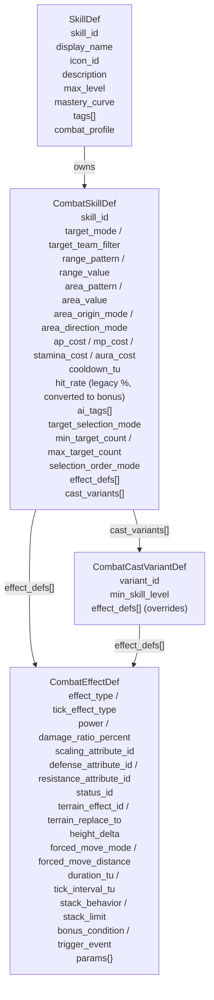

# 战斗技能系统实现纪要 — 可落地执行版

更新日期：`2026-04-22`

## 1. 文档目的

本文件是战斗技能系统的**当前实现与后续扩展规格书**，覆盖：

1. 仓内已落地的技能资源链路、命中模型、状态语义、范围计算、AI 评分实际结构
2. 字段级的文档→代码对齐表
3. 每个子系统的当前能力与已识别缺口
4. 下一阶段（Phase 4+）的扩展边界与验收标准

设计红线：

- 技能定义以 `SkillDef -> CombatSkillDef -> CombatEffectDef` 为唯一真相源，不再另起平行系统
- 战斗执行以 `BattleRuntimeModule -> BattleHitResolver -> BattleDamageResolver -> BattleGridService` 链路为准
- 命中结算走 **3.5e 风格 BAB + 降序 AC + d20**，不走 2E THAC0 口径（与 `docs/design/player_growth_system_plan.md` 的大等级压制设计同源）
- 旧 `hit_rate / evasion` 属性名保留为运行时字段，由 `BattleHitResolver` 现场转换为 BAB/AC，不再做全链路重命名
- 新技能内容统一走通用技能书，不绑定职业主动授予
- `aura / 斗气` 是独立资源，与 `MP` / `Stamina` / `AP` 并列
- 场景与运行时以 `scripts/systems/world_map_system.gd` 为主，`scripts/systems/game_runtime_facade.gd` 需保持同步

---

## 2. 与现有代码的对齐

### 2.1 核心文件清单

| 组件 | 文件 | 状态 |
| --- | --- | --- |
| 技能顶层定义 | `scripts/player/progression/skill_def.gd` | 稳定 |
| 战斗档 | `scripts/player/progression/combat_skill_def.gd` | 扩展完成：`aura_cost / area_origin_mode / area_direction_mode / ai_tags / target_selection_mode` |
| 效果档 | `scripts/player/progression/combat_effect_def.gd` | 扩展完成：`damage_ratio_percent / forced_move_mode / forced_move_distance / stack_limit / bonus_condition / trigger_event` |
| 施法变体 | `scripts/player/progression/combat_cast_variant_def.gd` | 稳定 |
| 技能注册中心 | `scripts/player/progression/progression_content_registry.gd` | 稳定 |
| 技能语义校验 | `scripts/player/progression/skill_content_registry.gd` | 已接入 `forced_move / charge` 等 effect 校验 |
| 战斗命中 | `scripts/systems/battle_hit_resolver.gd` | 已落地 BAB+AC+d20 + 天然 1/20 + deterministic RNG |
| 战斗主流程 | `scripts/systems/battle_runtime_module.gd` | 已接入资源校验 / 扣费 / CD 写入 / 命中路由 |
| 伤害结算 | `scripts/systems/battle_damage_resolver.gd` | 稳定 |
| 连段结算 | `scripts/systems/battle_repeat_attack_resolver.gd` | 已接入分阶段命中独立掷骰 |
| 冲锋结算 | `scripts/systems/battle_charge_resolver.gd` | 稳定 |
| 范围计算 | `scripts/systems/battle_grid_service.gd` | 已支持 `single / diamond / square / cross / radius / line / cone / self` |
| 状态语义 | `scripts/systems/battle_status_semantic_table.gd` | 已登记 20+ 状态语义模板 |
| 战斗预览 | `scripts/systems/battle_preview.gd` | 已带 `hit_preview` 结构化字段 |
| AI 决策 | `scripts/systems/battle_ai_service.gd` | 已改为候选打分 + state 分流 |
| AI 评分 | `scripts/systems/battle_ai_score_service.gd` | 已统一技能 / 移动 / 撤退 / 等待评分 |
| AI 评分入参 | `scripts/systems/battle_ai_score_input.gd` | 已导出 `score_input` 摘要 |

### 2.2 旧计划与实现的偏差

| 原计划 | 当前实现 | 说明 |
| --- | --- | --- |
| `CombatSkillDef.hit_rate` → `attack_roll_bonus` | 保持 `hit_rate`，`BattleHitResolver` 现场换算 | 避免全仓技能资源大规模迁移 |
| 属性 `HIT_RATE / EVASION` → `THAC0 / ARMOR_CLASS` | 仍为 `hit_rate / evasion` | 仅解析层换算为 BAB/AC，外层接口不改 |
| `roll_disposition` 作为 `CombatSkillDef` 字段 | **未新增**；仅作为 `BattleHitResolver` 命中结果分类出现 | 优势/劣势双骰机制未动 |
| 2E THAC0 | **改为 3.5e BAB + 降序 AC** | 命中随等级差扩张，支持大等级碾压感 |
| `SAVE_VERSION` 不升 | 实际未升 | 与旧存档兼容 |
| Demo 15 警士技能 | 15 个里有 14 个落地，`warrior_shield_wall` 已删 | 当前通过 `warrior_guard` + `warrior_taunt` 覆盖防御姿态 |
| 文档约束 80 个技能目标 | 已登记 ≈ 185 个技能资源（warrior 16 / archer 32 / mage 135 / priest 1 / saint 1） | 扩展远超原目标，内容侧用同一 effect/status/shape 模板复用 |

---

## 3. 核心运行时数据结构

以下结构以当前仓库真实实现为准。资源层 (`.tres`) 只负责模板，`BattleRuntimeModule` 在开战时深拷贝进运行时实例。

### 3.1 技能定义对象图



### 3.2 BattleUnitState 关键字段

| 字段 | 含义 |
| --- | --- |
| `unit_id` / `display_name` / `faction_id` | 单位识别三件套 |
| `control_mode` | `manual` / `ai`，AI 分流只看这个字段 |
| `ai_brain_id` / `ai_state_id` | AI 控脑与当前状态 |
| `current_hp / mp / stamina / aura / ap` | 五种资源，`aura` 默认 0 |
| `attribute_snapshot` | 派生属性快照，读写 `hit_rate` / `evasion` / `physical_attack` / `magic_attack` 等 |
| `cooldowns: Dictionary` | `{ skill_id: remaining_tu }` |
| `status_effects: Dictionary` | `{ status_id: BattleStatusEffectState }` |
| `movement_tags: Array` | 地格移动标签 |
| `known_active_skill_ids: Array` | 本场战斗可用的主动技能列表 |
| `known_skill_level_map: Dictionary` | 技能等级，决定可用 cast variants |

### 3.3 BattleState 关键字段

| 字段 | 含义 |
| --- | --- |
| `battle_id` / `seed` | 战斗唯一标识与主随机种子 |
| `phase` | `timeline_running` / `unit_acting` / `battle_ended` 等 |
| `active_unit_id` | 当前行动单位 |
| `units: Dictionary[StringName, BattleUnitState]` | 单位索引 |
| `timeline` | TU 推进状态 |
| `attack_roll_nonce` | d20 掷骰游标，配合 `seed + battle_id` 做 deterministic RNG |
| `log_entries` | 日志行 |
| `ally_unit_ids / enemy_unit_ids` | 按 faction 分组的单位列表 |
| `winner_faction_id` | 胜方 faction |

---

## 4. 命中系统（BAB + 降序 AC + d20）

### 4.1 攻击检定公式

`BattleHitResolver.build_skill_attack_check()` 的正式公式：

```text
required_roll =
    ATTACK_CHECK_TARGET   (固定 21)
  - attacker_bab
  - target_armor_class
  - skill_attack_bonus
  - situational_attack_bonus
  + situational_attack_penalty

hit_rate_percent = clamp((21 - required_roll) * 5, 0, 100)

resolution:
  if d20 == 1  → 天然失手（natural_1_auto_miss）
  if d20 == 20 → 天然命中（natural_20_auto_hit）
  if d20 >= required_roll → 命中
  else → 未命中
```

映射细节：

- `attacker_bab = _convert_legacy_hit_rate_to_bab(active_unit.hit_rate)`
- `target_armor_class = _convert_legacy_evasion_to_armor_class(target_unit.evasion)`
- `skill_attack_bonus = _convert_legacy_percent_to_attack_bonus(combat_profile.hit_rate)`
- 以上换算步长 `ATTACK_BONUS_STEP = 5.0`，即 5% 命中率约等于 1 点攻击加值。

### 4.2 连段攻击

`BattleHitResolver.build_repeat_attack_stage_hit_check()`：

- 每一段独立掷骰，独立写入 `attack_roll_nonce`
- `repeat_attack_effect.params.base_hit_rate` → 基础段位加值
- `repeat_attack_effect.params.follow_up_hit_rate_penalty` × `stage_index` → 阶段递减
- `cost_resource` 支持 `aura / mp / stamina / ap`，默认 `aura`
- 预览用 `_resolve_repeat_attack_preview_stage_count()` 按当前资源推算最多可执行阶段

### 4.3 deterministic RNG

`_roll_battle_d20()` 的随机源：

```text
seed_source = "<battle_id>:<seed>:<attack_roll_nonce>"
rng.seed    = seed_source.hash()
roll        = rng.randi_range(1, 20)
attack_roll_nonce += 1
```

- 保证 headless 回归下相同种子下 d20 序列稳定
- 每次掷骰都会自增 `battle_state.attack_roll_nonce`，禁止跨回合共享

### 4.4 优势 / 劣势（roll_disposition）

当前 `roll_disposition` 仅作为命中结果的分类枚举：

- `threshold_hit` / `threshold_miss`
- `natural_1_auto_miss` / `natural_20_auto_hit`

双骰取高 / 取低的规则骨架**尚未接入**，`CombatSkillDef` 也没有 `roll_disposition` 配置字段。Phase 4 才会展开。

---

## 5. 范围与选点系统

`BattleGridService.get_area_coords()` 已支持的 `area_pattern`：

| 图案 | 语义 | 计算方式 |
| --- | --- | --- |
| `single` | 单格 | 返回 `center_coord` |
| `self` | 施法者自身 | 同 single，实际中心由调用方传入 |
| `diamond` | 曼哈顿距离 ≤ radius | `|dx| + |dy| <= r` |
| `square` / `radius` | 切比雪夫距离 ≤ radius | `max(|dx|, |dy|) <= r` |
| `cross` | 十字延伸 | `dx == 0 or dy == 0` |
| `line` | 直线延伸 | 方向由 `facing_direction` 决定（x 轴或 y 轴） |
| `cone` | 锥形延伸 | 方向由 `facing_direction` 决定 |

`area_origin_mode` / `area_direction_mode` 分别控制中心点与方向：

- `area_origin_mode`：`target` / `caster` / `anchor_coord`
- `area_direction_mode`：`target_vector`（由施法者到目标格的向量确定）/ `caster_facing`

当前**不引入单位朝向系统**，line/cone 的方向完全由瞄点向量决定。

---

## 6. 状态语义表

`BattleStatusSemanticTable` 负责集中维护状态行为模板。已登记的状态：

| 状态 ID | stack_mode | tick_mode | 说明 |
| --- | --- | --- | --- |
| `archer_pre_aim` | refresh | none | 预瞄：增加下一次攻击检定 |
| `archer_range_up` | refresh | none | 射程增益 |
| `armor_break` | refresh | none | 破甲 |
| `attack_up` | refresh | none | 攻击力增益 |
| `burning` | **add** | turn_start_damage | 叠层烧伤，回合起始结算持续伤害 |
| `damage_reduction_up` | refresh | none | 受伤减免 |
| `death_ward` | refresh | none | 致死免伤 |
| `evasion_up` | refresh | none | 闪避增益（降 AC） |
| `frozen` | refresh | none | 冰冻 |
| `guarding` | refresh | none | 格挡姿态 |
| `hex_of_frailty` | refresh | none | 脆弱诅咒 |
| `magic_shield` | refresh | none | 法术盾 |
| `marked` | refresh | none | 标记 |
| `pinned` | refresh | none | 钉射 |
| `prismatic_barrier` | refresh | none | 棱彩屏障 |
| `rooted` | refresh | none | 束缚 |
| `shocked` | refresh | none | 导电 |
| `slow` | refresh | none | 迟缓，移动代价 +1 |
| `spellward` | refresh | none | 护咒 |
| `staggered` | refresh | none | 踉跄 |
| `taunted` | refresh | none | 挑衅 |
| `tendon_cut` | refresh | none | 断筋 |

所有状态时间粒度 `TU_GRANULARITY = 5`，需在 TU 轴上对齐。

### 6.1 已接入的状态效应

- `archer_pre_aim`：提供下次攻击检定 `+2` 等价加成
- `evasion_up`：等价 `armor_class -2`
- `burning`：`stack_mode = add`，最大叠 3 层，回合起始造成持续伤害
- `slow`：`move_cost_delta = 1`，移动代价永久 +1 直到消失
- 其他均走 `refresh` timeline 模板，按 `duration_tu` 自行衰减

---

## 7. AI 评分系统

### 7.1 候选打分结构

`BattleAiScoreService.build_skill_score_input()` 与 `build_action_score_input()` 产出统一 `BattleAiScoreInput`，字段包含：

```text
score_input:
  action_kind            # skill / move / retreat / wait
  action_label
  score_bucket_id
  score_bucket_priority
  command / skill_def / preview
  primary_coord
  target_unit_ids[] / target_coords[]
  target_count

  hit_payoff_score       # 伤害 + 治疗 + 状态 + 地形 + 高度差 * 命中率
  estimated_damage / estimated_healing
  estimated_status_count / estimated_terrain_effect_count
  estimated_height_delta
  estimated_hit_rate_percent

  ap_cost / mp_cost / stamina_cost / aura_cost / cooldown_tu
  resource_cost_score

  move_cost
  position_objective_kind
  desired_min_distance / desired_max_distance
  position_anchor_coord
  distance_to_primary_coord
  position_objective_score

  total_score
```

### 7.2 总分公式

技能动作：

```text
total_score = action_base_score
            + hit_payoff_score
            + target_count * target_count_weight
            - resource_cost_score
            + position_objective_score
```

移动 / 撤退 / 等待动作：

```text
total_score = action_base_score
            + position_objective_score
            + target_count * metadata.target_count_weight
            - move_cost * movement_cost_weight
```

### 7.3 候选比较顺序

当多个动作都有评分时，`BattleAiService` 的比较顺序：

1. `score_bucket_priority` 高者优先
2. `total_score` 高者优先
3. `hit_payoff_score` 高者优先
4. `target_count` 高者优先
5. `position_objective_score` 高者优先
6. `resource_cost_score` 低者优先
7. 相等则按 action 列表先后

---

## 8. 技能内容池现状

### 8.1 内容规模

| 类别 | 数量 | 位置 |
| --- | --- | --- |
| warrior | 16 | `data/configs/skills/warrior_*.tres` |
| archer | 32 | `data/configs/skills/archer_*.tres` |
| mage | 135 | `data/configs/skills/mage_*.tres` |
| priest | 1 | `data/configs/skills/priest_aid.tres` |
| saint | 1 | `data/configs/skills/saint_blade_combo.tres` |
| **总计** | **≈ 185** | 所有技能资源 |

特殊说明：

- `charge` 作为 `effect_type` 存在（见 `skill_content_registry.gd` 校验），挂在需要冲锋落点判定的技能上（如 `warrior_whirlwind_slash` 的冲锋 cast variant），不以独立 tres 形式出现。
- `warrior_shield_wall` 已删除，防御姿态由 `warrior_guard` + `warrior_taunt` 覆盖。

### 8.2 旧 Demo 15 的落地对照

| 原 Demo 15 | 当前资源 | 状态 |
| --- | --- | --- |
| 重击 | `warrior_heavy_strike` | ✓ |
| 横扫 | `warrior_sweeping_slash` / `warrior_whirlwind_slash` | ✓（拆成双技能） |
| 穿刺 | `warrior_piercing_thrust` | ✓ |
| 裂甲斩 | `warrior_guard_break` | ✓（改名） |
| 断头斩 | `warrior_execution_cleave` | ✓ |
| 冲锋 | `warrior_whirlwind_slash.charge variant` | ✓（以 cast variant 接入） |
| 跳斩 | `warrior_jump_slash` | ✓ |
| 后撤步 | `warrior_backstep` | ✓ |
| 格挡 | `warrior_guard` | ✓ |
| 护盾墙 | —— | 删除，防御姿态收敛到 `warrior_guard` |
| 战斗回复 | `warrior_battle_recovery` | ✓ |
| 盾击 | `warrior_shield_bash` | ✓ |
| 挑衅 | `warrior_taunt` | ✓ |
| 战吼 | `warrior_war_cry` | ✓ |
| 真龙斩 | `warrior_true_dragon_slash` | ✓ |

额外落地：`warrior_aura_slash` / `warrior_combo_strike`（连段骨架）/ `warrior_whirlwind_slash`（含冲锋变体）。

---

## 9. 分步实现计划

### 9.1 Phase 0 / 1 / 2 / 3 回顾

| 阶段 | 目标 | 当前状态 |
| --- | --- | --- |
| Phase 1 规则底座 | Aura / `BattleHitResolver` / BAB+AC+d20 / `BattlePreview` / 冷却推进 / 状态注册表 / 强制位移 / 范围图形 / AI 评分骨架 / HUD | **已落地** |
| Phase 2 Demo 技能池 | 15 个示范 warrior 技能 | **14/15 落地**，`warrior_shield_wall` 已删除 |
| Phase 3 补齐 80 技能 | 沿用 effect/status/shape 模板扩展 | **已超额**（≈ 185 技能资源） |

### 9.2 Phase 4：规则扩展（待办）

| 任务 | 文件 | 改动 |
| --- | --- | --- |
| 1. `roll_disposition` 字段 | `combat_skill_def.gd` | 新增 `@export roll_disposition: StringName`，支持 `normal / advantage / disadvantage` |
| 2. 双骰取舍 | `battle_hit_resolver.gd` | `_roll_battle_d20()` 支持一次取两骰，按 disposition 取 max/min |
| 3. 预览展示 | `battle_preview.gd` / `battle_hud_adapter.gd` | `hit_preview` 补 `roll_disposition` 字段，HUD 展示 "优势 / 劣势" 标签 |
| 4. 战场规则来源 | 新文件 `scripts/systems/battle_roll_disposition_resolver.gd` | 高地 / 掩体 / 贴身远程 / 包夹等战场来源合成最终 disposition |
| 5. 回归测试 | `tests/battle_runtime/run_battle_roll_disposition_regression.gd` | 覆盖双骰取高 / 取低 / 与天然 1/20 的互动 |

**验收标准**：

- `CombatSkillDef.roll_disposition = &"advantage"` 时，同一场景下命中率显著提升
- 天然 1 / 天然 20 规则优先级不被 disposition 改变
- HUD 预览可视化 "需 X+ · 优势" 文案
- headless trace 记录双骰的两个原始结果

### 9.3 Phase 5：战场情境表（可延后）

| 任务 | 说明 |
| --- | --- |
| 高地判定 | `battle_grid_service.get_height_delta()` 注入 attack bonus |
| 掩体判定 | 通过地格的 `terrain_effect_ids` 给防御方提供 AC 加成 |
| 贴身远程惩罚 | `BattleHitResolver` 按 skill tag 和近战距离触发负加成 |
| 包夹 | 多个友军毗邻目标时提供 attack bonus |

这些情境目前都**未接入**，留待 Phase 5 统一通过 `situational_attack_bonus` 通道注入。

### 9.4 Phase 6：Saving Throw / 暴击重构（长远）

- 救援检定：受害方按属性对 effect 发起 d20 抵抗，未过则全额生效
- 暴击重构：当前命中系统没有独立暴击逻辑，只有天然 20 自动命中。暴击伤害倍率落地需要新引 `crit_multiplier` 字段与结算分支

Phase 6 目前**未启动**，不影响 Phase 0~3 内容继续迭代。

---

## 10. 与现有系统的集成边界

### 10.1 修改边界

| 现有系统 | Phase 4 改动 | Phase 5+ 改动 |
| --- | --- | --- |
| `CombatSkillDef` | 新增 `roll_disposition` | 无 |
| `BattleHitResolver` | 双骰取舍 | 情境表注入 `situational_attack_bonus` |
| `BattlePreview` | `hit_preview.roll_disposition` | `hit_preview.situational_sources[]` |
| `BattleGridService` | 无 | 新增 `get_cover_bonus()` / `get_height_bonus()` 接口 |
| `BattleAiScoreService` | 0% 命中候选排除 | 将情境 bonus 纳入预期命中率 |
| `BattleHudAdapter` | 优势/劣势标签 | 情境来源明细展示 |

### 10.2 不应触碰的系统

- `SaveSerializer` — 命中模型不升 `SAVE_VERSION`，存档兼容保持
- `AttributeService.HIT_RATE / EVASION` — 保留原名，避免 ripple 全仓资源迁移
- `HeadlessGameTestSession` — 新增 text command 域即可，不改核心结构
- `WorldMapSystem` 主流程 — 技能扩展不应牵动 world map 的战斗启动链路

### 10.3 资源 / 工具链对齐

- 技能资源变更后需跑 `run_skill_schema_regression.gd`（schema 级校验）
- 命中公式变更后需跑 `run_battle_runtime_ai_regression.gd` 与 `run_warrior_skill_semantics_regression.gd`
- 大规模内容平衡可走 `docs/design/battle_balance_simulation.md` 的批量模拟链路

---

## 11. 测试清单

### 规则测试

- BAB + 降序 AC + d20 公式正确（`_convert_legacy_*` 链路覆盖）
- 天然 1 / 天然 20 在任何 disposition 下都优先生效
- Aura / Stamina / AP / CD 校验与扣除路径
- 状态 `stack_mode` / `tick_mode` / `duration_tu` 的生命周期
- 强制位移（击退 / 拉拽 / 跳斩）正确更新坐标与占位
- 击杀刷新行动只在条件满足时触发
- 连段攻击逐段独立掷骰、阶段惩罚正确
- deterministic RNG 保证相同 `seed + battle_id + nonce` 的稳定性

### 技能测试

- 每个 warrior Demo 技能覆盖"合法释放"与"非法目标"两类
- `warrior_taunt` 验证 AI 转火
- `warrior_guard` 验证减伤姿态
- `warrior_execution_cleave` 验证低血增伤条件
- `warrior_true_dragon_slash` 验证直线大范围命中
- multi-unit 技能验证逐目标独立命中与聚合预览
- self / ally 向技能不走攻击检定

### UI / 预览测试

- HUD 展示最终命中率与"需 X+"文案
- 资源不足时技能槽禁用态
- 范围预览显示选点与受影响格
- 文本快照 / headless snapshot 能读到 `hit_preview` 摘要

### AI 测试

- 击杀优先 / 控制高威胁 / 低血保命 / AOE 最大收益 / 位移接敌五类行为
- 0% 命中候选被正确排除
- `score_bucket_priority` 优先级生效

---

## 12. 总结

当前战斗技能系统已经具备完整闭环：

- **数据层** — `SkillDef / CombatSkillDef / CombatEffectDef / CastVariantDef` 覆盖所有内容需求，`damage_ratio_percent` 与 `forced_move_*` 填平了旧字段缺口
- **执行层** — `BattleHitResolver` 接管 BAB + 降序 AC + d20 口径，deterministic RNG 让 headless 回归稳定
- **范围层** — `BattleGridService` 覆盖 `single / self / line / cone / radius / diamond / square / cross` 八种图案，方向由瞄点向量推算
- **状态层** — `BattleStatusSemanticTable` 登记 20+ 状态模板，`refresh / add` 叠层与 `turn_start_damage` tick 已接入
- **AI 层** — 候选打分统一到 `BattleAiScoreInput`，支持技能 / 移动 / 撤退 / 等待同平面比较
- **内容层** — 约 185 个技能资源，已超出原 80 个的目标

实施优先级：

1. **Phase 4（近期）**：`roll_disposition` 优势/劣势双骰机制，配套 HUD 与回归
2. **Phase 5（中期）**：高地 / 掩体 / 包夹 / 贴身远程惩罚等情境表
3. **Phase 6（远期）**：Saving Throw、独立暴击倍率、跨阵营救援检定

最理想的体验是让玩家感到：

> **数值差距在棋盘上可感知、命中是可预览的决策、技能丰度不会压到资源与冷却之外的规则骨架。**
