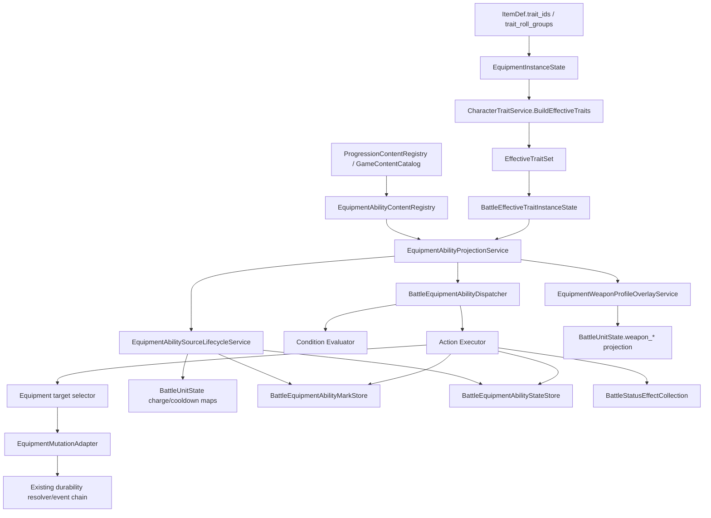
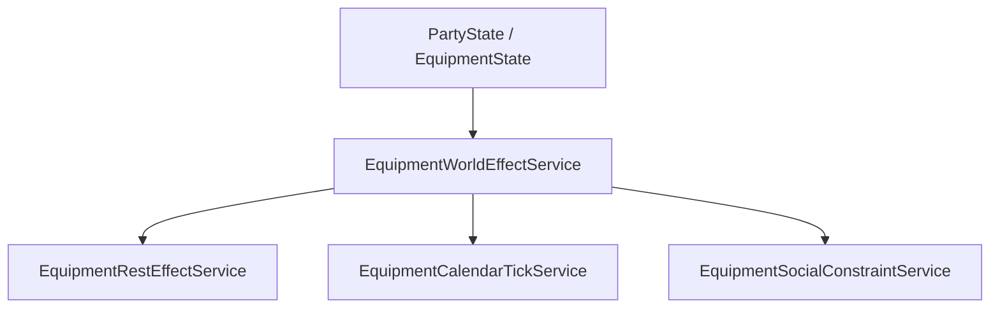
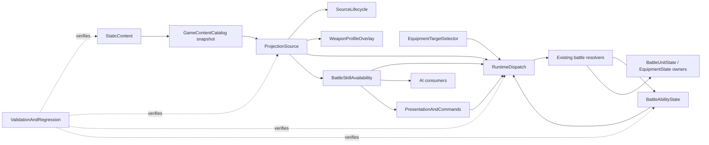

# 装备能力系统设计

更新时间：2026-06-29
状态：Draft / Review
目标读者：Claude / Kimi / 后续实现者

## 目标

本设计用于支撑 `docs/design/weapons/by_family/*.md` 中的武器能力，而不是只支撑当前已落地的静态属性加成。系统需要覆盖武器自带专长、被动、触发反应、目标标记、层数、授予动作、召唤物、战场区域、延迟效果、环境条件，以及少量休息/日历/世界层效果。

核心目标：

- 让装备携带的“专长/特性”有统一展示入口。
- 让装备能力可以真正生效，而不是只作为文本说明。
- 保持数据驱动，避免每把武器一个 C# 类。
- 保持当前仓库偏好的 typed state，避免用 Godot Dictionary 承载业务状态。
- 为 MOD 留出数据扩展空间：V1 普通 MOD 能通过资源新增装备能力；新增规则处理器属于 V4 代码 ABI，不在 V1 承诺中。

## 当前系统边界

当前项目已经有一套 trait 聚合边界，可以作为装备能力的入口：

- `ItemDef.trait_ids` 表示装备固定特性。
- `ItemDef.trait_roll_groups` 和 `EquipmentInstanceState.trait_instances` 表示装备随机词条。
- `CharacterTraitService.BuildEffectiveTraits` 会聚合身份、角色、装备固定 trait、装备随机 trait。
- `EffectiveTraitSet` 会投影到战斗单位的 `BattleEffectiveTraitInstanceState`。
- `TraitDef.categories` 可用于区分 `weapon_feat`、`equipment_passive`、`weapon_property` 等展示分类。

但当前系统主要停留在“聚合和展示”层。真正的触发能力只有少量硬编码逻辑，例如 `TraitTriggerHooks` 中的 HalflingLuck、SavageAttacks、RelentlessEndurance。对于武器文档里的复杂装备能力，当前结构缺少：

- 数据化触发器。
- 数据化条件。
- 数据化动作。
- 装备能力运行时状态。
- 目标标记和层数。
- 战场实体、区域、延迟效果。
- 世界/休息/日历层能力执行入口。
- 面向数据 MOD 的内置 handler registry，以及 V4 预留的代码 handler registry 边界。

## 设计原则

### Trait 是外壳，Ability 是规则

`TraitDef` 不应该直接变成一个巨大的“万能效果定义”。它负责：

- 展示名称、描述、分类。
- 来源聚合。
- 堆叠策略。
- charge/reset 等轻量通用信息。
- 作为装备能力绑定的展示外壳和来源 key。

装备能力的具体规则应该落在显式的 ability resource / DTO 上：

- `EquipmentAbilityBindingDef`
- `EquipmentAbilityReactionDef`
- `EquipmentAbilityConditionDef`
- `EquipmentAbilityActionDef`
- `EquipmentAbilityStateSchemaDef`
- `EquipmentGrantedActionDef`
- `EquipmentWorldEffectDef`

这样角色特性、种族特性、装备特性可以继续共享 trait 外壳，但不会把所有运行时语义塞进 `TraitDef.effect_type`，也不会把装备能力数组直接挂到通用 `TraitDef` 上。

### 数据资源和运行时状态分离

资源层可以使用 Godot Resource：

- 便于编辑器、内容资源、MOD 包加载。
- 使用 `StringName` 表示 handler id、tag、状态 key。
- 使用显式 typed 字段表示数值、枚举、列表。

运行时层必须使用 typed DTO/state：

- 战斗保存和回放不能依赖 Dictionary。
- UI 和测试可以通过 `ToDictionary`/`FromDictionary` 做边界转换。
- 不引入 `params` 字典式万能字段。

### 不为单件装备写专属代码

代码层只实现规则原语：

- 触发点 handler。
- 条件 handler。
- 动作 handler。
- 状态 schema。
- validator。

内容层组合这些原语形成具体武器能力。比如“暴击后给目标叠一层裂伤，三层后爆发额外伤害”应由 trigger + condition + action + state schema 组合完成，而不是写一个 `AxeOfRuptureSystem`。

### MOD 边界

数据 MOD 可以新增：

- `ItemDef`
- `TraitDef`
- `EquipmentAbilityBindingDef`
- ability reactions
- conditions
- actions
- state schemas
- granted actions
- world effects

前提是它们使用已有 handler id。
如果 MOD 要新增一种项目没有实现过的规则语义，例如“将未来三次敌方行动倒序执行”，V1 数据 ABI 会把未知 handler 作为内容错误拒绝；这类需求需要等 V4 代码 ABI 开放后，通过受控的 condition/action handler registration 落地。

### V1 数据 ABI 与 V4 代码 ABI 边界

V1 的 MOD 支持是**数据 ABI**，不是完整代码 ABI。V1 对外稳定承诺的是资源形状、命名空间、handler id 引用方式、registry build fail-fast 错误和 runtime DTO 投影结果；不承诺外部程序集能把任意 C# 代码插入战斗 resolver。

V1 数据 ABI 包含：

- `EquipmentAbilityBindingDef` 及其子资源的字段结构。
- `binding_id`、`reaction_id`、`condition_id`、`action_id`、`state_key`、`granted_action_id` 的命名空间规则。
- Resource 层 `StringName kind` / `fact_id` / `selector_id` / `state_key` 到 typed DTO 的转换规则。
- 内置 condition/action handler id 列表。
- 内置 `EquipmentAbilityHandlerSpec` 元数据结构。
- `EquipmentAbilityContentValidator` 的 registry build `Success/Errors` 最小契约；`Errors` 应尽量携带稳定诊断码和错误路径。
- 数据 MOD 使用已有 handler id 时的 add / replace / reject 规则。

V1 不把以下内容作为 ABI：

- 外部 C# handler interface。
- 外部程序集加载、卸载、热更新。
- handler 直接读写 `BattleState` / `BattleUnitState` 的权限。
- handler 注入新的 battle hook phase。
- 外部 handler 自定义 save schema 或 runtime state owner。
- 外部 handler 影响 deterministic RNG、AI mutation guard、snapshot builder 的入口。

因此 V1 的设计目标不是“现在就做完整 ABI”，而是把未来代码 ABI 需要的前置结构先稳定下来：handler metadata、payload validation、consumer support、state access contract、diagnostic metadata 和 phase compatibility。V4 如果开放代码 MOD handler，只能复用这些结构，不允许绕过它们直接暴露战斗 live state。

### 存档兼容

V1 硬约束：**战斗进行中不能存档**。装备能力的 V1 战斗状态是 active battle runtime state，不设计 battle save/load roundtrip，也不为了恢复战斗中断而新增 `BattleState` / `BattleUnitState` save schema。

因此 V1：

- 不新增 active battle save payload。
- 不为 `BattleEquipmentAbilityMarkStore` / `BattleEquipmentAbilityStateStore` 增加普通存档字段。
- 不为了 source-local charge/cooldown 补 `BattleUnitState` 存档字段。
- projection cache、weapon overlay result、granted skill availability view 都只运行时重建，不入存档。
- 战斗结束后的装备耐久变化、装备摧毁等结果仍沿用现有 battle result -> writeback 链路，不新增装备能力专属 writeback schema。
- `per_world_day`、`per_world_month` 和 `persistent_counter` 是 V1 正式支持的跨战斗装备能力状态，owner 是 `EquipmentInstanceState`。这些状态必须随装备实例在装备栏/仓库之间移动，并通过现有 party/equipment writeback 保存。

根据项目兼容策略，不能擅自添加旧 schema fallback 或迁移兼容。V1 引入 `EquipmentInstanceState` 的 world-bound ability state 时，必须同步确认 save version bump、当前版本旧档处理方式和严格 schema 更新范围；不能用可选字段 fallback 悄悄吞旧 payload。若未来要允许战斗中保存/恢复，仍必须单独确认 battle save schema。

V1 save schema impact matrix：

| 数据 | V1 存档策略 | 说明 |
| --- | --- | --- |
| `EquipmentAbilityContentPackDef` / binding 资源 | 不进入 save | 静态内容随 content registry / catalog revision 加载 |
| `BattleEquipmentAbilityProjection` | 不保存 | battle setup、换装、content revision 变化时重建 |
| `BattleGrantedEquipmentSkillEntry` / availability view | 不保存 | 从 projection + known skills 运行时重建 |
| weapon profile overlay result | 不保存 | 写入当前 `BattleUnitState.weapon_*`，但 active battle 不能存档 |
| mark/state store | 不保存 | 只要求 live owner API、AI snapshot/restore、headless snapshot 摘要 |
| source-local charge/cooldown/per-turn limit | 不新增保存 | 战斗中断不恢复；战斗持续期间由 `BattleUnitState` live map 持有 |
| world-bound usage / persistent counter | 保存到 `EquipmentInstanceState` | `per_world_day`、`per_world_month`、`persistent_counter`；使用 `WorldTimeSystem` 派生 period index，战斗内使用后随 equipment view writeback |
| 装备耐久损失/摧毁 | 走现有战后 writeback | 复用 `GameRuntimeBattleWritebackService` / 既有装备状态写回 |
| party/world persistent consequence | V3 | 永久改角色属性、世界旗标、剧情、记忆等后果需要独立 action owner 和 save schema |

## 总体结构



装备能力在角色侧只需要被聚合出 trait 来源。进入战斗后，由 projection service 使用 effective trait 的 `trait_id`、source kind、source id 和当前 `equipment_view` 派生出的 item/slot/category 去查询 `EquipmentAbilityContentRegistry`，把匹配的 ability binding 转成战斗可执行数据。source lifecycle service 负责 seed/cleanup；weapon overlay service 负责 projection 层武器 profile 改写；dispatcher 在各个战斗 hook 上查找匹配的 reaction，执行条件判断并产出 mutation plan。

世界层能力不进入 battle dispatcher，而是由独立服务执行：



## 按代码 owner 的 V1 模块拆分

下面的拆分是实现模块边界，不是必须逐字照抄的命名空间。判定一个模块是否自成单元时，按四件事检查：它拥有的数据、允许读取的输入、输出契约、禁止依赖。只要某个模块需要直接改另一个模块的内部状态，就说明边界没切干净。

### 依赖方向



核心规则：

- 静态内容只能往 runtime 提供已校验 DTO 和 handler metadata，不能读取或修改 `BattleState`。
- projection 只消费 `BattleUnitState.effective_trait_instances`、`BattleUnitState.equipment_view` 和 `GameContentCatalog` 快照，不回头重跑 `CharacterTraitService`。
- dispatcher 只做 trigger/condition/action 解析并产出 mutation plan；正式状态由当前 hook owner 或既有 resolver commit。
- source-local charge/cooldown 仍属于 `BattleUnitState.per_battle_charges`、`per_turn_charges`、`per_turn_charge_limits`、`cooldowns`，不得再写入 `BattleEquipmentAbilityStateStore`。
- mark 和非 source-local ability state 属于 `BattleState` typed store，不属于 `BattleStatusEffectCollection`，也不直接塞进 `BattleUnitState`。
- weapon profile overlay 是 projection 层事实，必须在 range、preview、AI 读取 `BattleUnitState.weapon_*` 之前生效，不能做成普通 triggered action。
- attack-defense modifier 是单次 attack check 的 runtime result，负责破甲、穿盾、无视闪避和掩体/障碍策略；它不改写 `WeaponProjection`、不持久修改 `BattleUnitState.attribute_snapshot`、也不等价于普通 `+hit`。
- 战斗环境事实只属于当前 battle runtime。`night`、`storm`、`moonlit`、`cold`、`heat` 这类全局环境必须在 battle setup 时物化到 `BattleState.environment_snapshot`，战斗结束即丢弃；世界地图不引入天气系统，也不能让 world effect 读取这些 battle-local tag。
- 生物分类事实属于 `BattleUnitState.creature_type_tags`。`undead`、`dragon`、`plant`、`beast`、`construct` 等只在战斗单位上作为正式 runtime projection 读取；敌人模板、玩家种族/血脉/变身等只能在 battle unit 创建或刷新时投影到该字段，condition/fact provider 执行时不得回查 `EnemyTemplateDef.tags` 或 progression identity catalog。
- battle skill availability 是唯一的“当前可用战斗技能入口”读口；`BattleUnitState.known_active_skill_ids` 仍只表示角色长期已知主动技能，装备授予技能不得写入该 owner。
- 装备目标选择和装备耐久变更分成 selector 与 commit；selector 不改装备，commit 复用现有耐久 resolver/事件链。
- UI 和文本命令不是规则 owner；它们可以显示 runtime projection，也可以发起 runtime preview/command，但最终合法性以 runtime 返回为准。

### 生产模块

| 模块 | 现有/新增 owner | 拥有内容 | 允许依赖 | 禁止依赖 | 接入点 |
| --- | --- | --- | --- | --- | --- |
| 1. StaticContent | 新增 `scripts/player/progression/equipment_abilities/*`；接入 `ProgressionContentRegistry`、`GameSession.RefreshContentCatalog()`、`GameContentCatalog` | `EquipmentAbilityContentPackDef`、`EquipmentAbilityBindingDef`、handler metadata、registry build result、optional/internal typed diagnostics | `TraitDef`、`ItemDef`、`SkillDefinition`、status id 表、内置 handler spec | `BattleState`、`BattleUnitState` live state、battle resolver、装备实例变更 | `ProgressionContentRegistry.Rebuild()` 重建 sidecar registry；`GameContentCatalog.Rebuild(...)` 缓存只读快照并递增 revision |
| 2. ProjectionSource | `scripts/systems/battle/runtime/EquipmentAbilityProjectionService.cs`、`EquipmentAbilitySourceResolver.cs` | `BattleEquipmentAbilityProjection` 派生缓存、`BattleEquipmentAbilitySource`、trigger 索引 | `BattleUnitState.effective_trait_instances`、`BattleUnitState.equipment_view`、`EquipmentAbilityContentRegistry` 快照、`ItemDef` 只读 facts | `CharacterTraitService.BuildEffectiveTraits(...)`、party live equipment、battle mutation | `BattleUnitFactory.RefreshEquipmentProjection(...)` 中 effective trait 和 charge reconcile 后重建；battle setup、换装与 catalog revision 变化后重建 |
| 3. SourceLifecycle | `scripts/systems/battle/runtime/EquipmentAbilitySourceLifecycleService.cs` | source key diff、缺失 charge/cooldown seed、失效 source cleanup | previous/current ability projection、`BattleUnitState` charge maps、`BattleState` typed mark/state API | handler condition/action 执行、耐久扣减、UI 展示 | 跟随 `BattleUnitFactory.RefreshEquipmentProjection(...)`；使用类似 `TraitTriggerHooks.ReconcileChargesAfterEffectiveTraitProjection(...)` 的 previous/current diff |
| 4. BattleAbilityState | 新增 `scripts/systems/battle/core/BattleEquipmentAbilityMarkStore.cs`、`BattleEquipmentAbilityStateStore.cs`、state DTO | target mark、battle-level once/stack/counter 等非 source-local runtime facts | `BattleState` typed API、payload project/replace、AI mutation guard snapshot/restore | `BattleStatusEffectCollection`、`BattleUnitState` source-local charge/cooldown、handler 语义判断 | `BattleState.Project...` / `Replace...`；headless/runtime snapshot；`BattleAiMutationGuard` stable/capture/restore |
| 5. RuntimeDispatch | `scripts/systems/battle/runtime/BattleEquipmentAbilityDispatcher.cs`、condition/action/fact/selector/dice services | trigger evaluation、condition result、mutation plan、trace | projection cache、handler metadata、fact providers、target selector service、`BattleUnitState` fact projection、existing resolver public/internal API | 直接改 `EquipmentInstanceState.current_durability`、直接写 weapon projection、直接拥有 mark store internals、执行期回查 enemy template tag | thin service 挂到真实 hook：`BattleHitResolver`、`BattleDamageResolver`、`BattleTimelineDriver`、`BattleChangeEquipmentResolver`、技能 turn resolver |
| 6. WeaponProfileOverlay | `scripts/systems/battle/runtime/EquipmentWeaponProfileOverlayService.cs`、`scripts/systems/battle/core/WeaponProjection` 扩展 DTO | 当前 `WeaponProjection` 字段的 projection-only overlay 合成结果：range、dice、damage tag、grip、two-handed/versatile | base `WeaponProjection`、ability projection、static overlay definition | dispatcher action commit、status/mark owner、耐久 owner、未扩展 DTO 的 crit/attack mode 旁路 | `BattleUnitFactory.RefreshWeaponProjection(...)` 应先算 base weapon projection，再应用 overlay，最后写回 `BattleUnitState.ApplyWeaponProjectionTyped(...)` |
| 6b. AttackDefenseModifier | `scripts/systems/battle/runtime/EquipmentAttackDefenseModifierService.cs`、`scripts/systems/battle/core/EquipmentAttackDefenseAdjustment.cs` / `EquipmentDefenseComponentSnapshot.cs` | 单次 attack check 的目标 AC 组件快照、组件忽略/倍率、dodge lock、cover / projectile obstacle policy、trace | `BattleAttackCheckPolicyService`、`BattleHitResolver`、`AttributeService.AC_COMPONENT_ATTRIBUTE_IDS`、`BattleUnitState.equipment_view`、ItemDef tags/type、ability projection | 直接改 `armor_class` attribute、把破甲做成永久 status、把穿盾塞进 weapon overlay、绕过 preview/AI | `BattleAttackCheckPolicyService.BuildAttackCheck(...)` 在调用 `BattleHitResolver` 前收集 modifier；`BattleHitResolver` 用 adjustment 生成同一个 `AttackCheckInput` |
| 6c. BattleEnvironmentFacts | `scripts/systems/battle/core/BattleEnvironmentSnapshot.cs`、`scripts/systems/battle/runtime/BattleEnvironmentContextProvider.cs`、`BattleEnvironmentTagContentRules` | 当前战斗的全局环境 tag/scalar、格子/路径环境派生规则、环境 fact trace | `BattleState.terrain_profile_id`、`BattleCellState.base_terrain/current_height/terrain_effect_ids/timed_terrain_effects`、battle setup context、test override | 世界地图天气系统、world runtime 当前时间/天气、装备 ability pack 自己声明环境 tag、执行/AI/preview 各自硬编码环境判断 | `BattleRuntimeModule.StartBattle(...)` 建立 snapshot；condition/fact provider、preview、AI scoring、execution 只读 provider |
| 7a. EquipmentTargetSelector | `scripts/systems/battle/runtime/EquipmentAbilityEquipmentTargetSelector.cs` | `EquipmentAbilityEquipmentTargetRef` 只读选择结果、weighted random 候选和 trace | `EquipmentState`、`EquipmentEntryState`、`EquipmentInstanceState` snapshot、`ItemDef.IsWeapon/IsArmor/tags/slots`、正式 battle RNG | 修改装备实例、扣耐久、清装备槽 | target selector resolver 的 equipment result kind；供 action handler 和 fact provider 读取 |
| 7b. EquipmentMutationAdapter | `scripts/systems/battle/runtime/EquipmentAbilityEquipmentMutationAdapter.cs` 或抽窄现有 `BattleDamageResolver` internal API | ability durability payload 到现有装备耐久 commit 的 selected-target 适配 | `CombatEffectDefinition equipment_durability_damage` 语义、`BattleDamageResolver`、`BattleSkillExecutionOrchestrator._apply_equipment_durability_result(...)` | 重新实现耐久扣减、二次随机、绕过 save/result event、直接写 party warehouse | V1 只支持 durability loss/destroy；摧毁后复用现有刷新投影和 changed unit report |
| 8. BattleSkillAvailability | `scripts/systems/battle/runtime/BattleSkillAvailabilityService.cs`、`BattleAvailableSkillEntry.cs` | merged skill entry view、slot 顺序、source ref、skill level 解析、consumer access gate | `BattleUnitState.known_active_skill_ids`、`known_skill_level_map`、`BattleEquipmentAbilityProjection.GrantedSkills`、skill catalog、condition evaluator | 写 `UnitProgress.skills`、写 `BattleUnitState.known_active_skill_ids`、直接 commit 技能效果、保存 projection cache | HUD、selection、preview、execution、AI 都必须通过该 service 判断当前技能入口是否存在和等级 |
| 9. PresentationAndCommands | `scripts/systems/battle/presentation/BattleHudAdapter.cs`、`scripts/ui/BattleMapPanel.cs`、`scripts/systems/game_runtime/headless/HeadlessGameTestSession.cs`、`GameTextCommandRunner.cs` | 展示 DTO、granted skill 按钮/文本命令入口、trace 摘要 | battle skill availability、runtime preview/command 结果、content display name | 规则判定 owner、直接 commit battle mutation | HUD 可以做本地 disabled hint，但最终可用性以 runtime preview/command 为准；headless 只走正式 command facade |

### 验证切片

`ValidationAndRegression` 不是生产模块，而是保证上述模块边界没有互相漏职责的实现切片：

| 验证切片 | 覆盖边界 |
| --- | --- |
| `tests/runtime/validation` | StaticContent：pack/binding/handler metadata、registry build fail-fast、string error code/path 片段 |
| `tests/equipment` | `EquipmentState`、`EquipmentEntryState`、`EquipmentInstanceState`、trait roll 和耐久 schema |
| `tests/battle_runtime/runtime` | ProjectionSource、SourceLifecycle、换装后 projection/cleanup；BattleSkillAvailability 的 slot 排序、重复技能裁剪、skill level 解析、preview/execution gate |
| `tests/battle_runtime/rules` | WeaponProfileOverlay 对 range、preview、target validation 的影响 |
| `tests/battle_runtime/environment` | battle environment snapshot 注入、全局/局部 tag 查询、AI guard restore、world-weather 禁止读取 |
| `tests/battle_runtime/skills` | EquipmentMutationAdapter 复用耐久 damage/result/log 语义 |
| `tests/battle_runtime/ai` | BattleAbilityState、weapon overlay、equipment view、BattleSkillAvailability 在 AI guard / AI 候选中不污染正式战斗 |
| `tests/text_runtime/commands` | PresentationAndCommands 的文本命令、换装、writeback、granted skill 展示入口 |

## 装备能力绑定

`TraitDef` 保留现有基础字段，不直接增加 `reactions`、`state_schemas`、`granted_actions`、`world_effects` 数组。装备能力使用独立 sidecar 资源绑定到 trait。下面代码块只说明 binding 的概念边界，不是 Authoring Resource ABI；精确 `[GlobalClass]` / `[Export]` 以“Resource 层结构”的代码块和导出清单为准：

```csharp
public partial class EquipmentAbilityBindingDef : Resource
{
    public StringName binding_id;
    public StringName trait_id;
    public Godot.Collections.Array<StringName> allowed_source_kinds;
    public Godot.Collections.Array<StringName> required_trait_categories;
    public EquipmentAbilityReactionDef[] reactions;
    public EquipmentAbilityStateSchemaDef[] state_schemas;
    public EquipmentGrantedActionDef[] granted_actions;
    public EquipmentWeaponProfileOverlayDef[] weapon_profile_overlays;
    public EquipmentWorldEffectDef[] world_effects;
}
```

说明：

- `binding_id`：装备能力绑定自身 id，供内容校验、MOD 覆盖和诊断使用。
- `trait_id`：绑定到已有 trait。该 trait 仍然负责名称、描述、分类和来源聚合。
- `allowed_source_kinds`：限制该绑定只在 `equipment_fixed`、`equipment_roll` 等来源上生效。
- `required_trait_categories`：限制该绑定只对 `weapon_feat`、`equipment_passive` 等分类生效。
- `reactions`：战斗内触发反应。
- `state_schemas`：该装备能力拥有的 charge、stack、mark、cooldown 等状态定义。
- `granted_actions`：装备授予的主动动作、反应动作或技能入口。
- `weapon_profile_overlays`：projection-only 的武器 profile 改写，进入 `EquipmentWeaponProfileOverlayService`，不进入 dispatcher action。
- `world_effects`：休息、日历、地图、社交、永久后果等战斗外效果。

`EquipmentAbilityContentRegistry` 是装备能力规则的正式内容 owner。它负责加载所有 binding，按 `trait_id` 建索引，并在校验时确认：

- 绑定的 `trait_id` 必须存在于 trait catalog。
- 绑定的 trait 必须包含允许的分类，例如 `weapon_feat` 或 `equipment_passive`。
- 绑定只能匹配允许的来源，例如装备固定 trait 或装备随机词条。
- 同一 `binding_id`、同一 trait 下的 `reaction_id`、`state_key`、`granted_action_id`、`overlay_id` 不能冲突。
- 纯身份 trait、种族 trait 或职业特性不能因为共享 `TraitDef` 外壳而自动获得装备能力规则。

这样 UI 仍然可以从 `TraitDef.categories` 把装备携带的专长展示为 `weapon_feat`，但战斗规则读取的是装备能力 sidecar，而不是让 `TraitContentRegistry` 理解所有装备规则。

## 数据结构详设

### 分层约束

装备能力分四层，不允许跨层偷懒：

| 层 | 形式 | 是否保存 | 职责 |
| --- | --- | --- | --- |
| Resource authoring | `*Def : Resource` | 静态内容 | 编辑器/MOD 可写，使用 `StringName` 和 typed payload resource |
| Runtime definition | plain C# DTO | 不保存 | 从 Resource 校验后投影，所有 fixed kind 转 enum/typed value |
| Battle projection | plain C# derived cache | 默认不保存 | 按 effective trait + source equipment 生成触发索引 |
| Runtime state | `BattleState` / `BattleUnitState` / `EquipmentInstanceState` typed owner | 按 owner 保存 | charge、cooldown、mark、entity、持久后果等事实状态 |

重要约束：

- `TraitDef` 不保存装备能力规则，只保存展示、分类和来源聚合信息。
- Resource 层可以暴露 `StringName`，runtime DTO 必须转成 enum/typed value。
- Condition/action 不使用公共字段池，不使用 `params` 字典，统一使用 `kind + typed payload`。
- projection 是静态内容和当前装备状态的派生索引，不作为事实状态。
- 动态状态必须进入明确 owner，并同时覆盖 clone、save、AI mutation guard、换装清理。

### Resource 层结构

#### Authoring Resource ABI 导出规则

本节中标为 `*Def : Resource` 且服务 `.tres` / MOD 内容编辑的类，都是 Authoring Resource ABI。实现时必须遵守：

- 每个可在 Godot Inspector 创建或作为子资源选择的 authoring resource 类必须标 `[GlobalClass]`。
- 每个可写入 `.tres` 的 authoring 字段必须标 `[Export]`。没有 `[Export]` 的 public 属性不能视为 MOD ABI。
- `Resource payload` 这类多态槽位本身也必须 `[Export]`；具体 payload 类型由 handler spec / validator 校验。
- Runtime definition DTO、handler spec、projection entry、trace、runtime state、selector result 和 mutation result 都是 plain C# runtime 结构，不属于 `.tres` ABI，不能因为字段是 `public` 就加 `[Export]` 或 `[GlobalClass]`。
- 若后续新增 authoring payload，只要它能被 `.tres` 引用，就必须加入本清单，并为所有可写字段补 `[Export]`。

必须导出的 authoring resource 清单：

| 类 | 必须 `[Export]` 的字段 |
| --- | --- |
| `EquipmentAbilityContentPackDef` | `pack_id`、`schema_version`、`load_order`、`dependencies`、`bindings` |
| `EquipmentAbilityBindingDef` | `binding_id`、`trait_id`、`override_mode`、`replaces_binding_id`、`allowed_source_kinds`、`required_trait_categories`、`required_item_tags`、`supported_equipment_type_ids`、`source_traces`、`state_schemas`、`reactions`、`granted_actions`、`weapon_profile_overlays`、`world_effects` |
| `EquipmentAbilityReactionDef` | `reaction_id`、`trigger`、`timing`、`priority`、`once_scope`、`requires_player_confirmation`、`condition_group`、`roll_gate`、`outcome_table`、`actions` |
| `EquipmentAbilityConditionGroupDef` | `mode`、`negate`、`conditions`、`groups` |
| `EquipmentAbilityConditionDef` | `condition_id`、`kind`、`payload` |
| `HasStatusConditionPayloadDef` | `subject`、`status_id` |
| `CompareFactConditionPayloadDef` | `left`、`compare`、`right` |
| `HasEquipmentTagConditionPayloadDef` | `subject`、`equipment_selector`、`all_tags`、`any_tags` |
| `EquipmentAbilityFactQueryDef` | `query_kind`、`fact_id`、`subject`、`aggregation`、`value_kind`、`bool_literal`、`int_literal`、`float_literal`、`string_name_literal` |
| `DiceExpressionDef` | `terms`、`flat_bonus`、`preview_policy` |
| `DiceExpressionTermDef` | `dice_count`、`dice_sides`、`count_bonus_fact`、`count_bonus_multiplier`、`max_dice_count` |
| `EquipmentAbilityActionDef` | `action_id`、`kind`、`payload`、`condition_group`、`roll_gate` |
| `AddDamageDiceActionPayloadDef` | `target_selector`、`dice`、`damage_type`、`damage_tags` |
| `ApplyStatusActionPayloadDef` | `target_selector`、`status_id`、`duration_turns`、`stack_delta` |
| `ModifyAbilityStateActionPayloadDef` | `target_selector`、`state_key`、`operation`、`int_delta` |
| `MarkTargetActionPayloadDef` | `target_selector`、`state_key`、`stack_delta`、`remove_on_source_missing` |
| `GrantSkillActionPayloadDef` | `skill_id`、`skill_level`、`availability_state_key` |
| `EquipmentDurabilityDamageActionPayloadDef` | `target_selector`、`target_slots`、`slot_weights`、`required_item_tags`、`required_equipment_type_ids`、`durability_loss`、`save_tag`、`save_dc`、`require_attack_success`、`max_damaged_items` |
| `EquipmentAttackDefenseModifierDef` | `modifier_id`、`ignored_ac_components`、`ac_component_multipliers`、`lock_dodge_bonus`、`required_target_equipment_selector`、`required_target_item_tags`、`required_target_equipment_type_ids`、`cover_policy`、`projectile_obstacle_policy`、`trace_label` |
| `EquipmentAcComponentMultiplierDef` | `ac_component_id`、`multiplier_percent`、`stack_mode` |
| `EquipmentWeaponProfileOverlayDef` | `overlay_id`、`priority`、`condition_group`、`require_equipped_weapon`、`required_weapon_families`、`required_weapon_type_ids`、`attack_range_delta`、`min_attack_range`、`max_attack_range`、`one_handed_dice_overlay`、`two_handed_dice_overlay`、`physical_damage_tag_override`、`grip_override`、`uses_two_hands_override`、`is_versatile_override` |
| `EquipmentWeaponDiceOverlayDef` | `mode`、`dice_count_delta`、`dice_sides_override`、`flat_bonus_delta`、`dice_override` |
| `EquipmentRollGateDef` | `rng_stream`、`roll`、`compare`、`threshold` |
| `EquipmentOutcomeTableDef` | `table_id`、`roll`、`entries` |
| `EquipmentOutcomeEntryDef` | `min_roll`、`max_roll`、`actions` |
| `EquipmentAbilityStateSchemaDef` | `state_key`、`owner_scope`、`value_kind`、`initial_int_value`、`max_int_value`、`reset_timing`、`persist_outside_battle`、`visible_to_ui` |
| `EquipmentGrantedActionDef` | `granted_action_id`、`granted_kind`、`skill_id`、`skill_level`、`display_category`、`display_priority`、`availability_conditions` |
| `EquipmentWorldEffectDef` | `world_effect_id`、`trigger`、`timing`、`condition_group`、`actions` |

以下结构明确不是 Authoring Resource ABI：`EquipmentAbilityContentPackDefinition`、`EquipmentAbilityBindingDefinition`、handler spec、consumer support spec、phase compatibility spec、`BattleEquipmentAbilityProjection`、`BattleEquipmentAbilitySource`、`BattleGrantedEquipmentSkillEntry`、`BattleWeaponProfileOverlayEntry`、skill availability DTO、mark/state runtime DTO、dispatcher context/result、target selector result/trace、durability mutation request/result、weapon overlay query/result/trace、attack-defense adjustment/result/trace、`BattleEnvironmentSnapshot`、`BattleEnvironmentFactSource`、`EquipmentAbilityEnvironmentContext`。它们不应该 `[Export]`。

#### EquipmentAbilityContentPackDef

V1 数据 MOD 的稳定入口是 content pack。项目内置内容也可以被视为一个 `base_game` pack；MOD pack 在 content rebuild 时一起交给 `EquipmentAbilityContentRegistry`。V1 不要求热更新，pack 只在 session/content rebuild 边界加载。

```csharp
[GlobalClass]
public partial class EquipmentAbilityContentPackDef : Resource
{
    [Export]
    public StringName pack_id { get; set; } = "";

    [Export]
    public int schema_version { get; set; } = 1;

    [Export]
    public int load_order { get; set; }

    [Export]
    public Godot.Collections.Array<StringName> dependencies { get; set; } = new();

    [Export]
    public Godot.Collections.Array<EquipmentAbilityBindingDef> bindings { get; set; } = new();
}
```

pack 规则：

- `pack_id` 全局唯一。内置内容使用 `base_game`；MOD 使用自己的 mod id。
- `schema_version` V1 必须等于 `1`。不做旧 schema fallback。
- `dependencies` 必须能在已安装 pack 中解析；registry 先按 dependency 拓扑排序，再按 `load_order`、`pack_id` 排序。
- `bindings` 是 V1 唯一开放的数据扩展面。target selector、fact provider、handler spec 在 V1 只允许内置注册。
- content pack 只承载静态内容 Resource，不承载运行时状态、Godot Object 实例或 C# handler 类型。

#### EquipmentAbilityBindingDef

绑定资源是装备能力内容域的根。每个 binding 将一个已有 trait 变成可执行装备能力。

```csharp
[GlobalClass]
public partial class EquipmentAbilityBindingDef : Resource
{
    [Export]
    public StringName binding_id { get; set; } = "";

    [Export]
    public StringName trait_id { get; set; } = "";

    [Export]
    public StringName override_mode { get; set; } = "add";

    [Export]
    public StringName replaces_binding_id { get; set; } = "";

    [Export]
    public Godot.Collections.Array<StringName> allowed_source_kinds { get; set; } = new();

    [Export]
    public Godot.Collections.Array<StringName> required_trait_categories { get; set; } = new();

    [Export]
    public Godot.Collections.Array<StringName> required_item_tags { get; set; } = new();

    [Export]
    public Godot.Collections.Array<StringName> supported_equipment_type_ids { get; set; } = new();

    [Export]
    public Godot.Collections.Array<EquipmentAbilitySourceTraceDef> source_traces { get; set; } = new();

    [Export]
    public Godot.Collections.Array<EquipmentAbilityStateSchemaDef> state_schemas { get; set; } = new();

    [Export]
    public Godot.Collections.Array<EquipmentAbilityReactionDef> reactions { get; set; } = new();

    [Export]
    public Godot.Collections.Array<EquipmentGrantedActionDef> granted_actions { get; set; } = new();

    [Export]
    public Godot.Collections.Array<EquipmentWeaponProfileOverlayDef> weapon_profile_overlays { get; set; } = new();

    [Export]
    public Godot.Collections.Array<EquipmentWorldEffectDef> world_effects { get; set; } = new();
}
```

字段规则：

- `binding_id` 全局唯一。建议命名为 `weapon.<item_or_family>.<trait_id>`，MOD 使用 `mod_id:local_binding_id` 命名空间。
- `trait_id` 必须存在于 `TraitContentRegistry`。
- `override_mode` DTO 层转 `EquipmentAbilityBindingOverrideMode`，V1 只允许 `add`、`replace_binding`。
- `override_mode = add` 时，`binding_id` 不得和已加载 binding 冲突，`replaces_binding_id` 必须为空。
- `override_mode = replace_binding` 时，`replaces_binding_id` 必须指向已加载 binding；registry 用当前 binding 整体替换被替换 binding，不做 reaction/action/state 的局部 merge。
- V1 不支持 patch merge。想改一个 action，也必须替换整个 binding，避免跨 MOD 局部合并顺序不稳定。
- `allowed_source_kinds` V1 只允许 `equipment_fixed`、`equipment_roll`。
- `required_trait_categories` 至少包含 `weapon_feat`、`equipment_passive` 或后续明确允许的装备分类之一。
- `required_item_tags`、`supported_equipment_type_ids` 用于避免同一个 trait 被错误地应用到非武器或非目标族装备上。
- `source_traces` 是作者与诊断 metadata，只用于把 binding 追溯到设计文档、装备条目和自然语言 bullet；不参与 projection、dispatcher、AI、save/load 或 battle result。
- `state_schemas` 的 key 只在当前 `binding_id` 命名空间内唯一，runtime key 由 projection 生成。
- `weapon_profile_overlays` 是 projection-only 子资源，Resource projection 必须映射到 `EquipmentAbilityBindingDefinition.WeaponProfileOverlays`；它不进入 dispatcher action 列表，也不能被普通 action handler 消费。
- `weapon_profile_overlays` 的 entry 生成顺序沿用 weapon profile overlay projection 排序规则：`priority`、equipment slot order、binding load order、source key、`overlay_id`、projection ordinal；最终字段覆盖由 `EquipmentWeaponProfileOverlayService` 顺序 apply。
- `reactions`、`granted_actions`、`weapon_profile_overlays`、`world_effects` 都是 binding 的子资源；`override_mode = replace_binding` 时用当前 binding 整体替换被替换 binding，不做 reaction/action/overlay/world effect 的局部 merge。

#### EquipmentAbilitySourceTraceDef

`EquipmentAbilitySourceTraceDef` 只服务内容制作追踪和后续 coverage ledger，不是运行时能力结构。框架期不做全量 by_family bullet 扫描，也不要求每个自然语言 bullet 都有一条 trace；但已经制作成 binding 的内容应能反查来源，避免后续“资源有了但不知道对应哪条设计”的问题。

```csharp
[GlobalClass]
public partial class EquipmentAbilitySourceTraceDef : Resource
{
    [Export]
    public StringName source_kind { get; set; } = "by_family";

    [Export]
    public string source_file { get; set; } = "";

    [Export]
    public StringName item_id { get; set; } = "";

    [Export]
    public string display_name { get; set; } = "";

    [Export]
    public int bullet_index { get; set; } = -1;

    [Export]
    public string bullet_title { get; set; } = "";

    [Export]
    public string bullet_text { get; set; } = "";

    [Export]
    public StringName mechanism_family { get; set; } = "";

    [Export]
    public StringName coverage_status { get; set; } = "bound";

    [Export]
    public StringName phase { get; set; } = "v1";

    [Export]
    public StringName test_id { get; set; } = "";

    [Export]
    public string note { get; set; } = "";
}
```

字段规则：

- `source_kind` DTO 层转 `EquipmentAbilitySourceTraceKind`，V1 允许 `by_family`、`manual`、`system`。
- `coverage_status` DTO 层转 `EquipmentAbilityCoverageStatus`，定义 `bound`、`validator_rejected`、`deferred`、`content_cut`；binding 内只允许 `bound`。
- `phase` DTO 层转 `EquipmentAbilityContentPhase`，定义 `v1`、`v1_5`、`v2`、`v3`、`content_cut`。
- `source_kind = by_family` 时，`source_file` 必须是 `docs/design/weapons/by_family/*.md` 下的相对路径，`item_id` 必须填写。
- `coverage_status` V1 只允许 `bound` 出现在 binding 的 `source_traces` 中；`validator_rejected`、`deferred`、`content_cut` 是未来独立 coverage ledger 的状态，不应混进会实际投影的 binding。
- `mechanism_family` 使用本节覆盖矩阵里的机制族名或其稳定枚举 id；不要写自由文本分类。
- `phase` 只表达内容归属阶段，不驱动 runtime。V1 不根据 `phase` 自动启用/禁用能力，能力能否加载仍由正式 validator 和 handler support 决定。
- `test_id` 可为空。若 binding 已有专项回归，填对应测试 case id；没有测试时不阻塞框架加载。
- 未来做全量 coverage 时，可以把 `source_traces` 与独立 ledger 合并校验；V1 框架期不把缺少 trace 的 by_family bullet 当作错误。

#### EquipmentAbilityReactionDef

reaction 是战斗内或世界层 trigger 的执行单元。它不直接携带零散参数，只引用 condition group 和 action 列表。

```csharp
[GlobalClass]
public partial class EquipmentAbilityReactionDef : Resource
{
    [Export]
    public StringName reaction_id { get; set; } = "";

    [Export]
    public StringName trigger { get; set; } = "";

    [Export]
    public StringName timing { get; set; } = "";

    [Export]
    public int priority { get; set; }

    [Export]
    public StringName once_scope { get; set; } = "none";

    [Export]
    public bool requires_player_confirmation { get; set; }

    [Export]
    public EquipmentAbilityConditionGroupDef condition_group { get; set; }

    [Export]
    public EquipmentRollGateDef roll_gate { get; set; }

    [Export]
    public EquipmentOutcomeTableDef outcome_table { get; set; }

    [Export]
    public Godot.Collections.Array<EquipmentAbilityActionDef> actions { get; set; } = new();
}
```

字段规则：

- `trigger` Resource 层是 `StringName`，DTO 层转 `EquipmentAbilityTriggerKind`。
- `timing` DTO 层转 `EquipmentAbilityTimingKind`，并必须绑定到具体 resolver 阶段。
- `once_scope` 取值：`none`、`battle_event`、`reaction_source`、`source_target_pair`、`turn`、`battle`。
- `roll_gate` 表示一次概率门；`outcome_table` 表示 D20/D100 等随机结果表。二者都必须使用 battle deterministic RNG。
- `actions` 的执行顺序由 `action_index` 派生；同 priority reaction 的总排序由 projection 章节定义。
- V1 只执行无需人工确认的 reaction。`requires_player_confirmation = true` 的 reaction 必须在 V1 validator 中报 `EQA_REACTION_CONFIRMATION_UI_UNSUPPORTED` 或同级 blocking diagnostic，不进入 runtime projection。
- V1.5 才实现反应确认 UI：暂停当前 resolver、展示候选 reaction、处理玩家确认/取消、headless 文本命令确认、AI/自动确认策略和超时/失效清理。在 V1 落地前，不允许用“默认确认”偷偷执行这些内容。

#### EquipmentAbilityConditionGroupDef

condition group 解决 OR/NOT、跨对象比较、聚合查询和历史事实查询，不再用单层 condition 数组假装足够。

```csharp
[GlobalClass]
public partial class EquipmentAbilityConditionGroupDef : Resource
{
    [Export]
    public StringName mode { get; set; } = "all";

    [Export]
    public bool negate { get; set; }

    [Export]
    public Godot.Collections.Array<EquipmentAbilityConditionDef> conditions { get; set; } = new();

    [Export]
    public Godot.Collections.Array<EquipmentAbilityConditionGroupDef> groups { get; set; } = new();
}
```

`mode` 取值：

- `all`
- `any`

DTO 层转 `EquipmentConditionGroupMode`。validator 应拒绝空 group，除非它是 reaction 的缺省 always-true group。

#### EquipmentAbilityConditionDef

condition 是 `kind + typed payload`。`payload` 必须是 handler spec 声明的 payload resource 类型。

```csharp
[GlobalClass]
public partial class EquipmentAbilityConditionDef : Resource
{
    [Export]
    public StringName condition_id { get; set; } = "";

    [Export]
    public StringName kind { get; set; } = "";

    [Export]
    public Resource payload { get; set; }
}
```

内置 payload 示例：

```csharp
[GlobalClass]
public partial class HasStatusConditionPayloadDef : Resource
{
    [Export]
    public StringName subject { get; set; } = "target";

    [Export]
    public StringName status_id { get; set; } = "";
}

[GlobalClass]
public partial class CompareFactConditionPayloadDef : Resource
{
    [Export]
    public EquipmentAbilityFactQueryDef left { get; set; }

    [Export]
    public StringName compare { get; set; } = "greater_or_equal";

    [Export]
    public EquipmentAbilityFactQueryDef right { get; set; }
}

[GlobalClass]
public partial class HasEquipmentTagConditionPayloadDef : Resource
{
    [Export]
    public StringName subject { get; set; } = "source";

    [Export]
    public StringName equipment_selector { get; set; } = "source_weapon";

    [Export]
    public Godot.Collections.Array<StringName> all_tags { get; set; } = new();

    [Export]
    public Godot.Collections.Array<StringName> any_tags { get; set; } = new();
}
```

`subject` DTO 层转 `EquipmentAbilitySubjectKind`，例如 `source`、`target`、`attacker`、`defender`、`ally_near_source`、`source_weapon`、`target_equipment`。

#### EquipmentAbilityFactQueryDef

fact query 统一表达“目标 HP 百分比”“本回合是否造成伤害”“同一 action 击杀数量”“附近友军数量”等可查询事实。

```csharp
[GlobalClass]
public partial class EquipmentAbilityFactQueryDef : Resource
{
    [Export]
    public StringName query_kind { get; set; } = "fact";

    [Export]
    public StringName fact_id { get; set; } = "";

    [Export]
    public StringName subject { get; set; } = "";

    [Export]
    public StringName aggregation { get; set; } = "value";

    [Export]
    public StringName value_kind { get; set; } = "int";

    [Export]
    public bool bool_literal { get; set; }

    [Export]
    public int int_literal { get; set; }

    [Export]
    public float float_literal { get; set; }

    [Export]
    public StringName string_name_literal { get; set; } = "";
}
```

规则：

- `query_kind` DTO 层转 `EquipmentAbilityFactQueryKind`，V1 只允许 `fact`、`literal`。
- `compare` Resource 层是 `StringName`，DTO 层必须转 `EquipmentAbilityComparisonKind`；未知值在内容校验阶段报错。
- `value_kind` DTO 层转 `EquipmentAbilityFactValueKind`，V1 只允许 `bool`、`int`、`float`、`string_name`、`unit_id`、`coord`、`equipment_slot`。
- `fact_id` 由 `EquipmentAbilityFactProviderSpec` 注册，例如 `hp_percent`、`turn_damage_dealt`、`same_action_kill_count`、`nearby_ally_count`。
- literal 不再伪装成 fact id；`query_kind = literal` 时必须按 `value_kind` 只读取一个 literal 字段。
- `aggregation` DTO 层转 `EquipmentAbilityFactAggregationKind`，V1 支持 `value`、`count`、`sum`、`max`、`min`、`exists`。provider spec 必须声明每个 fact 支持的 aggregation。
- `CompareFactConditionPayloadDef.left/right` 的 value kind 必须可比较；validator 必须在内容加载阶段拒绝不合法组合。

运行时值必须使用 tagged value，不允许用 `object` 或 `Variant` 在 evaluator 内部流转：

```csharp
public readonly struct EquipmentAbilityFactValue
{
    public EquipmentAbilityFactValueKind Kind { get; }
    public bool BoolValue { get; }
    public int IntValue { get; }
    public float FloatValue { get; }
    public StringName StringNameValue { get; }
    public Vector2I CoordValue { get; }
}

public sealed class EquipmentAbilityFactProviderSpec
{
    public StringName FactId { get; init; }
    public EquipmentAbilityFactDomainKind Domain { get; init; }
    public EquipmentAbilityFactValueKind ValueKind { get; init; }
    public IReadOnlySet<EquipmentAbilitySubjectKind> SupportedSubjects { get; init; }
    public IReadOnlySet<EquipmentAbilityFactAggregationKind> SupportedAggregations { get; init; }
    public IReadOnlySet<EquipmentAbilityContextFieldKind> RequiredContextFields { get; init; }
    public EquipmentAbilityFactValidationSourceKind ValidationSource { get; init; }
    public EquipmentAbilityReferenceCatalogKind ReferenceCatalog { get; init; }
    public bool ProjectionSafe { get; init; }
    public IReadOnlyDictionary<EquipmentAbilityConsumerKind, EquipmentAbilityConsumerSupportSpec> ConsumerSupport { get; init; }
}
```

#### Fact domain 与 tag 词表

装备能力不提供通用 `unit_tag`。所有看似 tag 的条件都必须先落到一个明确 fact domain，再由该 domain 的 owner 和校验源解释。

V1 fact domain：

| domain / fact | V1 owner | 允许 subject | value kind | 校验源 | 说明 |
| --- | --- | --- | --- | --- | --- |
| `creature_type_tag` | `BattleUnitState.creature_type_tags` | `source`、`target`、`attacker`、`defender`、单个 selector result unit | `string_name` | unit/progression 侧 `CreatureTypeTagContentRules` 产出的 known tag set | `undead`、`dragon`、`plant` 等生物分类只从战斗单位读；执行、preview、AI 不回查 `EnemyTemplateDef.tags`。 |
| `body_size_category` / `body_size` | `BattleUnitState.body_size_category` / `body_size` | unit subjects | `string_name` / `int` | `BodySizeContentRules` | `Large` 这类条件必须写成体型 fact，不能写成 creature type 或 unit tag。 |
| `status_id` | `BattleUnitState.status_effects` | unit subjects | `string_name` | status id catalog / applied status owner | `restrained`、`prone` 这类具体状态优先按 status id 判断。 |
| `status_tag` | `BattleStatusEffectState.status_tags` | unit subjects | `string_name` | `CombatEffectDef.effect_tags` 投影后的 status tag | 用于“任意控制类状态”“任意流血类状态”这种分类判断。 |
| `item_tag` / `equipment_tag` | `ItemDef.tags`，经 `EquipmentState` / equipment target ref 只读投影 | source equipment、target equipment、explicit equipment selector result | `string_name` | item content registry | `shield`、`metal`、`axe`、`weapon_class_axe` 属于装备/物品域，不属于单位域。 |
| `skill_tag` | `SkillDefinition.Tags` | current skill、granted skill、trigger skill | `string_name` | skill content registry | `melee`、`bow`、`weapon` 等技能分类从 skill DTO 读。 |
| `damage_tag` | `DamageTagContentRules` + effect/weapon projection | current damage event、weapon projection | `string_name` | `DamageTagContentRules` / `ItemDef.ToWeaponPhysicalDamageTagKind(...)` | 物理伤害类型和法术伤害类型按现有 damage tag 规则。 |
| `save_tag` | `BattleSaveContentRules` + save resolver context | current save event、effect payload | `string_name` | `BattleSaveContentRules` | 不为装备能力另建 save tag 字符串池。 |
| `movement_tag` / `vision_tag` / `proficiency_tag` / `save_advantage_tag` | `BattleUnitState` 对应 typed list | unit subjects | `string_name` | 对应内容 owner；V1 只读现有投影 | 用于移动、视野、熟练和豁免优势事实，不混入 creature type。 |
| `battle_environment_tag` | `BattleState.environment_snapshot.global_environment_tags` | battle context | `string_name` | `BattleEnvironmentTagContentRules.KnownBattleEnvironmentTags` | V1 只允许当前战斗内全局环境，例如 `night`、`storm`、`moonlit`、`cold`、`heat`、`indoors`、`outdoors`；战斗结束即丢弃，不写世界地图天气。 |
| `coord_environment_tag` | `BattleEnvironmentContextProvider` 从 `BattleCellState` 和地形效果派生 | source coord、target coord、selected coord、area coord | `string_name` | `BattleEnvironmentTagContentRules.KnownBattleEnvironmentTags` | 水域、森林、黑暗区域、火焰地面、冰面等局部事实从当前格子/区域 owner 读，不从 `terrain_profile_id` 字符串硬猜。 |
| `path_environment_tag` | `BattleEnvironmentContextProvider` 从 target path / projectile path 派生 | targeting path、projectile path | `string_name` | `BattleEnvironmentTagContentRules.KnownBattleEnvironmentTags` | 用于“路径穿过黑暗/风暴/水域/森林”等条件；没有 path context 的 consumer 必须 blocking。 |

`creature_type_tags` 是 battle-only runtime projection，不是 active battle save schema。V1 因“战斗中不能存档”不新增战斗现场保存字段；headless snapshot、AI mutation guard 和 battle unit payload projection 可以展示或恢复它，但普通 save payload 不包含装备能力专属运行态。

生物分类的事实和词表都归 unit / progression identity 侧控制，不归装备能力 pack 控制。装备能力系统只消费两个只读入口：

- runtime fact：`BattleUnitState.creature_type_tags`。
- static validation fact：unit/progression 侧 `CreatureTypeTagContentRules` 或同等 taxonomy registry 产出的 `KnownCreatureTypeTags`。

`CreatureTypeTagContentRules` 负责内置分类和 MOD 扩展分类的合并、重复检测、命名空间规则和依赖顺序。它可以由 race/subrace/bloodline/ascension/enemy taxonomy 内容共同喂入，但最终必须输出一个按 `StringName` 去重的只读 known set。`EquipmentAbilityContentPackDef` 不声明 `declared_creature_type_tags`；装备能力 validator 只把 `creature_type_tag` literal 拿去查 `EquipmentAbilityContentValidationContext.KnownCreatureTypeTags`。

建议 `BattleUnitState` 补正式字段：

```csharp
public partial class BattleUnitState
{
    public StringNameList creature_type_tags = new();

    public bool HasCreatureTypeTag(StringName tag) =>
        tag != "" && creature_type_tags != null && creature_type_tags.Contains(tag);
}
```

投影规则：

- 敌方单位创建时，roster/template/encounter 只能作为输入来源，把生物分类 materialize 到 `BattleUnitState.creature_type_tags`；运行时 fact provider 只读 battle unit 字段。
- 玩家单位创建时，从 `PartyMemberState` 的 `race_id`、`subrace_id`、`bloodline_id`、ascension/变身等已有 typed identity owner 派生 `creature_type_tags`；不能把这些身份 id 直接当 creature type tag。
- 状态或特殊能力如果临时改变生物分类，必须通过明确 action/owner 修改 `BattleUnitState.creature_type_tags`，并进入 `BattleAiMutationGuard` snapshot/restore；V1 若不实现该 action，则只支持 battle setup 时的静态投影。
- MOD 若要新增生物分类 tag，必须通过 unit/progression taxonomy 内容声明；未声明 tag 在装备能力 validator 中报 blocking diagnostic。这样既允许 MOD 扩展，又能拦截拼写错误，同时避免装备能力 pack 反向拥有单位分类。

#### BattleEnvironmentSnapshot

`BattleEnvironmentSnapshot` 是当前战斗的环境事实 owner，归 `BattleState` 持有。它是 battle-only runtime projection，不是世界地图状态，也不是 active battle save schema。V1 因战斗中不能存档，不新增普通 save 字段；headless snapshot、AI mutation guard 和 battle state test payload 可以投影它。

建议 `BattleState` 补正式字段和只读入口：

```csharp
public partial class BattleState
{
    public BattleEnvironmentSnapshot environment_snapshot =
        BattleEnvironmentSnapshot.Empty();

    public BattleEnvironmentSnapshot GetEnvironmentSnapshot() =>
        environment_snapshot ?? BattleEnvironmentSnapshot.Empty();

    internal void ReplaceEnvironmentSnapshot(BattleEnvironmentSnapshot snapshot)
    {
        environment_snapshot = snapshot ?? BattleEnvironmentSnapshot.Empty();
    }
}

public sealed class BattleEnvironmentSnapshot
{
    public StringName TerrainProfileId { get; init; }
    public IReadOnlySet<StringName> GlobalEnvironmentTags { get; init; }
    public IReadOnlyDictionary<StringName, int> GlobalEnvironmentScalars { get; init; }
    public int Revision { get; init; }
    public IReadOnlyList<BattleEnvironmentFactSource> SourceFacts { get; init; }

    public static BattleEnvironmentSnapshot Empty();
}

public sealed class BattleEnvironmentFactSource
{
    public StringName SourceKind { get; init; }
    public StringName FactId { get; init; }
    public StringName Value { get; init; }
    public int IntValue { get; init; }
}
```

字段语义：

| 字段 | owner / 输入 | 说明 |
| --- | --- | --- |
| `TerrainProfileId` | `BattleRuntimeModule.StartBattle(...)` 从 terrain data 解析出的 `terrain_profile_id` | 只作为 terrain profile id，不直接等同环境 tag。 |
| `GlobalEnvironmentTags` | battle setup context、encounter/battle profile、测试 override | 仅本场战斗有效，例如 `night`、`storm`、`moonlit`、`cold`、`heat`、`indoors`、`outdoors`。这些 tag 不写入 world runtime，也不要求世界地图天气系统。 |
| `GlobalEnvironmentScalars` | battle setup context、battle profile | 给 `light_level`、`wind_level`、`temperature_band` 等数值/枚举投影留口；V1 condition 只开放有 handler spec 的 scalar。 |
| `Revision` | `BattleState` runtime | 初始为 1；若战斗内能力改变全局光照/风暴等环境，必须通过明确 owner 更新 snapshot 并递增。V1 若不实现全局环境 mutation，则战斗开始后冻结。 |
| `SourceFacts` | setup/provider trace | 记录 `battle_setup_context`、`terrain_profile`、`encounter_anchor`、`test_override`、`battle_effect` 等来源，供 headless 和调试断言。 |

V1 全局环境来源规则：

- `BattleRuntimeModule.StartBattle(...)` 在 `terrain_profile_id` 解析后创建 `BattleEnvironmentSnapshot`。
- 允许从 battle setup context 或 encounter/battle profile 显式注入 `global_environment_tags`；这是一场战斗的局部事实，不代表世界地图天气。
- headless 测试允许通过 battle setup context 注入固定 tag，例如 `storm` 或 `night`。
- 禁止 `BattleEnvironmentContextProvider` 在运行时回查 `WorldMapSystem`、`WorldRuntimeData` 当前时间、天气、区域叙事字段或敌人模板来决定环境。
- 月相类文案在 V1 只能映射成 battle-local `moonlit` / `full_moon_light` 这类显式 tag；按日期推导月相、长期天气、跨战斗天气预报都不属于 V1。
- 世界地图不引入 weather owner。后续若要做战斗外日历/月相或世界事件，必须作为独立 world design 单独确认，不能复用 `BattleEnvironmentSnapshot`。

局部环境不写进 `BattleEnvironmentSnapshot` 的大字典，默认由 provider 从当前 `BattleState` 派生：

```csharp
public sealed class BattleEnvironmentContextProvider
{
    public EquipmentAbilityEnvironmentContext BuildContext(
        BattleState state,
        EquipmentAbilityDispatchContext dispatchContext
    );

    public bool HasBattleTag(BattleState state, StringName tag);
    public bool HasCoordTag(BattleState state, Vector2I coord, StringName tag);
    public bool HasPathTag(
        BattleState state,
        IReadOnlyList<Vector2I> path,
        StringName tag
    );
    public int GetCoordHeight(BattleState state, Vector2I coord);
}

public sealed class EquipmentAbilityEnvironmentContext
{
    public BattleEnvironmentSnapshot Snapshot { get; init; }
    public IReadOnlySet<StringName> SourceCoordTags { get; init; }
    public IReadOnlySet<StringName> TargetCoordTags { get; init; }
    public IReadOnlySet<StringName> AreaCoordTags { get; init; }
    public IReadOnlySet<StringName> PathTags { get; init; }
}
```

局部 tag 映射建议：

| 来源 | 输入 owner | 输出 tag 示例 |
| --- | --- | --- |
| 地形 | `BattleCellState.base_terrain` + `BattleTerrainRules` | `terrain_land`、`terrain_forest`、`water`、`shallow_water`、`flowing_water`、`deep_water`、`mud`、`spike` |
| 高度 | `BattleCellState.current_height` 与攻击/目标上下文 | `high_ground`、`low_ground`，或 numeric `height_delta` fact |
| 地形效果 | `terrain_effect_ids`、`timed_terrain_effects` | `magical_darkness`、`fire_ground`、`ice_ground`、`rooted_ground`、`difficult_ground` |
| 战场实体 | V2 trait entity / zone owner | `darkness_area`、`storm_area`、`silence_area` 等，V1 不实现时 validator 拒绝相关 handler |

`BattleEnvironmentTagContentRules` 是环境 tag 词表 owner。它负责合并内置 tag 和 MOD battle-environment tag 扩展，输出 `KnownBattleEnvironmentTags` 给 `EquipmentAbilityContentValidationContext`。装备 ability pack 不声明自己的环境 tag；它只能引用已由环境规则注册的 tag。未注册 tag、需要 world weather owner 的 tag、缺少 path/coord context 的 tag 都是 blocking validation error。

比较规则：

| compare | 允许 value kind | 说明 |
| --- | --- | --- |
| `equal` / `not_equal` | 全部 V1 value kind | `coord`、`unit_id`、`equipment_slot` 只允许相等类比较 |
| `greater` / `greater_or_equal` / `less` / `less_or_equal` | `int`、`float` | 左右 numeric kind 可提升为 float |
| `exists` / `not_exists` | 任意 fact query | 只判断 provider 是否返回值，不读取 literal |
| `contains` / `not_contains` | V2 set/list value | V1 不开放 |

#### DiceExpressionDef

`DiceExpressionDef` 是装备能力自己的受控 dice 表达式，不使用 `Godot.Expression`，也不直接复用 `WeaponDamageDiceDef` Resource。它可以在 DTO 层转换为与 `WeaponDice` / `BattleDamageResolver.Dice` 兼容的 plain dice terms。

```csharp
[GlobalClass]
public partial class DiceExpressionDef : Resource
{
    [Export]
    public Godot.Collections.Array<DiceExpressionTermDef> terms { get; set; } = new();

    [Export]
    public int flat_bonus { get; set; }

    [Export]
    public StringName preview_policy { get; set; } = "average";
}

[GlobalClass]
public partial class DiceExpressionTermDef : Resource
{
    [Export]
    public int dice_count { get; set; }

    [Export]
    public int dice_sides { get; set; }

    [Export]
    public EquipmentAbilityFactQueryDef count_bonus_fact { get; set; }

    [Export]
    public int count_bonus_multiplier { get; set; } = 1;

    [Export]
    public int max_dice_count { get; set; }
}
```

规则：

- V1 支持固定 `dice_count/dice_sides/flat_bonus`，以及可选的 numeric `count_bonus_fact`。不支持字符串公式。
- `dice_sides` 必须大于 1；`dice_count + count_bonus` 结果必须 clamp 到 `[0, max_dice_count]`，`max_dice_count = 0` 表示不允许 fact scaling。
- `preview_policy` DTO 层转 `EquipmentAbilityPreviewRollPolicyKind`，V1 支持 `average`、`maximum`、`minimum`。execution 使用 battle deterministic RNG；preview/AI 不消费正式 RNG。
- 所有 dice expression 在 DTO 层转为 `DiceExpressionDefinition`；handler 不读取 Resource。

#### EquipmentAbilityTargetSelector

action payload 中的 `target_selector` 不是自由字符串。它引用内置 `EquipmentAbilityTargetSelectorSpec`，并由统一 resolver 产生 typed result。

```csharp
public sealed class EquipmentAbilityTargetSelectorSpec
{
    public StringName SelectorId { get; init; }
    public EquipmentAbilityTargetResultKind ResultKind { get; init; }
    public IReadOnlySet<EquipmentAbilityTriggerKind> SupportedTriggers { get; init; }
    public IReadOnlySet<EquipmentAbilityContextFieldKind> RequiredContextFields { get; init; }
    public BattleTargetFilter TeamFilter { get; init; }
    public BattleTargetSelectionOrderMode OrderMode { get; init; }
    public int MaxCount { get; init; }
}

public sealed class EquipmentAbilityTargetSelectionResult
{
    public EquipmentAbilityTargetResultKind ResultKind { get; init; }
    public IReadOnlyList<BattleUnitState> Units { get; init; }
    public IReadOnlyList<Vector2I> Coords { get; init; }
    public IReadOnlyList<EquipmentAbilityEquipmentTargetRef> EquipmentTargets { get; init; }
    public IReadOnlyList<EquipmentAbilityEquipmentTargetCandidate> EquipmentCandidates { get; init; }
    public EquipmentAbilityTargetSelectionTrace Trace { get; init; }
}

public sealed class EquipmentAbilityEquipmentTargetRef
{
    public StringName UnitId { get; init; }
    public StringName EntrySlotId { get; init; }
    public StringName SlotId { get; init; }
    public StringName ItemId { get; init; }
    public StringName EquipmentInstanceId { get; init; }
    public StringName EquipmentTypeId { get; init; }
    public IReadOnlyList<StringName> OccupiedSlotIds { get; init; }
    public IReadOnlyList<StringName> ItemTags { get; init; }
    public int CurrentDurability { get; init; }
}

public sealed class EquipmentAbilityEquipmentTargetCandidate
{
    public EquipmentAbilityEquipmentTargetRef Target { get; init; }
    public int Weight { get; init; }
}

public sealed class EquipmentAbilityTargetSelectionTrace
{
    public StringName SelectorId { get; init; }
    public EquipmentAbilityConsumerKind Consumer { get; init; }
    public IReadOnlyList<EquipmentAbilityEquipmentTargetCandidate> Candidates { get; init; }
    public int TotalWeight { get; init; }
    public int Roll { get; init; }
    public StringName SelectedEquipmentInstanceId { get; init; }
    public StringName NoTargetReason { get; init; }
}
```

V1 内置 selector：

| selector id | result kind | 说明 |
| --- | --- | --- |
| `source` | `single_unit` | 能力来源单位 |
| `hit_target` | `single_unit` | 命中目标；只允许攻击/伤害相关 trigger |
| `damage_target` | `single_unit` | 当前伤害结算目标 |
| `trigger_target` | `single_unit` | 当前 hook 显式目标 |
| `selected_targets` | `unit_list` | 当前命令的 typed `target_unit_ids` |
| `target_coords` | `coord_list` | 当前命令或 ground effect 的 typed `target_coords` / effect coords |
| `source_weapon` | `source_equipment` | projection 中的来源装备实例 |
| `target_weapon` | `target_equipment` | 当前目标的主手武器，使用 `EquipmentState.GetEntryForSlot("main_hand")` |
| `target_shield` | `target_equipment` | 当前目标副手中带 `shield` tag 的装备；没有 formal shield type 时只按 tag 判定 |
| `target_armor` | `target_equipment` | 当前目标 `body` slot 中 `ItemDef.IsArmor()` 的装备 |
| `target_slot` | `target_equipment` | payload 指定的合法 `EquipmentRules` slot |
| `random_target_equipment` | `target_equipment` | 从 payload 允许的槽位/标签/装备类型候选中按权重随机选一个装备；execution 消费正式 battle RNG，preview/AI 只返回候选和期望 |

validator 必须检查 action handler 声明的 target result kind 与 payload selector 一致。例如 `AddDamageDiceActionPayloadDef` 只接受 `single_unit` 或当前 damage target；`EquipmentDurabilityDamageActionPayloadDef` 才能接受 `source_equipment` / `target_equipment`。

equipment selector 只返回 `EquipmentAbilityEquipmentTargetRef`，不能把可变 `EquipmentEntryState` 或 `EquipmentInstanceState` 暴露给 handler。真正的装备变更必须走 `EquipmentMutationAdapter` 或既有 resolver，这样 action handler 不会绕过耐久事件、save 结果、changed unit report 和换装刷新。

`random_target_equipment` 的随机必须发生在 selector resolver 内，不能发生在 `EquipmentMutationAdapter`。规则：

- 候选来自目标单位当前 `EquipmentState`，先按 `target_slots`、item tag、equipment type 过滤，再排除 `CurrentDurability <= 0` 的装备。
- `slot_weights` 控制候选权重；它必须是 typed `EquipmentSlotWeightDef` 列表，不得使用 `Godot.Collections.Dictionary` 作为装备能力 ABI；未配置权重但合法的候选默认权重为 `1`；配置的权重必须是正整数，`<= 0` 在内容校验阶段报错。
- 多槽位装备只生成一个候选，以 entry slot 为稳定 identity；若 occupied slot 和 entry slot 都出现在权重表中，取最高正权重。
- execution consumer 使用正式 battle RNG 在 `[1, TotalWeight]` 内选择一个候选，并把 roll、候选和选中 instance 写入 trace。实现时可以复用现有 `BattleDamageResolver` 的 candidate/weight helper，但 selector 只能返回 `EquipmentDurabilitySelection` / `EquipmentAbilityEquipmentTargetRef`，真正扣耐久必须进入 selected-target commit。
- preview / AI / snapshot consumer 不消费 RNG；结果保留 `EquipmentCandidates` 和 `TotalWeight`，由 preview/AI 计算期望耐久损失或威胁，不产生 selected target。
- selector 选出的是 explicit `EquipmentAbilityEquipmentTargetRef`。adapter commit 前只 revalidate 这个 ref，不允许再次随机或 fallback 到其它装备。

#### EquipmentAbilityActionDef

action 同样是 `kind + typed payload`。公共字段池禁止回潮。

```csharp
[GlobalClass]
public partial class EquipmentAbilityActionDef : Resource
{
    [Export]
    public StringName action_id { get; set; } = "";

    [Export]
    public StringName kind { get; set; } = "";

    [Export]
    public Resource payload { get; set; }

    [Export]
    public EquipmentAbilityConditionGroupDef condition_group { get; set; }

    [Export]
    public EquipmentRollGateDef roll_gate { get; set; }
}
```

内置 payload 示例：

```csharp
[GlobalClass]
public partial class AddDamageDiceActionPayloadDef : Resource
{
    [Export]
    public StringName target_selector { get; set; } = "hit_target";

    [Export]
    public DiceExpressionDef dice { get; set; }

    [Export]
    public StringName damage_type { get; set; } = "";

    [Export]
    public Godot.Collections.Array<StringName> damage_tags { get; set; } = new();
}

[GlobalClass]
public partial class ApplyStatusActionPayloadDef : Resource
{
    [Export]
    public StringName target_selector { get; set; } = "hit_target";

    [Export]
    public StringName status_id { get; set; } = "";

    [Export]
    public int duration_turns { get; set; }

    [Export]
    public int stack_delta { get; set; } = 1;
}

[GlobalClass]
public partial class ModifyAbilityStateActionPayloadDef : Resource
{
    [Export]
    public StringName target_selector { get; set; } = "source";

    [Export]
    public StringName state_key { get; set; } = "";

    [Export]
    public StringName operation { get; set; } = "add";

    [Export]
    public int int_delta { get; set; }
}

[GlobalClass]
public partial class MarkTargetActionPayloadDef : Resource
{
    [Export]
    public StringName target_selector { get; set; } = "hit_target";

    [Export]
    public StringName state_key { get; set; } = "";

    [Export]
    public int stack_delta { get; set; } = 1;

    [Export]
    public bool remove_on_source_missing { get; set; } = true;
}

[GlobalClass]
public partial class GrantSkillActionPayloadDef : Resource
{
    [Export]
    public StringName skill_id { get; set; } = "";

    [Export]
    public int skill_level { get; set; } = 1;

    [Export]
    public StringName availability_state_key { get; set; } = "";
}

[GlobalClass]
public partial class EquipmentSlotWeightDef : Resource
{
    [Export]
    public StringName slot_id { get; set; } = "";

    [Export]
    public int weight { get; set; }
}

[GlobalClass]
public partial class EquipmentDurabilityDamageActionPayloadDef : Resource
{
    [Export]
    public StringName target_selector { get; set; } = "target_slot";

    [Export]
    public Godot.Collections.Array<StringName> target_slots { get; set; } = new();

    [Export]
    public Godot.Collections.Array<EquipmentSlotWeightDef> slot_weights { get; set; } = new();

    [Export]
    public Godot.Collections.Array<StringName> required_item_tags { get; set; } = new();

    [Export]
    public Godot.Collections.Array<StringName> required_equipment_type_ids { get; set; } = new();

    [Export]
    public int durability_loss { get; set; }

    [Export]
    public StringName save_tag { get; set; } = "";

    [Export]
    public int save_dc { get; set; }

    [Export]
    public bool require_attack_success { get; set; } = true;

    [Export]
    public int max_damaged_items { get; set; } = 1;
}
```

`EquipmentDurabilityDamageActionPayloadDef` 是 V1 的 equipment damage 最小闭环。DTO 层将它适配成现有 `equipment_durability_damage` 语义，由 `EquipmentMutationAdapter` 调用或复用 `BattleDamageResolver` 路径提交结果；不得在 action handler 内直接写 `EquipmentInstanceState.current_durability`。V1 支持耐久损失和耐久归零摧毁装备；临时“禁用盾牌”、缴械、维修、超出 world-bound usage / persistent counter 的永久装备状态和持久写回规则不纳入 V1，除非单独确认 save/writeback 影响。

字段规则：

- `target_slots`、`required_item_tags`、`required_equipment_type_ids` 只定义候选过滤，不代表最终一定命中；selector 结果为空时 action 输出 no-op trace。
- `slot_weights` 只服务 `random_target_equipment`。每个 entry 的 `slot_id` 必须是合法 `EquipmentRules` slot，`weight` 必须是正整数；同一 slot 不允许重复；未配置但合法的候选默认权重为 `1`，显式 `<= 0` 的权重在内容校验阶段报错。
- `max_damaged_items` 在 V1 固定只允许 `1`。多件装备同时损坏需要先设计 multi-target event、log 聚合、save 次数和 changed-unit report。
- `save_tag`、`save_dc`、`require_attack_success` 沿用现有 `equipment_durability_damage` 解释规则；装备稀有度、抗性或其它 save modifier 也必须由现有耐久伤害链路处理。
- 持久化写回沿用现有装备耐久事实 owner：adapter 只能提交到现有 battle result / durability resolver，不能新增 sidecar writeback 或直接改仓库实例。

#### EquipmentAttackDefenseModifierDef

破甲、穿盾、无视闪避和掩体/障碍穿透不是 weapon profile overlay，也不是普通 `+hit`。V1 使用 `EquipmentAttackDefenseModifierDef` 作为 `before_attack_roll` / attack check 阶段的 action payload，handler 只产出 `EquipmentAttackDefenseAdjustment` phase result；正式命中检查仍由 `BattleAttackCheckPolicyService` 和 `BattleHitResolver` 统一生成 `AttackCheckInput`、preview、execution 和 AI scoring。

```csharp
[GlobalClass]
public partial class EquipmentAcComponentMultiplierDef : Resource
{
    [Export]
    public StringName ac_component_id { get; set; } = "";

    [Export]
    public int multiplier_percent { get; set; } = 100;

    [Export]
    public StringName stack_mode { get; set; } = "min";
}

[GlobalClass]
public partial class EquipmentAttackDefenseModifierDef : Resource
{
    [Export]
    public StringName modifier_id { get; set; } = "";

    [Export]
    public Godot.Collections.Array<StringName> ignored_ac_components { get; set; } = new();

    [Export]
    public Godot.Collections.Array<EquipmentAcComponentMultiplierDef> ac_component_multipliers { get; set; } = new();

    [Export]
    public bool lock_dodge_bonus { get; set; }

    [Export]
    public StringName required_target_equipment_selector { get; set; } = "";

    [Export]
    public Godot.Collections.Array<StringName> required_target_item_tags { get; set; } = new();

    [Export]
    public Godot.Collections.Array<StringName> required_target_equipment_type_ids { get; set; } = new();

    [Export]
    public StringName cover_policy { get; set; } = "normal";

    [Export]
    public StringName projectile_obstacle_policy { get; set; } = "normal";

    [Export]
    public StringName trace_label { get; set; } = "";
}
```

V1 字段规则：

- `ignored_ac_components` 只能引用 `AttributeService.AC_COMPONENT_ATTRIBUTE_IDS` 中的组件：`armor_ac_bonus`、`shield_ac_bonus`、`dodge_bonus`、`deflection_bonus`。不能引用聚合 `armor_class`，也不能引用 `base armor class` 或 agility modifier 这种没有独立 attribute id 的隐式项。
- `ac_component_multipliers` 用百分比缩放目标 AC 组件，`0` 等价于忽略该组件，`50` 表示只保留一半。`multiplier_percent` V1 范围是 `0..100`；超过 `100` 的“强化目标防御”不是破甲语义，应使用普通 attack roll modifier 或另行设计。
- 同一个 component 既在 `ignored_ac_components` 又在 `ac_component_multipliers` 中出现时，validator 必须报错；多个来源都改同一 component 时按 `stack_mode` 解析，V1 只允许 `min`，表示取最有利于攻击者的最低 multiplier。
- `lock_dodge_bonus = true` 表示本次 attack check 不计入目标 `dodge_bonus` attribute 和 `dodge_bonus_up` status；它复用当前 `BattleHitResolver` 里已有的 dodge lock 语义，但只在本次 attack check 生效，不写 status。
- `required_target_equipment_selector` 可选，V1 只允许空、`target_armor`、`target_shield`。不填表示不检查目标装备；填了以后必须用 `EquipmentAbilityEquipmentTargetSelector` 解析目标装备，并要求其 item tags / equipment type 满足 `required_target_item_tags`、`required_target_equipment_type_ids`。例如“无视金属护甲 AC”应写 `target_armor + metal`，没有符合条件的 armor 时该 modifier 不生效并输出 no-op trace。
- `cover_policy` V1 允许 `normal`、`ignore_cover_bonus`。该字段只影响 attack check 中由掩体产生的命中/防御修正；如果当前实现还没有 cover bonus owner，则非 `normal` 必须 blocking diagnostic，不能静默当作 `+hit`。
- `projectile_obstacle_policy` V1 允许 `normal`、`ignore_projectile_obstacle_for_attack_check`。它只允许跳过 attack check 阶段的 projectile obstruction / cover gate；路径、墙体、line-of-sight、穿墙寻路和地形残留仍属于 V2，当前没有对应 owner 时必须 blocking diagnostic。
- `trace_label` 只用于 HUD/headless/AI trace 展示，不参与规则判断。

runtime DTO：

```csharp
public sealed class EquipmentDefenseComponentSnapshot
{
    public StringName ComponentId { get; init; }
    public int OriginalValue { get; init; }
    public int AppliedMultiplierPercent { get; init; } = 100;
    public int AdjustedValue { get; init; }
    public IReadOnlyList<StringName> SourceModifierIds { get; init; }
}

public sealed class EquipmentAttackDefenseAdjustment
{
    public IReadOnlyList<EquipmentDefenseComponentSnapshot> ComponentSnapshots { get; init; }
    public bool LockDodgeBonus { get; init; }
    public EquipmentCoverPolicyKind CoverPolicy { get; init; }
    public EquipmentProjectileObstaclePolicyKind ProjectileObstaclePolicy { get; init; }
    public IReadOnlyList<EquipmentAbilityTraceEntry> TraceEntries { get; init; }
}
```

`BattleHitResolver` 需要增加“带 adjustment 的 attack check”入口，例如 `BuildSkillDefinitionAttackCheck(..., EquipmentAttackDefenseAdjustment adjustment)`。它必须按同一算法同时服务 `BattleUnitState` 和 `BattleUnitReadView` 路径，避免 execution 与 AI/preview 的 AC 结果不同。推荐算法：

1. 从目标 attribute snapshot 读取 `armor_ac_bonus`、`shield_ac_bonus`、`dodge_bonus`、`deflection_bonus`，并按当前 `_resolve_snapshot_armor_class(...)` 的隐式规则重建 base AC。
2. 应用 `armor_break` status 和 dodge lock status。
3. 应用 `EquipmentAttackDefenseAdjustment`：忽略/缩放组件，必要时对 `dodge_bonus_up` status 也按 dodge lock 处理。
4. clamp 到 `>= 1`，写入 `AttackCheckInput.TargetArmorClass`，并把 component snapshot 放入 `AttackPreviewData.AttackRollModifierBreakdown` 或新增 `DefenseModifierBreakdown` 投影，供 HUD、headless snapshot 和 AI trace 使用。

`EquipmentAttackDefenseModifierDef` 的 phase result 不允许：

- 修改 `BattleUnitState.attribute_snapshot` 或重新计算永久 `armor_class`。
- 直接写 `BattleStatusEffectCollection`。
- 改 `WeaponProjection` 或 `BattleUnitState.weapon_*`。
- 绕过 `BattleAttackCheckPolicyService.BuildAttackCheck(...)` 单独计算命中率。

#### EquipmentWeaponProfileOverlayDef

weapon profile 改写不是普通 action payload。V1 使用 projection-only 的 `EquipmentWeaponProfileOverlayDef`，由 `EquipmentWeaponProfileOverlayService` 在 `BattleUnitFactory.RefreshWeaponProjection(...)` 中拿到 base `WeaponProjection` 之后、`BattleUnitState.ApplyWeaponProjectionTyped(...)` 之前合成 final `WeaponProjection`，确保 range service、preview、AI threat range、target validation 读取到一致的 `BattleUnitState.weapon_*`。

```csharp
[GlobalClass]
public partial class EquipmentWeaponProfileOverlayDef : Resource
{
    [Export]
    public StringName overlay_id { get; set; } = "";

    [Export]
    public int priority { get; set; }

    [Export]
    public EquipmentAbilityConditionGroupDef condition_group { get; set; }

    [Export]
    public bool require_equipped_weapon { get; set; } = true;

    [Export]
    public Godot.Collections.Array<StringName> required_weapon_families { get; set; } = new();

    [Export]
    public Godot.Collections.Array<StringName> required_weapon_type_ids { get; set; } = new();

    [Export]
    public int attack_range_delta { get; set; }

    [Export]
    public int min_attack_range { get; set; }

    [Export]
    public int max_attack_range { get; set; }

    [Export]
    public EquipmentWeaponDiceOverlayDef one_handed_dice_overlay { get; set; }

    [Export]
    public EquipmentWeaponDiceOverlayDef two_handed_dice_overlay { get; set; }

    [Export]
    public StringName physical_damage_tag_override { get; set; } = "";

    [Export]
    public StringName grip_override { get; set; } = "keep";

    [Export]
    public StringName uses_two_hands_override { get; set; } = "keep";

    [Export]
    public StringName is_versatile_override { get; set; } = "keep";
}

[GlobalClass]
public partial class EquipmentWeaponDiceOverlayDef : Resource
{
    [Export]
    public StringName mode { get; set; } = "none";

    [Export]
    public int dice_count_delta { get; set; }

    [Export]
    public int dice_sides_override { get; set; }

    [Export]
    public int flat_bonus_delta { get; set; }

    [Export]
    public WeaponDamageDiceDef dice_override { get; set; }
}
```

V1 支持的 overlay 目标只限当前 `WeaponProjection` / `BattleUnitState.weapon_*` 已存在的字段：

- `weapon_attack_range`：通过 `attack_range_delta`、`min_attack_range`、`max_attack_range` 合成。`0` 表示不设置 clamp；`max_attack_range < min_attack_range` 且两者都大于 0 时 validator 报错。
- `weapon_one_handed_dice` / `weapon_two_handed_dice`：`mode = add` 时对当前 dice 做 count/sides/flat bonus 调整；`mode = override` 时使用 `dice_override` 替换，再允许后续 overlay 继续调整；`mode = none` 时忽略该 dice overlay。
- `weapon_physical_damage_tag`：`physical_damage_tag_override` 非空时覆盖，必须存在于 weapon physical damage tag 白名单。
- `weapon_current_grip`、`weapon_uses_two_hands`、`weapon_is_versatile`：`grip_override` 使用现有 grip kind；两个 bool override 使用 `keep` / `true` / `false` 三态。

V1 不允许 overlay 改写 `weapon_item_id`、`weapon_profile_kind`、`weapon_profile_type_id`、`weapon_family`。这些是身份和匹配事实，不是能力加成。`crit_range`、独立 `reach` 字段和 attack mode 若要进入 weapon profile，必须先扩展 `WeaponProjection`、`BattleUnitState` payload、range/preview/AI/target validation 读口和 AI mutation guard；否则 validator 必须以 unsupported overlay field blocking diagnostic 拒绝。shield bypass、忽略 armor/dodge/deflection AC、掩体/障碍穿透不属于 weapon overlay，必须走 `EquipmentAttackDefenseModifierDef`。disarm、临时禁用装备仍不属于 V1。

`condition_group` 只允许 projection-safe 条件：source equipment、source item tag、weapon family、weapon type、damage tag、静态 trait/category 这类能在 projection rebuild 时稳定计算的事实。目标单位、命中事件、HP 阈值、状态层数、天气/月相、地图地形、RNG 等动态事实不能进入 weapon overlay 条件；这类能力必须走 runtime dispatch 或 V2/V3 的专门 owner。

后续 V2/V3 payload：

- `CreateZoneActionPayloadDef`
- `SummonEntityActionPayloadDef`
- `ScheduleDelayedEffectActionPayloadDef`
- `PermanentConsequenceActionPayloadDef`

#### EquipmentRollGateDef 和 EquipmentOutcomeTableDef

概率和随机表是一等结构，避免每个随机武器写专属 handler。

```csharp
[GlobalClass]
public partial class EquipmentRollGateDef : Resource
{
    [Export]
    public StringName rng_stream { get; set; } = "battle_ability";

    [Export]
    public DiceExpressionDef roll { get; set; }

    [Export]
    public StringName compare { get; set; } = "greater_or_equal";

    [Export]
    public int threshold { get; set; }
}

[GlobalClass]
public partial class EquipmentOutcomeTableDef : Resource
{
    [Export]
    public StringName table_id { get; set; } = "";

    [Export]
    public DiceExpressionDef roll { get; set; }

    [Export]
    public Godot.Collections.Array<EquipmentOutcomeEntryDef> entries { get; set; } = new();
}

[GlobalClass]
public partial class EquipmentOutcomeEntryDef : Resource
{
    [Export]
    public int min_roll { get; set; }

    [Export]
    public int max_roll { get; set; }

    [Export]
    public Godot.Collections.Array<EquipmentAbilityActionDef> actions { get; set; } = new();
}
```

所有 roll 结果必须写入 trace，preview 使用期望值或显式 preview policy，不消费正式 RNG。
`compare` DTO 层同样转 `EquipmentAbilityComparisonKind`，V1 roll gate 只允许 numeric comparison。

#### EquipmentAbilityStateSchemaDef

state schema 声明动态状态的 key、owner、值类型和生命周期。

```csharp
[GlobalClass]
public partial class EquipmentAbilityStateSchemaDef : Resource
{
    [Export]
    public StringName state_key { get; set; } = "";

    [Export]
    public StringName owner_scope { get; set; } = "source_unit";

    [Export]
    public StringName value_kind { get; set; } = "int";

    [Export]
    public int initial_int_value { get; set; }

    [Export]
    public int max_int_value { get; set; }

    [Export]
    public StringName reset_timing { get; set; } = "none";

    [Export]
    public bool persist_outside_battle { get; set; }

    [Export]
    public bool visible_to_ui { get; set; }
}
```

`owner_scope` DTO 层转 `EquipmentAbilityStateOwnerKind`：

- `source_unit`：source-local charge、cooldown、flag。V1 优先复用 `BattleUnitState.per_battle_charges`、`per_turn_charges`、`per_turn_charge_limits`、`cooldowns`。
- `target_mark`：挂在目标身上的非 status 标记。V1 需要新增 `BattleEquipmentAbilityMarkStore`，由 `BattleState` typed API 持有和投影。
- `battle`：全局战斗计数或 once 记录。V1 需要新增 `BattleEquipmentAbilityStateStore`，由 `BattleState` typed API 持有和投影。
- `equipment_instance`：跨战斗持久装备状态。V1 只允许 world-bound usage / persistent counter，写入 `EquipmentInstanceState`；其它持久后果仍属 V3。
- `party_member`、`world`：V3 世界层后果。

注意：可见、可驱散、会被 status 规则读取的状态不通过 `EquipmentAbilityStateSchemaDef.owner_scope` 声明；它们必须通过 `ApplyStatusActionPayloadDef` 写入 `BattleUnitState` 的 `BattleStatusEffectCollection`。

validator 规则：

- V1 中 `persist_outside_battle = true` 只允许 `owner_scope = equipment_instance`，且 state schema 必须声明为 `world_period_usage` 或 `persistent_counter`。其它 owner scope 的持久状态必须报错。
- `state_key` 只在 binding 内唯一，runtime key 统一由 projection 生成。
- `owner_scope = target_mark` 且 `visible_to_ui = true` 时必须说明为什么不能用 status owner；没有理由的内容应在 validator 中报错或至少给出 blocking diagnostic。

#### EquipmentGrantedActionDef

授予动作 V1 只允许引用已有 `SkillDefinition`。非技能动作另开 V2 设计，避免绕过现有技能 owner。

```csharp
[GlobalClass]
public partial class EquipmentGrantedActionDef : Resource
{
    [Export]
    public StringName granted_action_id { get; set; } = "";

    [Export]
    public StringName granted_kind { get; set; } = "skill";

    [Export]
    public StringName skill_id { get; set; } = "";

    [Export]
    public int skill_level { get; set; } = 1;

    [Export]
    public StringName display_category { get; set; } = "equipment";

    [Export]
    public int display_priority { get; set; }

    [Export]
    public EquipmentAbilityConditionGroupDef availability_conditions { get; set; }
}
```

V1 规则：

- `granted_kind` 只支持 `skill`。
- `skill_id` 必须存在于 skill catalog。
- projection 生成 battle-only granted skill，不写回角色 `UnitProgress.skills`、`BattleUnitState.known_active_skill_ids` 或 `known_skill_level_map`。
- `skill_level` 是装备授予技能入口自身等级；当该 skill 进入 availability view 时，通过 `BattleSkillAvailabilityService.ResolveSkillEntryLevel(...)` 暴露给 range、preview、AI、执行和 HUD。
- `display_priority` 只影响装备授予技能追加到 slot view 后的稳定排序，不得重排角色长期已知技能。
- 换装、来源失效、content revision 改变或 runtime setup 后重建 projection；失效 source 必须移除 granted skill projection，并清理当前选择中指向它的 skill entry。
- V1 不允许 `EquipmentGrantedActionDef` 生成 `AutoCastRequest`。自动施法只能使用独立 `ScopedAutoCast` skill source，而且 `StoredSkillId` / 来源技能必须是使用者自己已经真实学会的技能；装备、职业授予、种族、血脉、升华、状态或临时 battle-only entry 提供的技能不能触发或成为 auto-cast source。
- V1 不支持装备授予 pending-cast / 延迟完成技能，除非先扩展 `BattlePendingCastState` source key、source lifecycle 和 stale source reconcile 规则。实现前 validator 必须拒绝需要 pending cast 的 granted skill。

#### EquipmentWorldEffectDef

world effect 是战斗外入口，不进入 battle dispatcher。

```csharp
[GlobalClass]
public partial class EquipmentWorldEffectDef : Resource
{
    [Export]
    public StringName world_effect_id { get; set; } = "";

    [Export]
    public StringName trigger { get; set; } = "";

    [Export]
    public StringName timing { get; set; } = "";

    [Export]
    public EquipmentAbilityConditionGroupDef condition_group { get; set; }

    [Export]
    public Godot.Collections.Array<EquipmentAbilityActionDef> actions { get; set; } = new();
}
```

V1 只加载和校验 world effect，不执行。V3 再开放 `on_rest`、`on_day_tick`、`on_month_tick`、`on_dialog_check`、`on_shop_price_check`。这里的 `on_day_tick` / `on_month_tick` 是主动世界事件 hook，不是 `per_world_day` / `per_world_month` 资源重置；后者在 V1 由 `EquipmentInstanceState` + `WorldTimeSystem` 处理。

### Runtime definition DTO

Resource 校验通过后投影为 plain C# DTO。DTO 不持有 `Resource`，不持有 `Godot.Collections.Dictionary`。

```csharp
public sealed class EquipmentAbilityContentPackDefinition
{
    public StringName PackId { get; init; }
    public int SchemaVersion { get; init; }
    public int LoadOrder { get; init; }
    public IReadOnlyList<StringName> Dependencies { get; init; }
    public IReadOnlyList<EquipmentAbilityBindingDefinition> Bindings { get; init; }
    public string ResourcePath { get; init; }
}

public sealed class EquipmentAbilityBindingDefinition
{
    public StringName BindingId { get; init; }
    public StringName TraitId { get; init; }
    public EquipmentAbilityBindingOverrideMode OverrideMode { get; init; }
    public StringName ReplacesBindingId { get; init; }
    public IReadOnlySet<TraitSourceKind> AllowedSourceKinds { get; init; }
    public IReadOnlySet<StringName> RequiredTraitCategories { get; init; }
    public IReadOnlySet<StringName> RequiredItemTags { get; init; }
    public IReadOnlySet<StringName> SupportedEquipmentTypeIds { get; init; }
    public IReadOnlyList<EquipmentAbilitySourceTraceDefinition> SourceTraces { get; init; }
    public IReadOnlyList<EquipmentAbilityStateSchemaDefinition> StateSchemas { get; init; }
    public IReadOnlyList<EquipmentAbilityReactionDefinition> Reactions { get; init; }
    public IReadOnlyList<EquipmentGrantedActionDefinition> GrantedActions { get; init; }
    public IReadOnlyList<EquipmentWeaponProfileOverlayDefinition> WeaponProfileOverlays { get; init; }
    public IReadOnlyList<EquipmentWorldEffectDefinition> WorldEffects { get; init; }
    public string ResourcePath { get; init; }
}

public sealed class EquipmentAbilitySourceTraceDefinition
{
    public EquipmentAbilitySourceTraceKind SourceKind { get; init; }
    public string SourceFile { get; init; }
    public StringName ItemId { get; init; }
    public string DisplayName { get; init; }
    public int BulletIndex { get; init; }
    public string BulletTitle { get; init; }
    public string BulletText { get; init; }
    public StringName MechanismFamily { get; init; }
    public EquipmentAbilityCoverageStatus CoverageStatus { get; init; }
    public EquipmentAbilityContentPhase Phase { get; init; }
    public StringName TestId { get; init; }
    public string Note { get; init; }
}

public sealed class EquipmentAbilityReactionDefinition
{
    public StringName ReactionId { get; init; }
    public EquipmentAbilityTriggerKind Trigger { get; init; }
    public EquipmentAbilityTimingKind Timing { get; init; }
    public int Priority { get; init; }
    public EquipmentAbilityOnceScopeKind OnceScope { get; init; }
    public bool RequiresPlayerConfirmation { get; init; }
    public EquipmentConditionGroupDefinition ConditionGroup { get; init; }
    public EquipmentRollGateDefinition RollGate { get; init; }
    public EquipmentOutcomeTableDefinition OutcomeTable { get; init; }
    public IReadOnlyList<EquipmentAbilityActionDefinition> Actions { get; init; }
}

public sealed class EquipmentGrantedActionDefinition
{
    public StringName GrantedActionId { get; init; }
    public EquipmentGrantedActionKind GrantedKind { get; init; }
    public StringName SkillId { get; init; }
    public int SkillLevel { get; init; }
    public StringName DisplayCategory { get; init; }
    public int DisplayPriority { get; init; }
    public EquipmentConditionGroupDefinition AvailabilityConditions { get; init; }
    public string ResourcePath { get; init; }
}

public sealed class EquipmentWeaponProfileOverlayDefinition
{
    public StringName OverlayId { get; init; }
    public int Priority { get; init; }
    public EquipmentConditionGroupDefinition ConditionGroup { get; init; }
    public bool RequireEquippedWeapon { get; init; }
    public IReadOnlySet<StringName> RequiredWeaponFamilies { get; init; }
    public IReadOnlySet<StringName> RequiredWeaponProfileTypeIds { get; init; }
    public int AttackRangeDelta { get; init; }
    public int? MinAttackRange { get; init; }
    public int? MaxAttackRange { get; init; }
    public EquipmentWeaponDiceOverlayDefinition OneHandedDiceOverlay { get; init; }
    public EquipmentWeaponDiceOverlayDefinition TwoHandedDiceOverlay { get; init; }
    public StringName PhysicalDamageTagOverride { get; init; }
    public StringName GripOverride { get; init; }
    public bool? UsesTwoHandsOverride { get; init; }
    public bool? IsVersatileOverride { get; init; }
    public IReadOnlySet<EquipmentWeaponProjectionFieldKind> ChangedFields { get; init; }
    public string ResourcePath { get; init; }
}

public sealed class EquipmentWeaponDiceOverlayDefinition
{
    public EquipmentWeaponDiceOverlayMode Mode { get; init; }
    public int DiceCountDelta { get; init; }
    public int? DiceSidesOverride { get; init; }
    public int FlatBonusDelta { get; init; }
    public WeaponDice DiceOverride { get; init; }
}

public sealed class EquipmentAbilityConditionDefinition
{
    public StringName ConditionId { get; init; }
    public EquipmentAbilityConditionKind Kind { get; init; }
    public IEquipmentAbilityConditionPayloadDefinition Payload { get; init; }
}

public sealed class EquipmentConditionGroupDefinition
{
    public EquipmentConditionGroupMode Mode { get; init; }
    public bool Negate { get; init; }
    public IReadOnlyList<EquipmentAbilityConditionDefinition> Conditions { get; init; }
    public IReadOnlyList<EquipmentConditionGroupDefinition> Groups { get; init; }
}

public sealed class EquipmentAbilityActionDefinition
{
    public StringName ActionId { get; init; }
    public EquipmentAbilityActionKind Kind { get; init; }
    public IEquipmentAbilityActionPayloadDefinition Payload { get; init; }
    public EquipmentConditionGroupDefinition ConditionGroup { get; init; }
    public EquipmentRollGateDefinition RollGate { get; init; }
}

public sealed class EquipmentAbilityFactQueryDefinition
{
    public EquipmentAbilityFactQueryKind QueryKind { get; init; }
    public StringName FactId { get; init; }
    public EquipmentAbilitySubjectKind Subject { get; init; }
    public EquipmentAbilityFactAggregationKind Aggregation { get; init; }
    public EquipmentAbilityFactValueKind ValueKind { get; init; }
    public EquipmentAbilityFactValue LiteralValue { get; init; }
}

public sealed class DiceExpressionDefinition
{
    public IReadOnlyList<DiceExpressionTermDefinition> Terms { get; init; }
    public int FlatBonus { get; init; }
    public EquipmentAbilityPreviewRollPolicyKind PreviewPolicy { get; init; }
}

public sealed class DiceExpressionTermDefinition
{
    public int DiceCount { get; init; }
    public int DiceSides { get; init; }
    public EquipmentAbilityFactQueryDefinition CountBonusFact { get; init; }
    public int CountBonusMultiplier { get; init; }
    public int MaxDiceCount { get; init; }
}
```

固定值 owner：

- `EquipmentAbilityTriggerKind`
- `EquipmentAbilityTimingKind`
- `EquipmentAbilityOnceScopeKind`
- `EquipmentAbilityBindingOverrideMode`
- `EquipmentAbilityHandlerKind`
- `EquipmentAbilityConditionKind`
- `EquipmentAbilityActionKind`
- `EquipmentGrantedActionKind`
- `EquipmentAbilitySubjectKind`
- `EquipmentAbilityTargetSelectorKind`
- `EquipmentAbilityTargetResultKind`
- `EquipmentAbilityFactQueryKind`
- `EquipmentAbilityFactDomainKind`
- `EquipmentAbilityFactValueKind`
- `EquipmentAbilityFactAggregationKind`
- `EquipmentAbilityFactValidationSourceKind`
- `EquipmentAbilityComparisonKind`
- `EquipmentAbilityContextFieldKind`
- `EquipmentAbilityPhaseResultKind`
- `EquipmentAbilityPreviewRollPolicyKind`
- `EquipmentAbilityStateOwnerKind`
- `EquipmentAbilityStateValueKind`
- `EquipmentAbilityStateResetTimingKind`
- `EquipmentAbilityMutationPolicyKind`
- `EquipmentAbilityHandlerOriginKind`
- `EquipmentAbilityConsumerKind`
- `EquipmentAbilityConsumerSupportKind`
- `EquipmentAbilityUnsupportedConsumerPolicyKind`
- `EquipmentAbilitySourceTraceKind`
- `EquipmentAbilityCoverageStatus`
- `EquipmentAbilityContentPhase`
- `EquipmentWeaponDiceOverlayMode`
- `EquipmentWeaponProjectionFieldKind`
- `EquipmentTriStateOverrideKind`
- `EquipmentAcComponentKind`
- `EquipmentAttackDefenseMultiplierStackModeKind`
- `EquipmentCoverPolicyKind`
- `EquipmentProjectileObstaclePolicyKind`
- `EquipmentAbilityPayloadFieldKind`
- `EquipmentAbilityPayloadFieldGroupRuleKind`
- `EquipmentAbilityReferenceCatalogKind`
- `EquipmentAbilityStateLifetimeKind`
- `EquipmentAbilityMutationCommitOwnerKind`
- `EquipmentAbilityDiagnosticSeverity`
- `EquipmentAbilitySourceInvalidationReason`

Resource 层 `StringName` 必须通过对应 typed rules 转换。未知值在内容校验阶段报错，不进入 runtime DTO。

### Handler spec

handler spec 是 validator、registry、dispatcher 共享的元数据，V1 必须存在；不能把字段规则硬编码散落在 validator switch 里。

```csharp
public sealed class EquipmentAbilityHandlerSpec
{
    public StringName HandlerId { get; init; }
    public EquipmentAbilityHandlerKind HandlerKind { get; init; }
    public int HandlerVersion { get; init; } = 1;
    public EquipmentAbilityHandlerOriginKind Origin { get; init; }
    public Type PayloadResourceType { get; init; }
    public Type PayloadDefinitionType { get; init; }
    public IReadOnlySet<EquipmentAbilityTriggerKind> SupportedTriggers { get; init; }
    public IReadOnlySet<EquipmentAbilityTimingKind> SupportedTimings { get; init; }
    public IReadOnlySet<EquipmentAbilityContextFieldKind> RequiredContextFields { get; init; }
    public IReadOnlySet<EquipmentAbilityFactValueKind> AcceptedFactValueKinds { get; init; }
    public IReadOnlySet<EquipmentAbilityTargetResultKind> AcceptedTargetResultKinds { get; init; }
    public IReadOnlySet<EquipmentAbilityPhaseResultKind> ProducedResultKinds { get; init; }
    public EquipmentAbilityMutationPolicyKind MutationPolicy { get; init; }
    public bool RequiresDeterministicRng { get; init; }
    public EquipmentAbilityHandlerValidationSpec Validation { get; init; }
    public IReadOnlyDictionary<EquipmentAbilityConsumerKind, EquipmentAbilityConsumerSupportSpec> ConsumerSupport { get; init; }
    public EquipmentAbilityStateAccessSpec StateAccess { get; init; }
    public EquipmentAbilityPhaseCompatibilitySpec PhaseCompatibility { get; init; }
    public EquipmentAbilityHandlerDiagnosticSpec Diagnostics { get; init; }
    public EquipmentAbilityTraceSpec Trace { get; init; }
}
```

V1 只支持内置 handler spec。数据 MOD 可以引用内置 handler；外部 C# handler 注册不属于 V1。

V1 内置 handler 的 `Origin` 必须是 `builtin`。`mod_data` 只表示数据 MOD 引用了内置 handler，不表示 MOD 注册了新 handler。`external_code` 是 V4 预留值，V1 validator 必须拒绝。

#### Handler validation spec

`EquipmentAbilityHandlerValidationSpec` 描述 payload 的字段级规则，避免 validator 只能按 handler 写散落 switch。它不是反射万能校验器；复杂跨字段规则仍可由 handler 专属 validator helper 实现，但 helper 必须挂在 spec 下，由统一 validator 调用并输出稳定诊断码。

```csharp
public sealed class EquipmentAbilityHandlerValidationSpec
{
    public IReadOnlyList<EquipmentAbilityPayloadFieldRule> FieldRules { get; init; }
    public IReadOnlyList<EquipmentAbilityPayloadFieldGroupRule> GroupRules { get; init; }
    public IReadOnlyList<EquipmentAbilityPayloadReferenceRule> ReferenceRules { get; init; }
    public IReadOnlyList<EquipmentAbilityCustomValidationRule> CustomRules { get; init; }
}

public sealed class EquipmentAbilityPayloadFieldRule
{
    public StringName FieldName { get; init; }
    public EquipmentAbilityPayloadFieldKind FieldKind { get; init; }
    public bool Required { get; init; }
    public bool MustBeEmptyWhenUnsupported { get; init; }
    public EquipmentAbilityFactValueKind? RequiredFactValueKind { get; init; }
    public EquipmentAbilityTargetResultKind? RequiredTargetResultKind { get; init; }
    public int? MinInt { get; init; }
    public int? MaxInt { get; init; }
    public float? MinFloat { get; init; }
    public float? MaxFloat { get; init; }
    public IReadOnlySet<StringName> AllowedStringNameValues { get; init; }
}

public sealed class EquipmentAbilityPayloadFieldGroupRule
{
    public EquipmentAbilityPayloadFieldGroupRuleKind RuleKind { get; init; }
    public IReadOnlyList<StringName> FieldNames { get; init; }
}

public sealed class EquipmentAbilityPayloadReferenceRule
{
    public StringName FieldName { get; init; }
    public EquipmentAbilityReferenceCatalogKind CatalogKind { get; init; }
    public bool AllowSelfBindingLocalStateKey { get; init; }
}

public sealed class EquipmentAbilityCustomValidationRule
{
    public StringName RuleId { get; init; }
    public EquipmentAbilityDiagnosticSeverity DefaultSeverity { get; init; }
}
```

字段组规则的 V1 取值：

- `exactly_one`
- `at_least_one`
- `all_or_none`
- `mutually_exclusive`
- `requires_all`

reference catalog 的 V1 取值：

- `trait_id`
- `item_id`
- `skill_id`
- `status_id`
- `damage_type`
- `state_key`
- `fact_id`
- `target_selector_id`
- `ac_component_id`
- `equipment_type_id`
- `equipment_slot`
- `battle_trigger`

#### Consumer support spec

preview、AI、execution 不是一个布尔开关。V1 必须明确每个 handler 对不同 consumer 的支持程度。

```csharp
public sealed class EquipmentAbilityConsumerSupportSpec
{
    public EquipmentAbilityConsumerKind Consumer { get; init; }
    public EquipmentAbilityConsumerSupportKind SupportKind { get; init; }
    public EquipmentAbilityPreviewRollPolicyKind RollPolicy { get; init; }
    public EquipmentAbilityUnsupportedConsumerPolicyKind UnsupportedPolicy { get; init; }
    public IReadOnlySet<EquipmentAbilityContextFieldKind> AdditionalRequiredContextFields { get; init; }
}
```

V1 consumer：

- `execution`
- `preview`
- `ai_scoring`
- `snapshot`
- `trace`

`SupportKind` 取值：

- `exact`：与 execution 语义一致。
- `approximate`：输出保守估值或 range，不消费正式 RNG。
- `trace_only`：只展示来源或解释，不参与数值决策。
- `unsupported_blocking`：该 handler 不能进入对应 consumer；例如会改变 state 的 handler 不允许在 preview 中执行。
- `unsupported_ignored`：对应 consumer 可安全忽略；例如纯 UI hint 不参与 AI。

#### State access spec

handler 不能只声明读写了哪个 owner，还必须声明读写哪些 state contract。这样 validator、snapshot、AI mutation guard 和 source lifecycle cleanup 才能提前知道状态面。

```csharp
public sealed class EquipmentAbilityStateAccessSpec
{
    public IReadOnlyList<EquipmentAbilityStateContract> Reads { get; init; }
    public IReadOnlyList<EquipmentAbilityStateContract> Writes { get; init; }
    public IReadOnlyList<EquipmentAbilityStateContract> Creates { get; init; }
    public IReadOnlyList<EquipmentAbilityStateContract> Clears { get; init; }
}

public sealed class EquipmentAbilityStateContract
{
    public EquipmentAbilityStateOwnerKind OwnerKind { get; init; }
    public EquipmentAbilityStateValueKind ValueKind { get; init; }
    public EquipmentAbilityStateLifetimeKind LifetimeKind { get; init; }
    public StringName StateKey { get; init; }
    public bool StateKeyMustBeDeclaredInBinding { get; init; }
    public bool SourceLifecycleCleanupRequired { get; init; }
}
```

V1 允许的 state contract：

- `source_local_charge`
- `source_local_cooldown`
- `battle_mark`
- `battle_local_stack`
- `battle_local_flag`
- `status_effect`

`status_effect` 只能通过 `BattleStatusEffectCollection` 读写；不能通过 `EquipmentAbilityStateSchemaDef` 私有 state 模拟可见 status。

#### Phase compatibility spec

`ProducedResultKinds` 说明 handler 能产出什么，但还需要说明它能在哪些 phase 产出，以及产出后由谁 commit。

```csharp
public sealed class EquipmentAbilityPhaseCompatibilitySpec
{
    public IReadOnlyList<EquipmentAbilityPhaseRule> Rules { get; init; }
}

public sealed class EquipmentAbilityPhaseRule
{
    public EquipmentAbilityTriggerKind Trigger { get; init; }
    public EquipmentAbilityTimingKind Timing { get; init; }
    public IReadOnlySet<EquipmentAbilityPhaseResultKind> AllowedResultKinds { get; init; }
    public EquipmentAbilityMutationCommitOwnerKind CommitOwner { get; init; }
    public EquipmentAbilityBattleEndCommitStage BattleEndCommitStage { get; init; }
    public bool AllowsImmediateStateMutation { get; init; }
}

public enum EquipmentAbilityBattleEndCommitStage
{
    None,
    PrePartyWriteback,
    PreLootCommit,
    PreProgressionCommit,
}
```

V1 默认 `AllowsImmediateStateMutation = false`。action handler 返回 `EquipmentAbilityMutationPlan` 后，由当前 hook owner commit；只有纯 trace/log 且不改变正式 state 的 handler 可声明 immediate-free result。

`Trigger = OnBattleEnd` 的 mutating rule 必须声明 `BattleEndCommitStage != None`。该字段不是展示标签，而是 `GameRuntimeFacade.FinalizeBattleResolution(...)` 中真实提交顺序的一部分：内容 validator 只能接受同时具备 commit owner、battle-end stage、adapter 和回归覆盖的 action。

#### Diagnostic and trace spec

basic V1 诊断目标是 registry build fail-fast，而不是一次性接完公开 typed validation ABI。`EquipmentAbilityContentRegistry.Rebuild(...)` 必须返回 `Success`、`Revision` 和 `Errors`；只要存在 blocking error，registry 不得把 invalid pack / binding 写入索引，也不得让它进入 projection。`Errors` 可以先是稳定 enough 的字符串：优先包含 code、path、binding id、handler id；缺上下文时也必须至少说明 pack/binding 路径和错误原因。

完整 typed diagnostic 属于 MOD-ready / maintenance 阶段。该阶段再把 `EquipmentAbilityContentDiagnostic` 接到 `GameSession.ContentValidationSnapshot`、headless text snapshot 和内容校验 UI，并定义公开 schema、string fallback 和回归断言。basic V1 可以在 registry 内部先构造 typed diagnostic，但不要求它成为 `ContentValidationRunner` 的 public contract。

```csharp
public sealed class EquipmentAbilityHandlerDiagnosticSpec
{
    public StringName DiagnosticCodePrefix { get; init; }
    public StringName DisplayName { get; init; }
    public IReadOnlyDictionary<StringName, EquipmentAbilityDiagnosticSeverity> RuleSeverities { get; init; }
}

public sealed class EquipmentAbilityTraceSpec
{
    public StringName TraceEventKind { get; init; }
    public bool IncludeSourceBindingId { get; init; } = true;
    public bool IncludeSourceTraitInstanceKey { get; init; } = true;
    public bool IncludeTargetSummary { get; init; } = true;
}
```

诊断路径格式：

```text
equipment_ability.bindings[weapon.axe.rupture].reactions[on_crit].actions[2].payload.damage_dice
```

诊断码格式：

```text
EQA_<handler_or_system>_<rule_id>
```

例如：

- `EQA_BINDING_DUPLICATE_ID`
- `EQA_HANDLER_UNKNOWN_ID`
- `EQA_HANDLER_PAYLOAD_TYPE_MISMATCH`
- `EQA_ACTION_TARGET_RESULT_KIND_UNSUPPORTED`
- `EQA_ACTION_PHASE_RESULT_UNSUPPORTED`
- `EQA_STATE_KEY_UNDECLARED`
- `EQA_CONSUMER_PREVIEW_UNSUPPORTED`

handler IO 规则：

- condition handler 只能返回 bool，不允许写入 state。
- action handler 不直接调用 resolver 旁路；它只能返回 `EquipmentAbilityPhaseResult` 或 `EquipmentAbilityMutationPlan`，再由当前 hook owner commit。
- `AcceptedTargetResultKinds` 必须覆盖 payload 内所有 `target_selector` 引用的 result kind。
- `ProducedResultKinds` 必须和 trigger/timing 匹配，例如 `attack_roll_modifier` 和 `attack_defense_adjustment` 只能在 attack check 阶段返回，`damage_modifier` 只能在 damage 阶段返回。
- `RequiresDeterministicRng = true` 的 handler 在 preview/AI consumer 中必须有 preview policy，不能偷偷消费正式 RNG。
- `Validation.FieldRules` 必须覆盖 payload 中所有会影响运行语义的 exported 字段。
- `StateAccess` 声明的 `StateKeyMustBeDeclaredInBinding = true` 时，binding 的 `state_schemas` 必须包含对应 key。
- `ConsumerSupport[preview]` 或 `ConsumerSupport[ai_scoring]` 为 `unsupported_blocking` 时，含该 handler 的 reaction 不允许进入对应 consumer 的候选路径。

### EquipmentAbilityContentRegistry

registry 是装备能力静态内容 owner。建议结构：

```csharp
public sealed class EquipmentAbilityContentRegistry
{
    private readonly Dictionary<StringName, EquipmentAbilityContentPackDefinition> _packsById = new();
    private readonly Dictionary<StringName, EquipmentAbilityBindingDefinition> _bindingsById = new();
    private readonly Dictionary<StringName, List<EquipmentAbilityBindingDefinition>> _bindingsByTraitId = new();
    private readonly Dictionary<StringName, EquipmentAbilityHandlerSpec> _conditionSpecs = new();
    private readonly Dictionary<StringName, EquipmentAbilityHandlerSpec> _actionSpecs = new();
    private int _revision;

    public EquipmentAbilityRegistryBuildResult Rebuild(
        IReadOnlyList<EquipmentAbilityContentPackDef> packs,
        EquipmentAbilityContentValidationContext validationContext
    );

    public IReadOnlyList<EquipmentAbilityBindingDefinition> FindBindings(
        StringName traitId,
        TraitSourceKind sourceKind,
        IReadOnlySet<StringName> traitCategories,
        ItemDef sourceItem
    );
}

public sealed class EquipmentAbilityRegistryBuildResult
{
    public bool Success { get; init; }
    public int Revision { get; init; }
    public IReadOnlyList<string> Errors { get; init; }
    public IReadOnlyList<EquipmentAbilityContentDiagnostic> Diagnostics { get; init; }
}

public sealed class EquipmentAbilityContentValidationContext
{
    public IReadOnlyDictionary<StringName, TraitDef> TraitDefs { get; init; }
    public IReadOnlyDictionary<StringName, ItemDef> ItemDefs { get; init; }
    public IReadOnlyDictionary<StringName, SkillDefinition> SkillDefs { get; init; }
    public IReadOnlySet<StringName> KnownCreatureTypeTags { get; init; }
    public IReadOnlySet<StringName> KnownBattleEnvironmentTags { get; init; }
    public IReadOnlySet<StringName> KnownStatusIds { get; init; }
    public IReadOnlySet<StringName> KnownDamageTypes { get; init; }
    public IReadOnlySet<StringName> KnownEquipmentSlotIds { get; init; }
}
```

basic V1 对 `Diagnostics` 的要求是 optional/internal：允许实现为了测试或后续迁移保留 typed 列表，但运行时阻断、registry build 结果和基本回归只依赖 `Success + Errors`。MOD-ready 阶段再把 `Diagnostics` 投影为公开 validation domain。

索引规则：

- `_packsById` 用于 pack id 唯一性、dependency 排序和诊断。
- `_bindingsById` 用于唯一性、override、诊断。
- `_bindingsByTraitId` 是 projection 热路径入口。
- `Rebuild` 必须先注册内置 handler spec，再校验 packs，再把 Resource 投影为 DTO。
- pack 排序为 dependency 拓扑顺序，然后 `load_order` 升序，然后 `pack_id` 字典序；排序结果必须 deterministic。
- `override_mode = add` 且 `binding_id` 已存在时报错，不进入 registry。
- `override_mode = replace_binding` 时，`replaces_binding_id` 必须已存在；registry 从 `_bindingsById` 和 `_bindingsByTraitId` 移除旧 binding，再加入新 binding。
- V1 不支持局部 merge；不存在“只替换 reaction/action/state_schema 中某一项”的规则。
- `FindBindings` 必须同时匹配 source kind、trait category、item tag、equipment type。
- `_revision` 随 rebuild 自增，projection cache 用它判断失效。
- registry 的正式输入是 Resource，经 validator 投影成 DTO 后入索引；runtime 不再扫描 Resource。

内容生命周期规则：

- `TraitContentRegistry` 只负责 `TraitDef`，不能让它扫描 `EquipmentAbilityContentPackDef`。sidecar pack 需要独立 registry。
- `ProgressionContentRegistry.Rebuild()` 或同级内容刷新 owner 必须显式重建 `EquipmentAbilityContentRegistry`；basic V1 把 blocking `Errors` 纳入现有 string validation 输出，MOD-ready 阶段再把 typed diagnostics 纳入 `equipment_ability` content validation domain。
- `GameSession.RefreshContentCatalog()` 必须把当前 equipment ability registry 快照推进 `GameContentCatalog`，由 catalog 暴露只读 typed snapshot 和 revision。
- validator 输入是 typed catalogs，例如 trait/item/skill/status 表；validator 不持有 `GameContentCatalog` live 引用，也不读取 battle state。
- battle runtime 持有的 projection 只记录 `ContentRevision`，发现 catalog revision 变化时整 unit 重建 projection，不局部 patch。

### Battle projection

projection 是从 battle unit 的 effective trait 和当前装备状态派生出的只读索引。

```csharp
public sealed class BattleEquipmentAbilityProjection
{
    public StringName UnitId { get; init; }
    public int ContentRevision { get; init; }
    public int ProjectionRevision { get; init; }
    public IReadOnlyList<BattleEquipmentAbilitySource> Sources { get; init; }
    public IReadOnlyDictionary<EquipmentAbilityTriggerKind, IReadOnlyList<BattleEquipmentAbilityReactionEntry>> ReactionsByTrigger { get; init; }
    public IReadOnlyList<BattleGrantedEquipmentSkillEntry> GrantedSkills { get; init; }
    public IReadOnlyList<BattleWeaponProfileOverlayEntry> WeaponOverlays { get; init; }
}

public sealed class BattleEquipmentAbilitySource
{
    public StringName SourceKey { get; init; }
    public StringName ContentPackId { get; init; }
    public StringName BindingId { get; init; }
    public int BindingLoadOrder { get; init; }
    public string BindingResourcePath { get; init; }
    public StringName TraitId { get; init; }
    public StringName EffectiveInstanceKey { get; init; }
    public TraitSourceKind SourceKind { get; init; }
    public StringName SourceId { get; init; }
    public StringName SourceTraitInstanceId { get; init; }
    public StringName SourceItemId { get; init; }
    public StringName SourceEquipmentInstanceId { get; init; }
    public StringName SourceEquipmentSlotId { get; init; }
    public StringName SourceEquipmentTypeId { get; init; }
    public IReadOnlyList<StringName> SourceEquipmentOccupiedSlotIds { get; init; }
    public IReadOnlyList<StringName> SourceItemTags { get; init; }
    public StringName SourceWeaponProfileTypeId { get; init; }
    public StringName SourceWeaponFamily { get; init; }
    public StringName SourceWeaponPhysicalDamageTag { get; init; }
    public int SourceWeaponAttackRange { get; init; }
}

public sealed class BattleEquipmentAbilityReactionEntry
{
    public BattleEquipmentAbilitySource Source { get; init; }
    public EquipmentAbilityReactionDefinition Reaction { get; init; }
    public int SourceTurnOrder { get; init; }
    public int EquipmentSlotOrder { get; init; }
}

public sealed class BattleGrantedEquipmentSkillEntry
{
    public StringName SkillEntryId { get; init; }
    public BattleEquipmentAbilitySource Source { get; init; }
    public StringName GrantedActionId { get; init; }
    public StringName SkillId { get; init; }
    public int SkillLevel { get; init; }
    public StringName DisplayCategory { get; init; }
    public int DisplayPriority { get; init; }
    public EquipmentConditionGroupDefinition AvailabilityConditions { get; init; }
    public int EquipmentSlotOrder { get; init; }
    public int BindingLoadOrder { get; init; }
    public int ProjectionOrdinal { get; init; }
    public StringName AvailabilityStateKey { get; init; }
    public StringName SourceResolveDiagnosticCode { get; init; }
}

public sealed class BattleWeaponProfileOverlayEntry
{
    public BattleEquipmentAbilitySource Source { get; init; }
    public EquipmentWeaponProfileOverlayDefinition Overlay { get; init; }
    public int EquipmentSlotOrder { get; init; }
    public int BindingLoadOrder { get; init; }
    public int ProjectionOrdinal { get; init; }
    public StringName SourceResolveDiagnosticCode { get; init; }
}
```

projection 排序规则：

1. battle event id
2. trigger
3. timing
4. priority
5. source unit turn order
6. equipment slot order
7. effective instance key
8. binding id
9. reaction id
10. action index

granted skill 的 projection 排序只负责生成稳定 source entry，不负责最终 slot 裁剪：

1. display priority
2. equipment slot order
3. binding load order
4. source key
5. granted action id
6. skill id
7. projection ordinal

weapon profile overlay 的 projection 排序只负责生成稳定 overlay entry；最终合成由 `EquipmentWeaponProfileOverlayService` 执行：

1. priority
2. equipment slot order
3. binding load order
4. source key
5. overlay id
6. projection ordinal

排序后服务按顺序 apply overlay。数值 delta 顺序无关但仍按同一顺序 trace；覆盖字段采用 last-wins，因此高 priority 内容必须排在低 priority 之后生效。若两个 overlay 同 priority 且写同一覆盖字段，validator 应输出 deterministic conflict diagnostic；项目内置内容必须消除该冲突，外部 MOD 可选择调整 priority 或拆 pack load order。

projection cache 不保存为正式事实状态，也不保存完整 ability DTO snapshot。V1 选择“运行时重建”策略：active battle 期间禁止存档，因此 projection、mark/state、source-local charge/cooldown 都不需要 battle save/load roundtrip。battle setup、换装、内容 registry revision 变化后，从当前 `EquipmentAbilityContentRegistry` 重建 projection。

这个选择的后果是：V1 不支持“保存战斗中现场，之后按旧静态内容恢复”。若以后要求 active battle save 完全复现创建时的静态内容，需要另行设计 content revision/hash 或 ability DTO snapshot 入存档，并先确认 save version bump。

`BattleGrantedEquipmentSkillEntry.SkillEntryId` 必须稳定且不能只用 `SkillId`。推荐格式：

```text
equipment_skill:{binding_id}:{source_equipment_instance_id}:{effective_instance_key}:{granted_action_id}:{skill_id}
```

`BattleEquipmentAbilitySource.SourceKey` 由 `binding_id + effective_instance_key + source_equipment_instance_id` 组成，用于 source lifecycle cleanup、trace 和 duplicate diagnostic。`SourceItemId`、`SourceEquipmentSlotId`、`SourceEquipmentTypeId`、`SourceEquipmentOccupiedSlotIds`、`SourceWeaponProfileTypeId` 不是 `BattleEffectiveTraitInstanceState` 的存档字段；它们必须由 `EquipmentAbilitySourceResolver` 从当前 `BattleUnitState.equipment_view` 反查派生。V1 不为了这些派生字段扩展 `BattleEffectiveTraitInstanceState` save schema。

`source_equipment_instance_id` 必须进入 equipment granted skill 的 `SkillEntryId`，不仅进入 `SourceKey`。`effective_instance_key` 可能被 trait stack policy 折叠成 trait 级 key，不能保证区分装备实例。换下装备 A 后换上同 binding、同 trait、同 granted action、同 `SkillId` 的装备 B 时，A 的旧 selection / command 必须 stale，不能按同一个 `SkillId` 或折叠后的 `effective_instance_key` 静默切到 B。

source-local charge/cooldown 的事实 owner 是 `BattleUnitState` 现有 map；projection cache 不保存剩余次数。V1 不要求这些次数跨 battle save/load 保留，因为战斗中不能存档；实现不得为了装备能力偷偷给 `BattleUnitState` 增加 charge save 字段。若未来允许 active battle save，再单独设计这些 map 的 payload、版本和兼容策略。

### Battle skill availability

`BattleEquipmentAbilityProjection.GrantedSkills` 只回答“装备来源授予了哪些技能”。HUD、选择、AI、preview 和 execution 需要的是“当前单位有哪些可用技能入口、来自哪里、等级是多少”。V1 必须新增 battle-only skill availability 层来合并角色长期已知技能与装备授予技能。

这条迁移会改动大量存量代码，不是单纯给 command 加字段。代码 owner、迁移阶段、严格性和测试矩阵见独立子文档：[battle_skill_availability_migration.md](equipment_ability/battle_skill_availability_migration.md)。

```csharp
public enum BattleSkillAvailabilityConsumerKind
{
    Hud,
    HeadlessSnapshot,
    ManualSelection,
    TextCommand,
    Preview,
    Execution,
    AiPlanning,
    AiScoring,
    AutoCast,
    PendingCastStart,
    PendingCastComplete,
}

public enum BattleSkillEntrySourceKind
{
    KnownActiveSkill,
    EquipmentGrantedSkill,
    ScopedAutoCast,
}

public readonly record struct BattleSkillEntrySourceRef(
    BattleSkillEntrySourceKind SourceKind,
    StringName SkillEntryId,
    StringName BindingId,
    StringName GrantedActionId,
    StringName EffectiveInstanceKey,
    StringName EquipmentInstanceId
);

public sealed class BattleAvailableSkillEntry
{
    public int SlotIndex { get; init; }
    public StringName SkillEntryId { get; init; }
    public BattleSkillEntrySourceKind SourceKind { get; init; }
    public BattleSkillEntrySourceRef SourceRef { get; init; }
    public StringName SkillId { get; init; }
    public int SkillLevel { get; init; }
    public bool IsBattleOnly { get; init; }
    public bool CountsAsKnownSkill { get; init; }
    public StringName DisplayCategory { get; init; }
    public StringName SourceLabelKey { get; init; }
    public bool IsEnabled { get; init; }
    public StringName DisabledReasonCode { get; init; }
    public string DisabledReasonText { get; init; }
    public IReadOnlyList<StringName> SuppressedSourceKeys { get; init; }
}

public sealed class BattleSkillAvailabilityQuery
{
    public BattleSkillAvailabilityConsumerKind Consumer { get; init; }
    public StringName RequestedSkillEntryId { get; init; }
    public bool IncludeKnownActiveSkills { get; init; } = true;
    public bool IncludeEquipmentGrantedSkills { get; init; } = true;
    public bool IncludeDisabled { get; init; } = true;
    public int MaxVisibleSlots { get; init; } = 0;
    public BattleCommand Command { get; init; }
}

public sealed class BattleSkillAvailabilityView
{
    public StringName UnitId { get; init; }
    public int ContentRevision { get; init; }
    public int ProjectionRevision { get; init; }
    public IReadOnlyList<BattleAvailableSkillEntry> SkillEntries { get; init; }
    public int HiddenSkillEntryCount { get; init; }
}

public sealed class BattleSkillAccessResult
{
    public bool Allowed { get; init; }
    public BattleAvailableSkillEntry Entry { get; init; }
    public StringName BlockReasonCode { get; init; }
    public string BlockReasonText { get; init; }
}

public sealed class BattleSkillAvailabilityService
{
    public BattleSkillAvailabilityView BuildView(
        BattleUnitState unit,
        BattleSkillAvailabilityQuery query
    );

    public bool TryGetSkillEntryBySlot(
        BattleUnitState unit,
        int slotIndex,
        BattleSkillAvailabilityConsumerKind consumer,
        out BattleAvailableSkillEntry entry
    );

    public bool TryResolveSkillEntryById(
        BattleUnitState unit,
        StringName skillEntryId,
        BattleSkillAvailabilityConsumerKind consumer,
        out BattleAvailableSkillEntry entry
    );

    public bool TryResolveWinningSkillEntryBySkillId(
        BattleUnitState unit,
        StringName skillId,
        BattleSkillAvailabilityConsumerKind consumer,
        out BattleAvailableSkillEntry entry
    );

    public int ResolveSkillEntryLevel(
        BattleUnitState unit,
        StringName skillEntryId,
        BattleSkillAvailabilityConsumerKind consumer,
        int fallback = 0
    );

    public int ResolveWinningSkillLevelBySkillId(
        BattleUnitState unit,
        StringName skillId,
        BattleSkillAvailabilityConsumerKind consumer,
        int fallback = 0
    );

    public BattleSkillAccessResult ValidateSkillEntryAccess(
        BattleUnitState unit,
        StringName skillEntryId,
        SkillDefinition skillDefinition,
        BattleSkillAvailabilityConsumerKind consumer,
        BattleCommand command = null
    );
}
```

`SkillEntryId` 在 V1 是一等字段，不是后续阶段再补的可选项：

- `SkillId` 只标识 catalog skill definition；`SkillEntryId` 标识战斗中一个单位当前可用的具体技能入口和来源。
- known active skill 也必须生成稳定 entry id。在 unit-scoped availability view 内推荐 `known_skill:{skill_id}`；跨单位 payload 仍由 command/selection 的 `actor_unit_id` 区分单位，不把 unit id 塞进 entry id。
- equipment granted skill 使用 `equipment_skill:{binding_id}:{source_equipment_instance_id}:{effective_instance_key}:{granted_action_id}:{skill_id}`，同一个 `SkillId` 可同时有 known entry、equipment entry 或多个被折叠的 equipment source。`source_equipment_instance_id` 必须来自当前 `BattleUnitState.equipment_view` 中的装备实例；如果 projection 无法反查该实例，不生成 granted skill entry。
- `GameRuntimeBattleSelectionState` 必须保存 `selected_skill_entry_id`；`selected_skill_id` 只能作为展示、catalog lookup 和兼容过渡辅助，不再是选择事实 owner。
- `BattleCommand` 必须携带 `skill_entry_id`。`skill_id` 继续用于 resolver/catalog lookup，但 preview/execution 的 access gate 必须先按 `skill_entry_id` 精确解析 entry，再校验该 entry 的 `SkillId` 与 command/catalog skill 一致。
- `TryResolveSkillEntryById(...)` / `ValidateSkillEntryAccess(...)` 是 command、preview、execution、selected state 的主入口。`TryResolveWinningSkillEntryBySkillId(...)` 只用于文本命令、AI preferred skill 或诊断场景的 winner lookup，不能用来验证一个已选中的旧 source 是否仍有效。
- 当 `selected_skill_entry_id` 或 `BattleCommand.skill_entry_id` 缺失、stale、被 source lifecycle 清理，或者同一个 `SkillId` 的 winner 已经变成另一件装备时，selection/preview/execution 必须清空或拒绝；不得按 `SkillId` 静默重新解析到当前 winner。
- HUD selected 状态、headless snapshot 和 text command 回显都按 `SkillEntryId` 比较选中项；同 `SkillId` 不同 source 不能互相高亮。

Availability 排序和去重规则：

- known active skills 保持 `BattleUnitState.known_active_skill_ids` 的原始顺序，slot index 从 0 开始。
- equipment granted skills 追加在 known skills 之后，按 projection 排序规则稳定排序。
- 如果 unit 已经 known 同一个 `skill_id`，known skill 永远胜出；对应装备 grant 不生成可选 slot，只记录到 winner 的 `SuppressedSourceKeys` / trace。
- 如果多个装备来源授予同一个 `skill_id`，availability view 只暴露一个 skill entry slot。优先级为：enabled grant 胜过 disabled grant，`SkillLevel` 高者胜出，然后按 projection 排序。被折叠的 source key 必须进入 `SuppressedSourceKeys`，便于诊断。
- `CountsAsKnownSkill = false` 的装备授予技能不能触发“主技能”“已学技能”等 known-only 规则；`IsMainSkillLockedByStatus(...)`、`BattleStateReadView.FirstKnownActiveSkillId` 这类语义保持 known-only。
- `BuildView(..., MaxVisibleSlots = 20)` 可以按现有 HUD `SKILL_GRID_SIZE` 裁剪展示，但 service 内部仍能构建完整有序列表；HUD/headless snapshot 必须暴露 `HiddenSkillEntryCount`。V1 不做分页。
- `AutoCast` consumer 只接受 `ScopedAutoCast` source，不接受 `EquipmentGrantedSkill` source。`ScopedAutoCast` 也不能从当前 availability winner 反推；它必须先验证 `AutoCastRequest.StoredSkillId` 属于使用者自身 true-learned skill source。V1 true-learned 默认要求 `UnitSkillProgress.is_learned == true` 且 `granted_source_type = player`；race/subrace/bloodline/ascension/profession grant、装备、状态和临时 battle-only entry 都不满足。现有 `ExecuteAutoCast(...)` 的临时 known mutation 必须在 R1 实现时移除。
- `PendingCastStart` / `PendingCastComplete` 对 `EquipmentGrantedSkill` 默认 blocking；除非实现 `BattlePendingCastState` source key snapshot 和 load/reconcile 规则，否则 validator 应拒绝将需要 pending cast 的 skill 配给装备 grant。

必须迁移到 `BattleSkillAvailabilityService` 的 consumer：

| consumer | 当前直接读法 | V1 要求 |
| --- | --- | --- |
| `GameRuntimeBattleSelection.SelectBattleSkillSlotTyped(...)` | slot index 读 `activeUnit.known_active_skill_ids[index]` | 用 `TryGetSkillEntryBySlot(...)`，选择状态同时保存 `selected_skill_entry_id` 和 `selected_skill_id` |
| `GameRuntimeBattleSelection.SyncSelectedBattleSkillState(...)` / `GetSelectedBattleSkillDefinition(...)` | `known_active_skill_ids.Contains(selected_skill_id)` | 用 `ValidateSkillEntryAccess(..., selected_skill_entry_id, ManualSelection/Preview)`；失效 source 要清掉 selected skill entry、selected skill、variant、target selection |
| `GameRuntimeBattleSelection.BuildSelectedSkillPreviewCommand(...)` / command issue | 只带 `skill_id` | command 同时带 `skill_entry_id` 和 `skill_id`；preview/issue 前按 entry id 调 access gate，skill level 通过 service 按 entry id 解析 |
| `BattleHudAdapter.BuildSkillSubtitle(...)` / `BuildSkillSlots(...)` / `BuildSkillSlotState(...)` / `GetUnitSkillLevel(...)` | 遍历 known skill、读 known level map | 用 availability view 生成 slot payload；保留旧字段，新增 `source_kind`、`skill_entry_id`、`source_label_key`、`hidden_skill_entry_count`；selected/highlight 按 `SkillEntryId` 比较 |
| `BattleRuntimeModule` preview / issue skill command | command 中有 catalog skill id 即继续 | 进入 resolver 前调用 `ValidateSkillEntryAccess(..., command.skill_entry_id, Preview/Execution)`，防止未授予 catalog skill 或 stale source 绕过技能入口可用性 |
| `BattleSkillExecutionOrchestrator.*GetSkillLevel*`、`BattleRangeService`、`BattleHitResolver` | known map/list fallback | command/preview path 统一走 `ResolveSkillEntryLevel(...)`；只有无具体 entry 的诊断或 preferred skill path 可用 `ResolveWinningSkillLevelBySkillId(...)` |
| `BattleAiActionAssembler.ClassifyKnownActiveSkills(...)` | 遍历 `unitState.known_active_skill_ids` | 改为枚举 `BuildView(..., AiPlanning)` 的 skill entries |
| `BattleAiTypedActionHelper.ResolveKnownSkillIds(...)` 和各 evaluator 的 known check | preferred skill 再过滤 `known_active_skill_ids.Contains(...)` | 改为 `TryResolveWinningSkillEntryBySkillId(..., AiPlanning/AiScoring)`，生成 plan/command 后必须保存 exact `SkillEntryId` |
| text/headless command | 通过 slot 选择 known skill | slot index 继续可用，但必须走 selection facade 和 availability view；按 skill id/name 发命令时若存在多个可用 entry，必须返回需要 slot/source 的诊断，不得任意选一个 |

V1 要求 AI 也支持装备授予技能。否则同一套装备规则在玩家手动单位和 AI 单位之间行为不一致，敌人装备或 AI 代控时会漏掉威胁。`BattleSpawnReachabilityService`、threat range 这类只读估算服务如果接收的是带 projection 的 `BattleUnitState`，也应优先使用 availability view；纯敌人模板生成阶段仍可保持 known-only。

#### Enemy attack equipment battle-only source

V1 支持敌方 `EnemyTemplateDef.attack_equipment_item_id` 参与装备能力系统，但只作为战斗内装备实例，不做战斗外持久敌方装备资产。

当前代码中 `EnemyTemplateDef.GetWeaponProjectionTyped(...)` 和 `EncounterRosterBuilder.ApplyEnemyWeaponProjection(...)` 只把 `attack_equipment_item_id` 投影成 `WeaponProjection`。这不足以成为装备能力 source，因为 ability projection 需要从 `BattleEffectiveTraitInstanceState.source_id` 反查 `BattleUnitState.equipment_view`，拿到装备实例、槽位、item、weapon profile 和耐久。

V1 应在 enemy battle setup 时为非 beast 的 `attack_equipment_item_id` 创建 battle-only synthetic equipment：

```text
EnemyTemplateDef.attack_equipment_item_id
  -> validate item exists and IsWeapon()
  -> EquipmentInstanceState {
       item_id = attack_equipment_item_id,
       instance_id = enemy_attack_equipment:{unit_id}:{item_id},
       rarity = common,
       current_durability = default durability for rarity,
       trait_instances = empty unless future enemy template explicitly supplies rolled traits
     }
  -> EquipmentEntryState in main_hand with item occupied slots
  -> BattleUnitState.SetEquipmentView(enemyEquipmentView)
  -> enemy effective equipment trait projection
  -> EquipmentAbilityProjectionService.RebuildForUnit(enemyUnit)
```

`enemy_attack_equipment:{unit_id}:{item_id}` 是 battle-local stable id。`unit_id` 必须进入 id，避免同一模板生成多个敌人时 source 冲突。它不消耗 `GameSession` / `PartyWarehouseService` 的装备实例序列号，不写入仓库，也不进入敌人模板 save。

敌方 synthetic equipment 的语义边界：

- 只存在于当前 `BattleUnitState.equipment_view`，生命周期随 battle unit 结束。
- 不进入 `PartyState`、`WarehouseState`、world runtime save 或 enemy template。
- 不自动生成 `BattleLootEntry.EquipmentInstance`。掉落仍走现有 drop table / random equipment loot；如果未来要掉落同一件被打坏的敌方装备，需要单独设计 loot ownership、耐久继承和重复掉落规则。
- 可以被装备耐久 action 选中、扣耐久、摧毁；摧毁只影响当前战斗内的 enemy `equipment_view`、weapon projection、装备能力 projection 和 source lifecycle。
- 默认不滚随机装备词条，避免同一模板每场战斗产生不可复现能力。V1 只支持 item 固定 trait / sidecar binding；如果以后需要敌方随机词条，必须由 encounter seed 或显式 enemy equipment instance payload 负责。
- beast natural weapon、unarmed fallback 和纯 `WeaponProjection` 不生成 equipment ability source。自然武器能力若需要装备能力之外的规则，应走 unit trait / creature ability 设计，不伪装成装备实例。

enemy projection 构建顺序必须与玩家单位保持同一条 source 链：

```text
build enemy BattleUnitState
  -> materialize battle-only EquipmentState from attack_equipment_item_id
  -> apply enemy equipment effective trait projection from that EquipmentState
  -> rebuild EquipmentAbilityProjection
  -> build final WeaponProjection through base weapon + ability overlays
```

实现可以把“从 item id 创建 battle-only enemy equipment”的逻辑做成 `EnemyBattleEquipmentProjectionService` / `BattleEnemyEquipmentFactory` 之类的小 helper，由 `EncounterRosterBuilder` 和 `BattleUnitFactory._build_runtime_enemy_unit(...)` 复用。不要把这条规则塞进 `EnemyTemplateDef.GetWeaponProjectionTyped(...)`，因为 template 只应该提供静态 item id 和基础 schema 校验，不应创建 runtime equipment instance。

#### 与当前代码的精确映射

现有代码已经提供 projection 重建所需的事实字段，但没有保存装备能力规则本身：

| 当前代码 owner | 当前字段/方法 | 装备能力 projection 用法 |
| --- | --- | --- |
| `CharacterTraitService.CollectEquipment(...)` | 遍历 `EquipmentState.GetEntrySlotIdsTyped()` 和 `EquipmentEntryState` | 角色侧聚合装备固定 trait 和装备随机 trait |
| `CharacterTraitService.AppendEquipmentFixedTraits(...)` | `AppendDefinitionTraits(..., TraitSourceKind.EquipmentFixed, entry.instance_id)` | 装备固定 trait 的 `source_id` 是装备实例 id |
| `EquipmentTraitRollService.MintWithRolls(...)` | `TraitInstanceState.Create(..., TraitSourceKind.EquipmentRoll, instance.instance_id, ...)` | 装备随机 trait 的 `source_id` 也是装备实例 id |
| `EffectiveTraitSet.ToBattleEffectiveInstances()` | 写入 `BattleEffectiveTraitInstanceState.trait_id/source_type/source_id/effective_instance_key` | 战斗侧只保存“单位拥有哪些 trait 及来源”，不保存 ability definition |
| `BattleUnitState.effective_trait_instances` | `List<BattleEffectiveTraitInstanceState>` | 装备能力 projection 的 trait/source 事实输入 |
| `BattleUnitState.equipment_view` | `EquipmentState`，通过 `GetEquipmentView()` 读取 | 用 `source_id` 反查当前装备实例、物品 id、槽位 |
| `EquipmentState.GetEntrySlotIdsTyped()` / `GetEntry(entrySlotId)` | `EquipmentEntryState.instance_id/item_id/occupied_slot_ids` | 将 `BattleEffectiveTraitInstanceState.source_id` 解析为 `SourceItemId`、`SourceEquipmentInstanceId`、`SourceEquipmentSlotId` |
| `ItemDef.weapon_profile as WeaponProfileDef` | `weapon_type_id`、`family`、`attack_range`、dice；`ItemDef.GetWeaponPhysicalDamageTag()` | 派生 `SourceWeaponProfileTypeId`、`SourceWeaponFamily`、`SourceWeaponAttackRange`、`SourceWeaponPhysicalDamageTag`；不能读取 final `BattleUnitState.weapon_*`，避免 overlay 循环 |
| `BattleUnitFactory._apply_member_effective_trait_projection(...)` | 调 `BuildEffectiveTraitProjectionForEquipmentView(...)` 并写回 `us.effective_trait_instances` | 装备能力 projection 必须跟随这个方法之后重建 |
| `BattleUnitFactory.RefreshEquipmentProjection(...)` | 重新算属性、effective trait、charge reconcile、weapon projection | 战斗换装后的能力 projection 重建主入口 |
| `BattleChangeEquipmentResolver.RefreshChangeEquipmentProjection(...)` | 调 `_runtime._unit_factory?.RefreshEquipmentProjection(activeUnit)` | 换装 resolver 不直接重建能力 projection，而是通过 `BattleUnitFactory.RefreshEquipmentProjection` 间接触发 |
| `EnemyTemplateDef.GetWeaponProjectionTyped(...)` | 只从 `attack_equipment_item_id` 构造 `WeaponProjection` | 继续作为 legacy/basic weapon projection helper；不能承担装备能力 source 构造 |
| `EncounterRosterBuilder.ApplyEnemyWeaponProjection(...)` | 只写 `unitState.ApplyWeaponProjectionTyped(projection)` | V1 需要改为先 materialize enemy battle-only `EquipmentState`，再通过统一装备 source projection 生成 weapon projection |
| `BattleUnitFactory._build_runtime_enemy_unit(...)` | 按 `EnemyUnitDefaults.Weapon` 写 explicit weapon projection，没有装备 view | 若 runtime enemy path 仍使用该入口，也必须接入同一个 enemy battle-only equipment helper，不能形成第二套敌方武器事实链 |

因此 V1 的代码契约应是：

```text
BattleUnitFactory._apply_member_effective_trait_projection(...)
  -> writes BattleUnitState.effective_trait_instances
  -> writes BattleUnitState.effective_trait_ids

TraitTriggerHooks.ReconcileChargesAfterEffectiveTraitProjection(...)
  -> reconciles existing trait charge maps

previousProjection = EquipmentAbilityProjectionService.GetCachedForUnit(unit)

currentProjection = EquipmentAbilityProjectionService.RebuildForUnit(unit)
  -> scans unit.effective_trait_instances
  -> resolves source equipment from unit.GetEquipmentView()
  -> queries EquipmentAbilityContentRegistry.FindBindings(...)
  -> builds BattleEquipmentAbilityProjection runtime cache

sourceDiff = EquipmentAbilitySourceLifecycleService.BuildDiff(previousProjection, currentProjection)
sourcePlan = EquipmentAbilitySourceLifecycleService.BuildPlan(unit, battleState, sourceDiff)
sourceResult = EquipmentAbilitySourceLifecycleService.Commit(unit, battleState, sourcePlan)
  -> seeds missing source-local charge/cooldown keys without overwriting retained values
  -> cleans stale source charge/cooldown, marks, states and granted skill entries
  -> never executes condition/action handlers

BattleUnitFactory.RefreshWeaponProjection(unit)
  -> base = GetMemberWeaponProjectionForEquipmentViewTyped(memberId, unit.GetEquipmentView())
  -> overlayResult = EquipmentWeaponProfileOverlayService.BuildFinalProjection(base, currentProjection)
  -> unit.ApplyWeaponProjectionTyped(overlayResult.FinalProjection)

BattleSkillAvailabilityService.Invalidate(unit)
  -> only when sourceResult.InvalidateSkillAvailabilityCache is true
```

`EquipmentAbilityProjectionService.RebuildForUnit(unit)` 必须放在每个会改变 `BattleUnitState.effective_trait_instances` 或 `equipment_view` 的代码路径之后：

- 初始建战斗单位：`BattleUnitFactory` 创建 ally unit 并调用 `_apply_member_effective_trait_projection(...)` 后。
- 初始建敌方单位：enemy `attack_equipment_item_id` 被 materialize 为 battle-only `EquipmentState`，并写入 enemy equipment effective trait projection 后。
- 刷新角色装备投影：`BattleUnitFactory.RefreshEquipmentProjection(...)` 中 `_apply_member_effective_trait_projection(...)` 和 `TraitTriggerHooks.ReconcileChargesAfterEffectiveTraitProjection(...)` 后。
- 战斗中换装：仍由 `BattleChangeEquipmentResolver.RefreshChangeEquipmentProjection(...) -> BattleUnitFactory.RefreshEquipmentProjection(...)` 间接触发。
- runtime setup：`BattleRuntimeModule` 创建当前 `BattleState` 后，对所有 `BattleUnitState` 调 `EquipmentAbilityProjectionService.RebuildForUnit(...)`，因为 projection 只在运行时派生。
- content registry rebuild：`EquipmentAbilityContentRegistry.Revision` 变化时，丢弃旧 projection cache 并对 active battle units 重建。

projection service 不允许调用 `CharacterTraitService.BuildEffectiveTraits(...)`。角色侧 trait 聚合已经在 `BattleUnitFactory._apply_member_effective_trait_projection(...)` 完成；ability projection 只能读取 battle unit 已经持有的 `effective_trait_instances` 和 `equipment_view`，否则 runtime setup、AI preview 和测试夹具会出现第二条来源事实链。

source 解析规则必须集中在一个 helper，例如 `EquipmentAbilitySourceResolver.Resolve(unit, effectiveTrait)`：

```text
effectiveTrait.source_type == equipment_fixed 或 equipment_roll
effectiveTrait.source_id == equipment instance id
unit.GetEquipmentView().GetEntrySlotIdsTyped()
  -> EquipmentEntryState entry = equipment.GetEntry(entrySlotId)
  -> entry.instance_id == effectiveTrait.source_id
  -> SourceEquipmentInstanceId = entry.instance_id
  -> SourceItemId = entry.item_id
  -> SourceEquipmentSlotId = entrySlotId
  -> ItemDef item = item catalog[entry.item_id]
  -> WeaponProfileDef profile = item.weapon_profile as WeaponProfileDef
  -> SourceWeaponProfileTypeId = profile.weapon_type_id
  -> SourceWeaponFamily = profile.family
  -> SourceWeaponAttackRange = profile.attack_range
  -> SourceWeaponPhysicalDamageTag = item.GetWeaponPhysicalDamageTag()
```

非武器来源可以解析为装备能力 source，但 `SourceWeaponProfileTypeId`、`SourceWeaponFamily`、`SourceWeaponPhysicalDamageTag` 和 `SourceWeaponAttackRange` 必须为空/0；声明 `required_weapon_*` 的 overlay 会因此自然不匹配。

如果 `source_id` 在当前 `equipment_view` 中找不到匹配实例，说明 trait 来源已经失效；projection 必须跳过该 effective trait，并交给 source lifecycle reconciliation 清理对应 mark、charge、granted skill。

### Runtime state owner

运行时状态 owner 必须按语义归属选择，不允许为了“装备能力统一”而把已有系统能表达的状态复制到新 store。判定顺序固定为：

1. 已有战斗状态是否能表达该语义。
2. 是否需要被现有规则、AI、预览、UI、驱散或存档路径读取。
3. 是否只是装备能力 dispatcher 自己消费的关系型/once 型事实。

#### Owner 判定表

| 语义 | 正式 owner | 代码接入点 | V1 处理 |
| --- | --- | --- | --- |
| per-battle 次数 | `BattleUnitState.per_battle_charges` | `BattleUnitState.GetPerBattleChargesTyped()` / `BattleStringNameIntMap`，沿用 `TraitTriggerHooks` 的 charge map 语义 | 支持 |
| per-turn 次数 | `BattleUnitState.per_turn_charges` | `BattleUnitState.GetPerTurnChargesTyped()`，回合开始清理沿用 `BattleUnitState.ResetPerTurnCharges()` / `BattleTimelineDriver` 路径 | 支持 |
| cooldown | `BattleUnitState.cooldowns` | `BattleUnitState.GetCooldownsTyped()` / `SetCooldown(...)` 现有 map 语义 | 支持 |
| per-world-day 次数 | `EquipmentInstanceState.equipment_ability_usage_states` | `WorldTimeSystem.StepToDay(world_step)` 派生 day index；battle setup 冻结当前 day；使用后写回 equipment view | 支持 |
| per-world-month 次数 | `EquipmentInstanceState.equipment_ability_usage_states` | `WorldTimeSystem.StepToMonth(world_step)` / `StepToMonthIndex(...)` 派生 month index；默认 30 world days = 1 month，常量由 `WorldTimeSystem` 统一拥有 | 支持 |
| permanent counter / 累计值 | `EquipmentInstanceState.equipment_ability_persistent_counters` | 以 equipment instance + binding/effective/state key 为作用域，随装备实例保存和移动 | 支持 |
| 可见/可驱散 buff/debuff | `BattleStatusEffectCollection` | `BattleUnitState.GetStatusEffect()` / `SetStatusEffect()` / `EraseStatusEffect()` | 通过 `ApplyStatusActionPayloadDef` 支持，不进 mark store |
| 非 status 的目标关系标记 | `BattleState` 下的装备 mark store | 新增 `ProjectEquipmentAbilityMarks()` / `ReplaceEquipmentAbilityMarksPayload(...)` / typed mutator | 支持 |
| once-per-event / once-per-battle / 全局计数 | `BattleState` 下的装备 ability state store | 新增 `ProjectEquipmentAbilityStates()` / `ReplaceEquipmentAbilityStatesPayload(...)` / typed mutator | 支持，但少用 |
| 地形、区域、屏障 | 现有 terrain/barrier owner 或 V2 专用 owner | `BattleCellState.timed_terrain_effects`、`BattleState.ProjectLayeredBarrierFields()` 等 | V1 不新增能力 zone |
| 召唤物/幻象实体 | summon / AI blackboard / roster owner 或 V2 专用 owner | 不进入 `equipment_ability_marks/states` | V2 |
| 角色/世界永久后果 | party/world 专用 owner | 永久属性损失、世界旗标、记忆/剧情变化等需要独立 action owner | V3 |

#### Source-local charge/cooldown

V1 不新增泛型 `BattleTraitRuntimeState` 来承载简单 charge。装备能力的 source-local key 必须写入现有 `BattleUnitState` map：

```text
equipment_ability:{binding_id}:{effective_instance_key}:{source_equipment_instance_id}:{state_key}
```

key 必须由 `EquipmentAbilityRuntimeKey` 统一生成和解析，不允许各 handler 手写字符串拼接。该 key 空间与现有 trait `effective_instance_key` 共用 `BattleUnitState.per_battle_charges` / `per_turn_charges` / `per_turn_charge_limits` / `cooldowns`，但 prefix 必须区分，避免 source lifecycle cleanup 误删普通 trait charge。

```csharp
public readonly struct EquipmentAbilityRuntimeKeyParts
{
    public StringName BindingId { get; init; }
    public StringName EffectiveInstanceKey { get; init; }
    public StringName SourceEquipmentInstanceId { get; init; }
    public StringName StateKey { get; init; }
}

public static class EquipmentAbilityRuntimeKey
{
    public static StringName Build(
        BattleEquipmentAbilitySource source,
        StringName stateKey
    );

    public static bool TryParse(
        StringName runtimeKey,
        out EquipmentAbilityRuntimeKeyParts parts
    );

    public static bool MatchesSource(
        StringName runtimeKey,
        BattleEquipmentAbilitySource source
    );
}
```

`SourceEquipmentInstanceId` 必须进入 key。只用 `binding_id + effective_instance_key + state_key` 会让“卸下一把武器，再装备同 binding/同 trait 的另一把武器”继承旧 charge/cooldown，这是 V1 必须阻止的幽灵状态。

source-local 状态的代码要求：

- `EquipmentAbilityProjectionService.RebuildForUnit(...)` 只 seed 缺失 key，不覆盖已有剩余次数。
- `EquipmentAbilitySourceLifecycleService` 在装备实例消失、effective trait 消失或 binding 失效时，按 `EquipmentAbilityRuntimeKey.TryParse(...)` + source identity 清理对应 charge/cooldown key；不得按字符串前缀批量误删。
- `BattleAiMutationGuard` 必须捕获 `per_battle_charges`、`per_turn_charges`、`per_turn_charge_limits`、`cooldowns`，使用这些 map 的装备能力状态才能进入 AI stable diff / restore；新增独立 source-local store 会违反这一点。

#### Status-like effects

满足任一条件时，能力结果必须使用 `BattleStatusEffectState`：

- UI 上应作为 buff/debuff 展示。
- 会被驱散、免疫、状态持续时间、状态标签或控制锁规则读取。
- AI/命中/伤害规则需要把它当成单位状态。
- 需要复用 `status_effects` 的现有生命周期、标签、免疫、驱散和 schema 校验规则。

这类能力用 `ApplyStatusActionPayloadDef`，由 handler 生成 `BattleStatusEffectState` 并调用目标单位的 `SetStatusEffect(...)`。装备来源信息写入现有 source 字段：

```csharp
statusEntry.source_unit_id = context.SourceUnit?.unit_id ?? "";
statusEntry.source_skill_id = context.SkillDefinition?.SkillId ?? "";
statusEntry.source_profile_id = context.Source.BindingId;
statusEntry.source_layer_id = context.Source.EffectiveInstanceKey;
```

不得同时再写 `BattleEquipmentAbilityMarkState`。如果一个效果既需要 UI status 又需要 dispatcher 私有 once 记录，应拆成 status + battle-level once state 两个明确 owner。

#### Target mark

只有非 status 语义的装备标记进入 battle-level mark store。例如“此武器命中过的目标，下一次由同一装备来源造成额外伤害”这种关系型事实，不应污染目标单位的通用 status 列表。

```csharp
public sealed class BattleEquipmentAbilityMarkState
{
    public StringName MarkInstanceKey { get; init; }
    public StringName TargetUnitId { get; init; }
    public StringName SourceUnitId { get; init; }
    public StringName SourceEquipmentInstanceId { get; init; }
    public StringName SourceItemId { get; init; }
    public StringName SourceEquipmentSlotId { get; init; }
    public StringName BindingId { get; init; }
    public StringName EffectiveInstanceKey { get; init; }
    public StringName StateKey { get; init; }
    public int StackCount { get; set; }
    public int CreatedTurnIndex { get; init; }
    public long CreatedEventSequence { get; init; }
    public int ExpiresOnTurnIndex { get; set; }
    public bool RemoveOnSourceMissing { get; init; }
}
```

`BattleState` 不应暴露 public `List<BattleEquipmentAbilityMarkState>`。实现应仿照 `BattleBarrierStore` / report entries 的风格，使用 private typed store + 投影方法：

```csharp
private readonly BattleEquipmentAbilityMarkStore _equipmentAbilityMarks = new();

internal IReadOnlyList<BattleEquipmentAbilityMarkState> GetEquipmentAbilityMarksTyped();
internal void ReplaceEquipmentAbilityMarksTyped(IEnumerable<BattleEquipmentAbilityMarkState> marks);
internal IReadOnlyList<BattleEquipmentAbilityMarkSnapshot> ProjectEquipmentAbilityMarksSnapshotTyped();
internal void ReplaceEquipmentAbilityMarksSnapshotTyped(IEnumerable<BattleEquipmentAbilityMarkSnapshot> marks);
internal void UpsertEquipmentAbilityMark(BattleEquipmentAbilityMarkState mark);
internal int RemoveEquipmentAbilityMarks(EquipmentAbilityMarkQuery query);
```

store 必须拥有 `DuplicateState()` 和 typed snapshot import/export helper。V1 中这些 snapshot 只服务 headless/runtime snapshot、AI mutation guard 和测试；如果 Godot/headless 输出需要 dictionary，由 snapshot adapter 在边界投影，store 本身不得暴露 `Godot.Collections.Dictionary` / `Array<Dictionary>` API，也不作为普通存档字段写入 save。

#### Battle-level ability state

少量 once-per-battle、同一 event 已触发记录、全局计数进入 battle-level ability state store。能落在现有 charge/cooldown map 的，不新增 state entry。

```csharp
public sealed class BattleEquipmentAbilityState
{
    public StringName StateInstanceKey { get; init; }
    public StringName OwnerUnitId { get; init; }
    public StringName SourceEquipmentInstanceId { get; init; }
    public StringName BindingId { get; init; }
    public StringName EffectiveInstanceKey { get; init; }
    public StringName StateKey { get; init; }
    public EquipmentAbilityStateValueKind ValueKind { get; init; }
    public int IntValue { get; set; }
    public float FloatValue { get; set; }
    public bool BoolValue { get; set; }
    public StringName StringNameValue { get; set; }
    public long LastEventSequence { get; set; }
    public int ExpiresOnTurnIndex { get; set; }
    public bool RemoveOnSourceMissing { get; init; }
}
```

`BattleState` 接入同样使用 private typed store：

```csharp
private readonly BattleEquipmentAbilityStateStore _equipmentAbilityStates = new();

internal IReadOnlyList<BattleEquipmentAbilityState> GetEquipmentAbilityStatesTyped();
internal void ReplaceEquipmentAbilityStatesTyped(IEnumerable<BattleEquipmentAbilityState> states);
internal IReadOnlyList<BattleEquipmentAbilityStateSnapshot> ProjectEquipmentAbilityStatesSnapshotTyped();
internal void ReplaceEquipmentAbilityStatesSnapshotTyped(IEnumerable<BattleEquipmentAbilityStateSnapshot> states);
internal bool TryGetEquipmentAbilityState(StringName stateInstanceKey, out BattleEquipmentAbilityState state);
internal void PutEquipmentAbilityState(BattleEquipmentAbilityState state);
internal int RemoveEquipmentAbilityStates(EquipmentAbilityStateQuery query);
```

V1 中 `BattleEquipmentAbilityState` typed snapshot 只服务 headless/runtime snapshot、AI mutation guard 和测试；Godot payload 只能在 snapshot adapter 边界生成，不作为普通存档字段写入 save。

#### Mandatory integration points

新增 mark/state store 时必须同步这些现有 owner 链路：

| 链路 | 必须改动 | 原因 |
| --- | --- | --- |
| `BattleState` owner API | 新增 typed store、payload projection、replace、query/mutator 方法 | 保持 `BattleState` 作为唯一 live owner |
| strict schema | mark/state DTO 的 required/optional 字段、重复 key、source id、target id 校验 | 防止坏 payload 进入 battle state |
| runtime payload / snapshot 边界 | headless snapshot、debug trace、AI restore 测试可投影 `equipment_ability_marks` / `equipment_ability_states`；正式 save 不写这些字段 | V1 战斗中不能存档，projection 与战斗事实状态都不做 battle save roundtrip |
| `BattleAiMutationGuard` | `BattleStateFieldsSnapshot.Capture/Restore/ToStableMap` 加入 mark/state store；必要时加 stable hash | AI 预览/评分不得污染正式战斗 |
| `GameRuntimeSnapshotBuilder` / trace | 只投影摘要字段：key、source、target、stack、expires、state value | headless 断言和调试可见 |
| `EquipmentAbilitySourceLifecycleService` | source missing 时清理 charge/cooldown、mark、battle-level state、granted skill projection | 换装/卸装后不保留幽灵状态 |
| `BattleRuntimeModule` setup/change equipment | setup 或换装后重建 projection，再执行 source lifecycle reconciliation | projection 不入存档，必须运行时重建 |
| tests | owner API、payload projection roundtrip、AI mutation guard、source cleanup、snapshot surface | 覆盖最容易破坏的 owner 链 |

V1 禁止战斗中存档，因此 mark/state 不进入普通 save schema。若以后需要保留正在进行的战斗，必须另开设计并重新确认存档版本、payload key 和 projection/static content 复现策略；不能只保存 projection cache。

#### AI mutation guard contract

`BattleAiMutationGuard` 当前通过 `BattleStateFieldsSnapshot`、`BattleUnitFieldsSnapshot`、`CaptureStable(...)`、`Restore(...)` 和 `ToStableMap()` 防止 AI preview/scoring 污染正式战斗。装备能力新增的 mark/state store 必须接入这条链，不能只依赖“AI 不应写状态”的约定。

新增 snapshot 结构：

```csharp
private sealed class BattleStateFieldsSnapshot
{
    private EquipmentAbilityMarkStoreSnapshot _equipmentAbilityMarks = new();
    private EquipmentAbilityStateStoreSnapshot _equipmentAbilityStates = new();
}

private sealed class EquipmentAbilityMarkStoreSnapshot
{
    public static EquipmentAbilityMarkStoreSnapshot Capture(
        IReadOnlyList<BattleEquipmentAbilityMarkState> marks
    );

    public IReadOnlyList<BattleEquipmentAbilityMarkState> Restore();
    public StableMap ToStableMap();
}

private sealed class EquipmentAbilityStateStoreSnapshot
{
    public static EquipmentAbilityStateStoreSnapshot Capture(
        IReadOnlyList<BattleEquipmentAbilityState> states
    );

    public IReadOnlyList<BattleEquipmentAbilityState> Restore();
    public StableMap ToStableMap();
}
```

`BattleStateFieldsSnapshot.Capture(state)` 必须调用：

```csharp
snapshot._equipmentAbilityMarks = EquipmentAbilityMarkStoreSnapshot.Capture(
    state.GetEquipmentAbilityMarksTyped()
);
snapshot._equipmentAbilityStates = EquipmentAbilityStateStoreSnapshot.Capture(
    state.GetEquipmentAbilityStatesTyped()
);
```

`BattleStateFieldsSnapshot.Restore(state)` 必须调用：

```csharp
state.ReplaceEquipmentAbilityMarksTyped(_equipmentAbilityMarks.Restore());
state.ReplaceEquipmentAbilityStatesTyped(_equipmentAbilityStates.Restore());
```

`ReplaceEquipmentAbilityMarksTyped(...)` 和 `ReplaceEquipmentAbilityStatesTyped(...)` 在 AI restore 路径中只做 payload/field 合法性和 duplicate key 校验，不做 live unit/equipment 存在性校验；source 是否仍有效由 `EquipmentAbilitySourceLifecycleService` 在 projection rebuild 后处理。这样 `BattleAiMutationGuard` 能在 cells/units restore 前后稳定恢复纯 id 状态，不会因为 restore 顺序误报。

stable map 规则：

- `equipment_ability_marks` 作为 `BattleStateFieldsSnapshot.ToStableMap()` 的顶层字段。
- `equipment_ability_states` 作为 `BattleStateFieldsSnapshot.ToStableMap()` 的顶层字段。
- mark stable key 使用 `MarkInstanceKey.ToString()`，按 ordinal 排序。
- state stable key 使用 `StateInstanceKey.ToString()`，按 ordinal 排序。
- mark stable value 必须包含 `target_unit_id`、`source_unit_id`、`source_equipment_instance_id`、`source_item_id`、`source_equipment_slot_id`、`binding_id`、`effective_instance_key`、`state_key`、`stack_count`、`created_turn_index`、`created_event_sequence`、`expires_on_turn_index`、`remove_on_source_missing`。
- state stable value 必须包含 `owner_unit_id`、`source_equipment_instance_id`、`binding_id`、`effective_instance_key`、`state_key`、`value_kind`、`int_value`、`float_value`、`bool_value`、`string_name_value`、`last_event_sequence`、`expires_on_turn_index`、`remove_on_source_missing`。
- stable map 不保存 `BattleEquipmentAbilityProjection`、`BattleGrantedEquipmentSkillEntry`、`BattleSkillAvailabilityView`。它们是 derived cache，不是事实状态。

AI restore 后必须处理 derived cache：

```text
BattleAiMutationSnapshot.Restore(context)
  -> restore BattleState scalar fields and stores
  -> restore timeline / backpack / cells / units
  -> invalidate EquipmentAbilityProjectionService cache
  -> invalidate BattleSkillAvailabilityService cache
  -> next read lazily rebuilds from restored BattleUnitState + BattleState + content revision
```

如果后续实现为了性能把 projection/skill availability 做成长期 cache，cache owner 必须提供 `ClearForBattleState(state)` 或等价 API，并由 `BattleAiMutationGuard` restore 路径调用。AI guard 不需要把 derived cache 纳入 stable diff；但它必须保证 restore 后没有使用 AI preview 期间生成的 stale projection、stale granted skill entry slot 或 stale disabled reason。

AI guard 回归必须覆盖：

- AI scoring 中新增 mark，`ValidateAndRestoreTyped(...)` 报告 diff 并恢复。
- AI scoring 中修改/消费 equipment ability state，guard 报告 diff 并恢复。
- AI scoring 中修改 source-local charge/cooldown，现有 `BattleUnitFieldsSnapshot` 捕获并恢复。
- AI scoring 中触发 weapon overlay 或换装 projection，`weapon_*`、`equipment_view` 和 effective trait projection 恢复。
- AI restore 后 projection/skill availability cache 被清空或重建；再次读取不会看到 AI preview 期间生成的 stale granted skill entry。
- allowed AI bookkeeping 白名单不能吞掉 `equipment_ability_marks` / `equipment_ability_states` 的 diff。

#### Battle entity / zone / delayed effect

V2 再实现实体、区域和延迟效果。数据结构应拆分，不用一个过宽的 `BattleTraitEntityState` 承载所有东西：

- `EquipmentSummonProfileDef` / `BattleEquipmentSummonState`
- `EquipmentZoneProfileDef` / `BattleEquipmentZoneState`
- `EquipmentScheduledEffectDef` / `BattleEquipmentScheduledEffectState`

V1 只允许 Resource 校验时识别并报告“需要 V2 owner”，不生成运行时状态。

#### World-bound persistent equipment state

V1 支持三类跨战斗装备实例状态：

- `per_world_day`：每日次数，绑定 world map day。
- `per_world_month`：每月次数，绑定 world map month。
- `persistent_counter`：永久计数/累计值，绑定装备实例本身。

没有短休/长休概念。`per_short_rest`、`per_long_rest`、`per_rest` 在 V1 必须是 unsupported reset policy；内容若写“每长休一次”，必须在内容制作阶段显式改写为 `per_world_day` / `per_world_month`，或标为 `deferred` / `content-cut`，不能自动等价。

world period 的唯一 owner 是 `WorldTimeSystem`：

```csharp
public sealed class WorldTimeSystem
{
    private const int StepsPerDay = 15;
    private const int DaysPerMonth = 30;

    public static int StepToDay(int world_step);
    public static int StepToMonth(int world_step);
}
```

`per_world_day` 使用 `WorldTimeSystem.StepToDay(world_step)`；`per_world_month` 使用 `WorldTimeSystem.StepToMonth(world_step)`，默认 `30 world days = 1 world month`。实现时不得在装备能力系统里重复计算 day/month，也不得使用现实日期、本地时间或战斗回合数。

`EquipmentInstanceState` 增加两个 typed list：

```csharp
public sealed class EquipmentAbilityWorldPeriodUsageState
{
    public StringName UsageKey { get; init; }
    public EquipmentAbilityResetPolicy ResetPolicy { get; init; } // per_world_day / per_world_month
    public int PeriodIndex { get; set; }
    public int UsedCount { get; set; }
    public int UpdatedWorldStep { get; set; }
}

public sealed class EquipmentAbilityPersistentCounterState
{
    public StringName CounterKey { get; init; }
    public long Value { get; set; }
    public int UpdatedWorldStep { get; set; }
}
```

key 由统一 helper 生成，不允许 action handler 手写字符串：

```text
equipment_ability_persist:{binding_id}:{effective_instance_key}:{state_key}
```

`state_key` 必须来自 authoring schema 中显式声明的 `limit_id` / `counter_id`，不能用 display name、handler id 或自然语言 bullet 文本。

使用规则：

1. battle setup 从 `GameRuntimeFacade.GetWorldStep()` 冻结 `CurrentWorldStep`、`CurrentWorldDay`、`CurrentWorldMonth` 到 battle context。
2. projection / availability 读取装备实例上的 usage/counter state，比较当前 period index。
3. `PeriodIndex != CurrentWorldDay/Month` 时视为当前 period 未使用；无需在 day/month 切换时扫描全仓库重置。
4. battle 内使用 world-bound 能力时，只更新当前 `BattleUnitState.equipment_view` 中的装备实例副本和 battle-local availability cache。
5. battle 结束时，沿用 `GameRuntimeBattleWritebackService` 把 mutated equipment view 写回 party equipment state。
6. world map 非战斗装备能力若后续开放，必须通过 world runtime transaction 修改同一个 `EquipmentInstanceState` state list 并立即进入普通 save。

敌方 battle-only synthetic equipment 没有跨战斗 owner；`per_world_day`、`per_world_month`、`persistent_counter` 默认不允许用于 battle-only enemy equipment source。若未来要让敌人使用这类能力，需要 encounter/world-owned enemy equipment instance 或显式一次性改写，不在 V1 默认路径里伪装成每日/月度。

`persistent_counter` 只表示装备实例自己的累计状态，例如“这把武器累计射击次数”“累计击杀数”“每 10 次触发一次”。永久修改角色属性、世界状态、剧情旗标、记忆、复活记录等不是 `persistent_counter`，必须走 V3 的 party/world consequence action owner。

### Execution context 和 mutation plan

condition 必须只读。action handler 不直接改正式 state，而是返回 phase-specific result 或 mutation plan。

```csharp
public sealed class EquipmentAbilityExecutionContext
{
    public EquipmentAbilityConsumerKind Consumer { get; init; }
    public EquipmentAbilityTriggerKind Trigger { get; init; }
    public BattleState BattleState { get; init; }
    public BattleUnitState SourceUnit { get; init; }
    public BattleUnitState TargetUnit { get; init; }
    public DamageApplicationInput DamageInput { get; init; }
    public SkillDefinition SkillDefinition { get; init; }
    public IReadOnlyList<Vector2I> TargetCoords { get; init; }
    public BattleEquipmentAbilitySource Source { get; init; }
}

public sealed class EquipmentAbilityPhaseResult
{
    public IReadOnlyList<AttackRollModifier> AttackRollModifiers { get; init; }
    public IReadOnlyList<EquipmentAttackDefenseAdjustment> AttackDefenseAdjustments { get; init; }
    public IReadOnlyList<DamageModifier> DamageModifiers { get; init; }
    public IReadOnlyList<AvailabilityModifier> AvailabilityModifiers { get; init; }
    public IReadOnlyList<EquipmentAbilityMutationPlan> MutationPlans { get; init; }
    public IReadOnlyList<BattleLogEntry> LogEntries { get; init; }
}
```

`Consumer` 取值至少包括：

- `execution`
- `preview`
- `ai_scoring`
- `pending_cast_start`
- `pending_cast_complete`
- `auto_cast`
- `headless_snapshot`

mutation plan 只允许在 `execution` 或明确可变的 runtime phase apply。preview/AI 只能读 projection 和 state，不能消费 charge、叠 mark 或修改 status。

## 触发点分类

装备能力至少需要以下 trigger。实现时可以分阶段落地，但 taxonomy 应保持稳定。

### 装备和投影

- `on_equip_projection`
- `on_unequip_projection`
- `on_equipment_changed`

### 战斗生命周期

- `on_battle_start`
- `on_round_start`
- `on_turn_start`
- `on_turn_end`
- `on_battle_end`

#### Battle-end staged commit pipeline

`on_battle_end` 在 V1 选择完整支持提交：凡是 validator 允许进入 `on_battle_end` 的 action，都必须真实提交到自己的正式 owner，不能退化成 trace/no-op，也不能等到 `_battle_runtime.EndBattle(...)` 里临时补写。完整支持不等于开放任意战后脚本；每个 mutating action 必须声明 `EquipmentAbilityBattleEndCommitStage`、`EquipmentAbilityMutationCommitOwnerKind`，并存在对应 adapter、rollback 和回归测试。

当前代码顺序是 `GameRuntimeFacade.FinalizeBattleResolution(...)` 先调用 `CommitBattleLocalViewsToPartyStateTyped(...)`，之后调用 `_battle_runtime.EndBattle(...)` 提交 HP/MP/aura、死亡、contingency consumed set 和 flush。因此 `on_battle_end` 必须成为 `FinalizeBattleResolution(...)` 内的分阶段 commit pipeline，而不是 `EndBattle(...)` 内的普通 hook。

V1 结算顺序必须调整为：

```text
BattleTimelineDriver.CheckBattleEnd(...)
  -> sets BattleState.PhaseKind = BattleEnded
  -> freezes timeline and records winner
  -> builds BattleResolutionResult

GameRuntimeFacade.FinalizeBattleResolution(...)
  -> capture rollback state
  -> BattleEquipmentAbilityDispatcher.DispatchBattleEndCommitStage(PrePartyWriteback)
       trigger = on_battle_end
       commit owners read by party writeback, fate, main-character-dead check, or EndBattle resources
  -> CommitBattleLocalViewsToPartyStateTyped(...)
  -> fate resolution / pending rewards filter
  -> BattleEquipmentAbilityDispatcher.DispatchBattleEndCommitStage(PreLootCommit)
       trigger = on_battle_end
       loot-only result deltas that do not affect already-run fate/reward filters
  -> CommitBattleLootToSharedWarehouseTyped(...)
  -> BattleEquipmentAbilityDispatcher.DispatchBattleEndCommitStage(PreProgressionCommit)
       trigger = on_battle_end
       final EndBattle inputs whose owner is explicitly supported
  -> _battle_runtime.EndBattle(commitProgression: true)
       resource commit / death commit / contingency consumed commit / flush
```

`PrePartyWriteback` 是默认且最重要的 battle-end stage：

- 装备耐久损失、装备摧毁、battle-local equipment/backpack view 变化必须在这里提交；玩家装备变化随后通过 `CommitBattleLocalViewsToPartyStateTyped(...)` 写回 party equipment state，敌方 battle-only equipment 随 battle unit 生命周期结束。
- 任何会影响 `BattleState`、`BattleUnitState`、`BattleResolutionResult`、pending rewards、`mainCharacterDead` 判定、fate resolution 或 `_battle_runtime.EndBattle(...)` 资源/死亡提交输入的 action，都必须放在这里。
- 该阶段可以消费正式 battle RNG；preview/snapshot/AI 不能执行该阶段，只能读取候选、权重、条件摘要或 dry-run trace。

`PreLootCommit` 只服务于 loot commit owner：

- 只能修改 `BattleResolutionResult` 中不影响 fate、pending reward filter、主角死亡分支或已完成 party writeback 的 loot-only delta。
- 如果某个 loot action 会影响 fate 或 reward filter，它必须改归 `PrePartyWriteback`，不能放在 `PreLootCommit`。
- 没有 loot adapter 的 action 即使语义上“战后给物品”，也必须 blocking diagnostic。

`PreProgressionCommit` 只服务于 `_battle_runtime.EndBattle(...)` 直接读取、且不会影响已完成分支判断的最终输入：

- 只能修改已经有明确 owner adapter、且不影响 party writeback、fate、main-character-dead、pending reward filter 或 loot branch 的 EndBattle 输入，例如 resource-only MP/aura 调整或 contingency consumed set。
- 如果 action 会改变装备、backpack、unit HP、alive/death、status、pending reward 或 quest/world 分支判断，必须放在 `PrePartyWriteback`，因为这些事实会被更早的 writeback、fate 或 main-character-dead 分支读取。
- V1 如果没有对应 adapter 和回归，必须 blocking diagnostic，不能把 action 放进这个 stage 后留给 `EndBattle(...)` 猜测提交。

所有 battle-end stage 共享以下约束：

- `on_battle_end` 在 `FinalizeBattleResolution(...)` 中按 stage 调度；`_battle_runtime.EndBattle(...)` 不能再次 evaluate trigger。
- 同一个 binding 可以包含不同 stage 的 actions，但 dispatcher 必须按 action stage 过滤；stage、binding id、action id 必须进入 trace，避免同一 action 被重复执行。
- 失败必须让 `FinalizeBattleResolution(...)` 走既有 rollback，不能出现装备/loot/resource/party 状态部分提交。
- 禁止重新打开 timeline、改变 `BattleState.PhaseKind`、改写 winner faction、生成新的 command/reaction/auto-cast/pending-cast。

内容 validator 必须按 trigger + action + stage + commit owner 检查：`trigger = on_battle_end` 时，mutating action 只有在 `BattleEndCommitStage != None`、commit owner 支持当前 stage、adapter 已注册、且测试矩阵覆盖该 owner 时才允许进入 projection。否则即使 handler 在其它 trigger 中存在，也必须 blocking diagnostic。

### 攻击流程

- `on_attack_declared`
- `before_attack_roll`
- `after_attack_roll`
- `on_hit`
- `on_miss`
- `on_crit`
- `on_kill`

### 伤害和治疗

- `before_damage_roll`
- `before_damage_apply`
- `after_damage_applied`
- `on_incoming_damage`
- `on_unit_downed`
- `before_healing_apply`
- `after_healing_applied`

### 状态和豁免

- `before_status_apply`
- `after_status_apply`
- `before_save_roll`
- `after_save_roll`
- `on_concentration_check`

### 技能和动作

- `before_skill_cast`
- `after_skill_cast`
- `on_extra_attack_check`
- `on_action_availability_check`

### V1.5 反应确认

- `on_reaction_requested`

`on_reaction_requested` 需要 UI/headless/AI 的确认协议。V1 不实现该 hook；无需确认的 reaction 由攻击、伤害、状态、回合等具体 resolver hook 自动触发。

### V2 移动和地形

- `on_movement_path`
- `on_forced_move_check`
- `on_enter_zone`
- `on_leave_zone`
- `on_terrain_effect_check`

这些 hook 需要路径、区域、地形 owner 或 ground effect bridge。V1 validator 只能识别并报告“需要 V2 owner”，不能把它们投影成可执行 reaction。

### 世界层

- `on_rest`
- `on_day_tick`
- `on_month_tick`
- `on_enter_biome`
- `on_dialog_check`
- `on_shop_price_check`

## 条件分类

条件 handler 应覆盖以下类型：

- 来源单位：生命值、职业、等级、阵营、状态、tag、是否持有指定武器族。
- 目标单位：生命值、状态、tag、护甲、盾牌、体型、是否已被标记。
- 攻击上下文：命中、未命中、暴击、优势/劣势、距离、武器攻击/法术攻击、伤害类型。
- 技能上下文：技能 tag、消耗、目标类型、是否需要专注。
- 状态上下文：即将施加的状态、状态强度、来源。
- 环境上下文：战斗内光照、水域、地形、高低差、battle-local `night` / `storm` / `moonlit` / `cold` / `heat` tag。它只读 `BattleEnvironmentSnapshot` 和当前格子/路径环境，不读取世界地图天气。
- 资源上下文：charge、cooldown、stack、每回合次数、每战斗次数。
- 队伍上下文：附近友军数量、附近敌人数量、队友受伤、召唤物存在。
- 世界上下文：休息类型、日期/日历、区域 tag、商店/对话场景 tag。世界地图不引入 weather owner；月相若需要按日期推导，属于后续独立 world design，不属于 V1 battle environment。

## 动作分类

动作 handler 应覆盖以下类型：

### 数值修正

- `add_attack_roll_modifier`
- `add_save_roll_modifier`
- `add_damage_dice`
- `add_damage_flat`
- `multiply_damage`
- `set_damage_type`
- `maximize_damage_dice`
- `reroll_damage_dice`

### 状态和生命

- `apply_status`
- `remove_status`
- `grant_status_immunity`
- `heal`
- `grant_temp_hp`
- `prevent_damage`
- `redirect_damage`

### 装备能力状态

- `seed_state`
- `consume_charge`
- `add_stack`
- `remove_stack`
- `clear_state`
- `start_cooldown`

### 目标标记

- `mark_target`
- `consume_mark`
- `clear_mark`
- `trigger_on_mark_stack`

### 动作和技能

- `grant_combat_skill`
- `grant_reaction`
- `disable_action`
- `add_extra_attack`
- `force_target`
- `override_targeting`

### 位置和战场实体

- `push`
- `pull`
- `teleport`
- `create_zone`
- `remove_zone`
- `summon_entity`
- `create_illusion`
- `schedule_delayed_effect`

### 装备和物品

- `equipment_durability_damage`，V1 复用现有 durability resolver，支持耐久损失和归零摧毁。
- `weapon_profile_overlay`，V1 projection-only，不是普通 action。
- `disable_equipment_trait`，V2，需要临时装备禁用 owner。
- `restore_equipment_trait`，V2/V3，需要维修或持久装备状态 owner。

### 世界层

- `modify_rest_result`
- `modify_shop_price`
- `modify_dialog_check`
- `apply_party_flag`
- `apply_world_flag`
- `schedule_calendar_effect`

### 调试和可观测性

- `append_battle_log`
- `append_trait_trace`
- `emit_ui_hint`

## 核心服务

### EquipmentAbilityContentValidator

资源校验服务。职责：

- 校验 trait category 是否允许声明装备能力。
- 校验 reaction id、state key、granted action id 唯一。
- 校验 trigger/condition/action handler 是否注册。
- 校验 handler 所需字段是否填写。
- 校验无关字段是否误填。
- 根据 `EquipmentAbilityHandlerValidationSpec.FieldRules` 校验 payload 字段类型、必填、范围、允许值和空值规则。
- 根据 `EquipmentAbilityHandlerValidationSpec.GroupRules` 校验 exactly-one、mutually-exclusive、requires-all 等字段组合。
- 根据 `EquipmentAbilityPayloadReferenceRule` 校验 trait、item、skill、status、state key、fact、target selector 等引用存在。
- 根据 `EquipmentAbilityStateAccessSpec` 校验 action 读写的 state key 是否已在 binding `state_schemas` 声明。
- 根据 `EquipmentAbilityConsumerSupportSpec` 校验 preview / AI / snapshot consumer 是否允许读取该 reaction。
- 根据 `EquipmentAbilityPhaseCompatibilitySpec` 校验 trigger/timing 与 result kind、commit owner 是否匹配。
- basic V1 根据 `EquipmentAbilityHandlerDiagnosticSpec` 尽量输出带 code/path 的 string errors；MOD-ready 阶段再输出公开 typed diagnostic。
- 校验 `persist_outside_battle` 是否有对应持久化位置。
- 校验 `CombatEffectDef` 复用时的目标和来源语义。

basic V1 validator 输出可以是 string errors，但不能是不可定位的散文本。每条 blocking error 应尽量包含稳定 code 和资源 path，最低也要包含 pack/binding 定位信息。建议内部诊断结构如下，供后续 MOD-ready 阶段接入 content validation snapshot：

```csharp
public sealed class EquipmentAbilityContentDiagnostic
{
    public StringName Code { get; init; }
    public EquipmentAbilityDiagnosticSeverity Severity { get; init; }
    public string Path { get; init; }
    public StringName BindingId { get; init; }
    public StringName HandlerId { get; init; }
    public string Message { get; init; }
}
```

`Path` 建议使用稳定资源路径格式；basic V1 测试可以先断言 string error 中的 code/path 片段和 registry fail-fast 行为，不要求 `GameSession.ContentValidationSnapshot` 暴露 typed diagnostic。MOD-ready 阶段再新增 `equipment_ability` validation domain：domain 内同时提供 `diagnostics[]` typed projection 和 `errors[]` string fallback，headless/text validation 回归也应断言 `Code + Path`，`Message` 只作为人类说明。

### EquipmentAbilityProjectionService

把战斗单位当前 effective trait 与装备视图投影为战斗可执行能力。projection 是派生缓存，不是 save owner。

职责：

- 读取 `BattleEffectiveTraitInstanceState`。
- 使用 `trait_id`、source kind、`source_id`，再通过 `EquipmentAbilitySourceResolver` 从 `BattleUnitState.equipment_view` 派生 source equipment instance、trait categories、source item，去 `EquipmentAbilityContentRegistry.FindBindings(...)` 查询匹配 binding。
- 从已经校验过的 `EquipmentAbilityBindingDefinition` 构造 `BattleEquipmentAbilityProjection`。
- 投影 granted skills 到战斗 UI/skill availability。
- 保留 source unit、source item、source equipment instance、slot、binding path 等追踪信息；`source_trait_instance_id` 若当前 source 事实不足则为空，不为了它扩展 save schema。
- 在 battle setup、runtime setup、换装、content revision 变化后重建 projection。
- 不调用 `CharacterTraitService`，不 seed/cleanup 状态，不执行 condition/action。

### EquipmentAbilitySourceLifecycleService

source lifecycle 服务。它只负责 source 生命周期 diff、seed/cleanup plan 和 commit，不是 dispatcher。建议 API：

```csharp
public sealed class EquipmentAbilitySourceLifecycleService
{
    public EquipmentAbilitySourceLifecycleDiff BuildDiff(
        BattleEquipmentAbilityProjection previousProjection,
        BattleEquipmentAbilityProjection currentProjection
    );

    public EquipmentAbilitySourceLifecyclePlan BuildPlan(
        BattleUnitState unit,
        BattleState battleState,
        EquipmentAbilitySourceLifecycleDiff diff
    );

    public EquipmentAbilitySourceLifecycleResult Commit(
        BattleUnitState unit,
        BattleState battleState,
        EquipmentAbilitySourceLifecyclePlan plan
    );
}

public sealed class EquipmentAbilitySourceLifecycleDiff
{
    public IReadOnlyList<BattleEquipmentAbilitySource> AddedSources { get; init; }
    public IReadOnlyList<BattleEquipmentAbilitySource> RetainedSources { get; init; }
    public IReadOnlyList<EquipmentAbilityRemovedSource> RemovedSources { get; init; }
}

public sealed class EquipmentAbilityRemovedSource
{
    public BattleEquipmentAbilitySource Source { get; init; }
    public EquipmentAbilitySourceInvalidationReason Reason { get; init; }
}

public enum EquipmentAbilitySourceInvalidationReason
{
    EquipmentInstanceMissing,
    EffectiveTraitMissing,
    BindingMissing,
    BindingNoLongerMatches,
    ContentRevisionChanged,
}

public sealed class EquipmentAbilitySourceLifecyclePlan
{
    public IReadOnlyList<EquipmentAbilitySourceSeedEntry> SeedEntries { get; init; }
    public EquipmentAbilitySourceCleanupPlan Cleanup { get; init; }
    public bool InvalidateSkillAvailabilityCache { get; init; }
    public bool InvalidateWeaponOverlayProjection { get; init; }
}

public sealed class EquipmentAbilitySourceSeedEntry
{
    public StringName RuntimeKey { get; init; }
    public EquipmentAbilityStateOwnerKind OwnerKind { get; init; }
    public int InitialValue { get; init; }
    public int PerTurnLimitValue { get; init; }
    public BattleEquipmentAbilitySource Source { get; init; }
    public StringName StateKey { get; init; }
}

public sealed class EquipmentAbilitySourceCleanupPlan
{
    public IReadOnlyList<StringName> ChargeKeysToRemove { get; init; }
    public IReadOnlyList<StringName> CooldownKeysToRemove { get; init; }
    public IReadOnlyList<StringName> PerTurnChargeLimitKeysToRemove { get; init; }
    public IReadOnlyList<StringName> MarkInstanceKeysToRemove { get; init; }
    public IReadOnlyList<StringName> BattleStateInstanceKeysToRemove { get; init; }
    public IReadOnlyList<StringName> GrantedSkillEntryIdsToInvalidate { get; init; }
    public IReadOnlyList<EquipmentAbilityRemovedSource> RemovedSources { get; init; }
}

public sealed class EquipmentAbilitySourceLifecycleResult
{
    public int SeededChargeCount { get; init; }
    public int RemovedChargeCount { get; init; }
    public int RemovedMarkCount { get; init; }
    public int RemovedBattleStateCount { get; init; }
    public bool InvalidateSkillAvailabilityCache { get; init; }
    public bool InvalidateWeaponOverlayProjection { get; init; }
}
```

职责：

- 对比 previous/current `BattleEquipmentAbilityProjection` 的 source key。
- 对新增 source seed 缺失的 source-local charge/cooldown key，但不覆盖已有剩余次数。per-turn charge 需要同时 seed `per_turn_charge_limits`，这样 `BattleUnitState.ResetPerTurnCharges()` 能沿用现有恢复逻辑。
- 对失效 source 清理其 source-local charge/cooldown、mark、battle-level state、granted skill availability 和 projection-only runtime cache。
- 通过 `BattleState` typed API 清理 mark/state，通过 `BattleUnitState` 现有 map 清理 charge/cooldown/per-turn limit。
- 不执行 reaction，不判断 condition，不调用 action handler。

source diff 规则：

| 场景 | 判定 | reason |
| --- | --- | --- |
| 装备实例从 `equipment_view` 消失 | previous source 的 `SourceEquipmentInstanceId` 不再能反查到 entry | `EquipmentInstanceMissing` |
| effective trait 消失 | previous source 的 `EffectiveInstanceKey` 不在 current projection | `EffectiveTraitMissing` |
| binding 被移除 | previous binding id 在 registry 当前 revision 找不到 | `BindingMissing` |
| binding 仍存在但不再匹配 | source kind、trait category、item tag、equipment type 或 weapon facts 不再满足 binding 条件 | `BindingNoLongerMatches` |
| content revision 改变导致 projection 重建 | previous/current revision 不同且无法证明 source 等价 | `ContentRevisionChanged` |

cleanup 允许范围：

- `BattleUnitState.per_battle_charges` 中能被 `EquipmentAbilityRuntimeKey.TryParse(...)` 解析且 matches removed source 的 key。
- `BattleUnitState.per_turn_charges` 和 `per_turn_charge_limits` 中 matches removed source 的 key。
- `BattleUnitState.cooldowns` 中 matches removed source 的 key。
- `BattleEquipmentAbilityMarkStore` 中 `RemoveOnSourceMissing = true` 且 binding/effective/source equipment 匹配 removed source 的 mark。
- `BattleEquipmentAbilityStateStore` 中 `RemoveOnSourceMissing = true` 且 binding/effective/source equipment 匹配 removed source 的 state。
- `BattleSkillAvailabilityService` 中来自 removed source 的 `SkillEntryId`。
- weapon overlay / skill availability 的 derived cache；ability projection cache 已由 `EquipmentAbilityProjectionService.RebuildForUnit(...)` 替换，不由 lifecycle 再次失效。

cleanup 禁止范围：

- 不删除非 `equipment_ability:` prefix 或 `TryParse` 失败的 trait charge/cooldown key。
- 不反向删除已经进入 `BattleStatusEffectCollection` 的普通 status；若某个 status 需要 source missing 时消失，必须由 status 自己的 duration/source 规则或明确 action 处理。
- 不撤销已经提交的 durability 损失、装备摧毁、battle log、result event、HP/MP/AP 等正式 mutation。
- 不清理 `RemoveOnSourceMissing = false` 的 mark/state；这些状态必须有自己的过期、消费或 battle end 清理规则。
- 不因为 `contentRevision` 改变而粗暴清空所有装备能力状态；能通过 runtime key/source identity 匹配到 retained source 的剩余 charge/cooldown 必须保留。

commit 规则：

1. `BuildDiff(...)` 和 `BuildPlan(...)` 不修改 state，测试可以直接断言 diff/plan。
2. `Commit(...)` 是唯一修改 owner 的方法；它按 plan 写 `BattleUnitState` map 和 `BattleState` typed store。
3. seed 只对 missing key 生效；已有 key 表示保留剩余次数，不被初始值覆盖。
4. removed source 的 cleanup 先删 charge/cooldown/per-turn limit，再删 mark/state，最后 invalidate derived cache，避免后续读口看到半清理状态。
5. commit 输出 result，供 `BattleUnitFactory.RefreshEquipmentProjection(...)` 决定是否刷新 weapon projection、skill availability 和 snapshot trace。

### BattleEquipmentAbilityDispatcher

战斗内统一 dispatcher。

职责：

- 接收 battle hook event。
- 只从 projection 预构建的 trigger index 中读取当前 hook 对应的 reaction 候选；不得在每个 hook 扫描全部 binding。
- 按 timing/priority 排序。
- 调用 condition evaluator。
- 调用 action executor。
- 记录触发 trace。
- 将 once-per-trigger、cooldown、charge 等状态变更表达为 `EquipmentAbilityMutationPlan`，由当前 hook owner 或 state owner commit。

性能边界：

- 装备投影完成后，属性加成、武器 profile overlay、授予技能 availability 都已经是 `BattleUnitState` / skill availability view 的固定读口，不进入 dispatcher 扫描。
- V1 dispatcher 只处理动态 reaction，例如命中、暴击、击杀、伤害、状态变化、回合开始/结束等 hook。
- `BattleEquipmentAbilityProjection` 必须按 `EquipmentAbilityTriggerKind` 生成只读索引，例如 `IReadOnlyDictionary<EquipmentAbilityTriggerKind, IReadOnlyList<BattleEquipmentAbilityReactionEntry>>`。
- 没有当前 trigger 候选时直接返回 empty result，不创建 condition context、不调用 fact provider、不产生日志。
- AI preview/scoring 复用同一个 trigger index 和 skill availability view；只有候选 reaction 明确声明支持 AI consumer 时才进入 condition evaluator。
- V1 不新增复杂全局性能 cache。若后续 profiling 证明必要，再为特定高频 hook 加窄缓存；初版只要求 trigger index、consumer support early-out 和 projection-safe 条件前置过滤。

### EquipmentAbilityConditionEvaluator

条件执行器。职责：

- 根据 condition kind 找 handler。
- 提供统一 context，例如 source、target、attack、damage、skill、environment、battle state。
- 通过 `EquipmentAbilityFactProviderRegistry` 解析 `EquipmentAbilityFactQueryDefinition`。
- 用 `EquipmentAbilityComparisonRules` 校验并执行 value kind 兼容的比较。
- condition handler 的结果只能是 bool；不得产生 mutation plan、log 或 RNG 消耗。
- 不直接修改状态。

### EquipmentAbilityActionExecutor

动作执行器。职责：

- 根据 action kind 找 handler。
- 调用 `EquipmentAbilityTargetSelectorResolver` 把 payload 的 selector id 解析为 typed target result。
- 调用 `DiceExpressionEvaluator` 把 dice expression 转为 execution roll 或 preview range。
- 按 `EquipmentAbilityHandlerSpec.ProducedResultKinds` 校验 handler 输出。
- 修改 battle state 必须通过 `EquipmentAbilityMutationPlan`，或向现有 resolver 返回 modifier。
- 复用现有 `CombatEffectDef` 执行路径。
- 对装备耐久类 action 只调用 `EquipmentMutationAdapter`，不得直接写 `EquipmentInstanceState.current_durability`。
- 输出日志和 trace。

### EquipmentAbilityFactProviderRegistry

注册 fact provider spec 和 evaluator。职责：

- 按 `fact_id` 返回 `EquipmentAbilityFactProviderSpec`。
- 在内容校验阶段提供 fact 的 `Domain`、`ValueKind`、支持 subject、支持 aggregation、校验源和 projection-safe 标记。
- 在运行时只返回 `EquipmentAbilityFactValue`，不返回 `Variant` / `Godot.Collections.Dictionary`。
- 区分 execution、preview、AI consumer；不支持 preview/AI 的 fact 不能进入对应 consumer 的 condition。
- 对 `creature_type_tag` 只读取 `BattleUnitState.creature_type_tags`；不得根据 `enemy_template_id` 回查 `EnemyTemplateDef.tags`，也不得把 `race_id`、`subrace_id`、`bloodline_id` 当作生物分类 tag 直接比较。

### EquipmentAbilityTargetSelectorResolver

统一解析 action target selector。职责：

- 按 selector id 读取 `EquipmentAbilityTargetSelectorSpec`。
- 复用现有 `BattleTargetFilter` / `BattleTargetSelectionOrderMode` 规则。
- 返回 `EquipmentAbilityTargetSelectionResult` typed result。
- 对缺失 context 的 selector 返回 empty result 和 trace，不由 handler 自行猜 fallback。
- equipment result 使用 `EquipmentAbilityEquipmentTargetRef`，不暴露可变 `EquipmentEntryState` / `EquipmentInstanceState`。
- `random_target_equipment` 在 resolver 内完成候选收集、权重计算和 execution 随机；preview/AI 只返回 `EquipmentCandidates`、`TotalWeight` 和 trace，不消费 RNG。
- resolver 必须把选中的 `EquipmentInstanceId`、`EntrySlotId`、`SlotId`、`ItemId` 固化到 `EquipmentAbilityEquipmentTargetRef`，后续 adapter 只能 revalidate 这个显式 ref。

### EquipmentMutationAdapter

装备变更适配层。职责：

- 把 `EquipmentDurabilityDamageActionPayloadDef` 转成现有 `equipment_durability_damage` 语义。
- 复用 `BattleDamageResolver` 的 save、耐久扣减、摧毁和 `EquipmentDurabilityEventResult`，但不复用它的随机装备选择入口。
- 复用 `BattleSkillExecutionOrchestrator._apply_equipment_durability_result(...)` 的 log、changed unit、projection refresh 语义。
- V1 不新增临时 disabled flag；除 `per_world_day` / `per_world_month` / `persistent_counter` 外，不新增其它持久 equipment ability state；不得绕过 battle result payload。

建议 ABI：

```csharp
public sealed class EquipmentAbilityEquipmentMutationAdapter
{
    public EquipmentDurabilityMutationResult ApplyDurabilityDamage(
        EquipmentDurabilityMutationRequest request
    );
}

public sealed class EquipmentDurabilityMutationRequest
{
    public BattleUnitState SourceUnit { get; init; }
    public BattleUnitState TargetUnit { get; init; }
    public EquipmentAbilityEquipmentTargetRef TargetEquipment { get; init; }
    public int DurabilityLoss { get; init; }
    public EquipmentDurabilitySaveProfile SaveProfile { get; init; }
    public bool RequireAttackSuccess { get; init; }
    public DamageResolutionContext DamageContext { get; init; }
    public int TotalDamage { get; init; }
    public int TotalShieldAbsorbed { get; init; }
    public BattleEquipmentAbilitySource Source { get; init; }
    public StringName ActionId { get; init; }
}

public sealed class EquipmentDurabilitySaveProfile
{
    public StringName SaveTag { get; init; }
    public int SaveDc { get; init; }
    public bool InheritExistingRarityBonus { get; init; } = true;
}

public sealed class EquipmentDurabilityMutationResult
{
    public bool Resolved { get; init; }
    public StringName NoOpReason { get; init; }
    public AttackEffectResolutionResult AttackEffectResult { get; init; }
    public EquipmentDurabilityEventResult Event { get; init; }
    public bool Destroyed { get; init; }
    public bool RequiresProjectionRefresh { get; init; }
    public bool RequiresChangedUnitReport { get; init; }
    public EquipmentDurabilityMutationTrace Trace { get; init; }
}

public sealed class EquipmentDurabilityMutationTrace
{
    public StringName ActionId { get; init; }
    public StringName SourceKey { get; init; }
    public EquipmentAbilityEquipmentTargetRef RequestedTarget { get; init; }
    public EquipmentAbilityEquipmentTargetRef RevalidatedTarget { get; init; }
    public StringName NoOpReason { get; init; }
}
```

实现契约：

1. `BattleDamageResolver.ApplyEquipmentDurabilityDamageEffect(...)` 必须重构为两步：先调用 `SelectEquipmentForDurabilityDamage(...)` 选出 `EquipmentDurabilitySelection`，再调用 `ApplyEquipmentDurabilityDamageToSelection(...)` 提交扣耐久。旧 skill effect 路径仍保留“随机选装备 -> 扣耐久”的外部行为。
2. `ApplyEquipmentDurabilityDamageToSelection(...)` 是唯一扣耐久核心。它接受已选中的 `EquipmentDurabilitySelection` / `EquipmentAbilityEquipmentTargetRef`，只 revalidate target，不再随机、不 fallback 到其它装备。
3. adapter 先 revalidate explicit target：`TargetUnit.unit_id == TargetEquipment.UnitId`、`EquipmentState.GetEntry(TargetEquipment.EntrySlotId)` 仍存在、entry 仍覆盖 `SlotId`、`EquipmentInstanceId` 和 `ItemId` 仍一致、`current_durability > 0`。任一条件失败时返回 no-op trace，不重新随机、不 fallback 到同槽位其它装备。
4. adapter 将 `DurabilityLoss/save_tag/save_dc/require_attack_success` 组装为现有 `CombatEffectDefinition` 的 `equipment_durability_damage` typed 字段，并把 `TargetEquipment` 转成 selected-target commit 入参；不得只用 `DamageResolutionContext.EquipmentSlotOverride` 代替 exact equipment identity。
5. selected-target commit 不能复制 save 逻辑；`BattleSaveResolver`、`EquipmentDurabilityRules.GetDisjunctionSaveBonusForRarity(...)`、自然 1/20、免疫和 `SaveResolutionResult` 字段仍由现有 resolver 填充。
6. save 成功也算 resolved：`EquipmentDurabilityEventResult.SaveResult.Success = true`、`DurabilityLoss = 0`、`Destroyed = false`，并交给 `_apply_equipment_durability_result(...)` 产生日志；它不触发 projection refresh。
7. 耐久归零时只允许 selected-target commit 清装备槽并设置 `EquipmentDurabilityEventResult.Destroyed = true`；adapter 不直接写 `current_durability`、不直接调用 party warehouse service。
8. `AttackEffectResolutionResult.EquipmentDurabilityEvents` 是 action executor 与 orchestrator 之间的唯一结果载体。持久化写回沿用当前 `BattleUnitState.equipment_view` -> `GameRuntimeBattleWritebackService` / 既有战斗结算写回链路。
9. no-op reason 固定值：`invalid_request`、`target_unit_missing`、`target_equipment_missing`、`target_equipment_changed`、`already_destroyed`、`attack_not_successful`、`resolver_rejected`。这些 reason 只进 trace，不伪造 durability event。

### EquipmentWeaponProfileOverlayService

武器 profile overlay 服务。它是 projection 合成服务，不是 action executor。建议 API：

```csharp
public sealed class EquipmentWeaponProfileOverlayService
{
    public BattleWeaponProfileOverlayResult BuildFinalProjection(
        BattleWeaponProfileOverlayQuery query
    );
}

public sealed class BattleWeaponProfileOverlayQuery
{
    public BattleUnitState Unit { get; init; }
    public WeaponProjection BaseProjection { get; init; }
    public BattleEquipmentAbilityProjection AbilityProjection { get; init; }
    public IReadOnlyDictionary<StringName, EquipmentWeaponOverlayFactView> ProjectionFactsBySourceKey { get; init; }
}

public sealed class EquipmentWeaponOverlayFactView
{
    public StringName SourceItemId { get; init; }
    public StringName SourceEquipmentInstanceId { get; init; }
    public StringName SourceEquipmentSlotId { get; init; }
    public IReadOnlySet<StringName> SourceItemTags { get; init; }
    public StringName SourceWeaponFamily { get; init; }
    public StringName SourceWeaponProfileTypeId { get; init; }
    public StringName SourceWeaponPhysicalDamageTag { get; init; }
    public int SourceWeaponAttackRange { get; init; }
}

public sealed class BattleWeaponProfileOverlayResult
{
    public WeaponProjection FinalProjection { get; init; }
    public IReadOnlyList<BattleWeaponProfileOverlayTrace> AppliedOverlays { get; init; }
    public IReadOnlyList<BattleWeaponProfileOverlayTrace> SuppressedOverlays { get; init; }
}

public sealed class BattleWeaponProfileOverlayTrace
{
    public StringName SourceKey { get; init; }
    public StringName OverlayId { get; init; }
    public IReadOnlySet<EquipmentWeaponProjectionFieldKind> ChangedFields { get; init; }
    public StringName SuppressedReason { get; init; }
}
```

职责：

- 在 `BattleUnitFactory.RefreshWeaponProjection(...)` 里接收 base `WeaponProjection` 和当前 ability projection。
- 合成 `weapon_attack_range`、weapon dice、damage tag、grip、two-handed/versatile 等 projection-only overlay。
- 返回 final `WeaponProjection`；正式写回由 `BattleUnitFactory` 调用 `BattleUnitState.ApplyWeaponProjectionTyped(...)` 完成。
- 不作为普通 triggered action，不写 mark/state，不消费 RNG。
- 保证 `BattleRangeService`、preview、AI threat range、target validation 读取到同一份 `BattleUnitState.weapon_*`。

合成流程：

1. `BattleUnitFactory.RefreshEquipmentProjection(...)` 或 battle setup/load/change equipment 先重建 `BattleEquipmentAbilityProjection`。`EquipmentAbilityProjectionService` 不读取 final `BattleUnitState.weapon_*`，只通过 `equipment_view`、`ItemDef.weapon_profile`、effective trait source 派生 source facts，避免 overlay 循环依赖。
2. `BattleUnitFactory.RefreshWeaponProjection(...)` 通过 `IBattleRuntimeCharacterGateway.GetMemberWeaponProjectionForEquipmentViewTyped(...)` 取得 base `WeaponProjection`。这个 base projection 必须视为 immutable input，不允许被 overlay service 原地修改。
3. `EquipmentWeaponProfileOverlayService.BuildFinalProjection(...)` 对 `baseProjection.DuplicateState()` 生成 working copy；若 base projection 为空、`RequireEquippedWeapon = true` 且不是 equipped weapon，或 source 已失效，则跳过对应 overlay 并记录 trace。
4. 从 `AbilityProjection.WeaponOverlays` 收集 active overlay，按 projection 排序规则稳定排序。`condition_group` 只能调用 projection-safe fact provider；条件失败的 overlay 进入 suppressed trace，不进入 working copy。
5. 按顺序 apply：range delta、dice add/override、damage tag override、grip/two-handed/versatile override。每次 apply 后只改 working copy，不写 `BattleUnitState`。
6. 全部 overlay apply 完成后统一 normalize：`weapon_attack_range = Math.Max(0, value)`；dice 必须满足 `dice_count > 0 && dice_sides > 0` 或为空；two-handed/grip 组合复用 `BattleUnitState.NormalizeWeaponProjection()` 的规则。
7. `BattleUnitFactory` 只调用一次 `ApplyWeaponProjectionTyped(result.FinalProjection)`。重复 refresh 必须从新 base projection 重新合成，不能从已 overlay 的 `BattleUnitState.weapon_*` 继续叠加。

字段合成规则：

| 字段 | V1 合成规则 | 冲突规则 |
| --- | --- | --- |
| `weapon_attack_range` | 从 base range 开始累加 `attack_range_delta`，最后执行 min/max clamp | 多来源 delta 可叠加；多个 clamp 取最严格交集，空交集 validator blocking |
| `weapon_one_handed_dice` / `weapon_two_handed_dice` | `override` 替换当前 dice；`add` 对当前 dice 应用 count/sides/flat bonus | 同 priority 多个 `override` 写同一 dice diagnostic；排序后 last-wins |
| `weapon_physical_damage_tag` | 非空 override 替换 tag | 必须在 damage tag 白名单；同 priority 多 override diagnostic |
| `weapon_current_grip` | `keep` 不变；其它值必须是现有 grip kind | 与 `uses_two_hands_override` 矛盾时 validator blocking |
| `weapon_uses_two_hands` / `weapon_is_versatile` | 三态 override：keep/true/false | 与 dice 存在性、grip 组合不合法时 validator blocking |

显式禁止：

- overlay service 不读写 `BattleEquipmentAbilityMarkStore`、`BattleEquipmentAbilityStateStore`、charge/cooldown map、durability 或 status collection。
- overlay service 不调用 `BattleEquipmentAbilityDispatcher`，也不消费 hit/damage/turn event context。
- overlay result 不单独保存。battle setup、换装或 content revision 变化后，从 `effective_trait_instances`、`equipment_view` 和当前 content registry 重建。
- preview、AI、target validation 不得各自重新计算 overlay；它们只读取已写入 `BattleUnitState.weapon_*` 的 final projection。

### DiceExpressionEvaluator

受控 dice 表达式求值。职责：

- execution consumer 使用 battle deterministic RNG。
- preview/AI consumer 使用 `preview_policy` 生成稳定期望或范围。
- fact scaling 只接受 numeric fact，且必须 clamp 到 `max_dice_count`。
- 输出 trace：dice terms、fact bonus、最终 dice count、roll policy、rolls。

### BattleTraitEntityService

管理由装备能力创建的战场实体。

职责：

- 创建/删除 trait entity。
- 每轮 tick。
- 处理 entity 受击、阻挡、区域影响。
- 和地面效果/召唤物系统对接。

### BattleEnvironmentContextProvider

给条件系统提供当前战斗内的环境上下文。它只读 `BattleState.environment_snapshot`、当前格子和路径，不访问世界地图天气/日历 owner。

职责：

- 读取 `BattleEnvironmentSnapshot.GlobalEnvironmentTags`，回答 battle-level `night`、`storm`、`moonlit`、`cold`、`heat`、`indoors`、`outdoors` 等 tag。
- 从 `BattleCellState.base_terrain`、`current_height`、`terrain_effect_ids`、`timed_terrain_effects` 派生 coord-level tag。
- 从 target path / projectile path 派生 path-level tag；缺少 path context 时返回 unsupported/blocking trace，而不是猜测。
- 将 setup/test 注入的环境来源投影到 trace，保证 preview、AI scoring、execution 看到同一份事实。

禁止：

- 不读取 `WorldMapSystem`、`WorldRuntimeData`、世界日期、世界天气或敌人模板叙事字段。
- 不把 `terrain_profile_id` 字符串直接当作 tag 匹配；必须通过 `BattleEnvironmentTagContentRules` / provider 映射。
- 不让 world effect、休息、商店、对话入口消费 `BattleEnvironmentSnapshot`。战斗结束后该 snapshot 失效。

### EquipmentWorldEffectService

战斗外入口服务。职责：

- 扫描队伍当前装备。
- 收集 world effects。
- 在休息、日历 tick、对话检查、商店价格等入口执行条件和动作。
- 只处理明确标记为 world effect 的能力。

## 战斗插入点

### CharacterTraitService

继续作为装备固定 trait 和装备随机 trait 的聚合入口。这里不执行装备能力，只负责生成 effective trait。

### EffectiveTraitSet.ToBattleEffectiveInstances

当前 `BattleEffectiveTraitInstanceState` 的 source 信息边界应保持窄，不为了装备能力派生字段扩展 save schema：

- trait id
- source kind
- source id，即装备固定 trait / 装备随机 trait 当前使用的装备实例 id
- effective instance key
- rank、stacks、roll values 等已有 trait 实例事实

装备能力需要的 item id、装备槽、occupied slots、weapon family、equipment type 等字段由 `EquipmentAbilitySourceResolver` 从 `BattleUnitState.equipment_view` 反查。只有当 `source_id` 无法稳定映射装备实例时，才考虑补 `BattleEffectiveTraitInstanceState` 字段；这属于 save/schema 变更，必须单独确认。

### BattleUnitFactory

战斗单位创建时：

- 应用装备基础攻击 profile。
- 应用静态属性 modifier。
- 调用 `EquipmentAbilityProjectionService` 从 current catalog 重建 ability projection。
- 调用 `EquipmentWeaponProfileOverlayService` 合成最终 weapon projection。
- 调用 `EquipmentAbilitySourceLifecycleService` seed/cleanup source-local charge/cooldown、mark/state 和 granted skill availability。
- granted combat skills 只进入 battle projection / `BattleSkillAvailabilityService`，不写入角色长期 `UnitProgress.skills`、`BattleUnitState.known_active_skill_ids` 或 `known_skill_level_map` owner。
- 换装或 source 失效后，`BattleSkillAvailabilityService` 必须让 HUD/selection/AI/preview/execution 同步看不到该 granted skill entry；当前已选中的失效 skill entry 要清空选择。

### BattleAttackCheckPolicyService

攻击 roll 阶段插入：

- `before_attack_roll`
- `after_attack_roll`
- `on_hit`
- `on_miss`
- `on_crit`

需要支持 action 返回 attack roll modifier 和 attack-defense adjustment，而不是所有动作都直接改 state。

接入顺序：

```text
BattleAttackCheckPolicyService.BuildAttackCheck(...)
  -> build BattleAttackCheckPolicyContext
  -> collect terrain / status / equipment attack roll modifier bundle
  -> dispatch equipment before_attack_roll actions
       phase result: AttackRollModifiers
       phase result: AttackDefenseAdjustments
  -> merge EquipmentAttackDefenseAdjustment
  -> BattleHitResolver.BuildSkillDefinitionAttackCheck(..., adjustment)
  -> AttackCheckInput + AttackPreviewData / AI score facts
```

`AttackDefenseAdjustments` 只能影响本次 attack check：

- 读取目标 AC 组件：`armor_ac_bonus`、`shield_ac_bonus`、`dodge_bonus`、`deflection_bonus`。
- 可按 `EquipmentAttackDefenseModifierDef` 忽略或缩放组件。
- 可临时启用 dodge lock，不写入 status。
- 可调整 cover / projectile obstacle policy，但必须使用当前已有 owner；没有 owner 时 validator blocking。
- 必须把 component snapshot 和 source modifier id 输出到 preview/headless/AI trace。

### BattleDamageResolver

伤害阶段插入：

- `before_damage_roll`
- `before_damage_apply`
- `after_damage_applied`
- `on_incoming_damage`
- `on_unit_downed`
- `on_kill`

装备能力的大量效果会落在这里，例如额外伤害骰、改伤害类型、免伤、反伤、击杀充能。

### BattleRuntimeSkillTurnResolver

技能施放和回合流程插入：

- `before_skill_cast`
- `after_skill_cast`
- `on_turn_start`
- `on_turn_end`
- `on_action_availability_check`

V1 不在这里接 `on_reaction_requested`。反应确认需要暂停/恢复 resolver、候选 reaction UI、headless 命令和 AI 确认策略，归 V1.5。

### BattleGroundEffectService

区域、地形、移动相关能力插入是 V2-only：

- `on_enter_zone`
- `on_leave_zone`
- `on_terrain_effect_check`
- `on_forced_move_check`
- `on_movement_path`

这些 hook 不能作为 V1 核心 trigger 实现；V1 内容校验必须把引用这些 trigger 的 binding 标为 V2 owner 缺失。

### BattleChangeEquipmentResolver

如果允许战斗内换装，需要：

- 重新计算装备 trait projection。
- 从 current catalog 重建 ability projection。
- 移除失效 trait 的 battle-only state。
- 根据规则决定 target mark 是否保留。
- 移除失效 granted skill entries。

## 展示结构

人物面板不需要新增独立 `feat` 根字段。建议展示层按 trait category 分组：

- `character_trait`
- `race_trait`
- `profession_feature`
- `weapon_feat`
- `equipment_passive`
- `equipment_roll`

装备携带的专长可以是 `TraitDef.categories` 包含 `weapon_feat` 的 trait。人物当前 effective traits 里已经能知道来源，所以 UI 可以展示：

- 名称。
- 描述。
- 来源装备。
- 来源槽位。
- 是否来自固定 trait 或随机词条。
- charge/cooldown/stack 当前状态。

也就是说 feat 可以和 trait 共用底层结构，但不应该和普通 trait 混成同一个无分类列表。展示上应分组，运行时应通过 source/category 限制能力。

## 能力覆盖分类

`docs/design/weapons/by_family` 下装备大致可分为以下能力类型。本系统需要逐步覆盖这些类型。

| 类型 | 示例语义 | 需要结构 |
| --- | --- | --- |
| 静态加成 | 属性、命中、伤害、视野 | `TraitDef.attribute_modifiers` 或 reaction modifier |
| 条件被动 | 对流血目标额外伤害 | trigger + condition group + typed action payload |
| 消耗反应 | 被击中时消耗 charge 反击 | state schema + existing charge maps + reaction + confirmation |
| 目标标记 | 命中后标记，后续追加效果 | `BattleEquipmentAbilityMarkStore` + `BattleState.ProjectEquipmentAbilityMarks()` |
| 层数爆发 | 三层后触发额外伤害 | mark state + typed action payload |
| 授予主动动作 | 武器给一个战技 | `EquipmentGrantedActionDef` + `SkillDefinition` |
| 授予反应 | 满足条件出现反应按钮 | granted reaction + confirmation |
| 召唤/幻象 | 生成可持续实体 | V2 `EquipmentSummonProfileDef` + battle summon state |
| 区域/地形 | 创造火焰地面或迟滞区域 | V2 `EquipmentZoneProfileDef` + ground effect bridge |
| 延迟效果 | 下回合爆炸或飞回 | V2 `EquipmentScheduledEffectDef` |
| 环境依赖 | battle-local 月光、水域、黑暗、风暴、冷热 | `BattleEnvironmentSnapshot` + `BattleEnvironmentContextProvider` |
| 装备破坏/禁用 | 击中盾牌后耐久损失或摧毁 | V1 equipment target selector + durability mutation adapter；临时禁用/缴械 V2 |
| 世界日/月与永久计数 | 每日一次、每月一次、每 10 次触发、累计使用次数 | V1 `EquipmentInstanceState` world-bound usage / persistent counter |
| 休息/月相 | 短休、长休、按真实月相变形 | V3 world effect；不包含 V1 `per_world_month` 次数资源 |
| 社交/永久后果 | 对话修正、阵营旗标 | V3 world effect + party/world consequence payload |

### 覆盖判定口径

`by_family` 覆盖不能按“某个武器族是否 V1 支持”判断，因为每个文件都混合了 V1 战斗能力、V2 战场实体/区域能力、V3 世界/持久能力。判定时按机制族拆分：

- `V1`：现有设计结构已经能表达，落地时只需要内置 handler、内容资源和回归测试。
- `V1 补强`：必须在 V1 开工前补正式结构，否则多个 `by_family` 文件的代表能力无法表达。
- `V2`：需要新增战场实体、区域、地形、延迟调度、召唤、幻象或更完整位移路径 hook。
- `V3`：需要战斗外世界入口、短休/长休、按日期推导月相、社交/商店/对话、角色/世界永久后果。
- `内容裁剪`：叙事型能力可以保留为描述或 UI hint，不应伪装成 V1 已生效规则。

V1 的验收口径是：所有 `docs/design/weapons/by_family/*.md` 文件都进入文件级覆盖矩阵；每个文件的 V1 高频机制族都能找到对应 trigger / condition / action / state owner；V2/V3 或内容裁剪项必须在机制族层面明确延期原因。框架期暂不做全量 per-item / per-bullet 检查，也不把“某个自然语言 bullet 没有 ledger entry”作为 PR 阻塞；V1 不要求 470 把武器全部制作 `.tres`。

当前阶段的目标是**先搭建装备能力框架**，不是逐把武器完整还原。凡是自然语言 bullet 需要新的行动经济、装填状态、射后移动、隐匿/暴露、逃跑/投降、死亡前插入行动、社交/世界判定、短休/长休或角色/世界永久后果 owner，V1 一律暂不处理。它们只能在后续内容 ledger 中标为 `deferred` / `content-cut`，或由 validator 报 owner-missing；不得为了“看起来支持”临时改写成普通加伤、免费技能或 trace/no-op。每日、月度和装备实例永久计数例外，V1 要按 world map 绑定真实实现。

因此 V1 框架验收只看以下事实：

- 已确认机制族有稳定 Resource ABI、typed DTO、handler metadata、projection、dispatcher、mutation adapter 和测试入口。
- 未确认机制族被内容校验挡住，或在内容制作台账中明确延期，不进入 runtime projection。
- `by_family` 覆盖矩阵用于防止漏类，不要求框架期逐件处理所有疑问武器。
- 已制作成 `EquipmentAbilityBindingDef` 的内容可以通过 `source_traces` 追溯到来源文件、`item_id`、bullet 和机制族；但 validator 不负责证明全部 bullet 都已被处理。

### by_family 机制族覆盖矩阵

| 机制族 | by_family 高频示例 | 当前结构 | 阶段 | 结论 |
| --- | --- | --- | --- | --- |
| 命中/暴击/击杀触发 | 雷霆之牙、Heartbane、Ravenplume | trigger + timing + condition group + action payload | V1 | 可覆盖 |
| 目标生物分类 / 状态 / HP / 装备 tag 条件 | 伐木者、屠龙、狂战士之咬 | fact query + subject + domain + comparison；生物分类从 `BattleUnitState.creature_type_tags` 读取 | V1 | 可覆盖 |
| 概率门与随机表 | D100 斩首、随机元素缺陷 | `EquipmentRollGateDef` + `EquipmentOutcomeTableDef` + deterministic RNG | V1 | 可覆盖 |
| 额外伤害、治疗、临时 HP | 元素箭、圣光杖、吸血类 | damage/heal/temp HP action + phase result | V1 | 可覆盖 |
| 状态施加与豁免 | 麻痹、恐惧、沉默、震慑 | `apply_status` + save/check fact + `BattleStatusEffectCollection` | V1 | 可覆盖 |
| 层数、标记、充能、冷却 | 正义烙印、锈蚀、盐化、财富层数 | MarkStore / StateStore / existing charge maps | V1 | 可覆盖 |
| 授予战斗动作/反应 | 誓约裁决、守护反击、摇篮曲 | granted action/reaction + confirmation + availability conditions | V1 | 可覆盖，但反应 UI 可延后 |
| 复杂行动经济 / 装填 / 射后移动 | Chain Crossbow 三连射、Armorcrush / Cheetah 装填、Battle Mage's Club 同动作攻击施法、Swan / Prey's Bow 射后移动 | 当前框架只有 AP/TU、技能入口和少量 repeat attack 解析；没有 reload/load、post-shot movement、bonus action/reaction slot、same-action compose 或连续回合疲劳 owner | V2 / 内容裁剪 | V1 框架不处理；内容不得用 granted skill 或 trace/no-op 伪装完整语义 |
| 隐匿定位、逃跑/投降、死亡前插入行动 | Prey's Bow 无声射击/禁射逃跑目标、Swan Crossbow 天鹅之歌 | 需要 stealth/reveal/localization、fleeing/surrendering battle status、before-death free action hook | V2 / 内容裁剪 | 疑问能力暂不处理；没有正式 fact/hook owner 时必须 deferred 或 validator-rejected |
| 目标强制、推拉、传送 | 击退、暗影传送、位移突袭 | push/pull/teleport action | V1/V2 | 单点位移 V1；路径/地形交互 V2 |
| 武器 profile 改写 | 射程翻倍、伤害骰取最大、伤害 tag / grip 改写 | `EquipmentWeaponProfileOverlayService` + projection-only overlay | V1 补强 | 必须作为 projection 模块，不作为普通 dispatcher action |
| 攻击防御模型修正 | 破甲、穿盾、无视闪避、忽略掩体/射线障碍 | `EquipmentAttackDefenseModifierDef` + `EquipmentAttackDefenseModifierService` + `BattleAttackCheckPolicyService` | V1 补强 | 单次 attack check phase result；不改永久 AC，不塞进 weapon overlay |
| 装备目标与损坏 | 护甲碎裂、盾牌耐久损失、摧毁装备 | `EquipmentAbilityEquipmentTargetSelector` + `EquipmentMutationAdapter` + 现有 durability resolver | V1 补强 / V2 | V1 支持耐久损失/摧毁；临时禁用 flag、缴械和维修 V2 |
| AoE / 锥形 / 线形 | 龙魂爆发、金币风暴、冲击波 | target selector + area pattern + damage/effect action | V1/V2 | 一次性范围伤害 V1；地形残留 V2 |
| 区域/地形/屏障 | 地裂、锈雾、火焰地面、冰面 | zone / terrain profile + ground effect bridge | V2 | 延期 |
| 召唤/幻象/仆从 | 霜魂仆从、狼灵、幻影分身 | summon/illusion profile + unit factory + timeline | V2 | 延期 |
| 延迟/调度效果 | 下回合爆炸、飞回、持续倒计时 | scheduled effect state + phase dispatcher | V2 | 延期 |
| 环境、天气、月相 | 夜间、moonlit、风暴、水域 | `BattleEnvironmentSnapshot` + environment fact provider | V1/V3 | 战斗内显式 tag V1；按世界日期推导月相 V3；世界地图 weather 不做 |
| 世界日/月次数与永久计数 | 每日一次、每月一次、每 10 发、累计使用次数 | `EquipmentInstanceState` world-bound usage / persistent counter + `WorldTimeSystem` period index | V1 补强 | 必须真实保存到装备实例；没有短休/长休 |
| 短休/长休资源 | 每短休 3 次、每长休一次 | 无正式 rest owner | V3 / 内容裁剪 | 暂不支持；内容可显式改写为 world day/month 或裁剪 |
| 世界/社交/知识/商店 | 树木低语、侦测谎言、王权命令 | world effect service | V3 | 延期 |
| 永久代价/复活/记忆删除 | 涅槃、永久智慧损失、从记忆消失 | save schema + world consequence payload | V3 | 延期且需兼容确认 |

### by_family 文件级覆盖矩阵

| 文件 | 数量 | V1 可覆盖机制 | V1 补强项 | V2/V3 或内容裁剪 |
| --- | ---: | --- | --- | --- |
| `axes_01.md` | 20 | HP 阈值、tag 伤害、暴击/击杀、状态、层数 | 绕盾/穿盾需要 attack-defense modifier；随机敌我目标需要 targeting policy 明确；battle-local `storm` / `moonlit` / `cold` / `heat` 条件走 environment snapshot | 复活、永久属性损失、按世界日期推导月相、森林/古树叙事 |
| `axes_02.md` | 20 | tag 伤害、状态、处刑/暴击、charge、保护弱者条件 | 狂暴敌我识别、骑士道宣判 target policy | 追踪、攀爬、挖掘、屠宰、建筑/世界交互 |
| `bows_01.md` | 30 | 元素箭、毒/status、夜间/undead 条件、暴击/命中触发 | 射程翻倍需要 weapon profile overlay；破甲穿盾/无视闪避/掩体需要 attack-defense modifier；battle-local `storm` / `moonlit` 条件走 environment snapshot | 流星雨、召唤、无限射程叙事、按世界日期推导月相；连射、装填动作、卡壳修理和世界地图 weather 暂不处理 |
| `bows_02.md` | 20 | 标记追踪、状态箭、协同加成、击倒/麻痹 | 无 | 狼灵、长期追踪、伪装/侦察世界能力；看穿隐形、射后隐匿、disengage、射后移动、死亡前免费射击、逃跑/投降限制暂不处理 |
| `clubs_staves_01.md` | 20 | 伤害/status、治疗/临时 HP、tag 条件、睡眠 | 冻结水面/熔化金属需要 terrain/equipment target 明确 | 树根区域、蛇形变形、梦境/世界树叙事 |
| `clubs_staves_02.md` | 40 | 检定修正、状态、主动/反应能力、醉酒条件 | 知识攻击、舞蹈/嘲笑需要 social/combat fact 边界 | 王权、贫穷、滑稽、古文献等社交/世界层 |
| `daggers_01.md` | 10 | 背刺、毒、命中条件、状态、阴影条件 | 生命共享需要 redirect/linked damage contract | 易容、记忆删除、谎言、心跳叙事能力 |
| `daggers_02.md` | 20 | 情绪状态、检定修正、少量主动能力 | 复制能力/装备效果需要 copy/borrow effect policy | 魅惑长期代价、心理永久后果、社交控制 |
| `exotic_01.md` | 40 | 缠绕、缴械倾向、多目标、推拉、投掷命中 | 返回手中、连续路径攻击、格挡箭矢需要 profile/action contract | 武器/肢体长期禁用、强风环境、复杂路径 |
| `exotic_02.md` | 40 | psychic/status、减速/加速、束缚、标记 | 时间错乱需要 action economy state contract | 灵魂占据、幻象/传送实体、长期代价 |
| `greatswords_01.md` | 20 | 暴击雷击、tag 伤害、吸血、冻结、日出条件 | 活体眼球感知、伤害转治疗比例需 handler 明确 | 地裂/地形、召唤、区域残留 |
| `hammers_01.md` | 20 | 审判、radiant、震慑、治疗、破甲条件 | 头盔/盾牌/护甲目标需要 equipment target selector | 地震地形、修复装备、锻造/建筑世界效果 |
| `hammers_02.md` | 60 | 守护、反伤、治疗、tag 伤害、审判、击杀/命中触发 | 保护盟友承伤需要 redirect/guard contract | 建造/修复/关系破坏、社会裁决、长期代价 |
| `maces_morningstars_01.md` | 20 | 眩晕、毒、冰火雷、治疗、tag 伤害 | 盾牌耐久损失/砸碎盾牌走 V1 durability adapter；临时禁用盾牌 V2 | 侦测谎言、治愈光芒世界/非战斗用途 |
| `polearms_01.md` | 30 | reach 条件、保护反应、屠龙、处决、穿透多个目标 | reach/range overlay、阵线/相邻盟友 policy | 水流控制、投掷雷电路径、凿穿护甲 |
| `swords_01.md` | 20 | 层数、mark、主动消耗、反应、状态、范围伤害 | 完整行动经济、装备破坏、锥形/线形 selector | 召唤仆从、区域残留、仆从 AI |
| `swords_02.md` | 40 | 人数条件、击杀额外攻击、层数、状态、护卫、范围爆发 | 高度/坠落、短休资源、幻影替身需要 dedicated contracts | 财富/荣耀长期状态、幻影实体、社交/心理代价 |

### by_family 覆盖结论

- V1 覆盖的是全部 17 个文件中的**战斗核心机制族**，不是每把武器的全部叙事能力；当前框架期不继续逐件处理疑问武器。
- V1 开工前必须补强 `weapon profile overlay` 和 attack-defense modifier：前者覆盖射程、reach、伤害骰、damage tag / grip 等 weapon projection 字段；后者覆盖破甲、穿盾、无视闪避、掩体/障碍穿透等单次 attack check 规则。不能再把绕盾/穿盾塞进 weapon overlay。
- V1 的 `equipment target selector / equipment damage payload` 最小范围是：选择来源/目标装备，复用现有 durability resolver 做耐久损失和摧毁；临时禁用、缴械、维修和超出 world-bound usage / persistent counter 的持久装备能力状态延期到 V2/V3。
- 召唤、幻象、地形残留、延迟调度、世界/社交/休息/月相和永久后果必须保留在 V2/V3，不得在 V1 内容资源里伪装成已生效能力。
- 每日、月度和装备实例永久计数属于 V1 框架目标，必须绑定 world map 的 `WorldTimeSystem` 和 `EquipmentInstanceState`；短休/长休没有正式概念，不能出现在 V1 reset policy 中。
- 复杂行动经济、装填、射后移动、隐匿/定位、逃跑/投降、死亡前插入行动和同动作施法/攻击组合都不属于 V1 框架目标；内容只能标 `deferred` / `content-cut` 或被 validator 拒绝。
- 后续制作 `.tres` 内容时，应以本矩阵作为机制族边界，并在新增 binding 的 `source_traces` 标注来自哪个 `by_family` 文件、`item_id`、bullet 和机制族；全量 per-bullet 覆盖台账延期到内容制作阶段，不作为当前框架文档的阻塞项。

## MOD 支持分析

把资源转换成 C# typed runtime 不会天然削弱 MOD。真正会削弱 MOD 的情况是：

- 每个装备能力都写死在 C# 分支里。
- handler id 是封闭 enum，MOD 无法引用新 id。
- 装备能力被强行塞进 `TraitDef.effect_type` 或直接挂到通用 `TraitDef` 字段上。
- validator 不允许外部资源声明组合规则。
- 运行时状态只能靠代码类字段扩展。

推荐方案：

- 资源层使用 `StringName kind` 指向 handler registry。
- 装备能力使用独立 `EquipmentAbilityBindingDef` / `EquipmentAbilityContentRegistry` 内容域。
- 项目内置一批稳定 handler，例如 `add_damage_dice`、`mark_target`、`consume_charge`。
- DTO 层仍然是 typed 字段，不使用 Dictionary。
- validator 根据 handler metadata 校验字段、引用、consumer 支持、phase compatibility、state access 和诊断码。
- V1 把资源结构、handler id、payload schema、add/replace/reject 规则作为数据 ABI；registry build 的 `Success/Errors` fail-fast 是 basic V1 契约，完整 `diagnostic code/path` public schema 延后到 MOD-ready 阶段。
- 数据 MOD 只要使用已有 handler，就不需要 C#。
- V1 不开放外部 C# handler 注册，不开放外部程序集加载，不允许外部 handler 直接读写 battle live state。
- 外部代码注册新 handler 需要独立 V4 插件/ABI 方案；V4 也必须复用 V1 的 metadata、mutation plan、consumer support、state access、diagnostic metadata 和 registry build 最小错误契约。

这相当于“数据开放，语义受控”。既避免脚本注入式混乱，也不会把每个装备能力锁死在主项目代码里。

## V1 落地范围

V1 建议只做战斗核心，不做所有世界层能力。

V1 的第一目标是框架落地：资源 ABI、registry/validator、projection/source lifecycle、dispatcher、availability、weapon overlay、attack-defense modifier、durability adapter、AI mutation guard 和测试入口必须先闭环。疑问玩法内容只进入 coverage/ledger 的延期记录，不驱动框架新增 owner。

V1 包含：

- `EquipmentAbilityContentPackDef` 作为内置内容和数据 MOD 的静态入口。
- `EquipmentAbilityBindingDef` 引用 reactions、state schemas、granted actions、weapon profile overlays。
- `EquipmentAbilityContentRegistry` 加载、校验、按 trait/source/category 查询 binding，并接入 `ProgressionContentRegistry` / `GameContentCatalog` 的内容生命周期和 revision。
- `EquipmentAbilityProjectionService` 只消费 battle 侧 `effective_trait_instances` + `equipment_view` + content catalog 快照，不回调 `CharacterTraitService`。
- `EquipmentAbilitySourceLifecycleService` 基于 projection source diff seed/cleanup charge、cooldown、mark、state 和 granted skill entry。
- source-local charge/cooldown 复用 `BattleUnitState.per_battle_charges`、`per_turn_charges`、`per_turn_charge_limits`、`cooldowns`。
- `per_world_day`、`per_world_month`、`persistent_counter` 复用 `EquipmentInstanceState` 上的 world-bound usage / persistent counter state；day/month 只能由 `WorldTimeSystem` 从 `world_step` 派生。
- battle-only `BattleEquipmentAbilityMarkStore`，通过 `BattleState` typed API 暴露。
- battle-only `BattleEquipmentAbilityStateStore`，通过 `BattleState` typed API 暴露。
- `EquipmentAbilityContentValidator`。
- `BattleEquipmentAbilityDispatcher`。
- `BattleUnitState.creature_type_tags` 作为生物分类的正式战斗单位事实；enemy template / party identity / polymorph 等只在进入战斗或明确刷新时投影到 battle unit，装备能力条件只读 battle unit。
- `EquipmentWeaponProfileOverlayService`，用于 projection 层 weapon range/dice/profile overlay。
- `BattleSkillAvailabilityService`，用于合并 `known_active_skill_ids` 与 `BattleEquipmentAbilityProjection.GrantedSkills`，并向 HUD、selection、preview、execution、AI 暴露同一个 battle-only skill entry view；V1 选择态和命令态必须携带 `SkillEntryId`，不能只靠 `SkillId`。详细迁移见 [battle_skill_availability_migration.md](equipment_ability/battle_skill_availability_migration.md)。
- equipment target selector 的 V1 最小集合：`source_weapon`、`target_weapon`、`target_shield`、`target_armor`、`target_slot`。
- `EquipmentDurabilityDamageActionPayloadDef` + `EquipmentMutationAdapter`，复用现有 `equipment_durability_damage` 结果、save、log 和刷新语义。
- condition/action handler registry + 内置 `EquipmentAbilityHandlerSpec` metadata。
- V1 数据 ABI：资源字段、handler id、payload schema、add/replace/reject 规则；basic V1 只要求 registry build 的 `Success/Errors` fail-fast，完整 diagnostic code/path public schema 延后到 MOD-ready 阶段。
- handler metadata 前置层：validation spec、consumer support spec、state access spec、phase compatibility spec、diagnostic/trace spec。
- 战斗中禁止存档：装备能力 V1 不新增 active battle save schema，所有 battle-only state 只在当前战斗生命周期内有效。
- 攻击、伤害、状态、回合开始/结束、skill cast 前后的核心 triggers；不包含反应确认 UI 和移动/地形 hook。
- granted combat skill/action 展示、手动选择、文本命令、preview、execution legality、skill level 解析和 AI 候选/评分。
- `BattleAiMutationGuard` 对 mark/store、weapon overlay、equipment view 的 stable/capture/restore。
- 全部 `by_family` 文件进入覆盖矩阵；V1 回归从每个高频机制族选 3 到 5 个代表性武器做行为验证。

V1 不包含：

- 完整召唤物 AI。
- 复杂世界层社交效果。
- 真实月相推导、世界日历事件、角色/世界永久后果。
- 热更新 MOD。
- `equipment_ability` content validation domain、typed diagnostic public schema、headless/text validation snapshot typed projection；basic V1 只保留 registry build string errors 和 fail-fast。
- 外部 C# handler interface。
- 外部程序集加载、卸载、版本协商。
- 外部 handler 自定义 save schema 或直接 battle state 写权限。
- 完整代码 ABI 的兼容承诺。
- 旧存档兼容 fallback。
- 通用 `unit_tags` 字段或执行期 catalog 反查式生物分类；V1 必须使用 `BattleUnitState.creature_type_tags`。
- active battle save/load、战斗中断恢复、战斗现场静态内容复现。
- 为 mark/state、source-local charge/cooldown、projection cache、granted skill availability view 或 weapon overlay result 新增正式 save 字段。
- 短休/长休 reset policy；项目没有 long rest / short rest 概念，V1 不允许 `per_rest`、`per_short_rest`、`per_long_rest`。
- 装备授予技能的 pending-cast / 延迟完成；除非先确认并实现 `BattlePendingCastState` source key save/reconcile。
- 装备授予技能、职业授予、种族/血脉/升华/状态/临时 battle-only 技能不得直接生成或满足 `AutoCastRequest`；auto-cast 只能走独立 scoped skill source，且来源技能必须是使用者自己真实学会的 `UnitSkillProgress`。
- skill slot 分页；V1 使用现有 HUD 容量裁剪并暴露 hidden count。
- `requires_player_confirmation = true` 的反应确认 UI、候选 reaction 面板、headless 确认命令和 AI 确认策略；这些进入 V1.5。
- `on_reaction_requested` hook；V1 只支持无需确认的自动 reaction。
- `on_movement_path`、`on_forced_move_check`、`on_enter_zone`、`on_leave_zone`、`on_terrain_effect_check` 等移动/地形 hook。
- 多射行动经济、reload/load 装填、bonus action/reaction slot、射后移动/disengage、同动作攻击+施法、连续射击疲劳、死亡前免费攻击和卡壳/修理动作。
- stealth/reveal/localization、fleeing/surrendering 等当前没有 battle fact owner 的目标限制。
- 现实日期、本地时间、短休/长休或战斗回合推导的日/月资源；V1 的日/月资源只能来自 world map `world_step`。
- 临时装备禁用 flag、缴械、维修、除 world-bound usage / `persistent_counter` 之外的泛化永久装备能力状态，以及战斗外装备耐久写回新规则；这些都需要单独确认 save/writeback 影响。

## V1.5/V2/V3 扩展

V1.5：

- reaction confirmation UI。
- headless/text command reaction confirm/cancel。
- AI / auto-confirm policy。
- resolver pause/resume and stale reaction cleanup。

V2：

- `EquipmentSummonProfileDef` / battle summon state。
- `EquipmentZoneProfileDef` / battle zone state。
- `EquipmentScheduledEffectDef` / scheduled effect state。
- forced movement/path terrain hooks。
- 更完整的地形和环境上下文。

V3：

- 超出装备实例 world-bound usage / counter 的 generic persistent state。
- short-rest / long-rest owner；如果未来仍不引入休息概念则保持 unsupported。
- world / party consequence actions。
- shop/dialog/social hooks。
- party/world flag action。

V4：

- MOD handler registration。
- 外部 C# handler interface。
- 外部程序集加载、卸载、版本协商和依赖声明。
- 外部包能力 validator metadata。
- 外部 handler 的 deterministic RNG、mutation guard、snapshot、save schema 扩展规则。
- 外部 handler ABI 兼容策略和弃用策略。
- 更细的内容诊断和编辑器工具。

## 后续实现文件

预计会涉及：

StaticContent：

- `scripts/player/progression/TraitDef.cs`，只在需要补分类/source 校验时改动，不直接增加装备能力数组。
- `scripts/player/progression/TraitContentRules.cs`。
- `scripts/player/progression/CreatureTypeTagContentRules.cs` 或同等 unit taxonomy registry，提供 V1 内置生物分类、MOD unit 分类扩展、重复/依赖/load order 校验，并输出 `KnownCreatureTypeTags` 给装备能力 validator。
- `scripts/player/progression/ProgressionContentRegistry.cs`，接入 equipment ability sidecar registry。
- `scripts/player/progression/equipment_abilities/EquipmentAbilityContentPackDef.cs`。
- `scripts/player/progression/equipment_abilities/EquipmentAbilityBindingDef.cs`。
- `scripts/player/progression/equipment_abilities/EquipmentAbilitySourceTraceDef.cs` / `EquipmentAbilitySourceTraceDefinition.cs`，只作为作者追踪 metadata，不进入 battle runtime。
- `scripts/player/progression/equipment_abilities/EquipmentAbilityContentRegistry.cs`。
- `scripts/player/progression/equipment_abilities/EquipmentAbilityContentValidator.cs`。
- `scripts/player/progression/equipment_abilities/EquipmentAbilityHandlerSpec.cs`。
- `scripts/player/progression/equipment_abilities/*Def.cs` / `*Definition.cs`，保存 Resource 与 runtime DTO。
- `scripts/systems/persistence/GameSession.cs`，在内容刷新和 validation snapshot 中推进 equipment ability registry。
- `scripts/systems/content/GameContentCatalog.cs`，缓存 equipment ability typed snapshot 和 revision。

ProjectionSource / SourceLifecycle：

- `scripts/systems/battle/core/BattleUnitState.cs`，新增 `creature_type_tags` battle-only projection 字段、typed helper、payload/snapshot 投影；不新增 active battle save schema。
- `scripts/systems/battle/core/BattleEffectiveTraitInstanceState.cs`，只在 source facts 不足时补字段；不重跑 trait 聚合。
- `scripts/systems/battle/runtime/BattleUnitFactory.cs`，在 battle setup 时从 party identity 派生 `creature_type_tags`，并在 `RefreshEquipmentProjection(...)` / battle setup/load 后重建 ability projection。
- `scripts/enemies/EnemyTemplateDef.cs`，保留 `attack_equipment_item_id` schema 校验和基础 weapon projection helper；不创建 runtime equipment instance。
- `scripts/systems/world/EncounterRosterBuilder.cs`，敌方单位创建时把模板/roster 的生物分类 materialize 到 `BattleUnitState.creature_type_tags`，并把 `attack_equipment_item_id` materialize 为 battle-only enemy `EquipmentState`；运行时 fact provider 不回查模板。
- `scripts/systems/battle/runtime/EnemyBattleEquipmentProjectionService.cs` 或等价 helper，集中创建 enemy battle-only `EquipmentInstanceState` / `EquipmentEntryState` / `EquipmentState`，生成稳定 `enemy_attack_equipment:{unit_id}:{item_id}` instance id。
- `scripts/systems/battle/runtime/EquipmentAbilityProjectionService.cs`。
- `scripts/systems/battle/runtime/EquipmentAbilitySourceResolver.cs`。
- `scripts/systems/battle/runtime/EquipmentAbilityRuntimeKey.cs`。
- `scripts/systems/battle/runtime/EquipmentAbilitySourceLifecycleService.cs`。
- `scripts/systems/battle/runtime/EquipmentAbilitySourceLifecycleDiff.cs`。
- `scripts/systems/battle/runtime/EquipmentAbilitySourceLifecyclePlan.cs`。
- `scripts/systems/battle/runtime/EquipmentAbilitySourceCleanupPlan.cs`。
- `scripts/systems/battle/runtime/EquipmentAbilitySourceLifecycleResult.cs`。
- `scripts/systems/battle/runtime/TraitTriggerHooks.cs`，只作为现有 charge diff 模式参考或窄复用点，不把 dispatcher 塞回旧 trait hook。

BattleAbilityState：

- `scripts/systems/battle/core/BattleState.cs`，新增 mark/state typed API、payload project/replace。
- `scripts/systems/battle/core/BattleEquipmentAbilityMarkState.cs`。
- `scripts/systems/battle/core/BattleEquipmentAbilityState.cs`。
- `scripts/systems/battle/core/BattleEquipmentAbilityMarkStore.cs`。
- `scripts/systems/battle/core/BattleEquipmentAbilityStateStore.cs`。
- `scripts/systems/battle/ai/BattleAiMutationGuard.cs`，新增 `EquipmentAbilityMarkStoreSnapshot`、`EquipmentAbilityStateStoreSnapshot`、stable map 字段和 restore 后 cache invalidation。
- `scripts/systems/battle/runtime/EquipmentAbilityProjectionService.cs` / `BattleSkillAvailabilityService.cs`，提供 AI restore 后可调用的 cache clear / lazy rebuild API。

RuntimeDispatch：

- `scripts/systems/battle/runtime/BattleEquipmentAbilityDispatcher.cs`。
- `scripts/systems/battle/runtime/EquipmentAbilityConditionEvaluator.cs`。
- `scripts/systems/battle/runtime/EquipmentAbilityActionExecutor.cs`。
- `scripts/systems/battle/runtime/EquipmentAbilityFactProviderRegistry.cs`。
- `scripts/systems/battle/runtime/EquipmentAbilityTargetSelectorResolver.cs`。
- `scripts/systems/battle/runtime/DiceExpressionEvaluator.cs`。
- `scripts/systems/battle/rules/BattleHitResolver.cs`，命中/暴击/未命中 hook。
- `scripts/systems/battle/rules/BattleDamageResolver.cs`，伤害/治疗/状态/装备耐久 hook。
- `scripts/systems/battle/runtime/BattleTimelineDriver.cs`，回合开始/结束 hook。
- `scripts/systems/game_runtime/GameRuntimeFacade.BattleResolution.cs`，在 `FinalizeBattleResolution(...)` 中实现 `on_battle_end` staged commit pipeline：`PrePartyWriteback` 早于 `CommitBattleLocalViewsToPartyStateTyped(...)`，`PreLootCommit` 早于 `CommitBattleLootToSharedWarehouseTyped(...)`，`PreProgressionCommit` 早于 `_battle_runtime.EndBattle(...)`；失败时沿用 battle finalization rollback。
- `scripts/systems/battle/runtime/BattleChangeEquipmentResolver.cs`，换装后 source lifecycle 间接触发点。

WeaponProfileOverlay：

- `scripts/player/progression/equipment_abilities/EquipmentWeaponProfileOverlayDef.cs`。
- `scripts/player/progression/equipment_abilities/EquipmentWeaponDiceOverlayDef.cs`。
- `scripts/player/progression/equipment_abilities/EquipmentWeaponProfileOverlayDefinition.cs`。
- `scripts/player/progression/equipment_abilities/EquipmentWeaponDiceOverlayDefinition.cs`。
- `scripts/systems/battle/core/WeaponProjection.cs` / `WeaponDiceProjection.cs`，仅在 overlay 需要扩展 projection DTO 时改动；V1 不为 crit range/attack mode/shield bypass 暗加旁路字段。
- `scripts/systems/battle/runtime/BattleWeaponProfileOverlayEntry.cs`。
- `scripts/systems/battle/runtime/BattleWeaponProfileOverlayQuery.cs`。
- `scripts/systems/battle/runtime/BattleWeaponProfileOverlayResult.cs`。
- `scripts/systems/battle/runtime/BattleWeaponProfileOverlayTrace.cs`。
- `scripts/systems/battle/runtime/EquipmentWeaponOverlayFactView.cs`。
- `scripts/systems/battle/runtime/EquipmentWeaponProfileOverlayService.cs`。
- `scripts/systems/battle/runtime/BattleUnitFactory.cs`，`RefreshWeaponProjection(...)` 改成 base projection -> overlay service -> single `ApplyWeaponProjectionTyped(...)`。
- `scripts/systems/battle/rules/BattleRangeService.cs`，验证 overlay 后的 `BattleUnitState.weapon_*` 被 range/preview 读取。

AttackDefenseModifier：

- `scripts/player/progression/equipment_abilities/EquipmentAttackDefenseModifierDef.cs`。
- `scripts/player/progression/equipment_abilities/EquipmentAcComponentMultiplierDef.cs`。
- `scripts/player/progression/equipment_abilities/EquipmentAttackDefenseModifierDefinition.cs`。
- `scripts/player/progression/equipment_abilities/EquipmentAcComponentMultiplierDefinition.cs`。
- `scripts/systems/battle/core/EquipmentDefenseComponentSnapshot.cs`。
- `scripts/systems/battle/core/EquipmentAttackDefenseAdjustment.cs`。
- `scripts/systems/battle/runtime/EquipmentAttackDefenseModifierService.cs`，从 ability projection 和当前 attack check context 解析 payload、目标装备过滤、组件倍率和 trace。
- `scripts/systems/battle/rules/BattleAttackCheckPolicyService.cs`，在 BuildAttackCheck / BuildAttackPreview / repeat attack preview 中合并 equipment attack roll modifier 和 attack-defense adjustment。
- `scripts/systems/battle/rules/BattleHitResolver.cs`，新增带 `EquipmentAttackDefenseAdjustment` 的 attack check 入口；`BattleUnitState` 与 `BattleUnitReadView` 路径必须同算法。
- `scripts/systems/battle/core/AttackCheckInput.cs` / `AttackPreviewData.cs`，保存 adjusted target AC、defense component breakdown 和 trace projection。
- `scripts/systems/battle/ai/BattleAiScoreService.cs` / `BattleAiScoreInput.cs`，AI 从 formal preview 读取 adjusted hit rate 和 defense breakdown，不自行重算。

BattleEnvironmentFacts：

- `scripts/systems/battle/core/BattleEnvironmentSnapshot.cs`。
- `scripts/systems/battle/core/BattleEnvironmentFactSource.cs`。
- `scripts/systems/battle/core/BattleState.cs`，新增 `environment_snapshot` typed field、`GetEnvironmentSnapshot()`、`ReplaceEnvironmentSnapshot(...)` 和 payload/test projection。
- `scripts/systems/battle/runtime/BattleEnvironmentContextProvider.cs`，统一提供 battle / coord / path 环境事实查询。
- `scripts/systems/battle/runtime/BattleRuntimeModule.cs`，`StartBattle(...)` 在 `terrain_profile_id` 解析后建立 battle-local snapshot，并支持 test/setup context 注入 `global_environment_tags`。
- `scripts/systems/battle/terrain/BattleTerrainRules.cs`，提供 terrain id 到环境 tag 的 typed 映射入口，不让 provider 硬编码字符串。
- `scripts/player/progression/equipment_abilities/BattleEnvironmentTagContentRules.cs`，拥有 `KnownBattleEnvironmentTags`、MOD battle-environment tag 合并和禁止 world-weather tag 的校验。
- `scripts/systems/battle/ai/BattleAiMutationGuard.cs`，把 `BattleEnvironmentSnapshot.Revision` / global tags 纳入 stable snapshot；若 V1 环境冻结，至少断言 AI restore 前后未被污染。
- `scripts/systems/game_runtime/headless/HeadlessGameTestSession.cs` / battle bootstrap helper，允许测试显式注入 battle-local `night`、`storm`、`moonlit` 等 tag。

BattleSkillAvailability：

详细迁移阶段、严格性和测试矩阵见 [battle_skill_availability_migration.md](equipment_ability/battle_skill_availability_migration.md)。

- `scripts/systems/battle/runtime/BattleSkillAvailabilityService.cs`。
- `scripts/systems/battle/runtime/BattleAvailableSkillEntry.cs`。
- `scripts/systems/battle/runtime/BattleSkillAvailabilityQuery.cs`。
- `scripts/systems/battle/runtime/BattleSkillAccessResult.cs`。
- `scripts/systems/game_runtime/GameRuntimeBattleSelectionState.cs`，新增 `selected_skill_entry_id`，`selected_skill_id` 仅保留为 catalog/display 辅助。
- `scripts/systems/battle/core/BattleCommand.cs`，新增 `skill_entry_id`；skill command 的 preview/execution 以 exact entry access 为准。
- `scripts/systems/game_runtime/GameRuntimeBattleSelection.cs`，slot 选择、选择同步、preview command、issue command 入口改读 availability view，并把 exact `SkillEntryId` 写入选择态和 command。
- `scripts/systems/battle/runtime/BattleRuntimeModule.cs`，preview/issue skill command 进入 resolver 前校验 `BattleCommand.skill_entry_id` 的 skill entry access。
- `scripts/systems/battle/runtime/BattleSkillExecutionOrchestrator*.cs`，skill level resolver 改走 availability service，不再只看 known map/list。
- `scripts/systems/battle/rules/BattleRangeService.cs` / `BattleHitResolver.cs`，涉及 skill level 或 known skill access 的路径改用 availability service。
- `scripts/systems/battle/ai/BattleAiActionAssembler.cs`、`BattleAiTypedActionHelper.cs`、相关 evaluator，AI 候选与评分改读 availability view。
- `scripts/systems/battle/core/BattleStateReadView.cs`，保留 known-only API，并新增 available skill entry API；不得改写 `KnowsActiveSkill` 语义。

EquipmentTargetSelector / EquipmentMutationAdapter：

- `scripts/systems/battle/runtime/EquipmentAbilityEquipmentTargetSelector.cs`。
- `scripts/systems/battle/runtime/EquipmentAbilityEquipmentTargetCandidate.cs`。
- `scripts/systems/battle/runtime/EquipmentAbilityTargetSelectionTrace.cs`。
- `scripts/systems/battle/runtime/EquipmentDurabilityMutationRequest.cs`。
- `scripts/systems/battle/runtime/EquipmentDurabilityMutationResult.cs`。
- `scripts/systems/battle/runtime/EquipmentDurabilitySaveProfile.cs`。
- `scripts/systems/battle/runtime/EquipmentDurabilityMutationTrace.cs`。
- `scripts/systems/battle/runtime/EquipmentAbilityEquipmentMutationAdapter.cs`，或把 `BattleDamageResolver` 中现有 durability 逻辑抽出窄 internal API。
- `scripts/systems/battle/rules/BattleDamageResolver.DtoHelpers.cs`，将现有 `ApplyEquipmentDurabilityDamageEffect(...)` 重构为 `SelectEquipmentForDurabilityDamage(...) -> ApplyEquipmentDurabilityDamageToSelection(...)`，selected-target commit 必须保持现有 save、rarity bonus、event 字段语义。
- `scripts/player/equipment/EquipmentState.cs` / `EquipmentEntryState.cs`，只读 selector 输入；V1 不新增临时 disabled flag。
- `scripts/player/warehouse/EquipmentInstanceState.cs`，`current_durability` 是装备耐久事实 owner；V1 需要新增 world-bound usage / persistent counter state，且必须同步 save schema / validation / duplicate。
- `scripts/systems/battle/runtime/BattleSkillExecutionOrchestrator.cs`，复用 `_apply_equipment_durability_result(...)` 的 log/report/refresh 语义。
- `scripts/systems/game_runtime/GameRuntimeFacade.BattleResolution.cs`，`on_battle_end` durability action 必须声明 `PrePartyWriteback` 并早于 party equipment writeback；其它 battle-end action 必须声明对应 stage/commit owner，禁止无 stage 的半支持。
- `scripts/systems/game_runtime/GameRuntimeBattleWritebackService.cs`，不新增装备能力专属写回；验证 battle equipment view 的现有写回仍覆盖耐久变化和装备摧毁。

WorldBoundPersistentUsage：

- `scripts/systems/world/WorldTimeSystem.cs`，新增 `DaysPerMonth` 和 `StepToMonth(world_step)`，作为 world day/month period 的唯一 owner。
- `scripts/player/warehouse/EquipmentInstanceState.cs`，新增 `equipment_ability_usage_states` / `equipment_ability_persistent_counters`，更新 exact payload、validation、duplicate 和 roundtrip。
- `scripts/player/warehouse/EquipmentAbilityWorldPeriodUsageState.cs` / `EquipmentAbilityPersistentCounterState.cs`，或等价 typed DTO，作为装备实例内部状态条目。
- `scripts/systems/battle/runtime/EquipmentAbilityPersistentStateAdapter.cs`，只通过 selected source equipment instance 更新 usage/counter；战斗内改 `BattleUnitState.equipment_view`，世界侧改 party/warehouse 中的正式 equipment instance。
- `scripts/systems/battle/runtime/BattleRuntimeModule.cs` / battle bootstrap context，冻结 `CurrentWorldStep`、`CurrentWorldDay`、`CurrentWorldMonth`，供 availability、preview、execution 和 AI 共用。
- `scripts/systems/game_runtime/GameRuntimeBattleWritebackService.cs`，不新增专属 schema，但必须验证 battle equipment view 的 usage/counter 变化随现有 equipment writeback 回到 party state。

PresentationAndCommands：

- `scripts/systems/battle/presentation/BattleHudAdapter.cs`。
- `scripts/ui/BattleMapPanel.cs`。
- `scripts/systems/game_runtime/GameRuntimeSnapshotBuilder.cs`。
- `scripts/systems/game_runtime/BattleSessionFacade.cs`。
- `scripts/systems/game_runtime/headless/HeadlessGameTestSession.cs`。
- `scripts/systems/game_runtime/headless/GameTextCommandRunner.cs`。

这些入口只消费 `BattleSkillAvailabilityService` 生成的 view 和 runtime preview/command 结果，不再直接遍历 `BattleUnitState.known_active_skill_ids` 来决定装备授予技能是否存在。

验证：

- `tests/runtime/validation`。
- `tests/equipment`。
- `tests/world_map/schema`，覆盖 `WorldTimeSystem.StepToMonth(...)` 和 day/month period derivation。
- `tests/battle_runtime/runtime`。
- `tests/battle_runtime/rules`。
- `tests/battle_runtime/skills`。
- `tests/battle_runtime/ai`。
- `tests/text_runtime/commands`。
- `docs/design/project_context_units.md`。

如果实现改变了运行时 ownership 或推荐 read set，需要同步更新 `docs/design/project_context_units.md`。

## 测试策略

### 内容校验测试

- basic V1 只要求 registry build 返回 `Success=false` 和可定位 `Errors`；测试断言 string error 包含 code/path 片段和 invalid pack/binding 不进入索引。typed diagnostic、`equipment_ability` validation domain 和 headless/text validation snapshot typed projection 属于 MOD-ready 回归。
- 未注册 trigger 报错。
- 未注册 condition/action handler 报错。
- action 所需字段缺失报错。
- 无关字段误填报错。
- fact query 的 value kind、aggregation、subject 不匹配时报错。
- fact query 的 domain 与 subject 不匹配时报错，例如把 `creature_type_tag` 用在 equipment subject，或把 `item_tag` 用在 unit subject。
- `creature_type_tag` 引用未声明生物分类时报错；`large` / `huge` 这类体型词若写成 creature type 必须报错并要求改用 `body_size_category` fact。
- 装备能力内容不得声明“按 enemy template tag 判定”的 fact；生物分类条件只能引用 `creature_type_tag` domain。
- `battle_environment_tag` / `coord_environment_tag` / `path_environment_tag` 引用未注册环境 tag 时报错；需要世界天气 owner、世界日期推导月相、或跨战斗天气预报的 tag 必须 blocking diagnostic。
- `coord_environment_tag` 用在没有 coord context 的 trigger/consumer、`path_environment_tag` 用在没有 path context 的 trigger/consumer 时必须 blocking diagnostic，不能降级成 false。
- 装备能力 content pack 不允许声明自己的环境 tag；MOD 环境 tag 必须通过 `BattleEnvironmentTagContentRules` 或同等 battle-environment taxonomy owner 注册。
- compare 两侧 value kind 不可比较时报错。
- target selector result kind 与 action handler 不匹配时报错。
- dice expression 的 dice sides/count、fact scaling、preview policy 非法时报错。
- handler spec 的 produced result kind 与 trigger/timing 不匹配时报错。
- 持久 state 没有持久化位置时报错；V1 只承认 `EquipmentInstanceState` 的 `world_period_usage` / `persistent_counter` 两类持久位置。
- equipment ability sidecar pack 不走 `TraitContentRegistry`，而是进入 `ProgressionContentRegistry` / `GameContentCatalog` 快照和 revision。
- `source_traces` 若存在，只做字段合法性与 enum 转换：未知 `source_kind`、未知 `coverage_status`、未知 `phase`、非法 by_family 相对路径或缺 `item_id` 报错。
- V1 框架期不做全量 by_family bullet completeness check；validator 不扫描“哪些 bullet 缺 trace”。`source_traces` 不能让未支持能力绕过正式 handler / owner 校验。
- `EquipmentDurabilityDamageActionPayloadDef` 只允许 equipment target result，未知 slot、未知 shield tag、非法 durability loss 报错。
- `EquipmentDurabilityDamageActionPayloadDef.random_target_equipment` 的 `target_slots`、`slot_weights`、`required_item_tags`、`required_equipment_type_ids` 必须能被 selector 解释；未知 slot、重复 slot、非正权重、静态上必然为空的过滤组合和 `max_damaged_items != 1` 必须报 blocking diagnostic。
- `EquipmentDurabilityDamageActionPayloadDef` 的 `save_tag/save_dc/require_attack_success` 必须满足现有 `equipment_durability_damage` 校验；不允许为装备能力另开 save schema 或 writeback schema。
- `trigger = on_battle_end` 时，mutating action 必须声明 `BattleEndCommitStage` 和 commit owner；缺 stage、缺 adapter、stage 与 owner 不匹配或缺回归覆盖时必须 blocking diagnostic。V1 已支持的 battle-end action 必须完整提交；未支持的 loot/reward/resource/death/status/world/quest/pending-cast/auto-cast 等 action 不能降级为 trace/no-op。
- 声明多射行动经济、reload/load 装填、bonus action/reaction slot、射后移动/disengage、同动作攻击+施法、连续使用疲劳、死亡前免费攻击、卡壳/修理动作或其它 V2 action-economy handler 的 binding，在 V1 必须报 owner-missing / unsupported diagnostic。
- 声明 stealth/reveal/localization、fleeing/surrendering、投降/逃跑禁打等当前没有 battle fact owner 的 condition，在 V1 必须报 owner-missing；不能静默当作 false，也不能改写成普通命中/伤害修正。
- `reset_policy` V1 白名单只允许 `per_battle`、`per_turn`、`cooldown_tu`、`per_world_day`、`per_world_month`、`persistent_counter`。
- `per_day` / `per_month` 这种不带 world 前缀的策略必须报错并提示改用 `per_world_day` / `per_world_month`；`per_rest`、`per_short_rest`、`per_long_rest` 必须 blocking diagnostic。
- `per_world_day` / `per_world_month` / `persistent_counter` 必须绑定 `owner_scope = equipment_instance`、声明 `limit_id` / `counter_id`，且 source 必须有可写回的 `EquipmentInstanceState`。battle-only enemy synthetic equipment source 默认不允许使用这些 reset policy。
- `EquipmentWeaponProfileOverlayDef` 只能进入 projection overlay 校验，不允许作为普通 action handler。
- `EquipmentWeaponProfileOverlayDef.overlay_id` 在同一 binding 下必须唯一；`condition_group` 只能引用 projection-safe fact。
- overlay 不能引用当前 `WeaponProjection` 不存在的字段；`crit_range`、attack mode 等字段在 V1 必须 blocking diagnostic，除非同时扩展 `WeaponProjection`、`BattleUnitState` payload 和全部读口。shield bypass、忽略 armor/dodge/deflection AC、掩体/障碍穿透写在 overlay 中也必须 blocking diagnostic，并提示改用 `EquipmentAttackDefenseModifierDef`。
- range clamp 空交集、非法 dice、非法 grip/two-handed 组合、同 priority 多个覆盖字段冲突必须报错或 blocking diagnostic。
- `EquipmentAttackDefenseModifierDef.ignored_ac_components` / `ac_component_multipliers[].ac_component_id` 只能引用 `AttributeService.AC_COMPONENT_ATTRIBUTE_IDS`；引用 `armor_class`、base AC、agility modifier 或未知组件必须报错。
- `EquipmentAttackDefenseModifierDef.ac_component_multipliers` 的倍率必须在 `0..100`，`stack_mode` V1 只允许 `min`；同一 component 同时出现在 ignored 与 multiplier 中必须报错。
- `EquipmentAttackDefenseModifierDef.required_target_equipment_selector` 只能为空、`target_armor`、`target_shield`；配置 target tags/type 时 selector 不能为空。静态上永远不可能命中的 item tag / equipment type 组合必须 warning 或 blocking diagnostic。
- `EquipmentAttackDefenseModifierDef.cover_policy != normal` 时必须存在 cover bonus owner；`projectile_obstacle_policy != normal` 时必须存在 projectile obstacle check owner。当前 owner 未实现时对应内容必须 blocking diagnostic，不能静默转为 attack roll bonus。
- `EquipmentAttackDefenseModifierDef` 只能在 attack check 阶段产出 `attack_defense_adjustment`；preview、execution、AI 必须声明 exact consumer support。
- `EquipmentGrantedActionDef.skill_id` 未知、`granted_action_id` 重复、`display_priority` 非法或 pending-cast skill 被授予时必须报错。
- `EquipmentGrantedActionDef` 不允许声明 auto-cast 语义；需要 auto-cast 的内容必须走 scoped action / reaction 设计。
- `requires_player_confirmation = true` 的 reaction 在 V1 必须报 blocking diagnostic；V1 不允许默认确认或静默降级。
- 引用 `on_reaction_requested`、移动/地形 hook 或 V2-only trigger 的 binding 在 V1 必须报 owner missing diagnostic。

### 投影测试

- 装备固定 trait 能投影到 battle ability。
- 装备随机 trait 能投影到 battle ability。
- 卸下装备后 ability 不再投影。
- 多来源同 trait 按 stack policy 合并。
- projection 只读取 `BattleUnitState.effective_trait_instances` 和 `equipment_view`，不调用 `CharacterTraitService`。
- battle unit projection 包含 `creature_type_tags`；敌人模板、party identity、ascension/变身等来源只在创建或刷新 battle unit 时 materialize 到该字段。
- 生物分类 fact provider 在测试中不得访问 enemy template catalog；即使 `enemy_template_id` 为空，只要 `BattleUnitState.creature_type_tags` 包含目标 tag，condition 仍应生效。
- battle setup context 注入 `global_environment_tags = [night, storm]` 后，`BattleState.environment_snapshot` 保存同一组 tag、source trace 和 revision；战斗结束后不会写入 world runtime 或 party save。
- `BattleEnvironmentContextProvider` 从 `BattleCellState.base_terrain` 派生 `water` / `terrain_forest` 等 coord tag，并从 `terrain_effect_ids` / `timed_terrain_effects` 派生 darkness/fire/ice 等局部 tag。
- battle setup 从 `GameRuntimeFacade.GetWorldStep()` 冻结 `CurrentWorldDay` / `CurrentWorldMonth`；同一场战斗内 world time 不重新推进装备能力 daily/monthly period。
- content catalog revision 变化后 active battle units 丢弃旧 projection 并重建。
- source resolver 能投影 `item_id`、`instance_id`、slot、occupied slots、weapon family、damage tag、attack range。
- `EquipmentAbilityRuntimeKey.TryParse(...)` 能解析 binding/effective/source equipment/state key；普通 trait charge 和坏 key 不会被装备 cleanup 误删。
- source lifecycle 对失效 source 清理 charge/cooldown/per-turn limit、mark/state/granted skill entry，但保留仍有效 source 的剩余 charge/cooldown。
- 卸下装备后，removed source 的 source-local charge/cooldown、mark/state 和 granted skill entry 都消失。
- 换上同 binding/同 trait 但不同 `SourceEquipmentInstanceId` 的装备时，新装备不会继承旧装备剩余 charge/cooldown 或 mark/state。
- binding 被 MOD replace/remove 或不再匹配 item tag/equipment type 时，旧 binding source state 被清理并触发 skill availability cache invalidation。
- source cleanup 不撤销普通 status、durability 变更、battle log/result event 或已提交 HP/MP/AP mutation。
- weapon profile overlay 后 `BattleRangeService`、preview、AI threat range 读取到一致的 `BattleUnitState.weapon_*`。
- repeated `RefreshWeaponProjection(...)` 必须 idempotent：range/dice delta 不会因为从 final `BattleUnitState.weapon_*` 继续合成而重复叠加。
- 卸下装备、source 失效或 content revision 变化后，overlay 被移除并回到新 base `WeaponProjection`。
- 多 overlay 同时改 range/dice/tag/grip 时，按 priority/slot/load order/source key/overlay id/projection ordinal 稳定合成，并输出 trace。
- unsupported overlay field、动态 condition fact、非法 clamp/dice/grip 组合必须在内容校验或 projection 构建测试中被挡住。
- granted skill projection 为固定 trait 和 roll trait 都生成稳定 `SkillEntryId`、`SourceKey`、slot order、binding load order 和 projection ordinal。
- source resolver 不扩展 `BattleEffectiveTraitInstanceState` 也能从 `equipment_view` 派生 item id、装备槽、occupied slots；source 缺失时跳过 projection 并产生 cleanup diagnostic。
- `per_world_day` source 在同一 `WorldTimeSystem.StepToDay(world_step)` 内使用一次后，HUD/preview/execution/AI 同步显示不可用；world_step 推进到下一 day 后重新可用。
- `per_world_month` source 在同一 `WorldTimeSystem.StepToMonth(world_step)` 内使用一次后不可用；推进到下一 month 后重新可用。
- `persistent_counter` 在换装、入仓、重新装备、存取档后保留在同一 `EquipmentInstanceState` 上；复制/新生成装备实例不得继承旧实例计数。

### Skill availability 测试

- known active skills 保持原始 slot 顺序；equipment granted skills 追加在后。
- 已知技能与装备授予技能重复时，known skill 胜出，装备 source key 进入 suppressed list。
- 多个装备来源授予同一 skill 时，enabled source 胜出、再按 skill level 和 projection 排序决定 winner；suppressed source keys 可见。
- availability view 裁剪到 `SKILL_GRID_SIZE = 20` 时，`HiddenSkillEntryCount` 正确。
- `ResolveSkillEntryLevel(...)` 对 known skill 读 known level map，对装备 granted skill 读 `BattleGrantedEquipmentSkillEntry.SkillLevel`。
- `ValidateSkillEntryAccess(...)` 阻止未 known 且未 granted 的 catalog skill preview/execute。
- `GameRuntimeBattleSelectionState.selected_skill_entry_id` 指向 removed source 时，selection 同步会清空 `selected_skill_entry_id`、`selected_skill_id`、variant 和 target selection。
- `BattleCommand.skill_entry_id` 缺失或 stale 时，preview/execution 被拒绝；不得只按 `skill_id` 重新解析到当前 winner。
- 同一个 `SkillId` 同时来自 known skill 和装备 grant 时，HUD selected/highlight、headless snapshot、AI plan 和 issued command 都按 `SkillEntryId` 区分来源。
- 换下装备 A 后换上同 binding、同 trait、同 granted action、同 `SkillId` 的装备 B 时，A 的 `skill_entry_id` command 必须 stale；回归必须证明它不会按 `SkillId` 或折叠后的 `effective_instance_key` 自动切到 B。
- `BattleStateReadView.KnowsActiveSkill`、`FirstKnownActiveSkillId` 等 known-only API 不把装备授予技能当作已学技能。

### 战斗行为测试

- 攻击 roll modifier 生效。
- 命中后额外伤害骰生效。
- dice expression 在 execution 使用 RNG，在 preview/AI 使用 preview policy。
- 暴击 trigger 生效。
- target mark 添加、叠层、过期、消费。
- charge 消耗和 reset 生效。
- fact query condition 能按 typed value 比较，非法类型不会进入 runtime。
- `creature_type_tag` condition 只读 `BattleUnitState.creature_type_tags`，不因敌人模板 tag 变更而影响已创建 battle unit。
- `battle_environment_tag = storm` 的 condition 在 preview、execution、AI scoring 中读同一个 `BattleEnvironmentSnapshot`；headless 注入/移除 `storm` 后三条路径结果同步变化。
- `coord_environment_tag = water` / `terrain_forest` 的 condition 只根据当前格子 owner 派生；修改 `terrain_profile_id` 字符串但不改格子时，局部环境判断不变化。
- `path_environment_tag` 在有 projectile/target path 时按路径格子集合判断；缺 path context 时返回 unsupported/blocking trace，不 fallback 成 battle-level tag。
- `EquipmentAttackDefenseModifierDef` 忽略 `armor_ac_bonus` 时，preview、execution 和 AI scoring 的 `AttackCheckInput.TargetArmorClass` 都使用同一个 adjusted AC；目标 `BattleUnitState.attribute_snapshot["armor_class"]` 不变。
- `EquipmentAttackDefenseModifierDef` 对 `shield_ac_bonus` 使用 `multiplier_percent = 50` 时，defense breakdown 显示原始 shield AC、倍率、调整后值和 source modifier id。
- `lock_dodge_bonus = true` 只影响本次 attack check，并同时排除 `dodge_bonus` attribute 与 `dodge_bonus_up` status；回合结束后目标没有新增或删除 status。
- `required_target_equipment_selector = target_armor` 且 required tag 为 `metal` 时，目标没有 metal armor 会产生 no-op trace，不 fallback 成普通 `+hit`。
- `cover_policy = ignore_cover_bonus` / `projectile_obstacle_policy = ignore_projectile_obstacle_for_attack_check` 在 owner 未实现时被内容校验挡住；owner 实现后必须在 preview/execution/AI 中使用同一 gate。
- target selector 缺少 context 时给出 trace，不产生 fallback 目标。
- `random_target_equipment` 按 typed `slot_weights` 生成候选和 `TotalWeight`，execution 只随机一次，并把 roll、候选和选中 `EquipmentInstanceId` 写入 trace。
- preview/AI/snapshot 调用 `random_target_equipment` 不消费 RNG、不产生 selected target，只暴露候选、权重和期望耐久损失。
- granted combat skill 出现在可用技能入口中。
- 换装后 granted skill entry 和 state 正确清理。
- HUD、文本命令、manual selection、preview、execution、AI planning/scoring 使用同一个 availability view；同一 source 失效时这些入口结果一致。
- 装备授予技能的 cast variant、range、cost/hit scaling 使用 `BattleSkillAvailabilityService.ResolveSkillEntryLevel(...)` 的等级。
- `AutoCastRequest` 只接受 true-learned source：`StoredSkillId` 和 auto-cast 规则里的来源技能必须来自使用者自己已经真实学会的 `UnitSkillProgress`，不能来自装备、职业授予、种族、血脉、升华、状态或临时 battle-only entry；执行前后不得临时污染 `known_active_skill_ids` / `known_skill_level_map`。
- 敌方 `attack_equipment_item_id` 生成 battle-only `EquipmentState`，其 `EquipmentInstanceState.instance_id` 包含 enemy `unit_id`，同模板多敌人不会 source key 冲突。
- 敌方 battle-only 装备能触发 item 固定 trait / equipment ability binding、weapon overlay、granted skill availability 和 AI scoring。
- 敌方 battle-only 装备被耐久 action 摧毁后，只清理当前 battle unit 的 equipment view、weapon projection、ability projection 和 granted skill，不写回 enemy template / world / party。
- 敌方 battle-only 装备不自动生成 `BattleLootEntry.EquipmentInstance`；相同 item 的掉落必须仍由 drop table / random equipment loot 明确产生。
- pending-cast skill 被装备授予时在 V1 validator 中被拒绝，直到 `BattlePendingCastState` source key save/reconcile 被设计并确认。
- V1 自动 reaction 不需要 UI 确认；带 `requires_player_confirmation` 的 reaction 不进入 runtime projection，不能在战斗中触发。
- `target_weapon` / `target_shield` / `target_armor` / `target_slot` selector 只返回 `EquipmentAbilityEquipmentTargetRef`，handler 不能直接改装备实例。
- equipment durability action 复用现有 `equipment_durability_damage` save、事件、log、摧毁后刷新投影语义。
- `per_world_day` / `per_world_month` / `persistent_counter` action 只能通过 persistent state adapter 修改 `BattleUnitState.equipment_view` 中对应装备实例，不能直接写 party/warehouse live state；战斗结束 writeback 后 party equipment state 才反映 usage/counter。
- equipment durability adapter 对 stale explicit ref 返回 `target_equipment_changed` / `already_destroyed` no-op trace，不重新随机、不 fallback 到同槽位其它装备。
- equipment durability save 成功时产生现有 `EquipmentDurabilityEventResult` 和抵抗日志，但 `DurabilityLoss = 0`，不刷新 weapon projection。
- equipment durability 摧毁装备时沿用 `_apply_equipment_durability_result(...)` 的 changed unit id、coords、projection refresh 和后续 writeback 路径。
- `on_battle_end` staged commit pipeline 按 `PrePartyWriteback -> PreLootCommit -> PreProgressionCommit` 顺序执行，且每个 action 只在自己声明的 stage 执行一次。
- `on_battle_end` durability action 声明 `PrePartyWriteback`；玩家装备在该阶段扣耐久/摧毁后，战斗外 `PartyMemberState.equipment_state` 真实反映变化。
- 每个被 V1 validator 允许的 battle-end mutating action 都必须通过声明的 commit owner 完整提交；缺 adapter 或缺测试的 battle-end action 必须 blocking diagnostic，不能产生只 trace 不提交的假支持。
- 任一 battle-end stage 失败时，`FinalizeBattleResolution(...)` 回滚 battle finalization，不能出现装备、loot、resource、party 状态部分提交。
- `on_battle_end` 不允许重新打开 timeline、修改 winner faction，或生成新的 command/reaction/auto-cast/pending-cast。
- 临时禁用、缴械、维修类 payload 在 V1 validator 中被拒绝或标记为 V2 owner 缺失。

### 存档测试

- 战斗中保存入口必须被 UI/runtime 拒绝或禁用；装备能力 V1 不新增战斗现场保存/恢复回归。
- `BattleEquipmentAbilityMarkState` / `BattleEquipmentAbilityState` payload projection roundtrip 只用于 headless/runtime snapshot 和 AI restore 测试，不作为正式 save roundtrip。
- 普通 save payload 不包含 `BattleEquipmentAbilityProjection`、`BattleGrantedEquipmentSkillEntry`、`BattleSkillAvailabilityView`、weapon overlay result、mark/state store 或 source-local charge/cooldown。
- 战斗结束后的装备耐久损失/摧毁必须通过现有 writeback 路径进入 party equipment state；不新增装备能力专属 writeback schema。
- `EquipmentInstanceState` save roundtrip 保留 `equipment_ability_usage_states` 和 `equipment_ability_persistent_counters`，并拒绝未知字段、重复 key、负 period index、负 used count、非法 reset policy。
- 同一 world day 内使用过的装备能力，保存并重新加载世界后仍不可用；推进 world_step 到下一 day 后可用。
- 同一 world month 内使用过的装备能力，保存并重新加载世界后仍不可用；推进到下一 month 后可用。
- `BattleAiMutationGuard` 能 snapshot/restore mark/state、weapon overlay 结果、equipment view、`BattleUnitState.creature_type_tags` 和 `BattleEnvironmentSnapshot`，不污染正式战斗。
- `BattleAiMutationGuard.BattleStateFieldsSnapshot.ToStableMap()` 包含 `equipment_ability_marks` / `equipment_ability_states`，且 stable key 排序 deterministic。
- AI scoring 中新增、修改、消费 mark/state 时，guard 能报告 diff 并恢复原始 store。
- AI restore 后 `EquipmentAbilityProjectionService` / `BattleSkillAvailabilityService` cache 被清空或重建，不能保留 AI preview 期间生成的 stale granted skill entry。
- allowed AI bookkeeping normalization 不允许吞掉 `equipment_ability_marks` / `equipment_ability_states` 的 stable diff。
- headless snapshot 能展示 mark/state 摘要。
- 超出 `equipment_ability_usage_states` / `equipment_ability_persistent_counters` 的 generic persistent equipment state roundtrip，等 V3 再做。

### MOD 数据测试

- 外部资源新增装备 trait。
- 使用已有 handler 的 MOD 能通过 validator。
- 使用未知 handler 的 MOD 给出清晰错误。
- MOD pack 只能引用 V1 已注册 Resource 字段、payload 类型、handler id 和 fixed enum；未知 C# Resource/外部 handler 不 fallback、不静默忽略。
- `binding_id`、`granted_action_id`、`state_key` 的 pack 作用域、replace order、duplicate diagnostic 稳定。
- MOD 新增 battle-local 环境 tag 必须通过 `BattleEnvironmentTagContentRules` 或同等 battle-environment taxonomy 注册；装备 ability pack 中直接出现未注册 tag 或 world-weather tag 必须失败。


---

## 可行性 / 架构审查结论（真实阻塞点聚焦版）

> 审查时间：2026-06-28（三次审查，聚焦真实阻塞点）
> 审查人：Kimi Code CLI
> 方法：对照当前代码逐项验证设计假设，不评估实现工作量，只找"会导致设计无法按预期工作"的根本冲突。

### 真实阻塞点（2 个独立问题，必须解决否则 V1 无法工作）

#### 1. `known_active_skill_ids` 同时承担“已学技能”和“当前可用技能入口”

当前仓库大量代码把 `BattleUnitState.known_active_skill_ids` 当作技能格、技能可用性、技能等级 fallback 和 AI 候选的事实源。装备授予技能不能写入该列表，因为该列表还承担 known-only 语义：`BattleStateReadView.KnowsActiveSkill(...)`、`FirstKnownActiveSkillId`、`BattleRuntimeSkillTurnResolver.IsMainSkillLockedByStatus(...)` 等逻辑必须继续只表达人物长期已知主动技能。

因此不能用“把装备授予技能塞进 `known_active_skill_ids`”修复。那会污染主技能、已学技能、疯狂/状态类 known-only 规则。也不能只新增一个装备授予字段而不改消费者；HUD、手动选择、preview、execution、AI 和 skill level resolver 仍会继续看不到装备技能。

必须新增并落地 `BattleSkillAvailabilityService`，把它作为战斗期“可用技能入口”读口：

```text
BattleUnitState.known_active_skill_ids
  -> KnownActiveSkill entry

BattleEquipmentAbilityProjection.GrantedSkills
  -> EquipmentGrantedSkill entry

BattleSkillAvailabilityService.BuildView(...)
  -> BattleSkillAvailabilityView.SkillEntries
```

当前 `GameRuntimeBattleSelectionState.selected_skill_id` 和 `BattleCommand.skill_id` 都只能表达 catalog `SkillId`，不能表达“这一次选择来自哪个技能入口”。V1 必须同步新增 `GameRuntimeBattleSelectionState.selected_skill_entry_id` 和 `BattleCommand.skill_entry_id`，并把 `SkillEntryId` 作为 preview/execution/access gate 的事实键。`TryResolveWinningSkillEntryBySkillId(...)` 只能用于 preferred skill 或文本诊断的 winner lookup，不能拿来验证旧选择；旧 entry stale 时必须清空或拒绝，不能按同一个 `SkillId` 静默切到另一件装备。

需要迁移的 availability 消费者：

- `GameRuntimeBattleSelection.SelectBattleSkillSlotTyped(...)`：slot index 改读 `BattleSkillAvailabilityView.SkillEntries`。
- `GameRuntimeBattleSelection.SyncSelectedBattleSkillState(...)` / `GetSelectedBattleSkillDefinition(...)`：改用 `ValidateSkillEntryAccess(..., selected_skill_entry_id, ...)`，source 失效时清掉当前选择。
- `BattleHudAdapter.BuildSkillSlots(...)` / `BuildSkillSubtitle(...)` / `GetUnitSkillLevel(...)`：改用 availability view 和 `SkillEntryId`。
- `BattleRuntimeModule` preview / issue skill command：进入 resolver 前校验 skill entry access。
- `BattleSkillExecutionOrchestrator`、`BattleRangeService`、`BattleHitResolver`：skill level 改走 `ResolveSkillEntryLevel(...)`。
- `BattleRuntimeSkillTurnResolver.BuildMadnessFallbackCommand(...)`：若语义是“从当前可用技能中选 fallback”，必须走 availability view；`IsMainSkillLockedByStatus(...)` 继续 known-only，不迁移为装备技能可见。
- `BattleAiActionAssembler`、`BattleAiTypedActionHelper`、`EnemyAiAction` 及所有 evaluator：AI 候选与评分改读 `AiPlanning` / `AiScoring` consumer view。

**判定**：真实阻塞点。V1 必须引入 `BattleSkillAvailabilityService` / `BattleAvailableSkillEntry` / `SkillEntryId`，并迁移上述消费者。AI 技能候选是同一个阻塞点的必迁移消费者，不是独立第三个根因。

#### 2. 装备耐久效果入口把“随机选装备”和“扣耐久提交”耦合在一起

当前 `BattleDamageResolver.ApplyEquipmentDurabilityDamageEffect(...)`（`BattleDamageResolver.DtoHelpers.cs:423-518`）内部一次性完成：

- 通过 `SelectEquipmentForDurabilityDamage(...)` 随机选择目标装备；
- 解析 save / rarity bonus；
- 写 `EquipmentInstanceState.current_durability` 或清槽；
- 生成 `EquipmentDurabilityEventResult`。

这个入口的真实语义是“随机选一件装备并扣耐久”，不是“对已经选中的装备扣耐久”。装备能力系统如果先用 `EquipmentAbilityEquipmentTargetSelector` 按权重选中一件装备，再直接调用这个旧入口，就会再次随机，导致 selector trace / AI 评估 / 后续效果认为目标是一件装备，实际扣耐久发生在另一件装备。

修复不应该新开一套装备能力专属扣耐久逻辑，也不应该只加 `DamageResolutionContext.EquipmentSlotOverride`。正确结构是把旧接口本身重构为两步：

```text
ApplyEquipmentDurabilityDamageEffect(...)
  -> SelectEquipmentForDurabilityDamage(...)
  -> ApplyEquipmentDurabilityDamageToSelection(...)
```

其中：

- `SelectEquipmentForDurabilityDamage(...)` 只负责候选收集、权重计算、execution 随机和 trace。
- `ApplyEquipmentDurabilityDamageToSelection(...)` 是唯一 selected-target commit，负责 revalidate、save、rarity bonus、扣耐久、清槽和 event result。
- 旧 skill effect 路径继续调用 `ApplyEquipmentDurabilityDamageEffect(...)`，外部行为仍是“随机选装备 -> 扣耐久”。
- 装备能力路径如果已经有 `EquipmentAbilityEquipmentTargetRef`，直接转成 selection 后调用同一个 `ApplyEquipmentDurabilityDamageToSelection(...)`。
- selected-target commit 内部不得重新随机，不得 fallback 到同槽位其它装备；目标过期时只返回 no-op trace。
- preview / AI / snapshot 只暴露候选、权重和期望结果，不调用 commit，也不消费正式 RNG。

**判定**：真实阻塞点。V1 必须把现有耐久入口拆成 selector + selected-target commit，而不是新增旁路实现。否则要么二次随机，要么复制 save/rarity/log/event 语义，都会破坏装备能力系统的一致性。

AI 迁移细化要求：

- `BattleAiActionAssembler`、`BattleAiTypedActionHelper`、`EnemyAiAction` 及所有 evaluator 不能再把 `known_active_skill_ids` 当作唯一候选来源。
- `BattleSkillAvailabilityService` 必须提供 `AiPlanning` / `AiScoring` consumer view。
- AI mutation guard restore 后必须清理或重建 availability derived cache，避免 AI preview 期间的 stale granted skill entry 泄漏回正式战斗。

---

### 高摩擦设计约束（不是阻塞，但实现时极易出错）

| 约束 | 现状 | 风险 |
| --- | --- | --- |
| `BattleAiMutationGuard` 手写字段列表 | `BattleStateFieldsSnapshot` / `BattleUnitFieldsSnapshot` 都是手动 Capture/Restore/ToStableMap | 新增 mark/state store 或 `creature_type_tags` 时漏改一处，AI 评估就会污染正式战斗 |
| `BattleUnitState` exact-fields payload | `ToDictionary`/`FromDictionary` 用固定字段列表；新增 battle-only 字段需显式排除在 `ToDictFields` 外 | 若误把 battle-only 字段加入 save payload，会破坏旧存档 schema；若未在 snapshot 捕获，AI restore 会丢失 |
| `creature_type_tags` 投影来源分散 | 敌人模板、玩家身份、血脉/变身/状态都可能影响生物分类 | 若任何一处未正确投影，依赖生物分类的装备能力会表现不一致 |

---

### 已排除的"伪阻塞点"

| 担忧 | 验证结果 |
| --- | --- |
| 战斗中不能存档 | 现有系统已锁定战斗存档（`GameSession._battle_save_lock_enabled`），与设计文档 V1 硬约束一致，不是阻塞 |
| source-local charge key 与现有 trait charge 冲突 | `equipment_ability:` prefix 与现有 `effective_instance_key` 格式不重叠；`BattleStringNameIntMap` 无长度限制 |
| projection 运行时重建 | 当前代码已有 `BattleUnitFactory.RefreshEquipmentProjection` 等重建入口，路径清晰 |
| mark/state store 作为 `BattleState` 子 store | 已有 `BattleBarrierStore` 风格范例，可实现 |

---

### 对设计文档的强制性修改建议

1. **在 V1 落地范围中明确列出 `BattleSkillAvailabilityService` 必须替换的消费者**
   - `GameRuntimeBattleSelection` 全部技能相关方法
   - `GameRuntimeBattleSelectionState.selected_skill_entry_id` 和 `BattleCommand.skill_entry_id`
   - `BattleHudAdapter.BuildSkillSlots` / `BuildSkillSubtitle` / `GetUnitSkillLevel`
   - `BattleRangeService.GetUnitSkillLevel`
   - `BattleHitResolver` skill level fallback
   - `BattleRuntimeSkillTurnResolver.BuildMadnessFallbackCommand`；`IsMainSkillLockedByStatus` 继续 known-only，只需防止装备技能写入 known list
   - `BattleAiActionAssembler` / `BattleAiTypedActionHelper` 及所有 evaluator

2. **装备耐久章节必须写明旧接口拆成 selector + selected-target commit**
   - 旧 skill effect 路径：`ApplyEquipmentDurabilityDamageEffect(...)` 仍作为编排入口，内部先 select 再 commit。
   - 装备能力路径：`EquipmentAbilityEquipmentTargetSelector` 先选装备，再调用同一个 `ApplyEquipmentDurabilityDamageToSelection(...)` commit。
   - selected-target commit 不二次随机、不 fallback，并复用现有 save、rarity bonus、event result、log/refresh/writeback 语义。

3. **把 "AI / skill access 迁移" 归入 `BattleSkillAvailabilityService` 阻塞项**
   - 当前 V1 列表把 granted skill 展示和 AI 候选/评分放在一起，但文档必须强调 AI 是同一迁移的必需消费者。
   - 若 AI 不迁移，装备能力在 AI 单位上不生效，V1 不能验收。

4. **新增 snapshot/guard 字段 checklist**
   - 新增 battle-level 状态（mark store / state store）时，必须同步修改 `BattleStateFieldsSnapshot.Capture`、`Restore`、`ToStableMap`。
   - 新增 battle-only unit 字段（如 `creature_type_tags`）时，必须同步修改 `BattleUnitFieldsSnapshot` 三处，并明确不进入 `BattleUnitState.ToDictFields`。

5. **`creature_type_tags` 投影点必须精确化**
   - 敌人：`EncounterRosterBuilder` 从 `EnemyTemplateDef.tags` 投影到 `BattleUnitState.creature_type_tags`。
   - 玩家：`BattleUnitFactory` 从 `PartyMemberState` 的 race/subrace/bloodline/ascension 投影；禁止把身份 id 直接当 creature type tag。
   - 运行时 fact provider 只读 `BattleUnitState.creature_type_tags`，禁止回查 `EnemyTemplateDef.tags`。

---

### 最终判定（真实阻塞点版）

| 维度 | 状态 |
| --- | --- |
| 架构合理性 | ✅ 无阻塞 |
| 存档策略 | ✅ 无阻塞（与现状一致） |
| 技能可用性语义 / AI 技能候选 | ❌ **真实阻塞**：必须保留 `known_active_skill_ids` 的 known-only 语义，并把当前可用技能入口迁移到 `BattleSkillAvailabilityService`；AI 也必须改从 availability view 读取 |
| 装备耐久适配 | ❌ **真实阻塞**：必须把现有耐久入口拆成 selector + selected-target commit，commit 不得二次随机 |
| 状态 snapshot/guard | ⚠️ 高摩擦，可实现但需逐字段维护 |
| `creature_type_tags` 投影 | ⚠️ 高摩擦，可实现但来源分散 |

**结论**：设计本身合理，但 V1 有 **2 个独立真实阻塞点** 必须在开工前或开工初期解决：技能可用性迁移（包含 AI 候选）和装备耐久 selector/commit 拆分。若不解决，装备能力会出现"玩家能用但 AI 不会用""HUD 显示但选择失败""target selector 选中后 durability 又随机选别的装备"等无法通过局部 patch 修复的系统性故障。
