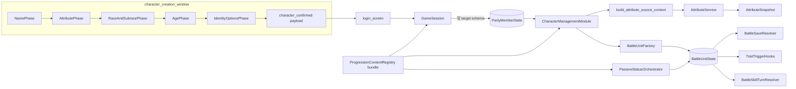

# 参考 D&D 3.5e + BG3 的种族 / 亚种 / 年龄 / 升华系统（目标态架构设计）

## Context（背景与动机）

当前角色生成只有「姓名 + 6 项 5d3-1 属性掷骰 + 出生运势」三段，所有队员属性都直接由掷骰值进入 `AttributeService`。属性轴 `UnitBaseAttributes.BASE_ATTRIBUTE_IDS` 已经接近 D&D（STR/AGI/CON/PER/INT/WIL，无 CHA），且 `AttributeService` 已有「修正源 -> 属性快照」管线，profession、skill、equipment、passive、temporary 等修正源已经在运行时参与属性快照。

目标是在建卡、队伍、战斗、存档和内容注册表中一次性设计好完整的人物身份系统：

- 主角和队友都有稳定的种族、亚种、年龄、体型、种族特性、种族授予技能和可选升华身份。
- 种族 / 亚种 / 年龄 / 升华不直接改写 base 掷骰值，而是作为独立修正源进入 `AttributeService`。
- BG3 常规种族和亚种、D&D 风格年龄成长、种族被动、种族法术、Dragon Breath、神话成长和剧情升华都使用同一套数据结构和运行时入口。
- 代码架构按最终形态设计；实现时可以拆任务，但资源字段、服务边界、存档 schema 和运行时接口不再按阶段临时留空或占位。

CHA / WIS 映射规则：

```text
D&D CHA -> WIL
D&D WIS -> PER
D&D INT -> INT
```

## 设计原则

- **目标态 schema 一次到位**：不要先只加 `race_id`，再后补 `subrace_id / body_size_category / granted_source_type`。所有确定会进入正式系统的字段一次纳入 target schema。
- **严格 schema，不做运行时软回落**：`PartyMemberState.from_dict()`、`UnitSkillProgress.from_dict()`、`BattleUnitState.from_dict()` 继续走严格字段校验。缺字段是坏数据，旧档是否迁移由 SaveSerializer 决定。
- **兼容路径必须显式**：如果要保留当前版本 5 存档，只写一次 `5 -> target` 迁移；不做中间版本链，也不在 `from_dict()` 里 `push_warning + fallback`。
- **属性来源可追踪**：每个修正源都有稳定 `source_type / source_id`，属性面板、战斗 dump、测试都能看到来源。
- **规则服务不塞 UI / Facade**：UI 只展示和发命令；`GameRuntimeFacade` 只编排；身份解析、属性快照、trait 应用、种族技能授予都放在专门服务或 registry。
- **战斗运行态和存档态分离**：per-battle / per-turn charge、临时 trait 状态、战斗内吐息次数等只属于 battle runtime，不写入永久存档。
- **自然成长和剧情升华共存**：普通种族靠年龄，神话种族靠长年龄线，剧情升华靠 `AscensionDef`，神器 / 神赐靠有效阶段覆盖；这些都不要伪装成建卡普通亚种。

## 总体数据流



## 目标态存档策略

当前仓库 `GameSession.SAVE_VERSION = 5`。一次性架构落地后推荐目标版本为 **6**，把所有新增正式字段一次写入 target schema。

| 项 | 决策 |
|---|---|
| 当前版本 | 5 |
| 目标版本 | 6 |
| 迁移函数 | `_migrate_payload_v5_to_v6_target_identity(payload)` |
| 中间版本 | 无 |
| SaveSerializer 职责 | 只补 target schema 字段；允许使用本文定义的 canonical migration defaults；不查内容 registry，不授予技能 |
| GameSession post-decode 职责 | 用 content registry 执行 idempotent 的种族 / 亚种授予技能补齐，并在 payload 被迁移或补授改变状态后安排一次保存 |
| 不保留旧档时 | 直接拒绝 version 5 payload；不要写 fallback |

兼容决策点：

- 如果需要保留当前版本 5 旧档，必须实现唯一迁移函数。它负责把 `PartyMemberState`、`UnitSkillProgress` 等 payload 补到 target schema，再交给严格 `from_dict()`。
- 如果不需要保留当前版本 5 旧档，就不写迁移函数，旧档会被版本校验拒绝。这样实现更简单，但用户已有存档无法读取。

保留 V5 时，迁移层使用一张**固定 canonical migration defaults 表**，这不是运行时 fallback，也不查 registry：

| 字段 | 迁移默认值 |
|---|---|
| `race_id` | `&"human"` |
| `subrace_id` | `&"human_standard"` |
| `age_years` | `18` |
| `birth_at_world_step` | `0` |
| `age_profile_id` | `&"human_age_profile"` |
| `natural_age_stage_id` | `&"adult"` |
| `effective_age_stage_id` | `&"adult"` |
| `body_size` | `1` |
| `body_size_category` | `&"medium"` |
| `versatility_pick` | `&""` |
| `active_stage_advancement_modifier_ids` | `[]` |
| `bloodline_id / bloodline_stage_id` | `&""` |
| `ascension_id / ascension_stage_id / original_race_id_before_ascension` | `&""` |
| `ascension_started_at_world_step` | `-1` |
| `biological_age_years / astral_memory_years` | `0` |

推荐迁移原则：

```gdscript
const _SUPPORTED_PAYLOAD_VERSIONS := [5, 6]
const _TARGET_SAVE_VERSION := 6

func decode_payload(payload: Dictionary, generation_config_path: String, generation_config, save_meta: Dictionary) -> Dictionary:
    if not payload.has("version") or payload.get("version") is not int:
        return {"error": ERR_INVALID_DATA}
    var payload_version := int(payload["version"])
    if not _SUPPORTED_PAYLOAD_VERSIONS.has(payload_version):
        return {"error": ERR_INVALID_DATA}

    var migrated := payload.duplicate(true)
    if payload_version == 5:
        var migrate_result := _migrate_payload_v5_to_v6_target_identity(migrated)
        if migrate_result.get("error", OK) != OK:
            return migrate_result
        migrated = migrate_result["payload"]
        migrated["version"] = _TARGET_SAVE_VERSION

    if int(migrated["version"]) != _TARGET_SAVE_VERSION:
        return {"error": ERR_INVALID_DATA}
    return _deserialize_strict_payload(migrated, generation_config_path, generation_config, save_meta)
```

迁移函数只补字段，不解释内容语义：

- `PartyMemberState`：补 race / subrace / age / body size / bloodline / ascension / stage override 等 target 字段。
- `UnitSkillProgress`：补 `granted_source_type / granted_source_id`，旧字段不进入 target schema。
- 不在 SaveSerializer 里调用 `ProgressionContentRegistry`。
- 不在 SaveSerializer 里授予 `racial_granted_skills`。
- 解码成功后由 `GameSession._backfill_racial_granted_skills(party_state)` 和 `GameSession._revoke_orphan_racial_skills(party_state)` 做 idempotent 补授 / 清理。
- `decode_payload()` 返回结果必须包含 `decoded_from_version` 和 `payload_was_migrated`。如果 `payload_was_migrated == true` 或 post-decode 补授 / 清理实际改变了 `party_state`，`GameSession.queue_post_decode_save()` 必须标记 save dirty，并在 `_load_active_save_payload()` 成功后复用 `_save_to_active_slot()` 写回 V6 payload，避免文件长期停留在 V5 或缺授予技能状态。
- 当前调用链里的 `decode_v5_payload()` 语义必须收束：保留旧函数名也只能作为 alias 转调 `decode_payload()`；不能继续在迁移前用 `save_version != _save_version` 拒绝 V5。

严格 schema 要求：

- `PartyMemberState.from_dict()` 和 `UnitSkillProgress.from_dict()` 必须像 `BattleUnitState.from_dict()` 一样拒绝额外字段；不能只检查缺字段。
- 所有 target schema 字段要进入 `to_dict()`，并有精确字段集合常量或等价校验。

## PartyMemberState 目标字段

`PartyMemberState` 是人物身份和永久成长状态的存档真相源。目标字段一次到位：

```gdscript
var race_id: StringName = &""
var subrace_id: StringName = &""

var age_years: int = 0
var birth_at_world_step: int = 0
var age_profile_id: StringName = &""
var natural_age_stage_id: StringName = &""
var effective_age_stage_id: StringName = &""
var effective_age_stage_source_type: StringName = &""
var effective_age_stage_source_id: StringName = &""

var body_size := 1
var body_size_category: StringName = &"medium"

var versatility_pick: StringName = &""        # human / culture / trait 等自选属性或熟练
var active_stage_advancement_modifier_ids: Array[StringName] = []

var bloodline_id: StringName = &""
var bloodline_stage_id: StringName = &""

var ascension_id: StringName = &""
var ascension_stage_id: StringName = &""
var ascension_started_at_world_step: int = -1
var original_race_id_before_ascension: StringName = &""

var biological_age_years: int = 0             # 星界 / 亡灵 / 构装等特殊时间规则使用
var astral_memory_years: int = 0
```

字段规则：

- `race_id / subrace_id / age_profile_id / natural_age_stage_id / effective_age_stage_id / body_size_category` 是必需字段，不能为空。
- `bloodline_id / bloodline_stage_id / ascension_id / ascension_stage_id / effective_age_stage_source_* / versatility_pick` 允许空字符串。
- `age_years / biological_age_years / astral_memory_years` 必须是非负 int。
- `birth_at_world_step` 使用现有 `world_data.world_step` 语义；没有独立 day index 概念。
- `ascension_started_at_world_step == -1` 表示未开始升华；非负值同样使用 `world_data.world_step`。
- `body_size_category` 是身份体型真相源；`body_size` 只是当前战斗占位链需要的持久派生缓存，必须由 `BodySizeRules` 从 category 计算写入。
- `active_stage_advancement_modifier_ids` 只存长期 / 永久在线来源，例如神器、誓约、神赐。战斗内临时升阶不写入这里。
- `bloodline_id` 是独立身份轴，不是 `ascension_id` 的子字段；ascension 可以通过 `allowed_bloodline_ids` 要求前置血脉。
- `original_race_id_before_ascension` 只能由 `AscensionApplyService.apply_ascension()` 写入；没有进入 ascension 时必须为空。
- 不允许 `from_dict()` 缺字段后默认 human / adult；旧数据只能由迁移层补齐。

## UnitSkillProgress 目标字段

种族 / 亚种 / 升华授予技能也写入普通 `UnitSkillProgress`，但来源可追踪：

```gdscript
var granted_source_type: StringName = &""
var granted_source_id: StringName = &""
```

规则：

- 这些字段进 `to_dict / from_dict` 必需字段。
- `granted_source_type` 值域为 `&"player" / &"profession" / &"race" / &"subrace" / &"ascension" / &"bloodline"`，target payload 内必须非空；V5 迁移遇到无法归因的既有 learned skill 时写 `&"player"`。
- `granted_source_id` 写 race_id / subrace_id / ascension_id / bloodline_id / profession_id 等来源 id；仅 `granted_source_type == &"player"` 时允许为空。
- `SkillDef.learn_source` 仍来自 `.tres`，不写进 progress payload。
- `ProgressionService.grant_racial_skill(grant, source_type, source_id)` 必须显式写 `skill_level = grant.minimum_skill_level`，不能只写 `is_learned = true`。
- 补授必须 idempotent：已有 learned skill 不覆盖等级、mastery、assigned profession 等进度。

## BattleUnitState 目标字段

战斗单位需要持有种族 / 体型 / 特性对战斗规则的投影。

序列化字段：

```gdscript
var body_size_category: StringName = &"medium"
var vision_tags: Array[StringName] = []
var proficiency_tags: Array[StringName] = []
var save_advantage_tags: Array[StringName] = []
var damage_resistances: Dictionary = {}
var race_trait_ids: Array[StringName] = []
var subrace_trait_ids: Array[StringName] = []
var ascension_trait_ids: Array[StringName] = []
var bloodline_trait_ids: Array[StringName] = []
var versatility_pick: StringName = &""
```

运行时 ephemeral 字段：

```gdscript
var per_battle_charges: Dictionary = {}
var per_turn_charges: Dictionary = {}
```

规则：

- 序列化字段必须同步进入 `TO_DICT_FIELDS / to_dict / from_dict / clone`。
- `body_size`、`footprint_size`、`occupied_coords` 继续保留为当前 battle runtime 占位真相源；`body_size_category` 是身份层 category 的战斗投影，不能和 `body_size` 分叉。
- `BodySizeRules` 必须提供 `category -> body_size` 映射，`BattleUnitState.from_dict()` 仍按 `body_size` 重算 `footprint_size / occupied_coords` 并拒绝不匹配 payload。
- ephemeral 字段只进新增的 `clone()`，不进 `TO_DICT_FIELDS / to_dict / from_dict`。
- `BattleUnitState.from_dict()` 继续精确字段集合校验。
- `per_turn_charges` 在回合开始重置；`per_battle_charges` 在战斗初始化时由 trait / skill resolver 灌入。
- 当前预览 / 模拟链不能继续依赖 `BattleUnitState.from_dict(unit_state.to_dict())` 复制带 charge 的单位；需要新增并迁移到 `BattleUnitState.clone()`，确保 ephemeral charge 被深拷贝。
- `BattleUnitFactory._normalize_unit_payloads()` 直接读取显式 battle payload，不经过 SaveSerializer。新增字段后采用 fixture 全量重生成策略：旧 `battle_party` payload 直接按严格 schema 拒绝，不在 normalization 里补默认值；测试 fixture 由专门 generator / 手工更新到 target schema。

## 内容资源模型

### RaceDef

`scripts/player/progression/race_def.gd`

```gdscript
class_name RaceDef
extends Resource

@export var race_id: StringName = &""
@export var display_name: String = ""
@export_multiline var description: String = ""

@export var age_profile_id: StringName = &""
@export var default_subrace_id: StringName = &""
@export var subrace_ids: Array[StringName] = []

@export var body_size_category: StringName = &"medium"
@export var base_speed: int = 6

@export var attribute_modifiers: Array[AttributeModifier] = []
@export var trait_ids: Array[StringName] = []
@export var racial_granted_skills: Array[RacialGrantedSkill] = []
@export var proficiency_tags: Array[StringName] = []
@export var vision_tags: Array[StringName] = []
@export var save_advantage_tags: Array[StringName] = []
@export var damage_resistances: Dictionary = {}
@export var dialogue_tags: Array[StringName] = []
@export var racial_trait_summary: Array[String] = []
```

### SubraceDef

`scripts/player/progression/subrace_def.gd`

```gdscript
class_name SubraceDef
extends Resource

@export var subrace_id: StringName = &""
@export var parent_race_id: StringName = &""
@export var display_name: String = ""
@export_multiline var description: String = ""

@export var body_size_category_override: StringName = &""
@export var speed_bonus: int = 0

@export var attribute_modifiers: Array[AttributeModifier] = []
@export var trait_ids: Array[StringName] = []
@export var racial_granted_skills: Array[RacialGrantedSkill] = []
@export var proficiency_tags: Array[StringName] = []
@export var vision_tags: Array[StringName] = []
@export var save_advantage_tags: Array[StringName] = []
@export var damage_resistances: Dictionary = {}
@export var dialogue_tags: Array[StringName] = []
@export var racial_trait_summary: Array[String] = []
```

### RaceTraitDef

`scripts/player/progression/race_trait_def.gd`

虽然类名沿用 `RaceTraitDef`，目标态它是 race / subrace / bloodline / ascension 共用的 trait 定义表；不要为 bloodline / ascension 再复制一套结构相同的 trait def。

```gdscript
class_name RaceTraitDef
extends Resource

@export var trait_id: StringName = &""
@export var display_name: String = ""
@export_multiline var description: String = ""

@export var trigger_type: StringName = &"passive"
@export var effect_type: StringName = &""
@export var params: Dictionary = {}
```

`effect_type` 不使用 placeholder。目标态白名单直接包含完整实现范围：

```text
darkvision
superior_darkvision
fey_ancestry
brave
halfling_luck
savage_attacks
relentless_endurance
gnome_cunning
dwarven_resilience
duergar_resilience
human_versatility
small_body
fleet_of_foot
dragon_breath
racial_spell_grant
damage_resistance
save_advantage
```

### RacialGrantedSkill

`scripts/player/progression/racial_granted_skill.gd`

```gdscript
class_name RacialGrantedSkill
extends Resource

@export var skill_id: StringName = &""
@export var minimum_skill_level: int = 1
@export var grant_level: int = 1
@export var charge_kind: StringName = &"per_battle" # at_will / per_battle / per_turn
@export var charges: int = 1
```

### AgeStageRule / AgeProfileDef

`scripts/player/progression/age_stage_rule.gd`

```gdscript
class_name AgeStageRule
extends Resource

@export var stage_id: StringName = &""
@export var display_name: String = ""
@export_multiline var description: String = ""

@export var attribute_modifiers: Array[AttributeModifier] = []
@export var trait_ids: Array[StringName] = []
@export var trait_summary: Array[String] = []
@export var selectable_in_creation: bool = true
@export var reachable_by_aging: bool = true
```

`scripts/player/progression/age_profile_def.gd`

```gdscript
class_name AgeProfileDef
extends Resource

@export var profile_id: StringName = &""
@export var race_id: StringName = &""

@export var child_age: int = 0
@export var teen_age: int = 12
@export var young_adult_age: int = 16
@export var adult_age: int = 18
@export var middle_age: int = 35
@export var old_age: int = 53
@export var venerable_age: int = 70
@export var max_natural_age: int = 90

@export var stage_rules: Array[AgeStageRule] = []
@export var creation_stage_ids: Array[StringName] = []
@export var default_age_by_stage: Dictionary = {}
```

年龄阶段修正是阶段总修正，不累计。

### BloodlineDef / BloodlineStageDef

血脉是独立身份轴，用于“泰坦血”“炎魔血”“六臂蛇魔血”等可遗传、可觉醒或可被剧情污染的来源。它不是 ascension 的子对象；ascension 只能引用它作为前置或融合材料。

`scripts/player/progression/bloodline_def.gd`

```gdscript
class_name BloodlineDef
extends Resource

@export var bloodline_id: StringName = &""
@export var display_name: String = ""
@export_multiline var description: String = ""

@export var stage_ids: Array[StringName] = []
@export var trait_ids: Array[StringName] = []
@export var racial_granted_skills: Array[RacialGrantedSkill] = []
@export var attribute_modifiers: Array[AttributeModifier] = []
@export var trait_summary: Array[String] = []
```

`scripts/player/progression/bloodline_stage_def.gd`

```gdscript
class_name BloodlineStageDef
extends Resource

@export var stage_id: StringName = &""
@export var bloodline_id: StringName = &""
@export var display_name: String = ""
@export_multiline var description: String = ""

@export var attribute_modifiers: Array[AttributeModifier] = []
@export var trait_ids: Array[StringName] = []
@export var racial_granted_skills: Array[RacialGrantedSkill] = []
@export var trait_summary: Array[String] = []
```

规则：

- `PartyMemberState.bloodline_id / bloodline_stage_id` 是血脉真相源。
- `CharacterManagementModule` 负责解析 bloodline def / stage def，并填入 attribute / passive context。
- `UnitSkillProgress.granted_source_type == &"bloodline"` 时，`granted_source_id` 写 bloodline_id 或 bloodline_stage_id。
- `BattleUnitState.bloodline_trait_ids` 只由 `AscensionTraitResolver` 的 bloodline 分支写入；它不表示 ascension 拥有 bloodline，只表示当前 resolver 统一处理神话身份投影。

### AscensionDef / AscensionStageDef

剧情升华不进入普通建卡种族池。

`scripts/player/progression/ascension_def.gd`

```gdscript
class_name AscensionDef
extends Resource

@export var ascension_id: StringName = &""
@export var display_name: String = ""
@export_multiline var description: String = ""

@export var stage_ids: Array[StringName] = []
@export var trait_ids: Array[StringName] = []
@export var racial_granted_skills: Array[RacialGrantedSkill] = []
@export var allowed_race_ids: Array[StringName] = []
@export var allowed_subrace_ids: Array[StringName] = []
@export var allowed_bloodline_ids: Array[StringName] = []
@export var trait_summary: Array[String] = []

@export var replaces_age_growth: bool = false
@export var suppresses_original_race_traits: bool = false
```

`scripts/player/progression/ascension_stage_def.gd`

```gdscript
class_name AscensionStageDef
extends Resource

@export var stage_id: StringName = &""
@export var ascension_id: StringName = &""
@export var display_name: String = ""
@export_multiline var description: String = ""

@export var attribute_modifiers: Array[AttributeModifier] = []
@export var trait_ids: Array[StringName] = []
@export var racial_granted_skills: Array[RacialGrantedSkill] = []
@export var body_size_category_override: StringName = &""
@export var trait_summary: Array[String] = []
```

字段消费者：

- `replaces_age_growth` 由 `AgeStageResolver` 读取。为 true 时，natural age 仍保存，但 `AttributeService` 不追加 natural age modifier；有效阶段来源写 ascension，年龄展示保留自然年龄。
- `suppresses_original_race_traits` 由 `PassiveStatusOrchestrator` 在调用 `RaceTraitResolver` 前读取。为 true 时跳过 race / subrace trait 投影，但不改写 `PartyMemberState.race_id / subrace_id`，也不影响 UI 展示原始身份。
- `allowed_bloodline_ids` 为空表示不要求血脉前置；非空时 `AscensionApplyService.apply_ascension()` 必须校验当前 `PartyMemberState.bloodline_id` 在列表内。

### StageAdvancementModifier

神器、神赐、仪式等长期来源不改变真实年龄，只提升有效阶段。它们是人物身份 / 成长层的永久或长效来源，必须可从存档重建。

`scripts/player/progression/stage_advancement_modifier.gd`

```gdscript
class_name StageAdvancementModifier
extends Resource

@export var modifier_id: StringName = &""
@export var display_name: String = ""

@export var target_axis: StringName = &"full"
# full / physical / mental / bloodline / divine / martial / domain

@export var stage_offset: int = 1
@export var max_stage_id: StringName = &""

@export var applies_to_race_ids: Array[StringName] = []
@export var applies_to_subrace_ids: Array[StringName] = []
@export var applies_to_bloodline_ids: Array[StringName] = []
@export var applies_to_ascension_ids: Array[StringName] = []

@export var grants_attributes: bool = true
@export var grants_traits: bool = false
@export var grants_body_size_change: bool = false
```

规则：

- `StageAdvancementModifier` 不表达战斗内临时回合数，不持有回合持续字段。
- 长期来源 id 存在 `PartyMemberState.active_stage_advancement_modifier_ids`，由 `CharacterManagementModule` 解析成 modifier def。
- `target_axis == &"bloodline"` 的来源必须在 bloodline / bloodline_stage 已解析后才参与计算；`target_axis == &"divine" / &"domain"` 等来源必须在 ascension / ascension_stage 已解析后才参与计算。当前成员没有对应身份轴时直接忽略。
- 战斗祝福、临时神威、临时巨神化这类回合级升阶只能走 `BattleStatusEffectState`：status params 写明 `stage_shift_axis / stage_offset / max_stage_id` 或直接写战斗属性 / trait / charge 变化，duration 由 battle status tick 扣减。它们不进入 `AttributeSourceContext.stage_advancement_modifiers`，也不改写 `PartyMemberState.effective_age_stage_id`。

## ProgressionContentRegistry 目标 bundle

新增子 registry：

- `RaceContentRegistry`
- `SubraceContentRegistry`
- `RaceTraitContentRegistry`
- `AgeContentRegistry`
- `BloodlineContentRegistry`
- `AscensionContentRegistry`
- `StageAdvancementContentRegistry`

目录常量：

```gdscript
const RACE_CONFIG_DIRECTORY := "res://data/configs/races"
const SUBRACE_CONFIG_DIRECTORY := "res://data/configs/subraces"
const RACE_TRAIT_CONFIG_DIRECTORY := "res://data/configs/race_traits"
const AGE_PROFILE_CONFIG_DIRECTORY := "res://data/configs/age_profiles"
const BLOODLINE_CONFIG_DIRECTORY := "res://data/configs/bloodlines"
const ASCENSION_CONFIG_DIRECTORY := "res://data/configs/ascensions"
const STAGE_ADVANCEMENT_CONFIG_DIRECTORY := "res://data/configs/stage_advancements"
```

`ProgressionContentRegistry.get_bundle()` 返回：

```gdscript
{
    "skill_defs": _skill_defs,
    "profession_defs": _profession_defs,
    "achievement_defs": _achievement_defs,
    "quest_defs": _quest_defs,
    "race_defs": _race_defs,
    "subrace_defs": _subrace_defs,
    "race_trait_defs": _race_trait_defs,
    "age_profile_defs": _age_profile_defs,
    "bloodline_defs": _bloodline_defs,
    "bloodline_stage_defs": _bloodline_stage_defs,
    "ascension_defs": _ascension_defs,
    "ascension_stage_defs": _ascension_stage_defs,
    "stage_advancement_defs": _stage_advancement_defs,
}
```

`ProgressionContentRegistry.VALID_LEARN_SOURCES` 必须包含 race 授予来源，但普通学习入口不能直接使用它：

```gdscript
const VALID_LEARN_SOURCES := {
    &"player": true,
    &"profession": true,
    &"race": true,
    &"subrace": true,
    &"ascension": true,
    &"bloodline": true,
}
```

校验分两层，避免子 registry 互相持有内容表：

- Phase 1：每个子 registry 只做本表内校验，例如 id 非空 / 唯一、字段类型、数组元素类型、本资源自有枚举值；不能查询 sibling registry。
- Phase 2：`ProgressionContentRegistry.validate()` 在所有子 registry 加载完成后做跨表校验和跨域常量校验。

Phase 2 校验项：

- race -> default_subrace、subrace_ids、age_profile_id 引用存在。
- subrace.parent_race_id 反向一致。
- trait_ids 引用存在，effect_type 在白名单内。
- racial_granted_skills.skill_id 引用存在，目标 `SkillDef.learn_source` 必须匹配 grant 所属来源：race/subrace grant 对应 `&"race" / &"subrace"`，ascension grant 对应 `&"ascension"`，bloodline grant 对应 `&"bloodline"`。
- racial_granted_skills.charge_kind 在 `&"at_will" / &"per_battle" / &"per_turn"` 内；`charges` 必须是正 int，`at_will` 可忽略 charges。
- age_profile.stage_rules 非空，creation_stage_ids 都存在。
- bloodline.stage_ids 引用存在，stage.bloodline_id 反向一致；`bloodline_stage_defs` 使用全局唯一 `stage_id`，不要用 `(bloodline_id, stage_id)` 复合键。
- ascension.stage_ids 引用存在，stage.ascension_id 反向一致。
- ascension.allowed_bloodline_ids 引用存在。
- `ascension_stage_defs` 使用全局唯一 `stage_id`，不要用 `(ascension_id, stage_id)` 复合键；内容 id 建议带前缀，例如 `dragon_awakened`、`titan_awakened`。
- stage_advancement.target_axis 在 `StageAdvancementModifier.VALID_TARGET_AXES` 内，`applies_to_race_ids / applies_to_subrace_ids / applies_to_bloodline_ids / applies_to_ascension_ids` 引用存在。
- damage_resistances key 在 `BattleDamageResolver.VALID_DAMAGE_TAGS` 内，value 在 `VALID_MITIGATION_TIERS` 内。
- body_size_category 在 `BodySizeRules.VALID_BODY_SIZE_CATEGORIES` 内。

```gdscript
const VALID_TARGET_AXES := {
    &"full": true,
    &"physical": true,
    &"mental": true,
    &"bloodline": true,
    &"divine": true,
    &"martial": true,
    &"domain": true,
}
```

`BattleDamageResolver.VALID_DAMAGE_TAGS` 必须显式落地为当前已有 8 个 tag 加新增元素：

```gdscript
const VALID_DAMAGE_TAGS := [
    &"physical_slash",
    &"physical_pierce",
    &"physical_blunt",
    &"fire",
    &"freeze",
    &"lightning",
    &"negative_energy",
    &"magic",
    &"acid",
    &"poison",
]
```

`charm / sleep / paralysis` 不是 damage tag，只能进入 `BattleSaveResolver` 的 save / status tag 校验。文案展示可以叫 cold，但内部 damage tag 统一使用现有 `&"freeze"`，不要新增并行的 cold tag。

damage resistance 校验函数必须显式检查 Godot Dictionary 的 key / value 类型：

```gdscript
static func validate_damage_resistances(owner_id: StringName, values: Dictionary) -> Array[String]:
    # key 必须是 StringName / String 且归一化后在 VALID_DAMAGE_TAGS 内。
    # value 必须是 StringName / String 且归一化后在 VALID_MITIGATION_TIERS 内。
    # 空 key、int key、bool value、未知 tier 都返回可定位错误。
    return []
```

## AttributeService 目标架构

不要继续扩 `AttributeService.setup(...)` 的参数列表。目标态用上下文对象承载所有来源。

`scripts/systems/attributes/attribute_source_context.gd`

```gdscript
class_name AttributeSourceContext
extends RefCounted

var unit_progress: UnitProgress = null
var skill_defs: Dictionary = {}
var profession_defs: Dictionary = {}

var race_def: RaceDef = null
var subrace_def: SubraceDef = null
var age_stage_rule: AgeStageRule = null
var bloodline_def: BloodlineDef = null
var bloodline_stage_def: BloodlineStageDef = null
var ascension_def: AscensionDef = null
var ascension_stage_def: AscensionStageDef = null
var versatility_pick: StringName = &""

var equipment_state = null
var passive_state = null
var temporary_effects = null
var stage_advancement_modifiers: Array[StageAdvancementModifier] = [] # 长期来源，不含战斗临时 status
```

`AttributeService.setup_context(context: AttributeSourceContext)` 是新主入口。现有 `setup(...)` 可以短期保留为测试适配器，但内部也构造 `AttributeSourceContext`，并 `push_warning("AttributeService.setup() lacks identity context")`；所有正式调用和身份相关测试必须迁到 `setup_context()`。

缓存规则：

- `setup_context(context)` 只替换 context 引用并标记 snapshot dirty。
- `get_snapshot()` 仍沿用现有惰性计算模式；只有 dirty 时才重建。
- `set_temporary_effects(effects)`、`set_passive_state(state)`、`set_equipment_state(state)` 这类运行时变更入口只更新 context 对应字段并 invalidate，不直接重算。
- 战斗内 status tick / charge 变化如果影响属性 snapshot，必须走这些 setter 或 `invalidate_snapshot()`；不能直接改 context 字典后期待缓存自动失效。

目标注入顺序：

```text
base roll
-> race
-> subrace
-> age
-> bloodline
-> ascension
-> ascension_stage
-> stage_advancement
-> versatility
-> profession
-> skill
-> equipment
-> passive
-> temporary
```

实现方法：

```gdscript
func _collect_all_modifier_entries() -> Array:
    var entries: Array = []
    _append_race_modifier_entries(entries)
    _append_subrace_modifier_entries(entries)
    _append_age_modifier_entries(entries)
    _append_bloodline_modifier_entries(entries)
    _append_ascension_modifier_entries(entries)
    _append_ascension_stage_modifier_entries(entries)
    _append_stage_advancement_modifier_entries(entries)
    _append_versatility_modifier_entries(entries)
    _append_profession_modifier_entries(entries)
    _append_skill_modifier_entries(entries)
    _append_external_modifier_entries(entries, _context.equipment_state, &"equipment")
    _append_external_modifier_entries(entries, _context.passive_state, &"passive")
    _append_external_modifier_entries(entries, _context.temporary_effects, &"temporary")
    return entries
```

每个 source 都复用 `_append_modifier_entries(entries, modifiers, source_type, source_id, rank)`。

阶段推进不能重复计入：

- `_append_age_modifier_entries()` 读取的是 `AgeStageResolver` 已写好的 `effective_age_stage_id`；如果 effective 来源是 stage advancement，entry 的 `source_type / source_id` 使用 `effective_age_stage_source_type / effective_age_stage_source_id`。
- `_append_stage_advancement_modifier_entries()` 只处理未被 age effective stage 消耗的长期 modifier，例如 `target_axis == &"bloodline"` 的血脉轴，或 `&"divine" / &"martial" / &"domain"` 的升华轴；没有对应 bloodline / ascension 时跳过。
- 战斗临时 status 不进这两个函数，避免回合持续效果在属性快照层变成永久效果。

Human Versatility / culture pick 不改写 `unit_base_attributes`，只作为独立修正源：

```gdscript
func _append_versatility_modifier_entries(entries: Array) -> void:
    if _context.versatility_pick == &"":
        return
    var modifier := AttributeModifier.new()
    modifier.attribute_id = _context.versatility_pick
    modifier.mode = AttributeModifier.MODE_FLAT
    modifier.value = 1
    _append_modifier_entries(
        entries,
        [modifier],
        &"versatility",
        _context.race_def.race_id,
        0
    )
```

这样建卡、读档、装备预览重复构建 snapshot 时不会把同一个自选属性叠加多次。

`AttributeService` 同时提供：

```gdscript
func get_modifier(attribute_id: StringName) -> int:
    var value := get_snapshot().get_value(attribute_id)
    return floori(float(value - 10) / 2.0)
```

该方法给 saving throw / DC 使用，避免每个 resolver 重复写 5e modifier 公式。

## CharacterManagementModule 职责

`CharacterManagementModule` 是人物身份解析与属性快照的运行时桥，不让 UI 自建 `AttributeService`。

新增职责：

- 接收 `progression_content_bundle`。
- 为成员解析 race / subrace / age profile / natural stage / effective stage / bloodline / ascension。
- 通过 `AgeStageResolver` 计算并回写 effective age stage。
- 构造 `AttributeSourceContext`。
- 构造 `PassiveSourceContext`。
- 提供 UI 和 battle 共用属性快照。
- 提供运行时授予种族 / 升华技能入口。
- 通过 apply service 包装入口修改 bloodline / ascension / stage advancement，并统一触发重算、技能补授 / 清理和 snapshot invalidation。

推荐入口：

```gdscript
func setup(
    party_state: PartyState,
    skill_defs: Dictionary,
    profession_defs: Dictionary,
    achievement_defs: Dictionary = {},
    item_defs: Dictionary = {},
    quest_defs: Dictionary = {},
    equipment_instance_id_allocator: Callable = Callable(),
    progression_content_bundle: Dictionary = {}
) -> void

func get_race_def_for_member(member_id: StringName) -> RaceDef
func get_subrace_def_for_member(member_id: StringName) -> SubraceDef
func get_age_stage_rule_for_member(member_id: StringName) -> AgeStageRule # effective stage
func get_bloodline_def_for_member(member_id: StringName) -> BloodlineDef
func get_bloodline_stage_def_for_member(member_id: StringName) -> BloodlineStageDef
func get_ascension_def_for_member(member_id: StringName) -> AscensionDef
func get_ascension_stage_def_for_member(member_id: StringName) -> AscensionStageDef

func build_attribute_source_context(member_id: StringName, equipment_state_override = null) -> AttributeSourceContext
func build_passive_source_context(member_id: StringName, progression_state = null) -> PassiveSourceContext
func get_member_attribute_snapshot_for_equipment_view(member_id: StringName, equipment_state_override = null)
func grant_racial_skill(member_id: StringName, grant: RacialGrantedSkill, source_type: StringName, source_id: StringName) -> void
func apply_bloodline(member_id: StringName, bloodline_id: StringName, bloodline_stage_id: StringName) -> bool
func revoke_bloodline(member_id: StringName) -> bool
func apply_ascension(member_id: StringName, ascension_id: StringName, ascension_stage_id: StringName, current_world_step: int) -> bool
func revoke_ascension(member_id: StringName, restore_original_race: bool = true) -> bool
func add_stage_advancement_modifier(member_id: StringName, modifier_id: StringName) -> bool
func remove_stage_advancement_modifier(member_id: StringName, modifier_id: StringName) -> bool
```

签名约束：

- 只能追加 `progression_content_bundle`，不能删除现有 `achievement_defs / item_defs / quest_defs / equipment_instance_id_allocator`。这些依赖当前用于仓库、装备、任务进度和奖励入队。
- `GameRuntimeFacade.setup()` 要么继续传分散字典并额外传 bundle，要么从 bundle 中解包旧字段；不能让 CMM、QuestProgressService、装备服务拿到不同来源的内容表。
- `progression_content_bundle == {}` 只允许空 party 的单元测试。只要 `party_state.members` 非空，就必须包含 `race_defs / subrace_defs / race_trait_defs / age_profile_defs / bloodline_defs / ascension_defs / stage_advancement_defs`；缺任一核心表时 setup 直接返回错误或触发断言，不允许后续解析出 null 再由 UI 防御。
- `equipment_state_override == null` 的含义固定为使用 `member_state.equipment_state`；不能构造空 `EquipmentState`，否则队伍窗口装备预览会丢装备修正。

`scripts/systems/progression/age_stage_resolver.gd`

```gdscript
class_name AgeStageResolver
extends RefCounted

static func resolve_effective_stage(
    member_state: PartyMemberState,
    age_profile: AgeProfileDef,
    modifiers: Array[StageAdvancementModifier],
    bloodline_def: BloodlineDef,
    bloodline_stage_def: BloodlineStageDef,
    ascension_def: AscensionDef,
    ascension_stage_def: AscensionStageDef
) -> Dictionary
```

返回：

```gdscript
{
    "stage_id": &"adult",
    "source_type": &"", # "" / "stage_advancement" / "ascension"
    "source_id": &"",
}
```

规则：

- 默认从 `natural_age_stage_id` 读取 `AgeStageRule`。
- 如果 `ascension_def.replaces_age_growth == true`，返回 ascension stage 对应的 effective source，且 `AttributeService._append_age_modifier_entries()` 跳过 natural age modifier。
- 长期 stage advancement 在 natural / ascension effective stage 的基础上应用；同轴来源不叠加，只取最高 stage_offset。

写入时机：

- 新建角色和默认队伍 bootstrap。
- `SaveSerializer` 迁移后、`GameSession` post-decode 补授 / 清理前。
- `StageAdvancementApplyService.add_modifier/remove_modifier()` 改变 `active_stage_advancement_modifier_ids` 后。
- bloodline_id / bloodline_stage_id 改变后。
- `AscensionApplyService.apply_ascension/revoke_ascension()` 改变 ascension_id / ascension_stage_id 后。

`scripts/systems/progression/passive_source_context.gd`

```gdscript
class_name PassiveSourceContext
extends RefCounted

var member_state: PartyMemberState = null
var unit_progress: UnitProgress = null
var skill_progress_by_id: Dictionary = {}

var race_def: RaceDef = null
var subrace_def: SubraceDef = null
var trait_defs: Dictionary = {}
var bloodline_def: BloodlineDef = null
var bloodline_stage_def: BloodlineStageDef = null
var ascension_def: AscensionDef = null
var ascension_stage_def: AscensionStageDef = null
var stage_advancement_modifiers: Array[StageAdvancementModifier] = []
```

`PassiveSourceContext` 和 `AttributeSourceContext` 读取同一套身份解析结果，但用途不同：前者只给 battle passive 投影，后者只给属性快照。`trait_defs` 直接持有 `ProgressionContentRegistry` bundle 中 `race_trait_defs` 的只读引用，不复制子集；resolver 根据 race / subrace / bloodline / ascension 当前 id 自行取 trait。

### BloodlineApplyService / AscensionApplyService / StageAdvancementApplyService

`scripts/systems/progression/bloodline_apply_service.gd`

```gdscript
class_name BloodlineApplyService
extends RefCounted

func apply_bloodline(
    member_state: PartyMemberState,
    bloodline_id: StringName,
    bloodline_stage_id: StringName
) -> bool

func revoke_bloodline(member_state: PartyMemberState) -> bool
```

规则：

- 只有这个服务写 `bloodline_id / bloodline_stage_id`。
- apply 校验 bloodline_id / stage_id 引用和 stage 反向一致。
- apply / revoke 之后固定调用 `AgeStageResolver` 重算 effective stage，再调用 orphan racial skill revoke / backfill。

`scripts/systems/progression/ascension_apply_service.gd`

```gdscript
class_name AscensionApplyService
extends RefCounted

func apply_ascension(
    member_state: PartyMemberState,
    ascension_id: StringName,
    ascension_stage_id: StringName,
    current_world_step: int
) -> bool

func revoke_ascension(member_state: PartyMemberState, restore_original_race: bool = true) -> bool
```

规则：

- 首次 apply 时，如果 `member_state.ascension_id == &""`，写 `original_race_id_before_ascension = member_state.race_id`。
- apply 校验 ascension 的 `allowed_race_ids / allowed_subrace_ids / allowed_bloodline_ids`。
- apply 写 `ascension_id / ascension_stage_id / ascension_started_at_world_step = current_world_step`。
- revoke 时清空 `ascension_id / ascension_stage_id / ascension_started_at_world_step`。
- `restore_original_race == true` 且 `original_race_id_before_ascension != &""` 时，恢复 `race_id`，再清空 `original_race_id_before_ascension`；如果设计上升华不改 race_id，也仍清空备份字段。
- apply / revoke 之后固定调用 `AgeStageResolver` 重算 effective stage，再调用 orphan racial skill revoke / backfill。

`scripts/systems/progression/stage_advancement_apply_service.gd`

```gdscript
class_name StageAdvancementApplyService
extends RefCounted

func add_modifier(member_state: PartyMemberState, modifier_id: StringName) -> bool
func remove_modifier(member_state: PartyMemberState, modifier_id: StringName) -> bool
```

规则：

- 只有这个服务写 `active_stage_advancement_modifier_ids`。
- 装备神器、剧情脚本、任务奖励和调试命令都调用 CMM 暴露的 add/remove 包装入口，不直接改数组。
- add/remove 成功后固定调用 `AgeStageResolver` 重算 effective stage，并使相关 attribute snapshot 失效。

空引用规则：

- 对正常建卡 / 默认队员，缺 race / subrace / age 是数据错误，应测试失败。
- UI 可以显示「未知」作为防御，但不能修改运行时状态或隐式回落。
- battle factory 遇到缺关键定义应记录错误并跳过对应 trait，不自行把角色变成人类。

## GameSession 职责

`GameSession` 仍然是全局持久化和新档 bootstrap 真相源。

新增职责：

- `get_progression_content_bundle()` 转发 PCR bundle。
- 创建默认队伍时写完整 target identity 字段。
- 建卡 payload 落地时写完整 target identity 字段。
- 解码成功后执行 `_backfill_racial_granted_skills(party_state)` 和 `_revoke_orphan_racial_skills(party_state)`。
- 如果 decode 发生 V5 -> V6 迁移，或 post-decode 补授 / 清理实际修改了 `party_state`，load 成功后必须调用 `queue_post_decode_save()` 安排一次保存，把 target payload 写回磁盘。

推荐入口：

```gdscript
func queue_post_decode_save(reason: StringName) -> void:
    _post_decode_save_pending = true
    _post_decode_save_reasons.append(reason)
```

`_load_active_save_payload()` 完成 payload 解码、party_state 落地、post-decode 补授 / 清理和 runtime 初始化后，如果 `_post_decode_save_pending == true`，复用现有 `_save_to_active_slot()` 写回；不要另建一条绕过正常 save meta / index 更新的写盘路径。

`_backfill_racial_granted_skills` 规则：

- 每次解码都跑，靠 idempotent 判断避免副作用。
- 从 race / subrace / bloodline / ascension 收集 grants。
- 已有 learned skill 不覆盖。
- 新建 `UnitSkillProgress` 时必须写 `skill_level = grant.minimum_skill_level`。
- 写 `granted_source_type / granted_source_id`。
- 不写 `SkillDef.learn_source`。
- 函数应返回 `bool changed`，让 `GameSession` 判断是否需要持久化。

`_revoke_orphan_racial_skills` 规则：

- 每次解码和剧情解除 ascension / bloodline 后都跑。
- 扫描 `UnitSkillProgress.granted_source_type in [&"race", &"subrace", &"ascension", &"bloodline"]`。
- 如果对应 source_id 不再属于当前角色身份，且该技能不是玩家或职业另行学会的技能，就删除该 progress 条目或清掉 learned 状态。
- 与补授函数分离，避免“补”和“撤销”在同一循环内互相覆盖。
- 函数应返回 `bool changed`，剧情解除升华时顺序固定为：先写 member_state 身份变化 -> revoke orphan -> backfill 当前身份应有技能 -> 重新保存。

## ProgressionService 学习入口规则

普通学习入口只处理玩家主动学习的技能：

```gdscript
func learn_skill(member_id: StringName, skill_id: StringName) -> int:
    var skill_def := _skill_defs.get(skill_id)
    if skill_def.learn_source in [&"profession", &"race", &"subrace", &"ascension", &"bloodline"]:
        return ERR_UNAUTHORIZED
    ...
```

来源型技能必须走专门 grant 入口：

- profession 技能走职业 / 转职奖励入口。
- race / subrace / ascension / bloodline 技能走 `grant_racial_skill(grant, source_type, source_id)`。
- grant 入口写 `UnitSkillProgress.granted_source_type / granted_source_id`，普通 `learn_skill()` 不允许伪造这些来源。

## Battle Passive 架构

`battle_unit_factory._sync_passive_battle_statuses` 不再内联判断种族或技能特性，只调用 orchestrator。

```gdscript
func _sync_passive_battle_statuses(unit_state: BattleUnitState, progression_state) -> void:
    if unit_state == null:
        return
    var character_gateway := _runtime.get_character_gateway()
    var member_id := unit_state.source_member_id
    var context := character_gateway.build_passive_source_context(member_id, progression_state)
    PassiveStatusOrchestrator.apply_to_unit(unit_state, context)
```

`PassiveStatusOrchestrator` 下挂：

```text
PassiveStatusOrchestrator
├─ RaceTraitResolver
├─ AscensionTraitResolver
└─ SkillPassiveResolver
```

`SkillPassiveResolver` 吸收现有：

- `vajra_body`
- `warrior_last_stand` / `STATUS_DEATH_WARD`

这样种族 trait 和技能派生 passive 并列，不互相污染。

## RaceTraitResolver 职责

`RaceTraitResolver` 把静态 trait 数据投影到 `BattleUnitState`：

- 写 `race_trait_ids / subrace_trait_ids`。
- 写 `vision_tags / proficiency_tags / save_advantage_tags`。
- 合并 `damage_resistances`。
- 初始化 `per_battle_charges / per_turn_charges`。
- 为 Dragon Breath / racial spell 写 charge key。
- 不直接执行攻击重掷、暴击加骰、致死保 1 HP；这些由触发器在实际事件点执行。
- 如果 `context.ascension_def.suppresses_original_race_traits == true`，`PassiveStatusOrchestrator` 不调用 `RaceTraitResolver`，从而保留身份展示但跳过原种族战斗特性。

`AscensionTraitResolver` 只处理 ascension / ascension_stage / bloodline 来源：

- 写 `ascension_trait_ids / bloodline_trait_ids`。
- 合并 ascension / bloodline 带来的 `vision_tags / proficiency_tags / save_advantage_tags / damage_resistances`。
- 初始化 ascension / bloodline granted skill 的 charge key。
- 不读取 race / subrace grant，避免和 `RaceTraitResolver` 双写。

抗性接入规则：

- `RaceTraitResolver / AscensionTraitResolver` 只把各自静态来源合并到 `BattleUnitState.damage_resistances`，并记录来源信息。
- `BattleDamageResolver._resolve_mitigation_tier_result()` 必须在扫描 `status_effects` 后读取 `target_unit.damage_resistances`，把 race / subrace / bloodline / ascension resistance 转成和 status mitigation 相同的 `half / double / immune` source，再走同一套 tier 合并逻辑。
- 不允许只写 `BattleUnitState.damage_resistances` 而不改 damage resolver；那会让种族抗性完全不生效。
- 不另开并列 pipeline，也不把永久种族抗性伪装成临时 status。

## BattleSaveResolver

新增 `scripts/systems/battle/rules/battle_save_resolver.gd`，用于状态 / 法术 / 吐息的 DC 检定。

`CombatEffectDef` 增：

```gdscript
@export var save_dc: int = 0
@export var save_ability: StringName = &""
@export var save_failure_status_id: StringName = &""
@export var save_partial_on_success: bool = false
@export var save_tag: StringName = &""
```

规则：

- `save_dc == 0` 表示不做豁免。
- `save_ability` 使用 `UnitBaseAttributes`。
- `save_tag` 用于 advantage / disadvantage / immunity 查找，目标集合至少包含 `&"sleep" / &"paralysis" / &"charm" / &"poison" / &"dragon_breath"`；新增 tag 必须进 `BattleSaveResolver.VALID_SAVE_TAGS`。
- advantage / disadvantage 从 `BattleUnitState.save_advantage_tags` 和状态效果读取。
- `BattleSaveResolver.is_immune(unit, save_tag)` 先于 advantage / disadvantage 执行；`save_advantage_tags` 或 status tags 中任意 `"<save_tag>_immunity"` 命中时直接返回免疫，不掷骰。
- natural 1 / natural 20 的强制结果在 resolver 内统一处理。
- Dragon Breath 成功豁免半伤走 `save_partial_on_success`。
- `SkillContentRegistry` / skill validation 必须同步允许并校验这些字段；只给 `CombatEffectDef` 加 export 字段不够。
- 状态应用和伤害应用路径必须在 effect 生效前调用 `BattleSaveResolver.resolve_save()`：
  - 状态 / 控制效果：豁免成功则不附加，除非 effect 明确声明 success fallback。
  - 伤害效果：豁免成功且 `save_partial_on_success == true` 时进入半伤或指定比例。
  - 多 effect 技能逐条 resolve，不把一次豁免结果隐式复用于所有 effect，除非 skill profile 显式声明共享 save。

## TraitTriggerHooks

新增 `scripts/systems/battle/runtime/trait_trigger_hooks.gd`，只负责事件触发，不持有静态配置扫描逻辑。

触发点：

```text
on_natural_one
on_crit
on_fatal_damage
on_battle_start
on_turn_start
```

典型 trait：

- `halfling_luck`：自然 1 时每回合一次重掷。
- `savage_attacks`：近战暴击额外一枚武器伤害骰。
- `relentless_endurance`：每场战斗一次致死伤害夹到 1 HP。

注册机制采用显式 dispatch 表，不让运行时反扫所有 `.tres`：

```gdscript
const _DISPATCH := {
    &"halfling_luck": {
        &"on_natural_one": "_handle_halfling_luck",
    },
    &"savage_attacks": {
        &"on_crit": "_handle_savage_attacks",
    },
    &"relentless_endurance": {
        &"on_fatal_damage": "_handle_relentless_endurance",
    },
}
```

`TraitTriggerHooks.VALID_TRIGGER_TYPES`：

```gdscript
const VALID_TRIGGER_TYPES := {
    &"passive": true,
    &"on_natural_one": true,
    &"on_crit": true,
    &"on_fatal_damage": true,
    &"on_battle_start": true,
    &"on_turn_start": true,
}
```

`RaceTraitDef` 必须声明 `trigger_type` 和 `effect_type`。PCR Phase 2 校验：

- `trigger_type` 在 `TraitTriggerHooks.VALID_TRIGGER_TYPES` 内。
- `trigger_type == &"passive"` 时不要求进入 `_DISPATCH`。
- `trigger_type != &"passive"` 时，`trait_id` 必须在 `_DISPATCH` 内，且 `_DISPATCH[trait_id]` 覆盖该 `trigger_type`。

新增行为复杂的 trait 需要 `.tres + GDScript handler + registry 校验` 三者同时落地；纯标签型 trait 不进入 hooks。

致死触发顺序必须固定在 `BattleDamageResolver._apply_damage_to_target()` 内部：

```text
1. 计算护盾和最终伤害。
2. 判断这次伤害是否会让 HP <= 0。
3. 在写入死亡状态前调用 TraitTriggerHooks.on_fatal_damage。
4. 若 trait 消耗 charge 并返回 clamp_to_hp=1，则写 HP=1，跳过 death_ward。
5. 若 trait 未处理，再走现有 death_ward / warrior_last_stand。
6. 最后才落 is_alive=false / death report。
```

这样 `relentless_endurance` 和 `warrior_last_stand` 不会双触发；如果希望反过来让职业不屈优先，必须在这里显式改顺序并加测试。

## Racial Skill / Dragon Breath

种族、血脉、升华法术和吐息都走 `SkillDef + UnitSkillProgress`：

- `.tres` 的 `SkillDef.learn_source` 使用 `&"race" / &"subrace" / &"ascension" / &"bloodline"` 之一。
- `ProgressionContentRegistry.VALID_LEARN_SOURCES` 加这些来源。
- `ProgressionService.grant_racial_skill(grant, source_type, source_id)` 绕开普通书本 / 职业学习限制。
- `ProgressionService.learn_skill(skill_id)` 必须拒绝 `learn_source in [&"profession", &"race", &"subrace", &"ascension", &"bloodline"]`；这些技能只能走对应 grant 入口。
- `BattleSkillTurnResolver` 释放 `racial_*` skill 前检查 `per_battle_charges` 或 `per_turn_charges`。
- racial active skill 沿用普通 active `SkillDef` schema：`combat_profile.target_selection_mode / area_pattern / effect_defs / ap_cost / mp_cost / cooldown_tu / save_dc / save_ability` 等字段照常校验。`charge_kind / charges` 只存在 `RacialGrantedSkill` 上，不复制到 `SkillDef`。

charge 规则必须落到现有施法链的两个位置：

- **key 约定**：charge key 固定为 `racial_skill_<skill_id>`。`BattleSkillTurnResolver` 拿到 skill_id 后只按 key 查 `per_battle_charges / per_turn_charges`，不反查 `RacialGrantedSkill` 或 registry。
- **阻断点**：在 AP/MP/体力/斗气和冷却检查之后、真正 resolve skill 前，读取 `racial_skill_<skill_id>`；charge 为 0 时返回命令失败，不进入效果结算。
- **扣减点**：技能效果成功进入执行路径后扣减 charge；如果前置校验失败、目标非法、范围非法或命中前被拒绝，不扣 charge。
- **初始化点**：`RaceTraitResolver` / `AscensionTraitResolver` 在 battle start 时遍历当前 race / subrace / bloodline / ascension grants，按 `RacialGrantedSkill.charge_kind` 写入 `per_battle_charges` 或 `per_turn_charges`；`at_will` 不写 charge。
- **刷新点**：回合开始只刷新 `per_turn_charges`，不重置 `per_battle_charges`。
- **预览链**：所有会复制 `BattleUnitState` 做预览的路径必须使用 `clone()`，不能通过 `to_dict/from_dict` 丢掉 charge。

Dragon Breath：

- `dragon_breath_fire_cone`
- `dragon_breath_fire_line`
- `dragon_breath_freeze_cone`
- `dragon_breath_poison_cone`
- `dragon_breath_acid_line`
- `dragon_breath_lightning_line`

区域由 `BattleSkillResolutionRules` / skill profile 统一描述，不在 trait resolver 里手写格子。

## BodySizeRules

新增 `scripts/systems/progression/body_size_rules.gd` 或放在 progression rules 层。

目标支持：

```text
tiny
small
medium
large
huge
gargantuan
boss
```

映射：

```text
small / medium -> body_size 1 -> Vector2i(1, 1)
large -> body_size 3 -> Vector2i(2, 2)
huge -> body_size 5 -> Vector2i(2, 2) 或 Vector2i(3, 3)，按战斗系统支持情况显式配置
gargantuan / boss -> 由具体模板声明
```

当前 `BattleUnitState.get_footprint_size_for_body_size()` 只有 `body_size >= 3 -> 2x2` 的规则。目标态要么扩展该函数支持更多占位，要么在内容校验阶段拒绝当前 battle 不支持的 body size。运行时不允许把大体型静默降级成 medium。

体型真相源规则：

- RaceDef / SubraceDef / AscensionStageDef 只允许声明 `body_size_category` 或 `body_size_category_override`，不允许声明 footprint。
- 优先级固定为 `ascension_stage > subrace > race`。
- `BodySizeRules` 是唯一的 `category -> body_size / footprint` 出口。
- `PartyMemberState.body_size_category` 存最终 category；`PartyMemberState.body_size` 是由 rules 计算出的派生缓存。
- `BattleUnitFactory` 只从 `PartyMemberState.body_size_category` 调 `BodySizeRules.resolve()`，再写入 `BattleUnitState.body_size / body_size_category` 和战斗占位缓存。

## 建卡 UI

建卡流程目标态：

```text
NamePhase -> AttributePhase -> RaceAndSubracePhase -> AgePhase -> IdentityOptionsPhase -> Confirm
```

`IdentityOptionsPhase` 用于：

- Human Versatility 自选属性 / 熟练。
- 可选文化分支。
- 年龄对应默认值预览。
- 不提供剧情升华选择。

UI 输入 payload 必须包含完整 target identity 字段，并继续保留当前 `GameSession._apply_character_creation_payload_to_main_character()` 已读取的顶层六维属性 key。不要把属性改成单独的 `base_attributes` 字典，除非同时改 GameSession 落地代码。

```gdscript
{
    "display_name": "...",
    "reroll_count": 0,
    "strength": 10,
    "agility": 10,
    "constitution": 10,
    "perception": 10,
    "intelligence": 10,
    "willpower": 10,
    "race_id": &"elf",
    "subrace_id": &"wood_elf",
    "age_years": 110,
    "birth_at_world_step": 0,
    "age_profile_id": &"elf_age_profile",
    "natural_age_stage_id": &"adult",
    "effective_age_stage_id": &"adult",
    "effective_age_stage_source_type": &"",
    "effective_age_stage_source_id": &"",
    "body_size": 1,
    "body_size_category": &"medium",
    "versatility_pick": &"",
    "active_stage_advancement_modifier_ids": [],
    "bloodline_id": &"",
    "bloodline_stage_id": &"",
    "ascension_id": &"",
    "ascension_stage_id": &"",
    "ascension_started_at_world_step": -1,
    "original_race_id_before_ascension": &"",
    "biological_age_years": 110,
    "astral_memory_years": 0,
}
```

UI 展示：

- 修正预览必须显示 base 值和最终值。
- 特性区合并 race / subrace / age / selected options。
- 种族法术显示为将获得的技能，不在建卡阶段直接执行。

## 人物信息 / 队伍管理 UI

`CharacterInfoWindow`：

- 显示 race / subrace / age / natural stage / effective stage / body size。
- 显示 bloodline / bloodline stage，如果为空则不显示；文本来自 `BloodlineDef.trait_summary / BloodlineStageDef.trait_summary`。
- 显示 ascension / ascension stage，如果为空则不显示。
- ascension 文本来自 `AscensionDef.trait_summary / AscensionStageDef.trait_summary`。
- 显示 trait summary、damage resistance、save advantage tags、racial skills。
- 属性面板使用 `CharacterManagementModule.get_member_attribute_snapshot_for_equipment_view()`。

`PartyManagementWindow`：

- 不再自建 `AttributeService`。
- 通过 `set_character_management(...)` 获取角色管理桥。
- 装备预览和人物卡片使用同一套 attribute snapshot，避免装备修正丢失。

场景接线必须同步：

- `GameRuntimeFacade` 暴露 `get_character_management()` 或更窄的 snapshot provider。
- `WorldMapRuntimeProxy` / `WorldMapSystem` 在打开队伍窗口前把该 provider 注入 `PartyManagementWindow.set_character_management(...)`。
- 如果 UI 不应持有完整 CMM，就提供只读接口 `get_member_attribute_snapshot_for_equipment_view()`、`get_identity_summary_for_member()`，但不能让窗口继续自建 `AttributeService`。

## 内容数据范围

常规建卡池包含 BG3 11 主种族：

```text
Human
Elf
Drow
Half-Elf
Half-Orc
Halfling
Dwarf
Gnome
Tiefling
Githyanki
Dragonborn
```

亚种目标态直接覆盖 31 个：

```text
Human Standard
High Elf / Wood Elf
Lolth-Sworn Drow / Seldarine Drow
High Half-Elf / Wood Half-Elf / Drow Half-Elf
Half-Orc Standard
Lightfoot Halfling / Strongheart Halfling
Gold Dwarf / Shield Dwarf / Duergar
Forest Gnome / Deep Gnome / Rock Gnome
Asmodeus Tiefling / Mephistopheles Tiefling / Zariel Tiefling
Githyanki Standard
Black / Blue / Brass / Bronze / Copper / Gold / Green / Red / Silver / White Dragonborn
```

剧情 / 神话内容不进入普通建卡池：

- 真巨人
- 泰坦
- 星界种族双年龄规则
- 半龙升华
- 泰坦血升华
- 天界 + 泰坦血融合路线
- 恶魔血脉升华
- 神器 / 神赐提前阶段

这些内容用 `RaceDef / AgeProfileDef / AscensionDef / StageAdvancementModifier` 同一套架构表达，但由剧情、物品、任务或调试命令授予。

## 年龄与成长规则

年龄阶段采用阶段总修正：

```text
age_years -> natural_age_stage_id -> AgeStageRule.attribute_modifiers
```

有效阶段：

```text
natural_age_stage_id + active StageAdvancementModifier + bloodline / ascension context
-> AgeStageResolver.resolve_effective_stage()
-> effective_age_stage_id / effective_age_stage_source_type / effective_age_stage_source_id
```

`AgeStageResolver` 是唯一写 `effective_age_stage_*` 的入口；`AttributeService` 只读取解析后的 stage rule 和长期 stage modifiers，不在 snapshot 构建时反向改 `PartyMemberState`。

错误规则：

```text
青年 + 成年 + 中年 + 老年全部叠加
```

正确规则：

```text
当前处于老年，只使用老年阶段修正。
```

星界 / 特殊时间规则：

```text
biological_age_years 决定身体成长
astral_memory_years 决定星界记忆、灵能、星界特性
```

## 高级成长与升华

高级路线的统一原则：

```text
种族不需要数值平等。
种族只需要成长代价合理。
```

强种族和强升华必须有代价：

- 低龄阶段不完整。
- 成长线更长。
- 获取门槛更高。
- 体型、装备、地图、腐化、誓约或社会关系有代价。
- 普通建卡不允许直接选择完成体或高阶升华体。

自然强种族：

- 人类：早熟、完整、适应性强，上限中等。
- 兽人 / 半兽人：强且快，短寿偏科。
- 精灵：低龄不完整，高龄精神上限高。
- 矮人：壮年坚韧，越老越稳。
- 真巨人：体型成长带来质变。
- 泰坦：万年尺度神话种族。

剧情升华：

- 半龙升华：快速龙化，龙息、抗性、龙威。
- 泰坦血升华：人形神威、领域、临时巨神化。
- 炎魔血脉：火焰毁灭、恐惧、召唤。
- 六臂蛇魔血脉：多武器连击、缠绕、传送。

神器 / 神赐：

- 不改变真实年龄。
- 只提升有效阶段或某个阶段轴。
- 同类来源不叠加，只取最高。
- 普通来源最多 +1 阶，神话来源可 +2 阶。

## 修改 / 新增文件清单

新增：

- `scripts/player/progression/race_def.gd`
- `scripts/player/progression/subrace_def.gd`
- `scripts/player/progression/race_trait_def.gd`
- `scripts/player/progression/racial_granted_skill.gd`
- `scripts/player/progression/age_profile_def.gd`
- `scripts/player/progression/age_stage_rule.gd`
- `scripts/player/progression/bloodline_def.gd`
- `scripts/player/progression/bloodline_stage_def.gd`
- `scripts/player/progression/ascension_def.gd`
- `scripts/player/progression/ascension_stage_def.gd`
- `scripts/player/progression/stage_advancement_modifier.gd`
- `scripts/player/progression/race_content_registry.gd`
- `scripts/player/progression/subrace_content_registry.gd`
- `scripts/player/progression/race_trait_content_registry.gd`
- `scripts/player/progression/age_content_registry.gd`
- `scripts/player/progression/bloodline_content_registry.gd`
- `scripts/player/progression/ascension_content_registry.gd`
- `scripts/player/progression/stage_advancement_content_registry.gd`
- `scripts/systems/progression/age_stage_resolver.gd`
- `scripts/systems/progression/bloodline_apply_service.gd`
- `scripts/systems/progression/ascension_apply_service.gd`
- `scripts/systems/progression/stage_advancement_apply_service.gd`
- `scripts/systems/progression/passive_source_context.gd`
- `scripts/systems/attributes/attribute_source_context.gd`
- `scripts/systems/progression/body_size_rules.gd`
- `scripts/systems/battle/rules/battle_save_resolver.gd`
- `scripts/systems/battle/runtime/trait_trigger_hooks.gd`
- `scripts/systems/battle/runtime/passive_status_orchestrator.gd`
- `scripts/systems/battle/runtime/race_trait_resolver.gd`
- `scripts/systems/battle/runtime/ascension_trait_resolver.gd`
- `scripts/systems/battle/runtime/skill_passive_resolver.gd`
- `data/configs/races/*.tres`
- `data/configs/subraces/*.tres`
- `data/configs/race_traits/*.tres`
- `data/configs/age_profiles/*.tres`
- `data/configs/bloodlines/*.tres`
- `data/configs/ascensions/*.tres`
- `data/configs/skills/racial_*.tres`

修改：

- `scripts/player/progression/progression_content_registry.gd`
- `scripts/player/progression/party_member_state.gd`
- `scripts/player/progression/unit_skill_progress.gd`
- `scripts/player/progression/combat_effect_def.gd`
- `scripts/systems/attributes/attribute_service.gd`
- `scripts/systems/progression/character_management_module.gd`
- `scripts/systems/progression/progression_service.gd`
- `scripts/systems/game_runtime/game_runtime_facade.gd`
- `scripts/systems/game_runtime/world_map_system.gd`
- `scripts/systems/persistence/game_session.gd`
- `scripts/systems/persistence/save_serializer.gd`
- `scripts/systems/battle/core/battle_unit_state.gd`
- `scripts/systems/battle/rules/battle_damage_resolver.gd`
- `scripts/systems/battle/rules/battle_hit_resolver.gd`
- `scripts/systems/battle/runtime/battle_unit_factory.gd`
- `scripts/systems/battle/runtime/battle_skill_turn_resolver.gd`
- `scripts/ui/character_creation_window.gd`
- `scenes/ui/character_creation_window.tscn`
- `scripts/ui/login_screen.gd`
- `scripts/ui/character_info_window.gd`
- `scripts/ui/party_management_window.gd`
- `docs/design/project_context_units.md`

## 测试计划

新增或扩展：

- `tests/runtime/run_save_migration_regression.gd`
- `tests/progression/run_race_subrace_age_modifier_regression.gd`
- `tests/progression/run_bloodline_ascension_regression.gd`
- `tests/progression/run_party_member_identity_schema_regression.gd`
- `tests/progression/run_race_trait_content_registry_regression.gd`
- `tests/progression/run_racial_skill_grant_regression.gd`
- `tests/battle_runtime/run_battle_unit_state_schema_regression.gd`
- `tests/battle_runtime/run_race_trait_resolver_regression.gd`
- `tests/battle_runtime/run_passive_status_orchestrator_regression.gd`
- `tests/battle_runtime/run_save_resolver_regression.gd`
- `tests/battle_runtime/run_trait_trigger_regression.gd`
- `tests/battle_runtime/run_dragon_breath_regression.gd`
- `tests/world_map/ui/run_party_management_window_regression.gd`

`tests/world_map/ui/` 是队伍窗口 / 人物信息窗口这类 world map UI 回归的正式子目录；如果本地分支尚未建目录，随测试一起创建，不把该 runner 放回 `tests/world_map/` 根层。

重点断言：

- Content registry 能加载全部 race / subrace / trait / age / bloodline / ascension 资源，validate 无错误。
- Content registry 能加载 bloodline / bloodline stage，并拒绝重复 stage_id、无效 allowed_bloodline_ids、无效 stage_advancement target_axis。
- 旧版本 5 payload 经唯一迁移后进入严格 `from_dict()` 成功；缺 target 字段的伪 target payload 失败。
- 带额外未知字段的 `PartyMemberState / UnitSkillProgress / BattleUnitState` payload 失败，验证 exact field schema。
- V5 迁移或 racial skill post-decode 补授后，`GameSession` 会写回 V6 payload。
- V5 迁移或剧情解除升华后，orphan racial / ascension skills 会被撤销。
- `AgeStageResolver` 在 stage advancement 增删和 ascension 变更后正确回写 `effective_age_stage_*`。
- `AscensionApplyService.apply/revoke` 正确写入和清理 `original_race_id_before_ascension`。
- `StageAdvancementApplyService.add/remove` 是唯一修改 `active_stage_advancement_modifier_ids` 的路径。
- `AttributeService.setup_context()` 输出 entries 包含 race / subrace / age / bloodline / ascension / stage_advancement / versatility 来源，且长期 stage advancement 在 ascension_stage 之后注入。
- Human Versatility 不重复加属性。
- RaceTraitResolver 只写 race / subrace tags、resistance、charges；AscensionTraitResolver 只写 ascension / bloodline 投影，二者不双写。
- `BattleDamageResolver._resolve_mitigation_tier_result()` 能读取 `BattleUnitState.damage_resistances` 并和 status mitigation 合并。
- `BattleUnitState.clone()` 深拷贝 `per_battle_charges / per_turn_charges`；预览路径不再通过 `to_dict/from_dict` 丢 charge。
- TraitTriggerHooks 对 natural 1、crit、fatal damage 只触发合法 trait。
- Passive trait 不要求进入 TraitTriggerHooks dispatch；非 passive trait 缺 dispatch 时 content validation 失败。
- `relentless_endurance` 与 `warrior_last_stand` 的 fatal ordering 有明确优先级且不会双触发。
- BattleSaveResolver 正确处理 immunity / advantage / disadvantage / partial success。
- status apply 和 damage apply 路径都会调用 BattleSaveResolver；成功豁免能阻止状态或产生半伤。
- Dragon Breath 的 line / cone 区域、元素、DC、半伤和 charge 都稳定。
- battle party fixtures 使用 target schema 全量重生成；旧 fixture 直接拒绝，不在 `_normalize_unit_payloads()` 加默认值。
- `vajra_body` 和 `warrior_last_stand` 迁到 SkillPassiveResolver 后行为不变。
- `PartyManagementWindow` 不再绕开 CharacterManagementModule 自建属性快照。

常规回归：

```bash
godot --headless --script tests/progression/run_progression_tests.gd
godot --headless --script tests/battle_runtime/run_battle_runtime_smoke.gd
godot --headless --script tests/battle_runtime/run_battle_unit_factory_regression.gd
godot --headless --script tests/warehouse/run_party_warehouse_regression.gd
```

## Project Context Units 影响

实现本设计时必须同步更新 `docs/design/project_context_units.md`，至少影响：

- CU-02：`GameSession / SaveSerializer` 目标版本迁移、post-decode racial skill 补授 / 清理、load 后写回。
- CU-11：`PartyMemberState` 与 `UnitSkillProgress` target schema，包含 bloodline / ascension 来源追踪。
- CU-12：`CharacterManagementModule` 解析 identity，构造 `AttributeSourceContext / PassiveSourceContext`，并接入 effective stage resolver、bloodline / ascension / stage advancement apply services。
- CU-13：新增 race / subrace / trait / age / bloodline / ascension 内容资源与 registry。
- CU-14：`AttributeService` 改为 context 注入，修正源顺序更新。
- CU-15：`BattleUnitState` 新增序列化字段和 ephemeral charge 字段。
- CU-16：`BattleSaveResolver`、damage tag、resistance 合并、trait trigger 接入。
- CU-08 / CU-09：人物信息和队伍管理 UI 展示身份与特性。
- CU-19：新增 runtime / progression / battle regression。

## 结论

这套设计把种族、亚种、年龄、体型、种族被动、种族法术、神话成长和剧情升华放进同一条目标态架构：

```text
PartyMemberState 持久身份
-> ProgressionContentRegistry 静态定义
-> CharacterManagementModule 解析身份
-> AttributeSourceContext 注入属性来源
-> AttributeService 输出快照
-> BattleUnitFactory 投影战斗单位
-> PassiveSourceContext 投影被动规则来源
-> PassiveStatusOrchestrator / BattleSaveResolver / TraitTriggerHooks 执行战斗规则
```

实现可以拆提交，但代码和数据结构不再拆成临时阶段。所有确定要有的字段、registry、resolver 和测试入口按目标态一次设计，避免后续反复迁移 schema 和重接运行时边界。
