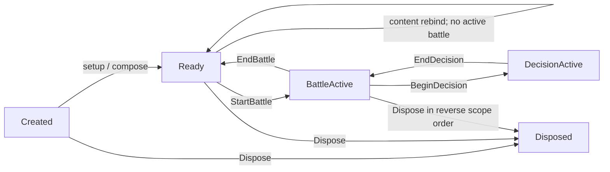

# 战斗运行时架构收敛计划

> 状态：**提案，未实施**。
> 核查基线：2026-08-16 当前工作树，`HEAD=bca5941411f2a833901d982f7899c8fcab27dbea`。
> 复核：2026-08-16 对全部计数逐条复测，修正了消费者口径、GroundEffect 端口成员数与
> CU-15 判断，并补入 Slice 0 与消费者依赖显式化切片。本文所有数字均可由该 HEAD 复现。
> 前序方案：[`runtime_hub_decoupling.md`](runtime_hub_decoupling.md)。
> 背景评审：[`../../reviews/architecture_review_2026-07-19.html`](../../reviews/architecture_review_2026-07-19.html)。

本文只描述后续落地计划，不把未实现结构写成当前事实。当前实现真相仍以源码、
`docs/design/` 和本轮验证结果的交集为准。

## 1. Problem

`BattleRuntimeModule` 当前同时承担四类职责：

1. 创建并持有战斗服务对象图；
2. 注入内容索引、外部 gateway 和 terrain generator；
3. 编排 module、battle、AI decision、preview/request 多种生命周期；
4. 作为大量 resolver/service 的反向 service locator。

现有按消费者建立 `IXxxRuntimePort + XxxBridgeService` 的工作已经通过 Roslyn analyzer
阻止部分隔离消费者重新引用 composition hub，这个棘轮必须保留。但该模式继续扩张后，
宽 port 开始复制 hub 表面：当前共有 7 组 port/bridge，其中 GroundEffect port 共 46 个成员
（11 个服务访问器 + 35 个行为；`GetSkillMasteryService` 被误放在"行为"分节下），
port 285 行、bridge 460 行。若直接处理 `BattleSkillExecutionOrchestrator`，该类经
`Runtime.*` 触及 **75 个互不相同的 hub 成员**，计入重载后端口将超过 80 个成员。

这四条职责里，**第 4 条是本方案真正要消灭的病灶**，也是最难的一条：组合与生命周期
（第 1、3 条）可以由新的组合根接管，但"消费者反向借用 hub"必须逐个消费者改造，
不会因为接线集中而自动消失。后续切片安排与退出判据都必须围绕这一条设计，
否则会出现"组合根很干净、反向借用一个没少"的假性完成。

同时，`BattleUnitState` 已经完成大部分 typed owner 存储迁移。它现在仍然庞大，主要原因
是 70-key strict codec、canonical/detached/clone/mutation-exact 多套投影仍集中在 façade 中，
而不是“尚有大量 flat 字段没有 owner”。后续工作必须针对 codec 职责，不能误删稳定 schema。

## 2. Current Ownership

### 2.1 组合与生命周期

- `BattleRuntimeModule` 主文件直接创建约 37 个对象或聚合对象；
  `BattleRuntimeModuleBorrowerSet` 另外创建 11 个 borrower，`BattleRuntimeServices` 创建 9 个
  runtime service。是否把聚合对象本身计为 service 会影响精确数字，但完整对象图约为 55 个节点。
- 构造函数会先绑定 borrower、command preview 和 AI decision binding。
- `setup(...)` 接收 14 个可选输入并执行内容 rebind。
- `FinishSetup(...)`、`_ensure_sidecars_ready()` 与
  `ConfigureDamageResolverForTests(...)` 分别重放一部分接线逻辑。
- teardown 已经具有明确的逆序阶段：decision consumer → runtime sidecar → content/result →
  battle state → owned native resource。这一顺序是必须保持的正确资产。

### 2.2 Port/bridge

当前 7 组边界为：

- Timeline；
- Charge；
- CommandPreview；
- SkillPreview；
- GroundEffect；
- AiDecisionBinding；
- Contingency。

`battle_runtime_isolated -> composition` 的 analyzer deny rule 和零 baseline 已经落地，
且 `BattleRuntimeModule*.cs` 确实被归入 `composition` 层，棘轮真实咬合。但测试目录中
对这 7 个 port 的引用数为 **0**——没有任何 fake/stub 实现它们，“可隔离单测”仍是
尚未兑现的收益。这是否决 Option A 的首要依据。

### 2.2.1 消费者口径与依赖宽度（实测）

排除 `BattleRuntimeModule` 自身与 `BattleRuntimeModuleBorrowerSet`，当前有 **18 个生产类**
持有 `BattleRuntimeModule` 字段并反向访问 hub。注意口径：

- 只有 **11 个类**继承 `BattleRuntimeModuleBorrower`（其中 7 个就是上述 bridge），
  且这 11 个已全部在 borrower set 内。**其余消费者不走该基类**，而是自持
  `WeakReference<BattleRuntimeModule>`。因此不能把这批消费者统称为 “legacy borrower”，
  删除 `BattleRuntimeModuleBorrower` 基类也不会影响到它们。
- 最大的消费者 `BattleSkillExecutionOrchestrator` 使用 `Runtime.*` 而非 `_runtime.*`，
  且铺开在 12 个 partial、共 6038 行中；任何以 `_runtime.` 为口径的扫描都会漏掉它。

按 hub 使用面宽度排序（同一类的全部 partial 合并计算，去重后的成员数）：

| 消费者 | 触及 hub 成员数 |
|---|---|
| `BattleSkillExecutionOrchestrator` | **75** |
| `BattleUnitFactory` / `BattleEquipmentAbilityRuntimeService` | 10 |
| `BattleMeteorSwarmResolver` / `BattleChainDamageService` | 9 |
| `BattleSkillOutcomeCommitter` | 8 |
| `BattleSkillTargetValidationService` | 6 |
| `BattleEquipmentSkillTriggerActionResolver` | 5 |
| `BattleEquipmentTargetMarkResolver` / `BattleEquipmentAreaActionResolver` | 4 |
| `BattleRandomChainSkillService` / `BattleEquipmentSummonResolver` | 3 |
| `BattleNineEchoFinalHammerResolver` / `BattleEquipmentStatusActionResolver` / `BattleEquipmentAbilityStateResolver` / `BattleEquipmentAbilityConditionEvaluator` | 2 |
| `BattleMetricsCollector` / `BattleEquipmentDirectEffectActionResolver` | 1 |

**18 个里有 17 个 ≤10 个成员。** 这个分布是本方案全部切片安排的依据：窄消费者可以直接
依赖显式化（见 §6.6），唯一的宽消费者必须先拆分（见 §7.0），二者不能用同一套手法。

### 2.3 BattleUnitState

- 顶层仍维持 70 个稳定 flat codec key；
- 当前已有 19 个 typed state owner，另有 typed status/contingency collection；
- identity、display、faction、control、AI id 等少量标量仍合理地留在 façade；
- strict `FromDictionary`、canonical、detached、clone 和 mutation-exact 仍集中在
  `BattleUnitState.cs`。

因此存储 owner 化不是本方案的主要未完成项；codec/projection 责任分离才是。

### 2.4 内容 ID

`BattleRuntimeModule` 目前声明 6 个 status id、7 个 skill id 和 2 个 stat id。
在该 partial class 作用域内只有 `black_star_brand_normal` 与 `crown_break_broken_hand`
仍被读取（`IsUnitGuardLocked` / `IsUnitCounterattackLocked` / `IsUnitFollowUpLocked`），
其余 13 个常量在类内零引用。两个仍在使用的 status id 参与 guard、counterattack、
follow-up lock 判定，违反“运行时不按具体内容 id 分支”的纪律。

**但删除这 13 个常量不等于消除 ID 分支，务必不要据此宣布纪律达成：**

- 同名常量在 `BattleSpecialSkillResolver`、`BattleStatusSemanticTable`、
  `BattleFateAttackRules`、`BattleHitResolver`、`BattleRuntimeSkillTurnResolver`
  中**各自另有声明且仍在使用**。module 内那 13 个只是各自类的副本，删除是安全的，
  但被删掉的只是副本。
- 全 `scripts/systems/battle/` 下仍有 **7 处** `skill_id == XXX_SKILL_ID` 形式的分支
  （`BattleSpecialSkillResolver` 6 处、`BattleRuntimeSkillTurnResolver` 1 处）。
- 更严重的是：`IsCrownBreakSkill` 与 `IsCrownBreakTargetEligible` 已经是
  `IBattleGroundEffectRuntimePort` 的正式成员（该文件第 93–95 行）。
  **上一轮端口化把内容 ID 特判从 hub 提拔进了跨层契约**，这是比留在 module 里更差的位置。

因此 §6.4 的处理范围必须是「module + 端口契约 + 通用规则」三处，而不是只清 module。

## 3. Hard Constraints And Invariants

后续每个切片都必须保持以下不变量：

1. `layer_baseline.json` 保持零豁免，不为迁移临时开放越层边。
2. preview、execution、AI 必须继续共享 canonical rule；不能为拆分类复制规则。
3. 同步 reaction、contingency、auto-cast、damage hook 的调用栈顺序不变。
4. module teardown 继续先断开 borrower/consumer，再释放 provider、state 和 native owner；
   重复 `Dispose()` 幂等，并保留首个异常堆栈。
5. `BattleUnitState` 的 70 个 key、相对顺序、strict 类型、null/raw presence、canonical 和
   mutation-exact 语义保持不变。
6. 不添加旧 payload fallback、legacy alias 或双 schema 兼容路径。若后续确实需要改变
   `setup(...)` 协议或 70-key schema，必须先单独说明破坏面并取得确认。
7. module 和通用规则不得按具体 skill/status id 分支；内容差异必须在 authoring → immutable
   definition → runtime state/capability 投影链上表达。
8. 不把 Godot `Dictionary`/`Array` 引入新的内部组合或状态 owner；Godot 容器只留在现有
   resource、projection 和 codec 边界。

## 4. Non-goals

本方案不包含：

- 引入第三方 DI 容器；
- 拆分 Godot C# 程序集以改变 `internal` 语义；
- 战斗数值、AI 权重或 BattleSim 平衡调整；
- 修改存档或 battle unit 70-key schema；
- 一次性重写所有 18 个 hub 消费者（口径见 §2.2.1，它们多数并非 borrower 基类的子类）；
- 仅为减少单文件行数而移动 partial 或 DTO，不改变责任边界；
- 同步整治 `GameRuntimeFacade` 的剩余 internal 方法。

## 5. Options

### Option A：继续按消费者增加 port/bridge

做法：沿用当前模板，为剩余 18 个 hub 消费者逐个建立 runtime port 和 bridge。

优点：

- analyzer 可以立即锁死已迁移消费者；
- 单次改动的行为面通常可控；
- 原 hub 字段无需立刻改可见性。

主要失败模式：

- 宽 resolver 会产生几十到近百成员的 hub 镜像；
- bridge 继续继承完整 module 权限，真实依赖没有在构造时声明；
- 每个消费者增加两份接线类型，维护成本线性增长；
- 没有 fake-port 测试时，只得到结构 diff，没有获得隔离验证收益。

结论：不作为默认路线。现有 port 先保留，停止机械新增。

### Option B：引入通用 DI 容器

做法：把 service registration、scope 和 resolution 交给运行时 DI 框架。

优点：

- 可以统一 constructor injection 与 scope；
- 可减少一部分手写工厂代码。

主要失败模式：

- 注册错误从编译期移动到运行时；
- Godot 启动、headless fixture 和测试替换路径会引入新的框架生命周期；
- 容器解析容易成为新的隐式 service locator；
- 当前对象图规模尚不足以抵消框架和调试成本。

结论：拒绝。

### Option C：typed 手写组合图 + 显式 scope

做法：保留编译期可见的 C# 构造和 analyzer，将现有 `BorrowerSet`、
`BattleRuntimeServices` 与 module 内散落接线收敛为 `BattleRuntimeGraph`；每个节点显式接收
依赖，生命周期由状态机和 scope owner 管理。

优点：

- 依赖、构造顺序和替换传播范围都可在源码中直接审核；
- 不引入运行时反射或字符串注册；
- 可以复用现有正确 teardown 顺序；
- 为后续删除 mega-port 提供稳定接线位置。

主要失败模式：

- 若一次迁移全部服务，diff 会过大且难证明行为等价；
- 若 graph 只暴露 `Get<T>()` 或所有 service 属性给消费者，会重新退化为 locator。

结论：推荐。必须以小切片迁移，graph 只供 composition owner 使用。

## 6. Recommended Design

### 6.1 Scope 模型

| Scope | Owner | 典型内容 | 创建/释放 |
|---|---|---|---|
| process/session borrowed | `BattleRuntimeSetupInput` | content snapshot、character gateway、catalog、外部 generator | 外部拥有，module 只借用 |
| module | `BattleRuntimeGraph` | resolver、rules、preview、timeline、equipment runtime | 首次 compose 创建，module dispose 释放 |
| battle | `BattleRuntimeServices` 或后续 `BattleScope` | `BattleState`、battle epoch、path/cache、contingency battle state | `BeginBattle` / `EndBattle` |
| decision | `BattleAiDecisionScope` | AI context、helper callback、action plan binding | 每次 decision 建立并清除 |
| request | 调用栈局部值 | preview session、event batch、projection lease | 同步调用结束释放 |



`setup(...)` 在第一阶段保持当前签名，避免同时修改大量 fixture。它只负责把 14 个参数投影为
typed input：首次调用执行 compose；后续调用只允许在没有 active battle 时执行明确的 content/
external-input rebind。任何依赖 runtime service 的命令在 `Ready` 之前都应稳定 fail-fast，不能通过
`?.` 返回空结果或让 `_ensure_sidecars_ready()` 隐式完成装配。

### 6.2 BattleRuntimeGraph

新增的 graph 应满足：

- 唯一创建 module-scope service；
- 使用普通构造或具名 `Bind...` 方法表达依赖拓扑；
- 只向 `BattleRuntimeModule` 和 graph 内部 composition code 暴露节点；
- 不提供 `Get<T>()`、字符串 key 或任意类型解析；
- 记录 lifecycle phase，但不持有 battle gameplay state；
- 以当前 teardown 顺序的严格逆序释放节点；
- test replacement 通过具名方法，例如 `RebindDamageResolverConsumers(...)`，只重绑受影响节点。

第一切片中可以让 `BattleRuntimeModuleBorrowerSet` 暂时作为 graph 的内部兼容组件，等所有既有
bridge 都由 graph 持有后再删除共享 `BattleRuntimeModuleBorrower` 基类。不能在第一切片同时改写
所有消费者。

### 6.3 Port 保留与退出规则

port 只在以下情况下保留：

- 表达一个内聚 capability，而不是“消费者需要的所有 hub 成员”；
- 实现执行数据转换、事务提交或语义编排，而不是大量一行转发；
- 不暴露多个无关 owner 的 concrete service getter；
- 至少有一个消费者测试可使用 fake/stub 证明隔离边界；
- 新增成员能对应到同一组不变量。

当前 7 组边界的目标状态：

| 当前边界 | 目标状态 |
|---|---|
| Contingency | 保留窄 port；实现重命名/重定位为 coordinator，不再拆新 bridge |
| AiDecisionBinding | 保留边界；改为 `BattleAiDecisionContextFactory`/decision scope factory |
| CommandPreview + SkillPreview | 合并为一个 preview composition façade，去掉重复 bridge 接线 |
| Timeline | 先保留 analyzer 棘轮；driver 拆出显式 dependency record 后删除纯转发 bridge |
| Charge | 先拆 resolver 编排；最终保留小型 commit capability 和直接下层依赖 |
| GroundEffect | 主 service 归 application orchestration；coord/validation/relocation leaf 保持隔离，删除 mega-port |

严禁为了让 `BattleSkillExecutionOrchestrator` 进入 isolated 层而直接创建 80+ 成员的端口。
该类的正确处理顺序是**先拆分、后声明依赖**，见 §7.0；在拆分完成前不为它建立任何端口。

#### GroundEffect 切片是形状回滚，必须显式记录

`BattleGroundEffectService` 及其三个子服务当前由 `tools/architecture/layer_rules.json`
第 145–149 行归入 `battle_runtime_isolated`，该映射来自 `e6e655b7 解耦地面效果服务族到端口`。
把主 service 归回 application orchestration 就是**撤销那次提交所选的形状**，并缩小隔离层。

这个决定是有意的：46 成员的端口不是隔离，是 hub 镜像。但文档必须把它写成显式回滚，
并在 §6.3 的保留规则里留下成文约束（端口不得承载无关 owner 的 concrete getter、
不得含内容 ID 判定、成员增长需对应同一组不变量）。否则后续维护者看到
GroundEffect 又回到 application 层，会照着现成模板再端口化一次。

### 6.4 内容 lock capability

内容 ID 清理分三类（范围见 §2.4，**不能只清 module**）：

1. 删除当前类内零引用的 13 个 module 常量副本；
2. 把两个仍使用的状态特例投影为通用状态 capability；
3. 从端口契约与通用规则中移除 ID 判定：`IBattleGroundEffectRuntimePort` 的
   `IsCrownBreakSkill` / `IsCrownBreakTargetEligible` 必须随折冠 capability 化一并删除，
   `BattleSpecialSkillResolver` 的 6 处与 `BattleRuntimeSkillTurnResolver` 的 1 处
   `skill_id == XXX_SKILL_ID` 分支同批处理。端口契约里的 ID 特判优先级最高——
   它比留在 module 里更难发现，也更容易被当成既定模板复制。

已有 `BattleStatusEffectState.lock_guard` 和 `lock_counterattack` 应成为 guard/counterattack 的唯一
运行时事实。follow-up lock 不应增加 `status_id == ...` 分支；优先复用现有 `status_tags` 外部字段，
由 `BattleStatusCapabilityKind` + typed converter/rules 把 authoring `StringName` 投影为封闭 capability，
避免增加新的 battle-unit schema key。

具体内容迁移：

- 黑星普通烙印在生成状态时写入通用 `lock_guard` / `lock_counterattack`；
- 折冠“折手”定义写入 `lock_counterattack` 和 typed follow-up-lock capability；
- `IsUnitGuardLocked`、`IsUnitCounterattackLocked`、`IsUnitFollowUpLocked` 只查询状态字段/capability；
- 黑星/折冠专项回归继续证明原行为，但通用规则测试必须使用非这些技能 ID 的 synthetic status，
  证明机制不是 ID 特判。

### 6.5 BattleUnitState codec

保留 `BattleUnitState` 作为 gameplay façade 和 owner gateway，新增顶层 codec owner：

- `BattleUnitStateCodec`：持有 70-key 顺序、strict encode/decode、字段聚合；
- owner 已有的 typed capture/restore API：继续负责各自 normal/canonical/raw 不变量；
- mutation-exact：仍使用独立 snapshot contract，不能借 canonical codec 归一化；
- `BattleUnitState.FromDictionary(...)` 和现有 projection 入口暂时保留为当前调用 façade，内部委托
  codec；这不是 legacy alias，而是保持现有正式 API。

不要创建 19 个只有几行转发的 codec 文件。首轮按语义组拆成少量 helper：identity/equipment、
geometry/turn clocks、resources/defenses、skills/traits/status。只有某一组形成独立 strict 不变量时才
升格为单独类型。

### 6.6 消费者依赖显式化（消灭反向借用的实际手法）

§2.2.1 显示 18 个消费者里 17 个的 hub 使用面 ≤10 个成员。把这 17 个的全部 hub 调用做并集后，
它们只落进四类，且**没有一类需要 composition root 本身**：

| 类别 | 典型成员（括号内为并集出现次数） | 供给方式 |
|---|---|---|
| 战斗态对象 | `GetState`(30)、`GetGridService`/`_grid_service`(30) | battle scope，`BeginBattle` 时注入，非 hub 行为 |
| 内容索引 | `GetSkillDefinitionTyped`(5)、`GetEquipmentAbilityBindingIndexTyped`(4)、`GetItemDefIndexTyped`(3)、`GetTraitDefIndexTyped`(2)、`BuildItemDefIndexSnapshotTyped`(2) | 借用的 process/session scope，compose 时直接注入 |
| 同层 peer 服务 | `_layered_barrier_service`(11)、`_skill_resolution_rules`(4)、`_movement_service`(4)、`_target_collection_service`(3)、`_terrain_effect_system`(3)、`_damage_resolver`、`_skill_mastery_service`、`_battle_rating_system` | graph 内构造注入，一对一 |
| 结果提交回写 | `MarkAppliedStatusesForTurnTiming`(5)、`HandleUnitDefeatedByRuntimeEffect`(4)、`IsFatalInterceptAttemptAvailable`/`TryCommitFatalInterceptAttempt`(各 3)、`AppendChangedCoord`/`AppendChangedUnitId`、`AppendBatchLog`/`AppendReportEntry`、`RecordBattleContributionResult`、`CurrentEffectOriginForContingency` | **唯一需要新端口的部分**，约 10 个成员 |

第四类是关键发现：它是这 17 个消费者**共享的同一组约 10 个成员**，语义高度内聚——
“把本次结算结果提交回当前事件批次/结算”。它符合 §6.3 的全部保留标准（内聚 capability、
执行事务提交而非一行转发、不暴露无关 owner 的 concrete getter、成员对应同一组不变量）。
暂定名 `IBattleOutcomeCommitSink`。

因此对这 17 个消费者，终态是：

```text
(注入内容索引) + (注入 peer 服务) + (battle scope 传入 state/grid) + (一个共享 IBattleOutcomeCommitSink)
= 消费者不再持有 BattleRuntimeModule 引用
```

做完之后**端口总数是减少的**：7 组 port/bridge 收敛为 preview 合并后的少数窄端口
加这一个共享 sink，而不是继续按消费者增加。这是本方案与 Option A 的根本分野。

### 6.7 环状依赖是合法的，不能作为退出判据的例外被消除

`BindDamageResolver()` 中 `_damage_resolver.SetRangedWeaponAttackReactionSink(_skill_orchestrator)`
使 resolver 持有 orchestrator，而 orchestrator 又要用 resolver；contingency auto-cast 还必须在
同一调用栈、同一个 `BattleEventBatch` 内重入 orchestrator（§3 不变量 3 明令顺序不变）。
**构造注入无法表达环**，这正是 hub 作为晚绑定间接层最初存在的原因之一。

所以终态不是"零反向引用"。正确的终态表述是：

> 反向引用只以**具名的窄角色接口**存在，在显式的第二阶段绑定，
> **没有任何消费者持有 composition root 本身**。

这个形状代码库里已有样板且已验证可用：`SetDamageApplicationHook`、`SetFatalInterceptArbiter`、
`SetEquipmentAbilityPorts`、`IBattleEquipmentAttackCheckQuery`、`IBattleEquipmentCombatReactionSink`。
缺的不是机制，是把它应用到剩余消费者（尤其是 orchestrator）上。
§12 的退出判据按此表述书写，不得写成"零反向引用"——那与不变量 3 直接冲突，
写进判据只会逼出更糟的绕法。

## 7. Slices

### 7.0 Slice 0：拆分 `BattleSkillExecutionOrchestrator`（前置，不可后置）

**这一条必须排在 graph 之前或与之并行，理由是结构性的**：orchestrator 不拆，graph 就永远
要留一个"什么都能拿"的节点给它，locator 退化的口子一直开着，§12 的判据也永远无法达成。

现状：12 个 partial、6038 行、经 `Runtime.*` 触及 75 个不同 hub 成员。它的依赖面不是耦合
问题而是体积问题——**注入不出去，必须先拆**。

现有 partial 的命名已经暗示了切法，按执行阶段收敛为三个 owner：

| 新 owner | 吸收的现有 partial | 预估依赖面 |
|---|---|---|
| 目标收集与几何 | `TargetCollection`、`OrderedUnitSlots`、`GroundBarrierClip`、`DirectionalPiercing` | 10–15 |
| 命中序列执行 | `SequentialLineHit`、`LineThroughAttack`、`Helpers` 中的执行部分 | 10–15 |
| 反应与 auto-cast 编排 | `SpellReactions`、`RangedWeaponReactions`、`AutoCast`、`DefinitionGates` | 10–15 |

拆完之后每个 owner 落回 §6.6 的四类分解，就能用与其余 17 个消费者相同的手法处理。
剩余的环（resolver ↔ 反应编排 ↔ contingency）按 §6.7 保留为具名窄角色接口，不消除。

硬约束：拆分**不得改变**同步 reaction、contingency、auto-cast、damage hook 的调用栈顺序，
也不得改变 `BattleEventBatch` 的共享方式。每个 owner 迁出后立即跑 §10 的定向回归，
不允许三个 owner 在同一个提交里一起迁。

### 7.1 Slice 1：组合根

本切片只建立组合阶段，不删除任何现有 port，不改变战斗规则：

1. 新增 `BattleRuntimeSetupInput`，由现有 14 参数 `setup(...)` 构造；
2. 新增 `BattleRuntimeGraph`，先接管 borrower set、runtime services 和当前 sidecar 的一次性接线；
3. 新增 lifecycle phase，并为 active-battle rebind、disposed 调用提供稳定异常；
4. 从 `FinishSetup(...)` 与 `ConfigureDamageResolverForTests(...)` 删除重复接线块；
5. `ConfigureDamageResolverForTests(...)` 改走具名的 damage-consumer rebind；
6. 保留当前 teardown 顺序，并由 graph 记录明确的逆序 release；
7. 不在这一切片修改 hub 消费者、port 成员或 `BattleUnitState`；
8. **不在这一切片改动 `_ensure_sidecars_ready()` 的语义**——见 §7.2，它是独立切片。

关于第 5 项的风险评估（已实测，可放心执行）：
`ConfigureDamageResolverForTests(...)` 目前 re-Setup 了 13 个服务，但其中真正消费
`_damage_resolver` 的只有 `_ai_service.Setup(..., _damage_resolver)` 与
`_equipment_ability_runtime_service.Setup(this, _damage_resolver)`，加上 resolver 自身的
5 处入站绑定（hit resolver、contingency damage hook、ranged reaction sink、
equipment ability ports、fatal intercept arbiter）。其余全部是 `Setup(this)`——借的是 hub，
而 `Borrower.Setup` 经 `IsBoundTo` 幂等，**那部分重放今天就是空转**。
因此收窄到真实消费者不会影响 104 个测试文件中的 141 处调用；这也正是"多入口重放接线"
这条 Problem 的最佳证据。

完成判据：

- module-scope service 每个 runtime lifetime 只 compose 一次；
- content rebind 不重建 service graph，且 active battle 时明确拒绝；
- test damage resolver 替换只影响上述声明的直接消费者；
- dispose 后所有 scope、bridge、callback 和 action plan 均断开；
- analyzer baseline 仍为空。

### 7.2 Slice 2：`_ensure_sidecars_ready()` 惰性闸门退役

**这一项从原 Slice 1 中拆出，因为它被严重低估。**

现状实测：`_ensure_sidecars_ready()` 有 **114 处调用**，分布如下——

| 文件 | 调用数 |
|---|---|
| `BattleRuntimeModule.cs` | 32 |
| `BattleRuntimeModule.RuntimeEffects.cs` | 25 |
| `BattleSpecialSkillGateService.cs` | 23 |
| `BattleMovementCommandService.cs` | 13 |
| `BattleContingencyBridgeService.cs` | 11 |
| `BattleMetricsReportService.cs` | 7 |
| 其余三个文件 | 各 1 |

它不是"三处重放接线"之一，而是**当前事实上的每命令惰性初始化闸门**，覆盖 module 四个
partial 与 4 个 borrower service 的几乎每个公开入口。

更关键的是 `BattleRuntimeModule.cs` 第 456–459 行的注释明确记载存在
**`_ensure_sidecars_ready` 早于 `FinishSetup`** 的调用路径——也就是说 module 今天在
`setup(...)` 之前是部分可用的。把入口改成"setup 前确定性失败"**是对外可见的行为变更**，
不属于"不改变战斗规则"的组合期改动。

因此本切片的执行顺序是强制的：

1. **先产出 pre-setup 调用路径清单**（含 BattleSim fixture、headless session、编辑器/工具路径），
   不得跳过这一步直接写 phase 断言；
2. 依清单判定每条路径应当 fail-fast，还是保留一个显式的 `EnsureComposed()` 入口；
3. 再把 114 处调用按 owner 分批替换，每批跑定向回归；
4. 最后删除方法本身或降级为纯 phase 断言。

完成判据：任一需要 runtime 的入口在 `Ready` 之前确定性失败，不再静默返回空值/no-op；
且清单中每条 pre-setup 路径都有明确归属（已修正 / 已改为显式 compose / 已确认不存在）。

### 7.3 Slice 3：消费者依赖显式化

按 §6.6 的四类分解改造窄消费者，这是**真正消灭反向借用的切片**，不能省略。

首批取依赖面最窄、语义最清楚的 4 个非 bridge borrower
（`BattleSpawnPlacementService`、`BattleSpecialSkillGateService`、
`BattleMovementCommandService`、`BattleMetricsReportService`）作样板，证明
"graph → 构造注入 → 删除该 owner 下的 `_ensure_sidecars_ready` 调用 → 删除 hub 字段"
这条链完整跑得通，再推广到其余消费者与 Slice 0 拆出的三个 orchestrator owner。

完成判据：持有 `BattleRuntimeModule` 字段的生产类从 18 降到 0；
`IBattleOutcomeCommitSink` 成员数不超过 12，且不含任何内容 ID 判定。

## 8. Follow-up Slices And Dependencies

| 顺序 | 切片 | 依赖 | 主要结果 |
|---|---|---|---|
| 0 | orchestrator 拆分 | 无（可与 1 并行） | 75 成员消费者拆为三个 ≤15 依赖面的 owner |
| 1 | composition phase/graph | 无 | 唯一接线入口和显式生命周期 |
| 2 | `_ensure_sidecars_ready` 退役 | 1；须先完成 pre-setup 路径清单 | 删除每命令惰性自愈，入口 fail-fast |
| 3 | **消费者依赖显式化** | 0、1、2 | **持有 hub 字段的生产类 18 → 0** |
| 4 | 内容 ID 清理（含端口契约） | 可与 1 后半并行设计；实现以通用 capability 测试为门槛 | module、端口与通用规则均不按具体技能/状态 ID 分支 |
| 5 | preview 边界合并 | 1 | Command/Skill preview 共用 composition façade |
| 6 | GroundEffect 重新分层（`e6e655b7` 形状回滚） | 1、3 | 删除 285/460 行 mega port/bridge，leaf 保持隔离 |
| 7 | Timeline/Charge 依赖显式化 | 1、6 | 用 dependency record/小 capability 代替 hub 镜像 |
| 8 | BattleUnitState codec 提取 | 与 5–7 独立 | 70-key 不变，codec 离开 state façade |
| 9 | EquipmentAbility 责任拆分 | 1、6/7 的边界经验 | 事件入口、action dispatch、resolver 编排分离 |
| 10 | AI evaluator 家族化 | 1、AiDecision factory | 评分聚合器不再以 12 个 partial 承载全部 evaluator |

切片 3 是本方案的收益兑现点。若因故只能执行部分切片，**0 → 1 → 2 → 3 是不可拆的最小闭环**；
只做 1 和 5–7 会得到一个干净的组合根和更少的端口，但 §1 第 4 条职责原封不动。

EquipmentAbility 切片应把同文件顶层 context/result 类型收进少量 contracts 文件，而不是每个 DTO
一个文件；主 service 最终只保留同步事件入口、binding collection、roll gate 与 action dispatch。

AI 切片按目标/动作语义拆独立 evaluator 类，例如 movement/range、single-target、multi-target、
ground/objective、reaction/contingency。`BattleAiScoreService` 保留 shared typed score context 和最终
聚合，不为每个 evaluator 新建一对 runtime port/bridge。

## 9. Files To Change

### Slice 0：orchestrator 拆分

新增（三个 owner，一个提交一个）：

- `scripts/systems/battle/runtime/BattleSkillTargetGeometryResolver.cs`（暂定名）
- `scripts/systems/battle/runtime/BattleSkillHitSequenceResolver.cs`（暂定名）
- `scripts/systems/battle/runtime/BattleSkillReactionOrchestrator.cs`（暂定名）

修改／删除：

- `scripts/systems/battle/runtime/BattleSkillExecutionOrchestrator*.cs`（12 个 partial，逐批迁出）
- `scripts/systems/battle/runtime/BattleRuntimeModule.cs`（`_skill_orchestrator` 接线与
  `_damage_resolver.SetRangedWeaponAttackReactionSink(...)` 的绑定目标）
- `tools/architecture/layer_rules.json`，仅新增文件分类；不改 deny rule/baseline。

### Slice 1：组合根

新增：

- `scripts/systems/battle/runtime/BattleRuntimeSetupInput.cs`
- `scripts/systems/battle/runtime/BattleRuntimeGraph.cs`
- `tests/battle_runtime/runtime/run_battle_runtime_composition_phase_regression.cs`

修改：

- `scripts/systems/battle/runtime/BattleRuntimeModule.cs`
- `scripts/systems/battle/runtime/BattleRuntimeModuleBorrowerSet.cs`
- `scripts/systems/battle/runtime/BattleRuntimeServices.cs`
- `tests/battle_runtime/runtime/run_battle_runtime_borrower_teardown_regression.cs`
- `tools/architecture/layer_rules.json`，仅在新文件分类需要时修改；不改 deny rule/baseline。

### Slice 2：`_ensure_sidecars_ready` 退役

先产出（不落代码）：

- pre-setup 调用路径清单，覆盖 `scripts/systems/battle/sim/*.cs`、
  `scripts/systems/game_runtime/headless/HeadlessGameTestSession.cs`、
  `scripts/systems/game_runtime/BattleSessionFacade.cs` 及工具路径。

再修改（按 owner 分批，每批一次回归）：

- `scripts/systems/battle/runtime/BattleRuntimeModule.cs`（32 处）
- `scripts/systems/battle/runtime/BattleRuntimeModule.RuntimeEffects.cs`（25 处）
- `scripts/systems/battle/runtime/BattleSpecialSkillGateService.cs`（23 处）
- `scripts/systems/battle/runtime/BattleMovementCommandService.cs`（13 处）
- `scripts/systems/battle/runtime/BattleContingencyBridgeService.cs`（11 处）
- `scripts/systems/battle/runtime/BattleMetricsReportService.cs`（7 处）
- `scripts/systems/battle/runtime/BattleRuntimeModule.ContentSync.cs`、
  `BattleCommandPreviewBridgeService.cs`、`BattleChargeBridgeService.cs`（各 1 处）

### Slice 3：消费者依赖显式化

新增：

- `scripts/systems/battle/runtime/IBattleOutcomeCommitSink.cs`
- `tests/battle_runtime/runtime/run_battle_outcome_commit_sink_isolation_regression.cs`
  （**首个使用 fake port 的隔离单测**，兑现 §2.2 指出的未收获收益）

修改：18 个持有 hub 字段的消费者，按 §2.2.1 表格自窄向宽推进；每个消费者迁完即删除其
`BattleRuntimeModule` 字段，不允许保留"过渡期双通道"。

### Slice 4：内容 capability

预期修改：

- `scripts/systems/battle/runtime/BattleRuntimeModule.cs`
- `scripts/systems/battle/runtime/IBattleGroundEffectRuntimePort.cs`
  （删除 `IsCrownBreakSkill` / `IsCrownBreakTargetEligible`）
- `scripts/systems/battle/runtime/BattleSpecialSkillResolver.cs`（6 处 ID 分支）
- `scripts/systems/battle/runtime/BattleRuntimeSkillTurnResolver.cs`（1 处 ID 分支）
- `scripts/systems/battle/core/BattleStatusEffectState.cs`
- `scripts/systems/battle/rules/BattleStatusSemanticTable.cs` 或新增同层 typed capability rules
- 黑星/折冠状态生成与内容 definition 投影 owner
- `data/configs/skills/crown_break.tres`
- 对应 content validator 与专项回归

本切片必须先验证是否可以完全复用现有 `status_tags` schema；若需要新增 strict payload 字段，
则暂停并请求兼容性决策，不能自行增加双读/回退路径。

已验证的有利条件：通用机制**已经存在且在线**——`BattleStatusEffectState.lock_guard` /
`lock_counterattack` 字段、authoring 投影链
（`CombatEffectDef.LockGuard` → `BattleStatusSemanticTable`）、通用查询
`HasGuardLockStatus` / `HasCounterattackLockStatus` 均已就位，`IsUnitGuardLocked` 等
今天就已经 OR 了通用分支。只有 follow-up lock 尚无通用对应物，需要新增 capability。

### Slice 5–7：port 收敛

主要涉及当前 7 个 `IBattle*RuntimePort.cs`、对应 bridge/service、
`BattleRuntimeGraph.cs`、`BattleRuntimeServices.cs` 和 analyzer path mapping。每次只处理一个可完整
证明行为等价的边界，不做跨 GroundEffect/Charge/Timeline 的大爆炸提交。
Slice 6 需要把 `tools/architecture/layer_rules.json` 第 145–149 行的 GroundEffect 映射
按 §6.3 的回滚说明调整，并在提交信息中显式引用 `e6e655b7`。

### Slice 8：codec

新增：

- `scripts/systems/battle/core/BattleUnitStateCodec.cs`
- 必要时增加少量按语义组组织的 codec helper，不按字段或 owner 一对一建文件。

修改：

- `scripts/systems/battle/core/BattleUnitState.cs`
- `tests/battle_runtime/state_schema/run_battle_unit_state_schema_contract_regression.cs`
- `tests/battle_runtime/state_schema/run_battle_unit_state_owner_api_regression.cs`

## 10. Tests To Add Or Run

### 新增结构/生命周期 oracle

`run_battle_runtime_composition_phase_regression.cs`（Slice 1）至少覆盖：

1. 首次 setup 进入 Ready，所有 module-scope node 只 compose 一次；
2. Ready 状态的 content rebind 不替换 graph/node identity；
3. active battle 期间 rebind 被拒绝且不留下半绑定内容；
4. battle begin/end 与 AI decision begin/end 按 scope 清理；
5. damage resolver test replacement 只重绑 §7.1 列出的真实消费者
   （`_ai_service`、`_equipment_ability_runtime_service` 与 resolver 自身的 5 处入站绑定），
   并证明其余服务的 identity 未被替换；
6. setup/compose 中途异常按逆序回滚；
7. dispose 正常、异常和重复调用后 borrower/callback/action plan 全部归零。

"constructor 后、setup 前调用确定性失败"归 **Slice 2**，与 pre-setup 路径清单一并验证，
不在 Slice 1 断言——原因见 §7.2。

`run_battle_outcome_commit_sink_isolation_regression.cs`（Slice 3）至少覆盖：

1. 至少一个消费者在**只持有 fake `IBattleOutcomeCommitSink` 和注入的 peer**、
   完全不存在 `BattleRuntimeModule` 实例的情况下可构造并执行；
2. fake sink 记录到的提交序列与经真实 module 执行时一致；
3. 消费者类型上不存在 `BattleRuntimeModule` 字段（反射断言，防止"过渡期双通道"回潮）。

这是 §2.2 指出的"7 个端口 0 个 test double"的兑现点；Slice 3 若没有产出可运行的 fake-port
测试，则该切片不算完成。

Slice 0 不新增结构 oracle，改由既有行为回归把关：每迁出一个 owner，
`run_battle_execute_ground_protocol_regression.cs`、`run_contingency_battle_lifecycle_regression.cs`
与 `run_battle_ai_charge_path_aoe_behavior_regression.cs` 必须证明同步 reaction /
contingency / auto-cast 的调用栈顺序与 `BattleEventBatch` 共享方式未变。

测试不能只检查类名、成员数或源码文本；必须通过可观察的 phase、服务 identity、callback 行为、
替换传播和 teardown 后调用结果证明对象图正确。

### 每阶段定向回归

- `tests/battle_runtime/runtime/run_battle_runtime_borrower_teardown_regression.cs`
- `tests/battle_runtime/runtime/run_contingency_battle_lifecycle_regression.cs`
- `tests/battle_runtime/runtime/run_battle_execute_ground_protocol_regression.cs`
- `tests/battle_runtime/runtime/run_battle_ground_effect_typed_sets_regression.cs`
- `tests/battle_runtime/runtime/run_equipment_ability_preview_integrity_regression.cs`
- `tests/battle_runtime/ai/run_battle_ai_decision_lifetime_regression.cs`
- `tests/battle_runtime/ai/run_battle_ai_charge_path_aoe_behavior_regression.cs`
- `tests/battle_runtime/fate/run_black_star_brand_regression.cs`
- `tests/battle_runtime/fate/run_crown_break_regression.cs`
- `tests/battle_runtime/state_schema/run_battle_unit_state_schema_contract_regression.cs`
- `tests/battle_runtime/state_schema/run_battle_unit_state_owner_api_regression.cs`

内容 capability 必须另加 synthetic status 测试：使用与黑星/折冠无关的 status id，分别证明
guard/counterattack/follow-up lock 来自 typed capability 而不是具体 id。

### 验证层级

每个切片按以下顺序验证：

1. 用 `git status --short` 和限定路径的 `git diff` 检查当前切片明确列出的改动，不从共享工作树自动推断影响面。
2. `dotnet build magic.csproj`
3. 对每个定向目标运行 `python tests/run_regression_suite.py --pattern <focused-runner-name>`。
4. 稳定工作树上运行 `python tests/run_regression_suite.py --jobs auto`。
5. 仅当用户明确要求时运行 BattleSim、benchmark 或 E2E；它们不计入 routine full。

历史 HTML、旧 `470/470` 或其他分支的 PASS 不能替代当前切片验证。若验证时工作树仍混有并行改动，
必须分别记录目标切片、当前完整文件系统、全量套件和 CI 的证据边界。

## 11. Project Context Units Impact

本文件只是 proposal，不改变当前代码所有权，因此现在不修改
`docs/design/project_context_units.md`。

Slice 1 落地后，CU-15 必须更新：

- 把 `BattleRuntimeGraph` 和 scope/lifecycle phase 加入推荐读取集；
- 修正“七个 module-owned service”——borrower set 现为 11 个成员（4 个 module-owned service
  + 7 个 bridge），该数字已过时；
- 记录 composition graph 是唯一 module-scope 接线 owner，battle/decision scope 分别释放。

**CU-15 中"原 `BattleTimelineStatusBridgeService` 因没有独立状态或 capability 已删除"这句是
准确的，不要删除。** 该类在 `scripts/` 与 `tests/` 中引用数为 0，确已不存在；
现存的 `BattleTimelineBridgeService` 是**另一个类**。需要做的是在 CU-15 中把两个名字
显式区分开，避免读者误以为 Timeline 边界已整体退出——它仍在 §6.3 的目标状态表里。

Slice 0 与 Slice 3 落地后，CU-15 还需更新：

- 用 Slice 0 拆出的三个 owner 替换 `BattleSkillExecutionOrchestrator` 的单一入口描述；
- 记录消费者依赖来自构造注入与 `IBattleOutcomeCommitSink`，
  并声明"任何生产类都不再持有 `BattleRuntimeModule` 字段"这一新的所有权事实。

Slice 8 落地后，CU-16 必须更新：

- 将 strict 70-key codec owner 指向 `BattleUnitStateCodec`；
- 继续声明 70-key schema 和各 typed owner 的 normal/canonical/mutation-exact 不变量不变。

只有相应代码与回归真正落地后，才同步更新 `docs/design/battle/runtime_module.md` 和 CU-15/CU-16；
不得提前把本计划写成 current implementation truth。

## 12. Exit Criteria

本计划完成时应满足：

**核心判据（对应 §1 第 4 条职责，不可降级）**

- 持有 `BattleRuntimeModule` 字段的生产类从 18 降到 **0**；
- 反向引用只以**具名的窄角色接口**存在，在显式的第二阶段绑定，
  **没有任何消费者持有 composition root 本身**（表述依据见 §6.7；
  不得写成"零反向引用"——那与不变量 3 的同步反应顺序直接冲突）；
- `IBattleOutcomeCommitSink` 成员数 ≤12，且不含任何内容 ID 判定；
- 至少存在一个使用 fake port、不构造 `BattleRuntimeModule` 即可运行的消费者隔离单测。

**组合与生命周期**

- `BattleRuntimeModule` 不再通过多个入口重复执行 service Setup；
- module、battle、decision、request scope 有唯一 owner 和明确进入/退出条件；
- `_ensure_sidecars_ready()` 已退役，pre-setup 路径清单中每条都有明确归属；
- `BattleRuntimeModuleBorrower` 基类被删除（注意：这只覆盖 11 个子类，
  不构成上述核心判据的替代——口径见 §2.2.1）。

**端口与内容**

- 没有新增 mega-port，GroundEffect port/bridge 已退出，且回滚决定已在提交信息中
  显式引用 `e6e655b7`；
- preview 两套 bridge 已收敛；Timeline/Charge 不再依赖 hub 镜像接口；
- `BattleSkillExecutionOrchestrator` 已拆为三个 owner，任一 owner 的依赖面 ≤15，
  且没有为其创建过任何宽端口；
- **module、端口契约与通用规则三处**均不存在具体 skill/status id 行为分支
  （含 `IBattleGroundEffectRuntimePort` 的 `IsCrownBreak*` 与 7 处 `skill_id ==` 分支）；

**状态与后续拆分**

- `BattleUnitState` 保持 gameplay façade，但 70-key strict codec 已由独立 owner 承担；
- EquipmentAbility 和 AI 的后续拆分按职责形成独立类，而不是继续增加 partial/bridge；
- analyzer 零 baseline、定向回归、当前 full suite 和文档同步全部完成。
