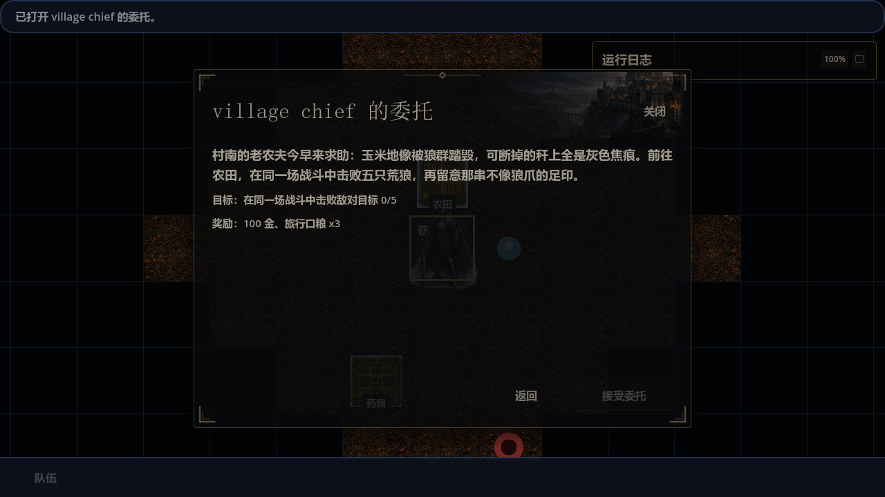
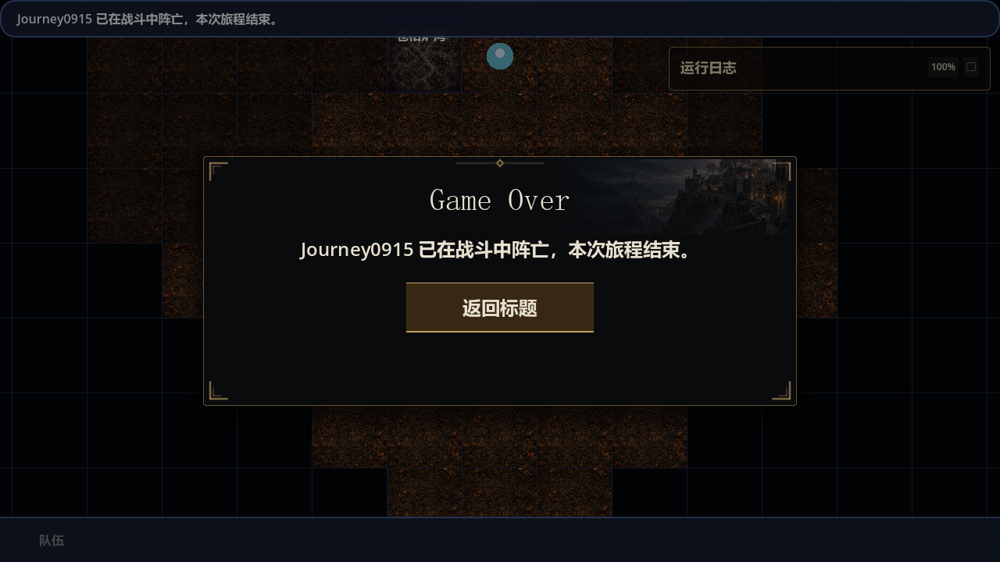

# 人物流程实机验证：首个任务入口阻塞，未走到晋升

日期：2026-09-15，约 10:26–10:39（Asia/Shanghai）。结论：**本次人物成长流程未走通**。

后续修复（同日 11:26）：F1 的入口阻塞已修复，新档实机成功接取《初阵》，关闭重开及读档保持进行中；720p、4K 和两个专项 runner 已验证。详见 [首个任务入口修复报告](2026-09-15-npc-first-quest-fix.md)。下文保留修复前观察；F2、F3 及完整成长流程尚未重新验收。

这是一个自然创建的角色，包含观察器中断后对同一存档的读档续测。实际运行 Godot 4.6.2 Mono，Vulkan Forward+，1280×720 原生窗口。工作树 HEAD 为 `49c80870c9a8d8e0f415544b25ed00be2ebb29f8`，包含其他任务的未提交修改；不代表干净提交或全项目回归结果。

## 1. 首要发现

### F1. 村长入口把新角色带到锁定的后续任务，无法从该面板接到《初阵》

复现：进入游戏 → 小型世界 → 创建角色 → Enter 打开初始村庄 → 点击村长。

实际显示“同一场战斗中击败五只荒狼”，奖励 100 金和旅行口粮 ×3；“接受委托”禁用，没有任务列表、切换入口或禁用原因。间隔再次采集仍是同一状态，角色没有已接或已完成任务。截图中 NPC 名称还显示为 `village chief`。

代码交叉核对：

- [GameRuntimeNpcQuestOfferCommandHandler.cs](../../scripts/systems/game_runtime/GameRuntimeNpcQuestOfferCommandHandler.cs:71) 收集同一 NPC 的全部任务，构造窗口时在第 112 行直接选 `npcQuests[0]`，没有优先选择当前可接条目。
- 本次显示的是 [folk_farmers_plea.json](../../data/configs/json/quests/folk_farmers_plea.json:22)，前置条件为已完成 `tutorial_first_blood`。
- [NpcQuestOfferDialog.cs](../../scripts/ui/NpcQuestOfferDialog.cs:86) 只呈现选中任务；第 99–117 行使用反馈文本和 `IsEnabled`，没有显示条目的 `DisabledReason`。实际窗口也没有切换任务的控件。

影响：不能再把“配置中有村长《初阵》任务”写成玩家已经能够接取的入口。本次默认新档的教程入口在这里被阻塞。该发现限于本轮入口与当前任务配置，未断言所有世界和所有任务都不可接。

### F2. 玩家看得到技能，却看不到首次晋升的具体缺额

P 打开人物管理后，技能页显示重击 Lv.0、银线封喉 Lv.0，当前及总熟练度均为 0；职业页只有“暂无职业”。晋升按钮为“职业晋升（未就绪）”，通用提示要求把未消费技能练到基础上限并满足职业条件，没有告诉玩家缺哪些资格、下一等级需要多少熟练度。

[初始技能截图](evidence/2026-09-15-character-journey/starting-skills.png) · [职业页截图](evidence/2026-09-15-character-journey/profession-gap.png)

这确认了“下一次成长”只读查询的体验价值；本轮没有验证晋升确认、奖励或晋升后配装。

### F3. 附近自然遭遇未形成可完成的首战教学

从村庄向南、南、东、南行走，在世界坐标 `(500, 502)` 进入“雾沼异兽”遭遇。我方为单人 HP 14；敌方两人 HP 分别为 23、46。战斗确认、TU 推进、玩家移动、结束行动、技能选择均有响应。

默认 ×1.3 视角中，主角头部被顶部栏截住，敌人处于画面之外；WASD 可以平移画面。轮次更新会重新聚焦角色。滚轮尝试未观察到缩放变化，但本次未完成缩放输入链诊断，不能据此单独判定缩放实现失效。

[默认战斗视角截图](evidence/2026-09-15-character-journey/battle-camera.png)

续测中通过方向键接敌并按 Enter 结束行动，尚未完成一次有效技能命中，随后出现主角阵亡的 Game Over；按“返回标题”正常回到登录页。本轮未取得胜利、任务奖励或技能熟练度增长证据，也未记录致死攻击的完整战报，不能给出具体伤害归因。

一次自然开局不能证明该遭遇必败，也不足以决定数值调整。但它说明“初始村庄附近有敌人”尚不能作为教学战适配当前角色的证据。

## 2. 实际覆盖

| 环节 | 本轮操作与结果 | 边界 |
| --- | --- | --- |
| 创建 | 默认小型世界；姓名 Journey0915；第一次掷属性，重掷 0 次；普通人类、成年 24 岁、适应力量；成功进世界 | 未覆盖其他种族、世界预设或随机技能样本 |
| 入队 | 主角 `player_sword_01` 自动上阵并为队长；1/4 人，无替补；等级 0，无职业；HP 14 | 未招募新成员，未验证多成员编成 |
| 初始能力 | 重击 Lv.0、银线封喉 Lv.0；钢制长剑，耐久 56/56；180 金 | 不代表所有随机开局都从技能 Lv.0 起步 |
| 补给与入库 | 补给商购买治疗草 ×1，12 金；金币 180 → 168；仓库 1/12 格 | 没有验证治疗草使用；本地仓库界面仅提供查看、丢弃和技能书使用 |
| 读档 | 观察器中断后从“加载存档”读回同一角色；168 金、治疗草 ×1、两项初始技能均保留 | 读回最近购买时的存档位置，重新走到同一遭遇；战斗未被当作可恢复快照 |
| 技能操作 | 战斗栏显示 3 个已装备技能；点击重击后进入选目标状态；方向键移动、Enter 结束行动有效 | 3 个战斗动作不等于人物有 3 项已学成长技能；没有有效命中或升级证据 |
| 配装入口 | 人物装备页显示初始长剑；战中背包显示长剑、无备用装备；当前 1 AP，换装需要 2 AP，卸下/装备禁用 | 只验证展示和禁用分支，没有完成实际换装 |
| 晋升 | 人物管理入口处于“未就绪”状态 | 未到达首次晋升，未验证提交和晋升后状态 |
| 失败收尾 | 自然战斗出现 Game Over，并返回标题 | 未验证失败后的存档策略或死亡持久化 |

[建卡确认截图](evidence/2026-09-15-character-journey/creation.png) · [购买后仓库截图](evidence/2026-09-15-character-journey/warehouse-purchase.png) · [战中背包截图](evidence/2026-09-15-character-journey/battle-equipment.png)

## 3. 验证方法与证据限制

- 从生产登录入口创建角色，未使用测试地图、预制角色、技能/熟练度注入、胜利注入或游戏命令 API。
- 临时应用观察器通过现有 `E2eInputDriver` 发送鼠标和键盘事件，读取界面与状态，用 Godot 渲染视口 `Image.SavePng` 保存原生截图。桌面截图 API 的 `SetIsBorderRequired` 错误通过原生截图绕过。
- 用户数据位于独立目录 `C:/Users/lu/.codex/visualizations/2026/09/15/character-journey/sandboxes/godot-e2e-user-data-rkvra17t/journey`，没有改动日常存档，未设置确定性随机种子。
- 初段观察器因 `request.json` 文件被占用抛出 IOException，退出码 1；这是采集工具中断。加入文件读删重试后，从登录页读取同一存档续测，最终退出码 0，生命周期 `failures=0`、`legacy_debt=0`。两个日志都保留，不能只引用续测日志的 PASS。
- 观察器 PASS 仅表示采集工具完成并正常退出，**不表示人物成长流程通过**。
- 状态记录的 `party` 来自 `GameSession.GetPartyState()`，与正在运行的战斗状态可能处于不同写回时点。Game Over 时该快照仍为战前 HP 14，因此本报告以实际界面确认失败，不把它当成死亡写回验证。
- 控件文本采集没有计算所有祖先滚动裁剪和模态遮挡。屏幕可见性以原生截图为准；未把滚动区外的文字当作可直接点击的内容。
- 本次未运行全量回归、数值战斗模拟或 CI；构建与采集工具结果列在下方。

证据：[观察记录 JSON](evidence/2026-09-15-character-journey/observations.json)、[初段日志](evidence/2026-09-15-character-journey/observer.log)、[续测日志](evidence/2026-09-15-character-journey/resume-observer.log)、[共享工作树记录](evidence/2026-09-15-character-journey/dirty-tree.txt)。完整采集和临时观察器源码归档位于 `C:/Users/lu/.codex/visualizations/2026/09/15/character-journey/`；临时 `.cs` 从游戏编译目录移除。

## 4. 对下一步的修正

1. 先恢复初始任务的实际入口：支持选择该 NPC 的任务，合理默认选中当前可接条目，并显示锁定原因；继续通过正式接取条件校验。
2. 再补人物页“下一次成长”，显示当前资格数、技能练习门槛及已核实可达的来源。不能继续把被遮住的《初阵》当作可用路线。
3. 修复入口后，用自然新角色重新验证教学遭遇、奖励到技能成长，再进入首次晋升与配装。战斗难度需要更多样本和完整战报，本轮不直接提出伤害数值调整。

本轮只记录验证结果并更新人物流程提案，没有修改角色、任务、技能、战斗或 UI 实现。

## 5. 收尾检查

- 移除临时观察器后执行 `dotnet build magic.csproj --nologo`：退出码 0，0 警告、0 错误，13.59 秒。
- 对本报告与提案直接检查本地链接和行尾空白，并确认临时观察器已移出源码目录；结果见 [validation.json](evidence/2026-09-15-character-journey/validation.json)。
- 全量回归、CI、其他分辨率及多随机样本未运行；上述构建不替代成长流程验收。
