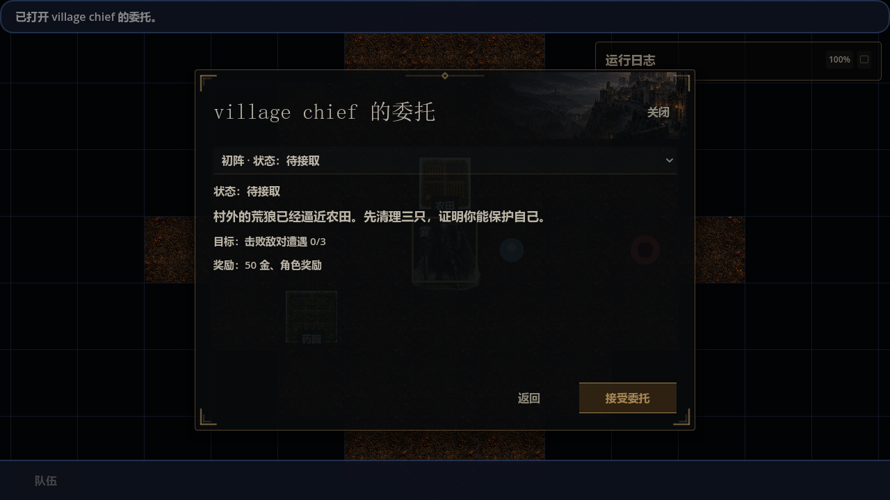
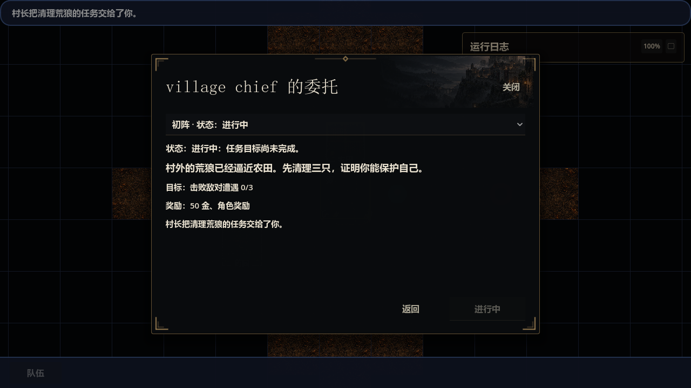

# 首个 NPC 任务入口修复与实机验证

后续修订（同日）：用户要求 NPC 只显示对话，任务详情改为大地图独立全屏日志。本报告保留当时的任务选择框实现与证据；当前呈现已由 [对话与任务日志验证](2026-09-15-quest-dialogue-journal.md) 取代。可操作任务优先和接取校验修复继续保留。

2026-09-15，约 11:16–11:26（Asia/Shanghai）。**新建角色已从村长处成功接取《初阵》，读档后保持进行中。** 本次修复对应 [人物流程实机报告 F1](2026-09-15-character-journey-playthrough.md)。

## 原因与修复

村长有多份任务，旧窗口固定显示集合首项。新档首先看到的《农夫的恳求》要求完成《初阵》，界面又没有切换入口和锁定原因，因此首个任务被挡住。

- `GameRuntimeNpcQuestOfferCommandHandler` 打开窗口时按待领奖、可操作、进行中、其余首项选择默认任务；新档因此选中可接的《初阵》。规则不依赖任务 ID。
- `NpcQuestOfferDialog` 增加任务选择框，允许浏览锁定任务，并同步显示目标、奖励、状态和锁定原因。浏览不接取任务。
- 接受/提交/领奖沿用原来的命令链，提交当前选择的 `quest_id`，继续检查 provider、NPC、渠道、前置条件和确认状态。有效提交目标保留在 modal context；提交另一任务会清除旧任务待确认状态。
- 本次没有更改任务内容、奖励、接取条件或存档格式。窗口浏览选择是临时状态。

当前实现与 owner 说明见 [据点模块](../design/world/settlement_module.md)。

## 实机结果

使用正式登录入口、默认小型世界、新角色 `QuestFix0915`；未重掷，普通人类、成年、适应力量。从正式村庄服务点击村长。通过现有 `E2eInputDriver` 发送鼠标和键盘输入；观察器只读 UI 和 party 状态并保存 Godot 原生渲染截图，没有注入任务或调用游戏命令。

| 操作 | 观察与状态证据 |
| --- | --- |
| 新档打开村长 | 默认《初阵》，接受按钮可用，`active_quests` 为空（记录 010） |
| 切换《农夫的恳求》 | 显示“未解锁：需先完成任务：初阵”，接受禁用，任务状态仍为空（014） |
| 切回《初阵》并接受 | 显示成功反馈和“进行中”；`active_quests` 仅含 `tutorial_first_blood`（017） |
| 返回再打开村长 | 默认仍为进行中的《初阵》（019） |
| 退出后从正式加载入口读档 | 《初阵》仍在 `active_quests`，没有误接后续任务（022、038） |
| 1280×720 / 3840×2160 | 已查看任务选择框、锁定说明、进行中详情和底部按钮，内容完整可见（010、014、038–040） |

[720p 锁定原因](evidence/2026-09-15-npc-first-quest-fix/locked-reason-720p.png) · [4K 读档后状态](evidence/2026-09-15-npc-first-quest-fix/loaded-active-4k.png) · [4K 任务列表](evidence/2026-09-15-npc-first-quest-fix/quest-selector-4k.png) · [4K 锁定原因](evidence/2026-09-15-npc-first-quest-fix/locked-reason-4k.png)

## 专项验证与边界

- `dotnet build magic.csproj --nologo`：移除临时观察器后再次构建通过，退出码 0，0 警告、0 错误，10.15 秒。见 [build-final.log](evidence/2026-09-15-npc-first-quest-fix/build-final.log)。
- `python tests/run_regression_suite.py --pattern npc_quest_offer --jobs 2 --lifecycle-correctness --fail-on-output-error`：**2 个 runner 通过，0 失败**。覆盖生产村长默认任务、实际接取、多任务提交目标、确认隔离、锁定原因和切换刷新，同时保留原有归属校验与领奖回归。见 [完整专项日志](evidence/2026-09-15-npc-first-quest-fix/focused-final.log)。
- 专项日志仍包含已有合成任务 fixture 的 `session.content.quest_validation_failed` 诊断，不能称为日志零错误。两次读档观察进程还记录了 shader cache 目录创建错误；界面渲染与操作完成，退出码均为 0，生命周期均为 `failures=0, legacy_debt=0`，不据此宣称启动日志无错误。
- 初次尝试仅通过启动参数指定 4K，实际被游戏显示设置恢复到 720p（记录 021–030）。之后通过正式显示设置选择 3840×2160 并应用，最终 PNG 尺寸核对为 3840×2160（038–040）。前一次不计作 4K 证据。
- 使用独立用户目录，没有改动日常存档。完整采集和临时观察器源码归档在 `C:/Users/lu/.codex/visualizations/2026/09/15/npc-first-quest-fix/`；观察器已从游戏编译目录移除。
- 本次基于共享脏工作树，HEAD 为 `49c80870c9a8d8e0f415544b25ed00be2ebb29f8`。未运行全量回归、CI、战斗数值模拟，也未验证任务完成、领取奖励、成长或首次晋升。NPC 英文显示名仍是先前报告中的独立问题。

机器可核对证据：[状态采集](evidence/2026-09-15-npc-first-quest-fix/observations.json)、[验证摘要与源码哈希](evidence/2026-09-15-npc-first-quest-fix/validation.json)、[工作树记录](evidence/2026-09-15-npc-first-quest-fix/dirty-tree.txt)。原生观察器的 PASS 只表示采集正常结束；本次任务入口结论由上表操作、截图和任务状态共同支持。
