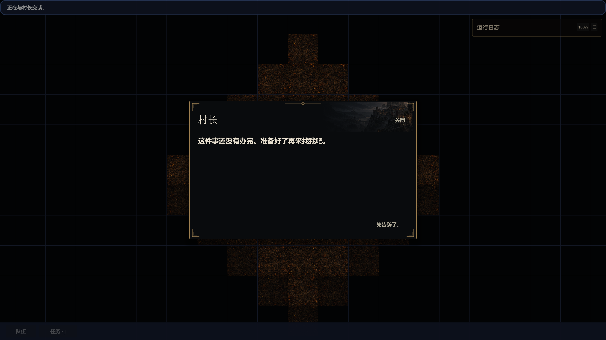
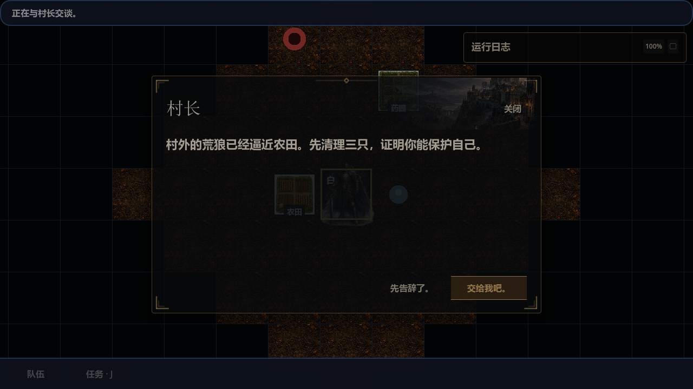
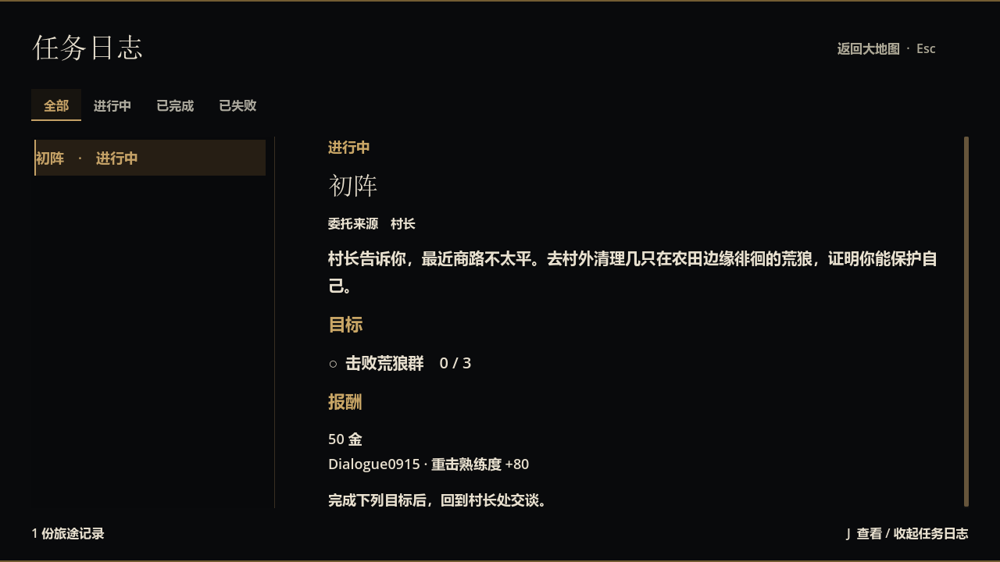
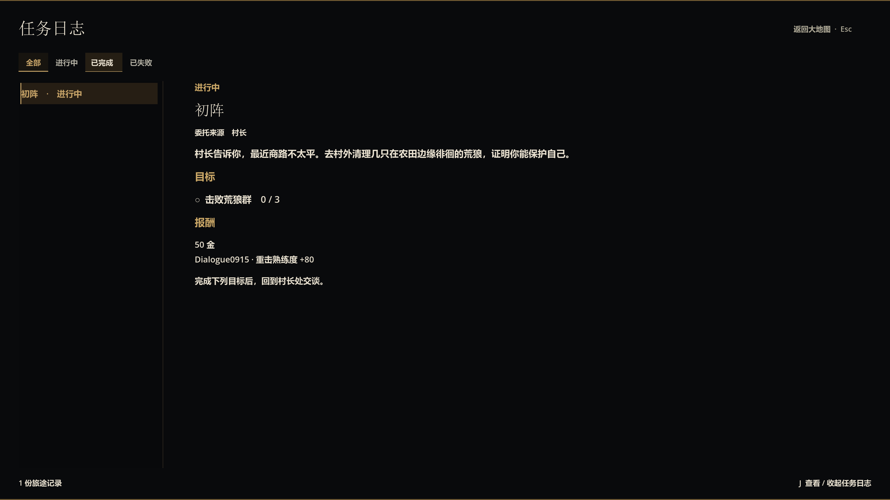

# NPC 对话与全屏任务日志验证

2026-09-15，原生流程观察约 11:54–11:59（Asia/Shanghai）。**村长现在显示对白与玩家回应，大地图“任务 · J”打开独立全屏任务日志；正式新档已走通对白接取《初阵》、查看日志与读档保留。**

## 后续修订：对话框不透明（同日 14:54）

用户要求对话框不透明。修订采用独立面板样式和禁用 NPC 淡入：`npc_quest_offer_dialog.tscn` 的底色及边框 alpha 为 1；`ModalWindowShell` 提供默认开启的 `AnimateEntrance`，`NpcQuestOfferDialog` 覆写为 false，避免打开瞬间透出地图。主题与装饰保留，信号、任务行为和存档格式未变，不需要编辑器额外接线。编辑器检查点为 Panel 的本地样式及首次显示透明度；这两项已通过原生显示检查。

实际读取此前隔离存档、进入村长对话，3840 × 2160 画面中地图不再穿透面板，文字和告辞按钮清晰；点击告辞正常返回据点。`dotnet build magic.csproj` 通过；`chronicle_window_presentation` 与 `npc_quest_offer_dialog_action` 两个聚焦 runner 均在 lifecycle / fail-on-output-error 模式下通过（各 1 / 1）。这是本次不透明修改的检查，未重跑全量回归。下文较早的 NPC 截图保留历史呈现，最新效果如下。

## 本次调整

按用户修订，将前一版 NPC 任务选择框改为对白。村长处不再显示目标计数、奖励或任务下拉框；多项可操作 / 进行中委托以对话话题切换。接取、提交和领奖继续走原 NPC command 校验。NPC 显示名使用据点提供的“村长”等正式名称。

任务日志展示已接任务的说明、来源、进度、奖励和下一步，支持全部 / 进行中（含待交付）/ 已完成 / 已失败筛选。根面板铺满视口，不透明背景覆盖地图与 HUD。任务按钮 / J 打开，Esc / J / 返回按钮关闭，打开期间禁止世界移动和冲突窗口。

日志是 `PartyState.quest_journal` 的只读投影；本次没有改变任务内容、奖励规则、存档字段或版本。窗口话题、筛选与选中状态不写入存档。实现 owner、场景文件与信号接线详见 [任务日志呈现](../design/ui/quest_journal_presentation.md)。

## 原生流程证据

从正式登录入口创建默认小型世界，新角色 `Dialogue0915`，普通人类、成年、适应力量。使用 `E2eInputDriver` 发送鼠标 / 键盘事件；临时观察脚本只读取 UI 与 party 状态，保存 Godot 原生 viewport 截图，没有注入任务或直接调用 gameplay 命令。使用隔离用户数据目录；观察脚本已移出源码。

| 操作 | 结果与观察编号 |
| --- | --- |
| 未交谈前按 J | 全屏空日志，0 份记录，没有泄露锁定任务（009） |
| 从据点点击村长 | 显示荒狼对白、“交给我吧”与离开回应；此时 active quests 为空（012） |
| 点击“交给我吧” | 出现接取反馈；active quests 增加 `tutorial_first_blood`（013） |
| 返回大地图点击任务按钮 | 全屏显示《初阵》、村长、击败荒狼群 0 / 3、50 金和主角重击熟练度 +80（016） |
| 日志内按 W | 坐标保持 `(499, 499)`，任务状态不变（017） |
| 点击“已完成” | 进行中任务不混入，显示空分类提示（018） |
| J 收起、J 重开、点击返回 | 均正确切换 modal（019–021）；关闭后 W 能移动到 `(499, 498)`（022） |
| 退出后正式读档，显示设置改为 4K | 日志仍有同一任务与相同进度、奖励，截图为 3840 × 2160（030、032） |
| 读档后再找村长 | 显示进行中对白和告辞回应，不显示详情清单（035） |

[完整结构化观察](evidence/2026-09-15-quest-dialogue-journal/observations.json) 保留 13 个关键观察、任务状态与控件范围。采集脚本额外断言：接取前后 canonical journal 改变、浏览不改任务、日志内移动无效、关闭恢复移动、读档记录相同及两种原生截图尺寸。

### 村长对白，1280 × 720

### 独立全屏任务页，1280 × 720

### 读档后的任务页，3840 × 2160

## 构建与聚焦回归

- `dotnet build magic.csproj`：移除临时观察源码后再次通过，0 警告、0 错误。
- `python tests/run_regression_suite.py --pattern npc_quest_offer --jobs 2 --lifecycle-correctness --fail-on-output-error --log-file <log>`：2 / 2 通过。
- 同样参数，`--pattern quest_journal_window`：1 / 1 通过。
- 同样参数，`--pattern world_map_runtime_proxy`：1 / 1 通过。
- 同样参数，`--pattern chronicle_window_presentation`：1 / 1 通过。
- `git diff --check`：退出码 0，无空白错误；输出包含共享工作树既有 CRLF 提示。

日志在 [证据目录](evidence/2026-09-15-quest-dialogue-journal)。NPC 日志是追加文件：首轮因旧测试仍期待英文推导 NPC 名称失败，更新为正式显示名“霍斯加尔”后最后一轮为 `Passed: 2 / Failed: 0`。该 runner 的合成无效内容 fixture 仍输出既有 `session.content.quest_validation_failed` 诊断，不能描述为零错误文本；其测试和生命周期校验通过。

两个原生进程均正常退出 0，shutdown report 为 `effective=0 / failures=0 / legacy_debt=0`，原生日志未见 ERROR / WARNING。观察器的 PASS 仅表示采集和退出完成，玩家流程结论来自上面的输入、截图与状态比对。

## 验证范围

这是当前共享工作树验证，未提交；其他人物详情、战斗和技能改动仍保留。未运行全量回归、CI 或独立干净检出验证。自然游玩只验收到接取 / 日志 / 读档；任务完成、物资交付、领奖和首次晋升没有在本次自然流程中发生，相关 NPC 状态与命令分支由聚焦回归覆盖。
