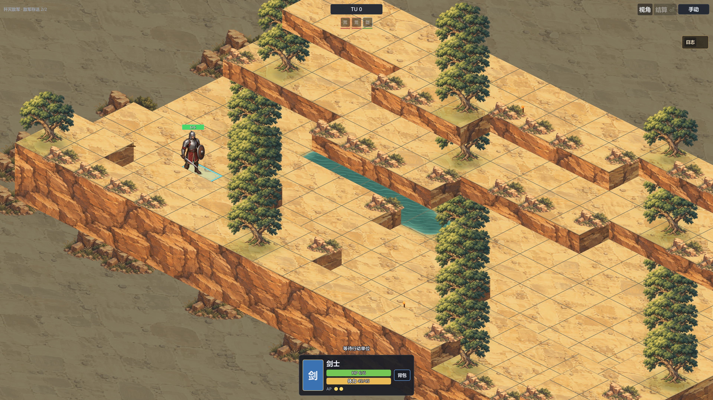
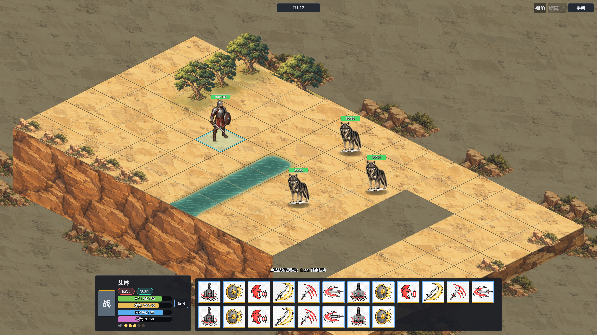
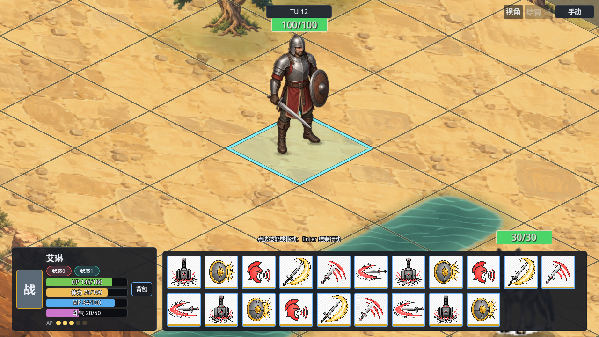
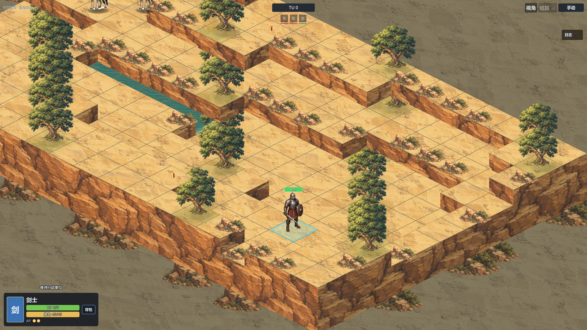
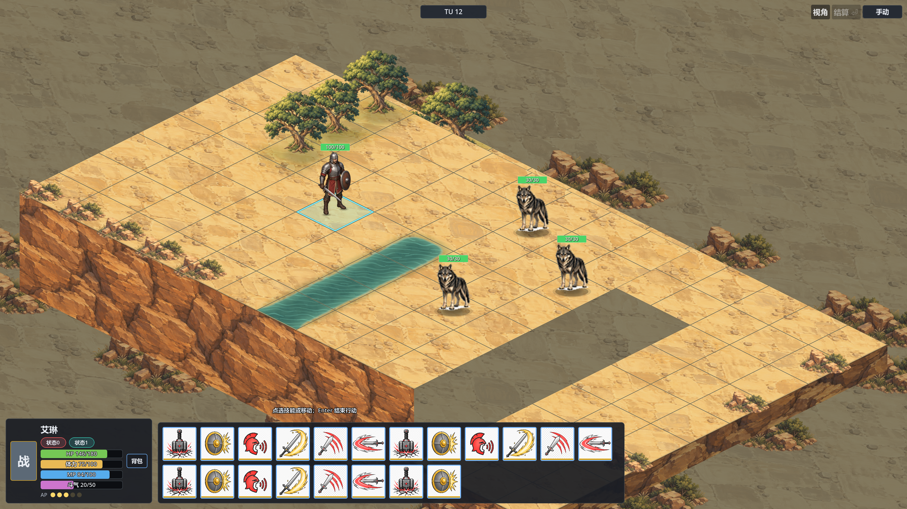

# 战斗地图空间调整与验证

日期：2026-09-16

## 问题与实施方案

用户给出的参考图以战场为画面主体，反馈当前界面被无关信息挤占。当前代码中，`BattleMapPanel._update_hud_layout()` 会把顶部和底栏实际高度从地图视口中扣除；角色资源数值各占独立文本行，指令提示也参与底栏增高。

比较了两种处理方式：继续压缩上下栏的字号和边距；或者让地图铺满窗口、将必要信息作为边缘悬浮控件。采用后一种，使地图不再依赖 HUD 文本高度，同时保留 72 像素技能图标及原有命令入口。

实施顺序：全屏地图与输入边界 → 紧凑资源和技能区 → 战斗日志小入口 → 原生渲染与交互检查。

## 当前责任归属

- `BattleHudAdapter` / `BattleHudSnapshot` 继续提供只读战斗信息，本次没有新增规则计算或快照字段。
- `BattleMapPanel`、其 partial 文件及 `battle_map_panel.tscn` 负责排版、资源条和技能操作。
- `BattleBoard2D` 的渲染、相机与格子拾取继续使用完整物理 SubViewport；地图大小不随 HUD 内容变化。
- `RuntimeLogDock` 管理折叠状态；`WorldMapSystem` 继续通过 `panel_layout_changed` 定位共享日志窗口。

## 改动与玩家操作

- 地图延伸至四边，顶部和底栏容器的通栏底板移除，透明空白区域不拦截地图输入。
- 顶部保留目标、TU、行动顺序、相关技能提示和模式 / 视角 / 结算入口；重复标题、READY 文本和缩放数字不常驻。
- HP、体力、MP、斗气数值并入资源条；姓名悬停保留角色说明。
- 技能栏只为实际技能占位，少量技能时横向收窄；最多显示两行，更多技能使用滚轮。点击保持原始命令索引，滚轮不传给棋盘。
- 取消 / 变体控件按当前操作状态出现；详细预览和屏障说明保留在悬停信息中。
- 状态常驻前两项及 `+N` 入口，持续时间、来源和剩余状态详情可以悬停查看。
- 入场后日志自动缩为小按钮；点击展开完整日志，再点击收起。用户原有存档、战斗规则和资源内容没有格式变化。

## 修改文件

- `scenes/ui/battle_map_panel.tscn`
- `scripts/ui/BattleMapPanel.cs`
- `scripts/ui/BattleMapPanel.CommandDock.cs`
- `scripts/ui/BattleMapPanel.SkillGrid.cs`
- `scripts/ui/BattleMapPanel.TimelineBadges.cs`
- `scripts/ui/BattleMapPanel.Styles.cs`
- `scripts/ui/RuntimeLogDock.cs`
- `tests/battle_runtime/runtime/run_battle_map_panel_schema_regression.cs`
- `tests/world_map/runtime/run_world_map_runtime_log_dock_regression.cs`
- `docs/design/ui/battle_map_presentation.md`
- `docs/design/project_context_units.md`

已有脏工作树中的其他改动保留。本次修改集中于以上 UI、验证与文档路径；两个设计文档原有其他内容也保留。

## 信号与编辑器接线

没有新增、移除或改名业务信号。技能选择、取消、变体、结算仍使用原有信号；新增 `SkillScroll.Resized` 的本地布局订阅并在离树时取消。日志仍发出既有布局信号，并在容器尺寸更新后再次通知宿主。

无需人工补接编辑器信号或导出字段。原生检查已覆盖资源条文字位置、节点显示、技能滚动和背包弹窗点击。若在编辑器继续调整场景，需保留全屏 MapFrame、透明布局容器的 Ignore 鼠标过滤，以及实际按钮 / 滚动区对输入的拦截。

## 当前工作树验证

| 验证 | 结果与范围 |
| --- | --- |
| `dotnet build magic.csproj --no-restore --nologo -v:q` | PASS，0 警告、0 错误 |
| `run_battle_map_panel_schema_regression.cs` | Headless PASS；原生 Vulkan PASS。1280×720 与 3840×2160 下检查地图格子点击、技能原索引、多状态 / 36 技能、滚轮、空集合、资源条合并、HUD 不穿透及背包层级 |
| `run_battle_skill_tooltip_regression.cs` | Headless PASS，实际悬停、详情与滚动路径 |
| `run_world_map_runtime_log_dock_regression.cs` | 隔离用户目录的 Headless PASS；隔离用户目录的原生 Vulkan PASS。真实点击入场确认、展开日志、收起日志 |
| 生命周期输出 | 上述成功 runner 均为 `failures=0`、`legacy_debt=0` |

日志回归新增真实鼠标验证时，补全了原测试缺失的战斗入场确认步骤，并固定 1280×720 初始窗口及逻辑画布，避免原测试混用物理窗口和逻辑控件坐标。完整战斗截图在检查结束后调整为 3840×2160 采集。

这是当前混合工作树中的聚焦验证；没有运行全套回归、CI、导出验证或存档兼容性测试，也不是从生产主场景冷启动贯穿全旅程的 application E2E。

## 原生截图

实际世界场景中的战斗，已确认入场，处于等待行动状态：

20 技能布局验证场景（使用测试 HUD 快照与正式素材，便于检查技能密集时的占用）：

截图为原生窗口渲染，不是全屏模式交互证明。相机缩放规则和地形美术沿用当前实现；此次解决的是 HUD 占用与布局，不宣称已复刻参考图的美术或默认镜头构图。

## 同日修正：底栏固定左下角

用户指出底栏居中仍遮挡中央战场，左侧的背景空间没有得到利用。已将角色卡和技能栏整体固定到左下角，从距左边缘 12 个逻辑像素的位置向右排列；内容增加时保持左端位置。操作提示随底栏宽度定位到其上方。

本次修正涉及 `BattleMapPanel._update_hud_layout()`、`battle_map_panel.tscn` 的 BottomPanel 锚点和对应呈现文档。业务信号、运行时所有权及推荐读集不变，编辑器无需额外接线，因此上下文单元索引无需再次修改。

修正后重新完成：编译（0 警告、0 错误）、战斗面板 720p / 4K 原生渲染与点击 / 滚动回归、隔离用户目录的完整世界场景原生日志回归，均 PASS，生命周期 `failures=0 legacy_debt=0`。未重新运行全套回归或 CI。

以下为修正后的截图，上节居中布局截图保留为首次调整记录：

