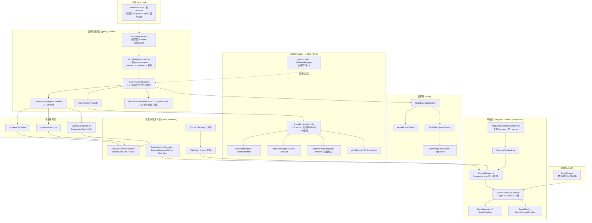
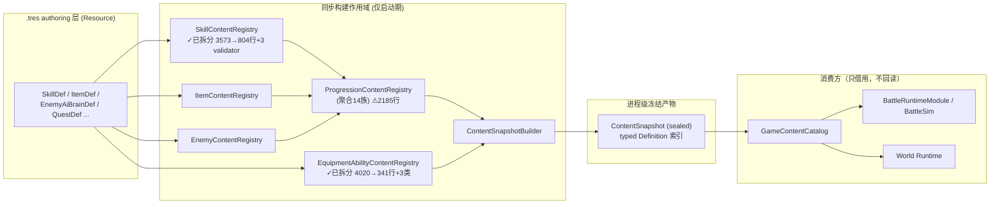
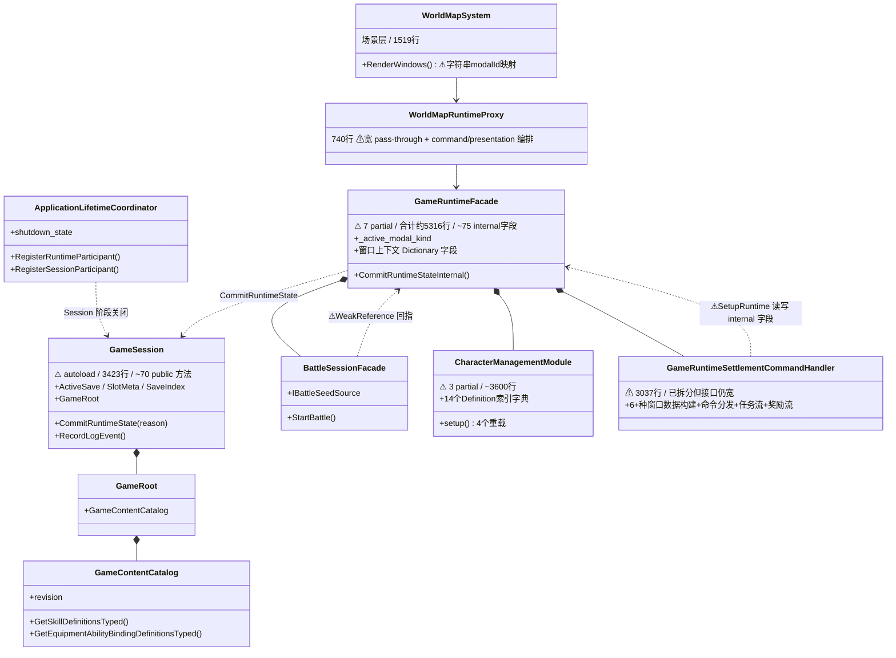
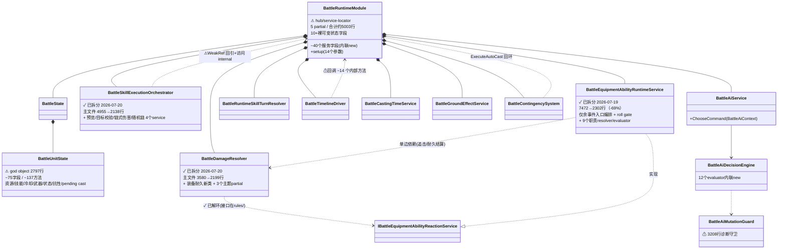
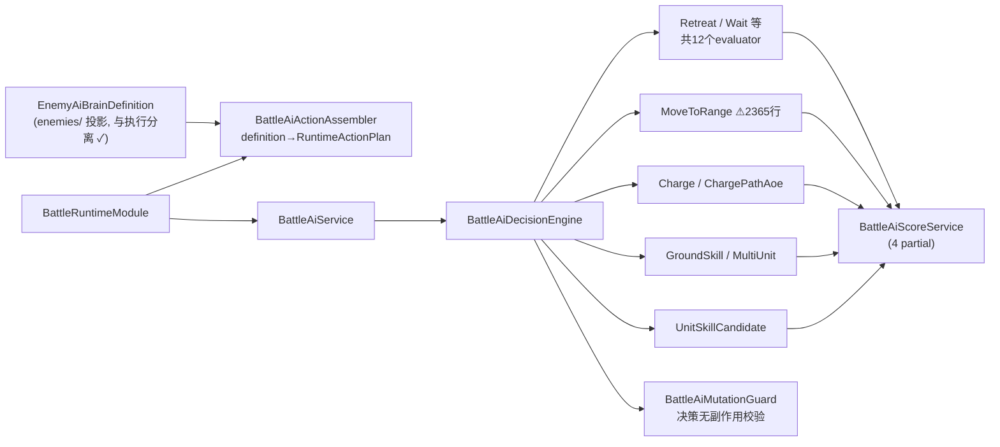

# 全项目架构评审与 UML 图（2026-07-19，2026-07-20 修正）

> 类型：时点架构审计（point-in-time review），不代表持续设计文档。
> 范围：`scripts/`（评审时 829 个 .cs / 278,282 行；拆分后 859 个 .cs / 279,549 行）、`tests/`（约 460 个 .cs，166,724 行）。
> 依据：实际源码静态分析 + `docs/design/project_context_units.md` 声明的边界对照。
> 后续路线已完成并归档：见 [`2026-07-26-code-structure-refactoring.md`](../archive/implementation-plans/landed/2026-07-26-code-structure-refactoring.md)；当前实现仍以 `docs/design/`、源码和测试为准，本审计仅保留为时点证据。

> **2026-07-20 修正记录**：评审后两天内完成 6 个超大文件拆分（合计 30,010 → 11,574 行，-61%，新增 27 个职责类）+ `BattleDamageResolver ⇄ BattleEquipmentAbilityRuntimeService` 循环依赖经 `IBattleEquipmentAbilityReactionService` 接口解耦 + SaveVersion 双真相源收敛 + 1 个 flaky 测试修复。全套件 394/394 全绿（`run_regression_suite.py --jobs auto`，3.5 分钟并发）。相关问题/建议条目已就地标注，图 ③④⑥ 与统计数据已更新为拆分后现状。
>
> **2026-07-21 路线修正**：普通反射/正则扫描不能充当完整依赖门禁，后续改用路径型 Roslyn analyzer；42 个空 partial 是 Godot 资源脚本锚点，不删除；runtime 业务提交已统一经 `RuntimeTransaction`。正文保留审计时证据，执行路线以链接提案为准。

---

## 1. 总量画像

| 区域 | 文件数 | 行数 | 占比 |
|---|---|---|---|
| `scripts/systems/battle`（战斗全域） | 307→326（拆分后） | 143,006→143,907 | **51%** |
| ├ runtime/ | 77→96（拆分后） | 51,728 | |
| ├ ai/ | 56 | 32,181 | |
| ├ core/ | 87 | 19,756 | |
| ├ rules/ | 35 | 17,592 | |
| ├ terrain/ · fate/ · sim/ · presentation/ | 52 | 17,900 | |
| `scripts/systems/game_runtime`（总编排） | 40 | 26,499 | 9.5% |
| `scripts/systems/progression`（成长服务） | 49 | 14,787 | 5.3% |
| `scripts/player/*`（数据/内容定义层） | 216 | 40,659 | 14.6% |
| `scripts/systems/world` / `persistence` / `settlement` 等 | ~80 | ~25,300 | 9% |
| `scripts/ui` | 31 | 16,770 | 6% |
| `scripts/utils` | 34 | 5,202 | 1.9% |

**关键事实：全项目 0 个 `namespace` 声明** —— 829 个类全部位于全局命名空间，分层边界仅靠目录约定维持，编译器无法强制，后述所有越层依赖都无法被编译期发现。

---

## 2. UML 图

### 图 1：全局分层组件图

### 图 2：静态内容管线（做得最好的一条链 ✓）

**模式**：`XxxDef(Resource)` → `XxxContentRegistry` → `XxxDefinition(frozen)` → `ContentSnapshot`。
每个内容族（技能/职业/种族/trait/任务/血脉/升华/信仰/屏障/触发术…共 ~14 族）按同一模板复制 5–7 个文件，这是 `player/progression` 105 个文件的主要来源。

### 图 3：会话与运行时编排类图

**问题标注**：
- `GameRuntimeFacade` 字段几乎全为 `internal`，任何 handler 经 `SetupRuntime(runtime)` 可读写全部字段 —— 封装形同虚设。
- ~~`CommitRuntimeState` 调用散布在 facade 4 个 partial + handler 共 ~15 处，**无统一事务层**。~~ 2026-07-21 当前复核：runtime 业务提交已统一经 `RuntimeTransaction`/facade 入口；该条只保留为审计时证据。
- 模态互斥的 canonical 状态已是 `RuntimeModalKind`；WorldMapSystem 消费字符串 modal id 是单点 UI 投影，不再视为双真相源。剩余债务是部分窗口上下文仍以 Dictionary 长驻 facade。

### 图 4：战斗运行时核心类图（问题最集中的区域）

**结构性问题**：
1. `BattleRuntimeModule` 是 **service locator hub**：约 40 个服务全部字段初始化器内联 `new()`，再经 `Xxx.Setup(this)` 把 module 自己反向注入；服务间互访全部走 hub 的 `internal` 成员（如 GroundEffectService 经 `_runtime._skill_orchestrator`）—— 依赖不可声明、不可单测隔离。
2. ~~**跨层反向依赖**~~ ✓ 已解（2026-07-20）：rules 层经 `IBattleEquipmentAbilityReactionService` 接口消费装备反应，DTO 下移 `battle/core/BattleEquipmentAbilityReactionContracts.cs`；依赖方向变为单边 runtime → rules；运行时的相互递归调用链按业务语义保留。
3. 同一段 ~20 行服务接线代码在 module 内**重复 3 次**（L436 / L2120 / L2302）。
4. AI 决策上下文靠两个巨型 struct 绑定回调：`BattleAiDecisionContextSetup`（13 字段）、`BattleAiHelperBindingContext`（17 字段 + 4 个 7~8 参数 Func）；12 个 evaluator 无公共接口。
5. `BattleAiMutationGuard` 达 3208 行 —— 诊断守卫体量本身即说明决策路径副作用曾难以控制。

### 图 5：AI 决策链

### 图 6：依赖违规汇总（实际存在的越层边）

```mermaid
flowchart TB
    subgraph 违规1["⚠ 数据层 → 服务层"]
        PS["PartyState (player)"] --> PCR["PendingCharacterReward<br/>(systems/progression)"]
    end
    subgraph 违规2["⚠ authoring 层 → battle runtime"]
        CE["CombatEffectDef (player)"] --> BARS["BattleAttackRollModifierSpec<br/>(systems/battle/core)"]
    end
    subgraph 违规3["✓ 已修复 2026-07-20 · rules ⇄ runtime 循环 → 接口解耦"]
        BDR["BattleDamageResolver (rules)"] --> IF["IBattleEquipmentAbilityReactionService (rules/) ✓"]
        BEARS["BattleEquipmentAbilityRuntimeService (runtime)"] -->|实现| IF
    end
    subgraph 违规4["⚠ 内容 registry → 属性服务"]
        EACR["EquipmentAbilityContentRegistry"] --> AS["AttributeService 常量<br/>(systems/attributes)"]
    end
    subgraph 违规5["⚠ utils 杂物抽屉被 content 层依赖"]
        CSB["ContentSnapshotBuilder (content)"] --> UTL["utils/WorldMapContentValidator<br/>WorldPresetRegistry"]
    end
    subgraph 违规6["✓ 已修复 2026-07-19 · 版本号双真相源"]
        GSV["GameSession.SaveVersion"] --> SCV["SaveSchemaVersions 唯一权威常量 ✓"]
        SSV["SaveSerializer._save_version"] --> SCV
    end
```

这些边全部能编译通过 —— 因为全局命名空间下没有任何边界强制机制。

---

## 3. 架构问题清单（按严重度排序）

### P0 — 结构性

| # | 问题 | 证据 |
|---|---|---|
| 1 | **无命名空间 / 无程序集边界**：829 个类全局命名空间，分层纯靠目录约定，越层依赖编译期不可见 | `namespace` 声明数 = 0 |
| 2 | **两个 god hub**：`BattleRuntimeModule`（5 个 partial、合计约 5003 行、约 40 个服务）与 `GameRuntimeFacade`（7 个 partial、合计约 5316 行、约 75 个 internal 字段）承担大量接线，服务经 hub 互访 | 图 3、图 4 |
| 3 | **战斗域体量失衡**：battle 占全项目 51% 代码（143k 行），Top15 大文件中 11 个在 battle | 总量画像表 |
| 4 | ~~**明确循环依赖**~~ ✓ 已解 2026-07-20（`IBattleEquipmentAbilityReactionService` 接口解耦，见下）；剩余 `ContingencySystem → module.ExecuteAutoCast → Orchestrator` 回环 | 图 4 |

### P1 — 封装与边界

| # | 问题 | 证据 |
|---|---|---|
| 5 | **internal 字段大开门**：Facade / BattleRuntimeModule 的 `internal` 字段 + `Setup(this)` 反向注入 = 模块内无封装，两阶段构造带来"未 Setup 即使用"时序风险（大量 `_runtime?.` 空值传播兜底） | BattleRuntimeModule.setup() 14 参 |
| 6 | **越层反向边 6 处**（图 6，已修 2 余 4）：最严重为 `PartyState → PendingCharacterReward`（存档根对象依赖服务层类型）和 `CombatEffectDef → BattleAttackRollModifierSpec`（authoring 引用 battle runtime 类型） | player→systems 反向引用审计 |
| 7 | **窗口管理与业务混合**：canonical modal 已是 enum 并经 `RuntimeModalKinds.ToPayloadValue(...)` 单点投影，但 UI 仍消费字符串 modal id，部分窗口上下文仍以 `Dictionary<string,object>` 存在 facade 字段中 | `RuntimeModalKind.cs`、`WorldMapSystem.RenderWindows` |
| 8 | **字符串字典协议反复往返**：typed → GDictionary → typed 在 world/settlement 层多次转换，是 handler 行数膨胀的机械来源 | `CopyIfPresent` / `BuildSettlementActionBasePayload` 等 |

### P2 — 体量与重复

| # | 问题 | 证据 |
|---|---|---|
| 9 | **仍有超大单体文件**：`BattleUnitState.cs` 2797 行（god object，需结构重构而非物理拆分）；~~BattleMapPanel 2916~~（已拆→1213+5 partial）、~~BattleAiMutationGuard 3438~~（已拆→242+4 文件）、~~BattleRuntimeModule 4299~~（两批已拆→2372+8 类）、~~BattleDamageResolver 3580~~（已拆→2199+4 文件） | 2026-07-20 当前文件行数 |
| 10 | **内容族模板膨胀**：progression 105 文件 = 14 族 × 5–7 文件模板复制；`equipment_abilities/` 49 文件中 **42 个是 <200 字节的空 partial 壳**（真实字段在 AuthoringDefs.cs） | 文件内容审计 |
| 11 | **Def/Definition 规则常量重复**：Def → immutable Definition 是有意的 authoring/runtime 边界，不再把双类本身视为问题；剩余债务是 `ItemDef` / `ItemDefinition` 等两侧仍复制规则常量 | warehouse 域常量审计 |
| 12 | **重复接线**：BattleRuntimeModule 同一段 Setup 序列 ×3；`WorldMapSpawnSystem` 在 GameSession.cs:1486 与 WorldMapDataContext.cs:654 两处独立实例化 | 行号实测 |
| 13 | **宽接口 proxy 债务**：`WorldMapRuntimeProxy`（740 行）包含大量 pass-through，但也统一了 command 执行、presentation delta 和 render，不再将它定性为“纯转发无职责” | 调用链审计 |

### P3 — 一致性风险

| # | 问题 | 证据 |
|---|---|---|
| 14 | **诊断代码常驻 production assembly**：~~`BattleAiMutationGuard.cs` 约 3438 行~~ 已拆分为 守卫核心 242 行 + 快照模型/快照类/屏障快照/stable 投影 4 个文件（2026-07-20，判定逻辑逐字未动）；体量问题已解，但诊断代码是否应迁出 production assembly 仍可单独立项 | 当前文件审计 |
| 15 | **utils 杂物抽屉 + 反向依赖**：34 个文件混杂 config Resource / 日志 / lease / 52KB 渲染器 / 31KB payload 规范化器；content 层 Builder 依赖 utils 的 validator | 图 6 违规 4 |
| 16 | **服务实例化不统一**：ProgressionServiceFactory 只覆盖 per-member 服务图，其余服务一半字段 `new`、一半方法内懒惰 `new`，无可注入接缝 | CharacterManagementModule |
| 17 | **序列化逻辑散布数据层**：~15 个 State 类各自持有 ToDictionary/FromDictionary（PartyState.SaveSnapshot 780 行），save schema 变更需多点修改 —— 与 AGENTS.md "save 高风险" 相互印证 | persistence 审计 |

---

## 4. 做得好的部分（应保持）

1. **静态内容管线**（图 2）：单进程宿主、同步构建、seal 后只借用 frozen definition、borrower 审计 —— 全项目最干净的一条链。
2. **分阶段 shutdown 管线**：ApplicationLifetimeCoordinator 唯一 owner + 外层 runner 判定的 lifecycle-correctness 门禁，legacy debt 归零要求写入 CI。
3. **战斗展示边界**：BattleHudAdapter 只经 Facade 的 5 个只读入口取数，presentation 不触达 runtime 内部。
4. **enemies 定义/执行分离**：authoring Resource 不执行战斗行为，AI definition → assembler → evaluator 链路清晰。
5. **plain C# 数据纪律**：业务态 typed owner + Godot collection 仅边界投影的约定执行得相当一致。
6. **测试资产**：166k 行测试 / 278k 行产品代码（≈0.6:1），headless 文本命令 + 快照 lane 成熟。

**总体格局**：基础设施层（content/lifecycle/persistence/测试门禁）高度严谨；应用层（两个 god hub、超大 handler/service、无边界强制）仍在还历史债。

---

## 5. 改进建议（按投入产出排序）

| 优先级 | 建议 | 预期收益 |
|---|---|---|
| 1 | ~~引入 namespace / 使用普通反射或正则作为完整依赖门禁~~。2026-07-21 当前复核改为：路径型 Roslyn analyzer 检查签名与方法体符号，精确 baseline 禁止新增边；`tools/architecture_checks.py` 只保留为源码气味扫描器。程序集拆分另行评估 | 让新增越层边直接使 build/CI 失败 |
| 2 | ~~**解 `DamageResolver ⇄ EquipmentAbilityRuntimeService` 循环**~~ ✓ 已完成 2026-07-20（`IBattleEquipmentAbilityReactionService` 接口，12 成员全覆盖；DTO 下移 core/） | P0 循环依赖已消除 |
| 3 | **收敛 `GameRuntimeFacade` 字段可见性**：internal → private + 明确方法；窗口上下文 Dictionary 抽为 typed modal context 对象 | 恢复封装；消除双 modal 表示 |
| 4 | ~~**删除 42 个空 partial 壳**~~。2026-07-21 当前复核否决：这些文件是 53 个正式 `.tres` 的脚本路径锚点，必须保留 | 避免破坏 Godot 资源加载 |
| 5 | **合并 proxy 层或赋予其真实职责**（如 scene 同步） | 减少一跳纯转发 |
| 6 | ~~**抽统一事务提交入口**~~。2026-07-21 当前复核：`RuntimeTransaction` 与 facade 单点入口已落地，资源采集绕过也已收口 | 已完成，从后续路线移除 |
| 7 | ~~**把 BattleRuntimeModule 约 40 个服务一次性按阶段聚合**~~。2026-07-21 当前复核否决大组合根路线：直属 split borrower 只用 owner-local 有序集合管理生命周期；后续按单个状态 owner 或窄 capability port 迁移，parent-owned children 仍由 parent 管理 | 避免制造新的全局 service registry |

> 注：以上均为方向性建议；任何落地改动需先按 `AGENTS.md` 与 `project_context_units.md` 的单元边界确认影响面，save/schema 相关改动属高风险项。
